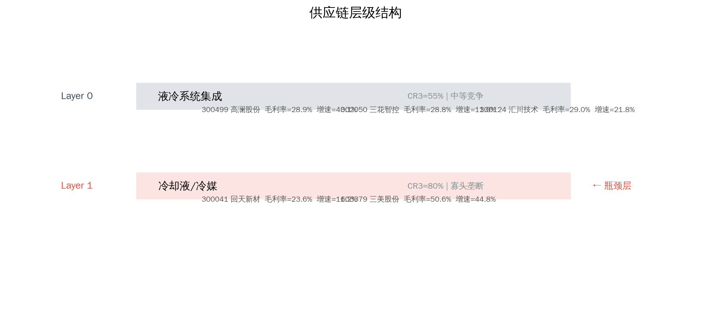

# AI服务器散热 Serenity 瓶颈分析报告

> 分析日期: 2026-07-09 | 方法论: Serenity Choke Point Theory | 数据源: Tushare

## 1. 板块周期定位

液冷散热，GPU功耗持续攀升驱动需求。

**驱动因素**: 英伟达GB300功耗超1200W，风冷无法满足

## 2. 供应链结构

**Layer 0: 液冷系统集成**  CR3=55%  moderate
  - 300499 高澜股份  PE=405.5558  毛利率=28.9396%  增速=43.09%
  - 002050 三花智控  PE=43.5106  毛利率=28.777%  增速=10.97%
  - 300124 汇川技术  PE=33.8852  毛利率=28.9546%  增速=21.77%

**Layer 1: 冷却液/冷媒**  CR3=80%  oligopoly ← **瓶颈层**
  - 300041 回天新材  PE=39.5882  毛利率=23.6112%  增速=11.21%
  - 603379 三美股份  PE=19.8355  毛利率=50.5982%  增速=44.81%

## 3. 瓶颈评分

| 排名 | 代码 | 名称 | 综合分 | 必要性 | 垄断 | 刚性 | 弹性 |
|------|------|------|--------|--------|------|------|------|
| 1 | 300041 | 回天新材 | 1.4 | 2.5 | 1.0 | 1.0 | 1.0 |

**已过滤标的:**

- 002050 三花智控: 市值>100亿，弹性有限
- 300124 汇川技术: 市值>100亿，弹性有限
- 300499 高澜股份: 市值>100亿，弹性有限
- 603379 三美股份: 市值>100亿，弹性有限

## 4. 瓶颈分析

**理论瓶颈层**: Layer 1 — 氟化液产能高度集中，环保管制限制扩产

瓶颈层标的通过筛选: 1 只
瓶颈层标的被过滤: 1 只 — 当前财务数据未体现垄断定价权

## 5. 财务对比

## 6. 风险提示

- ⚠️ **技术路线风险**: AI服务器散热涉及多条技术路线并行，路线收敛方向决定瓶颈归属
- ⚠️ **产能兑现风险**: 扩产计划可能因设备交付、良率爬坡延迟
- ⚠️ **政策风险**: 产业补贴退坡或技术管制升级可能影响供需格局
- ⚠️ **流动性风险**: 部分标的市值偏小，日内波动可能超10%
- ⚠️ **信息验证风险**: 供应链产能数据需通过公司公告和行业调研独立验证

---
数据截至: 2026-07-08 | 生成时间: 2026-07-09
⚠️ 本报告不构成投资建议。