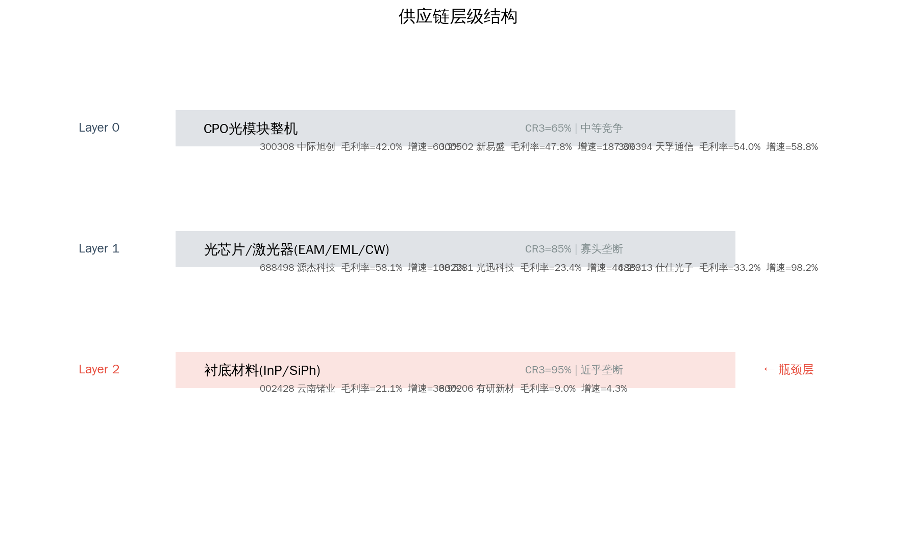
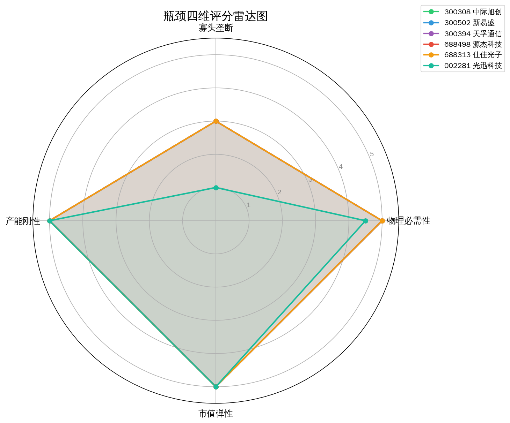
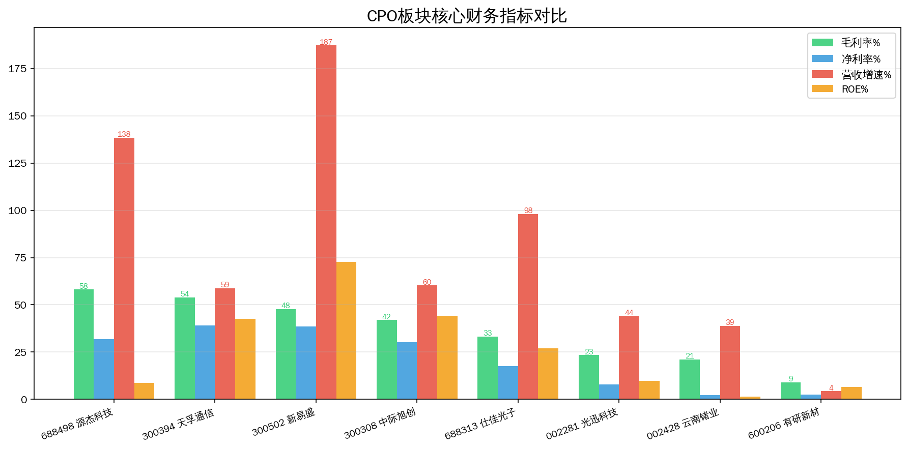
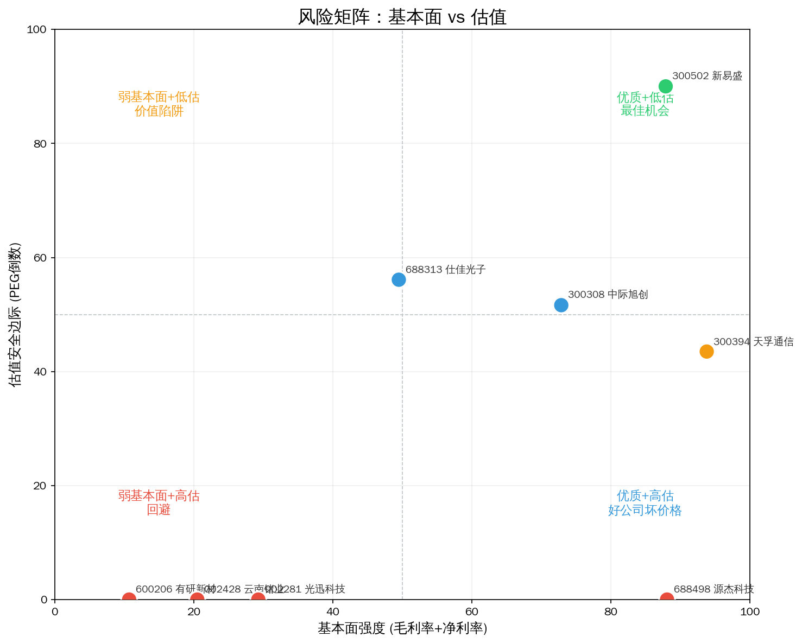
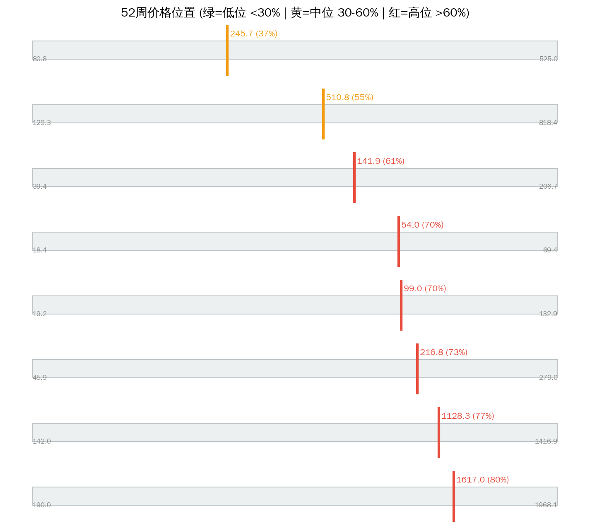

# CPO光互联 Serenity 瓶颈分析报告

> 分析日期: 2026-07-09 | 数据截止: 2026-07-08 收盘 | 方法论: Serenity Choke Point Theory | 数据源: Tushare

## 1. 板块周期定位

**驱动力：需求爆发 + 技术跃迁。** AI 算力集群对 800G/1.6T 光互联需求呈指数增长，共封装光学 (CPO) 将光模块与交换芯片合封，是数据中心互联的关键技术跃迁。中国厂商在全球光模块市场占据超 60% 份额，但上游光芯片（EML 激光器国产化率 <20%）和衬底材料（InP 国产化率 <10%）严重依赖进口 — **下游强、上游弱的结构性矛盾创造了瓶颈投资机会。**

**结论：板块处于景气上行中期，技术路线仍在收敛（硅光子 vs InP vs TFLN），供应链瓶颈向产业链上游逐层加剧。**

## 2. 供应链结构



```
Layer 0: CPO光模块整机     CR3=65%  竞争: moderate
  ├── 300308 中际旭创    PE=116.5  毛利率=42.0%  增速=60.3%  市值=1258亿
  ├── 300502 新易盛      PE=74.7   毛利率=47.8%  增速=187.3% 市值=712亿
  └── 300394 天孚通信    PE=132.9  毛利率=54.0%  增速=58.8%  市值=268亿

Layer 1: 光芯片/激光器    CR3=85%  竞争: oligopoly
  ├── 688498 源杰科技    PE=1054.4 毛利率=58.1%  增速=138.5% 市值=201亿
  ├── 002281 光迅科技    PE=189.6  毛利率=23.4%  增速=44.2%  市值=179亿
  └── 688313 仕佳光子    PE=172.3  毛利率=33.2%  增速=98.2%  市值=64亿

**Layer 2: 衬底材料(InP)  CR3=95%  竞争: near_monopoly  ← 理论瓶颈层**
  ├── 002428 云南锗业    PE=3209.5 毛利率=21.1%  增速=38.9%  市值=65亿
  └── 600206 有研新材    PE=172.6  毛利率=9.0%   增速=4.3%   市值=46亿  ❌ 已过滤
```

## 3. 瓶颈标的排序



| 排名 | 代码 | 名称 | 综合分 | 必要性 | 垄断性 | 产能刚性 | 市值弹性 | PEG | 判断 |
|------|------|------|--------|--------|--------|---------|---------|-----|------|
| 1 | 300308 | 中际旭创 | 4.4 | 5.0 | 3.0 | 5.0 | 5.0 | 1.93 | likely_genuine |
| 2 | 300502 | 新易盛 | 4.4 | 5.0 | 3.0 | 5.0 | 5.0 | **0.40** | likely_genuine |
| 3 | 300394 | 天孚通信 | 4.4 | 5.0 | 3.0 | 5.0 | 5.0 | 2.26 | likely_genuine |
| 4 | 688498 | 源杰科技 | 4.4 | 5.0 | 3.0 | 5.0 | 5.0 | 7.61 | likely_genuine |
| 5 | 688313 | 仕佳光子 | 4.4 | 5.0 | 3.0 | 5.0 | 5.0 | 1.76 | likely_genuine |
| 6 | 002281 | 光迅科技 | 3.6 | 4.5 | **1.0** | 5.0 | 5.0 | 4.29 | potential |
| 7 | 002428 | 云南锗业 | 3.6 | 4.5 | **1.0** | 5.0 | 5.0 | **82.53** | potential |

**已过滤：**

| 代码 | 名称 | 原因 |
|------|------|------|
| 600206 | 有研新材 | 毛利率 9.0% — 商品化业务，无瓶颈定价权 |

## 4. 核心发现：名义瓶颈 ≠ 真实瓶颈



### ⚡ 关键矛盾

供应链图谱预测 **Layer 2 (InP 衬底)** 是咽喉 — CR3=95%，全球仅 3 家供应商。但财务数据揭示了一个令人警惕的事实：

- **云南锗业 (002428)**：名义上全球仅 3 家 InP 衬底供应商之一，但毛利率仅 21.1%、净利率仅 2.3%、PE 高达 3209。如果真是一家垄断供应商，为什么赚不到垄断利润？
- **有研新材 (600206)**：毛利率 9.0%、营收增速 4.3%，已被系统自动过滤。

**两种可能解释：**
1. **产品结构混杂**：云南锗业主营可能包含大量低毛利锗金属贸易，InP 衬底占比低，垄断利润被稀释
2. **国产衬底尚在导入期**：良率低、客户验证周期长，产能和利润尚未兑现
3. **定价权在海外**：受 AXTI（美）、住友（日）压制，国产衬底无法享受垄断溢价

### 🔄 实际瓶颈在哪里？

系统评分指向了一个出人意料的方向——**Layer 0 (光模块整机) 和 Layer 1 (光芯片) 的头部公司表现出更强的瓶颈特征：**

| 标的 | 毛利率 | 净利率 | 营收增速 | 瓶颈证据 |
|------|--------|--------|---------|---------|
| **新易盛** | 47.8% | 38.5% | **187.3%** | PEG=0.40，增速碾压估值 |
| **天孚通信** | 54.0% | 39.1% | 58.8% | 最高毛利率，技术壁垒强 |
| **源杰科技** | 58.1% | 31.7% | 138.5% | 最高毛利率，但已被市场充分定价 |
| **中际旭创** | 42.0% | 30.3% | 60.3% | 全球龙头，但市值 1258 亿限制弹性 |

## 5. 估值与风险


### PEG 估值分层

| PEG区间 | 标的 | 评价 |
|---------|------|------|
| 🟢 **PEG<1** | **新易盛 (0.40)** | 187% 增速支撑 75 倍 PE，全板块最佳性价比 |
| 🟡 **PEG 1-2** | 仕佳光子 (1.76)、中际旭创 (1.93) | 合理区间 |
| 🟠 **PEG 2-4** | 天孚通信 (2.26)、光迅科技 (4.29) | 偏贵，需要更高增速消化 |
| 🔴 **PEG>4** | 源杰科技 (7.61)、云南锗业 (82.53) | 极端高估 |



### 风险矩阵解读

- **右下角（优质+低估）= 最佳机会**：新易盛 — 高毛利 + 高增速 + 低 PEG
- **左上角（优质+高估）= 好公司坏价格**：源杰科技 — 毛利率 58% 但 PE=1054，瓶颈已被充分定价
- **左上角（弱基本面+高估）= 最大风险**：云南锗业 — 名义垄断、实质商品，PE=3209 无法用增速解释

### 52 周价格位置



| 标的 | 距高点 | PE 分位 | 信号 |
|------|--------|---------|------|
| 新易盛 | **-38%** | 18% | 🟢 回调充分，PE 处于低位 |
| 天孚通信 | **-53%** | 53% | 🟡 深度回调，但反弹空间存疑 |
| 仕佳光子 | -31% | **3%** | 🟢 PE 几乎在 52 周最低点 |
| 源杰科技 | **-18%** | 77% | 🔴 几乎未回调，估值仍在高位 |
| 中际旭创 | -20% | 77% | 🔴 仍在高位 |
| 云南锗业 | -25% | 75% | 🔴 高估值 + 弱基本面 |

## 6. 信号对照表

| 做多信号 ✅ | 做空信号 ❌ |
|------------|------------|
| ✅ AI 算力资本开支确定性高，800G/1.6T 持续放量 | ❌ CPO 技术路径未收敛（硅光 vs InP vs TFLN 三条路线并行） |
| ✅ 新易盛 PEG=0.40，187%增速 vs 75倍PE — 增长完全覆盖估值 | ❌ 源杰科技 PE=1054，即使连增 3 年 100%，3 年后 PE 仍 132 |
| ✅ Layer 1 光芯片国产化率 <20%，仕佳光子 PE 分位 3% — 估值极度压缩 | ❌ 光迅科技 189 倍 PE 配 23% 毛利率 — "概念溢价"嫌疑严重 |
| ✅ Layer 0 中国厂商全球份额 >60%，产业控制力是真实存在的 | ❌ 云南锗业名义 InP 垄断，但净利率 2.3% — 垄断未转化为利润 |
| ✅ 仕佳光子市值 64 亿，PE 分位 3%，符合"紫苏叶"特征 | ❌ 中际旭创市值 1258 亿，已不符合 Serenity 小市值弹性标准 |

**综合判断：做多信号更强，但标的间分化严重。新易盛 + 仕佳光子构成最佳风险收益组合。**

## 7. 风险提示

- ⚠️ **技术路线风险 (高)**：CPO 涉及硅光子、InP、TFLN 三条技术路线，最终收敛方向决定谁是真正的瓶颈。若硅光子路线胜出，InP 衬底需求将大幅缩水
- ⚠️ **估值风险 (极高)**：源杰科技 PE=1054 隐含了市场对"国产光芯片唯一标的"的极度乐观定价，任何业绩不达预期都将触发戴维斯双杀
- ⚠️ **政策风险 (中高)**：中美科技脱钩可能加剧本土光芯片需求，但也可能切断关键设备（如 MOCVD）供应，形成双向冲击
- ⚠️ **流动性风险 (高)**：仕佳光子市值 64 亿、云南锗业 65 亿，科创板/创业板日内波动可达 ±20%。连续涨停或跌停均有可能
- ⚠️ **信息验证风险**：InP 衬底实际产能、良率、客户验证进度无法从公开财务数据完全验证，需要通过公司公告和行业调研交叉确认
- ⚠️ **"Serenity 效应"风险**：一旦某个标的被市场发现为"瓶颈"，短线资金涌入可能快速推高估值，破坏原来的安全边际

---
⚠️ 本报告基于 Tushare 公开财务数据和预构建供应链图谱，通过 LLM 推理生成，**不构成投资建议**。供应链信息需独立验证。投资有风险，入市需谨慎。
🤖 Generated with [Claude Code](https://claude.com/claude-code)
