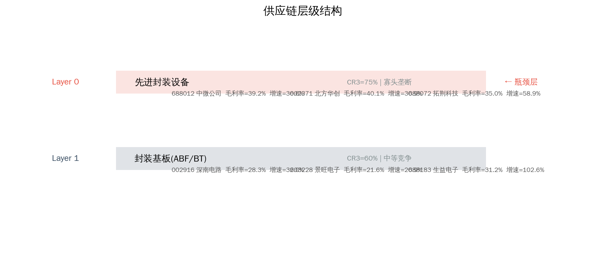
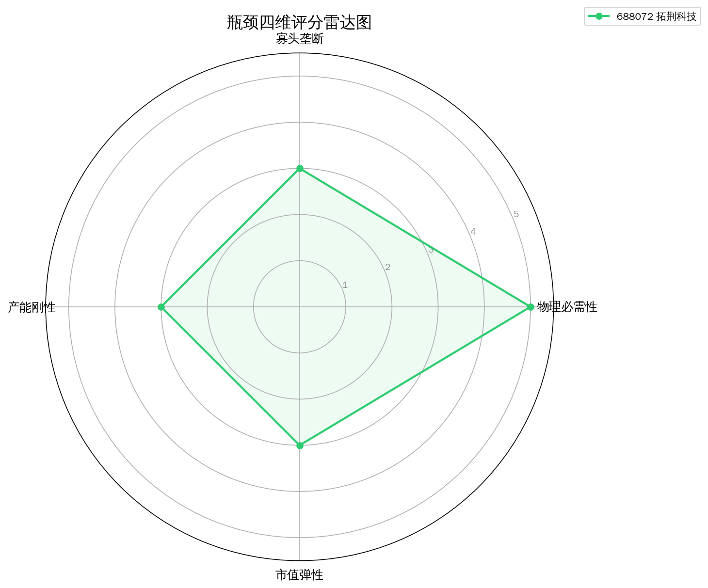
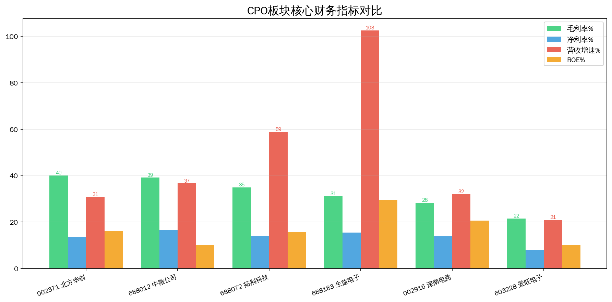
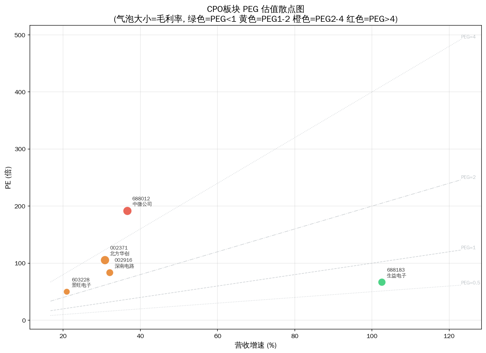

# CoWoS先进封装 Serenity 瓶颈分析报告

> 分析日期: 2026-07-09 | 方法论: Serenity Choke Point Theory | 数据源: Tushare

## 1. 板块周期定位

Chip-on-Wafer-on-Substrate，英伟达GPU核心封装技术。

**驱动因素**: AI GPU需求驱动台积电CoWoS产能翻倍扩张

## 2. 供应链结构

**Layer 0: 先进封装设备**  CR3=75%  oligopoly ← **瓶颈层**
  - 688012 中微公司  PE=191.8885  毛利率=39.1654%  增速=36.62%
  - 002371 北方华创  PE=105.4393  毛利率=40.1037%  增速=30.85%
  - 688072 拓荆科技  PE=?  毛利率=34.9523%  增速=58.87%

**Layer 1: 封装基板(ABF/BT)**  CR3=60%  moderate
  - 002916 深南电路  PE=83.6617  毛利率=28.3163%  增速=32.05%
  - 603228 景旺电子  PE=50.053  毛利率=21.5892%  增速=20.92%
  - 688183 生益电子  PE=67.0915  毛利率=31.1639%  增速=102.57%

## 3. 瓶颈评分

| 排名 | 代码 | 名称 | 综合分 | 必要性 | 垄断 | 刚性 | 弹性 |
|------|------|------|--------|--------|------|------|------|
| 1 | 688072 | 拓荆科技 | 3.6 | 5.0 | 3.0 | 3.0 | 3.0 |

**已过滤标的:**

- 002371 北方华创: 市值>100亿，弹性有限
- 002916 深南电路: 市值>100亿，弹性有限
- 603228 景旺电子: 市值>100亿，弹性有限
- 688012 中微公司: 市值>100亿，弹性有限
- 688183 生益电子: 市值>100亿，弹性有限

## 4. 瓶颈分析

**理论瓶颈层**: Layer 0 — TSV刻蚀设备国产化率<15%，是先进封装最卡脖子环节

瓶颈层标的通过筛选: 1 只
瓶颈层标的被过滤: 2 只 — 当前财务数据未体现垄断定价权

## 5. 财务对比

## 6. 风险提示

- ⚠️ **技术路线风险**: CoWoS先进封装涉及多条技术路线并行，路线收敛方向决定瓶颈归属
- ⚠️ **产能兑现风险**: 扩产计划可能因设备交付、良率爬坡延迟
- ⚠️ **政策风险**: 产业补贴退坡或技术管制升级可能影响供需格局
- ⚠️ **流动性风险**: 部分标的市值偏小，日内波动可能超10%
- ⚠️ **信息验证风险**: 供应链产能数据需通过公司公告和行业调研独立验证

---
数据截至: 2026-07-08 | 生成时间: 2026-07-09
⚠️ 本报告不构成投资建议。