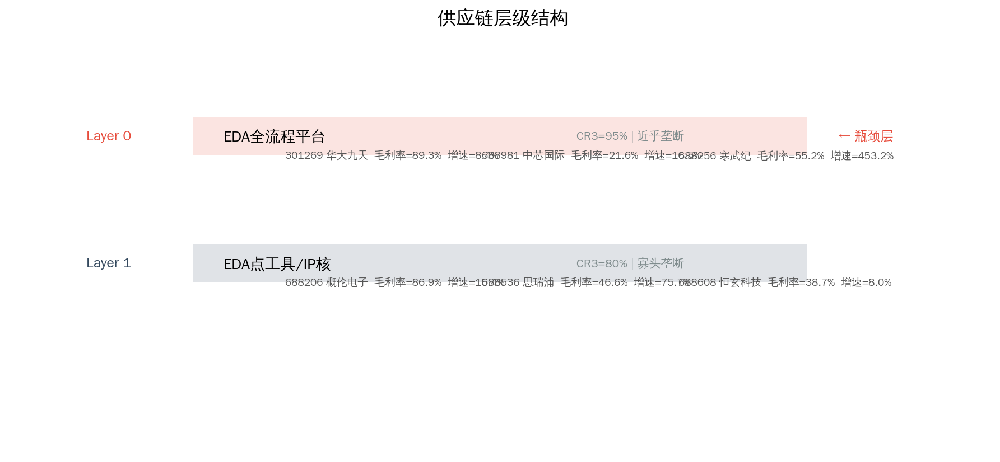
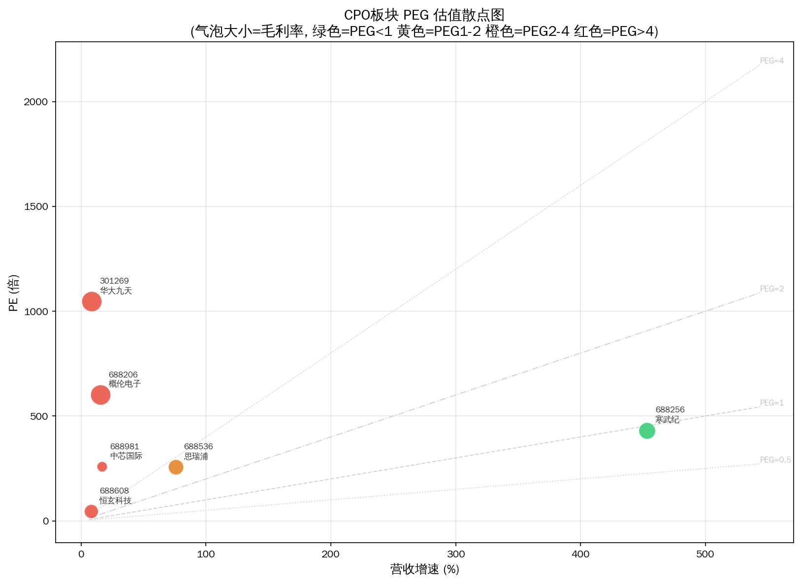

# EDA软件 Serenity 瓶颈分析报告

> 分析日期: 2026-07-09 | 方法论: Serenity Choke Point Theory | 数据源: Tushare

## 1. 板块周期定位

芯片设计电子自动化工具，集成电路产业链最上游的设计工具。

**驱动因素**: 国产替代紧迫+AI辅助芯片设计推动工具链升级需求

## 2. 供应链结构

**Layer 0: EDA全流程平台**  CR3=95%  near_monopoly ← **瓶颈层**
  - 301269 华大九天  PE=1048.0597  毛利率=89.2526%  增速=8.4%
  - 688981 中芯国际  PE=258.3153  毛利率=21.6242%  增速=16.48%
  - 688256 寒武纪  PE=431.2895  毛利率=55.1517%  增速=453.2%

**Layer 1: EDA点工具/IP核**  CR3=80%  oligopoly
  - 688206 概伦电子  PE=601.7697  毛利率=86.8906%  增速=15.41%
  - 688536 思瑞浦  PE=257.3194  毛利率=46.6406%  增速=75.65%
  - 688608 恒玄科技  PE=45.8898  毛利率=38.691%  增速=8.02%

## 3. 瓶颈评分

**⚠️ 全部标的未通过量化筛选。** 这不一定意味着没有瓶颈——更可能说明瓶颈尚未在财务层面兑现（这正是 Serenity 方法寻找的"研究差"机会）。

**已过滤标的:**

- 301269 华大九天: 市值>100亿，弹性有限
- 688206 概伦电子: 市值>100亿，弹性有限
- 688256 寒武纪: 市值>100亿，弹性有限
- 688536 思瑞浦: 市值>100亿，弹性有限
- 688608 恒玄科技: 市值>100亿，弹性有限
- 688981 中芯国际: 市值>100亿，弹性有限

## 4. 瓶颈分析

**理论瓶颈层**: Layer 0 — EDA全流程平台国产化率<5%，Synopsys/Cadence断供风险+国内晶圆厂扩产需求，替代空间巨大但技术壁垒极高

瓶颈层标的被过滤: 3 只 — 当前财务数据未体现垄断定价权

## 5. 财务对比

## 6. 风险提示

- ⚠️ **技术路线风险**: EDA软件涉及多条技术路线并行，路线收敛方向决定瓶颈归属
- ⚠️ **产能兑现风险**: 扩产计划可能因设备交付、良率爬坡延迟
- ⚠️ **政策风险**: 产业补贴退坡或技术管制升级可能影响供需格局
- ⚠️ **流动性风险**: 部分标的市值偏小，日内波动可能超10%
- ⚠️ **信息验证风险**: 供应链产能数据需通过公司公告和行业调研独立验证

---
数据截至: 2026-07-08 | 生成时间: 2026-07-09
⚠️ 本报告不构成投资建议。