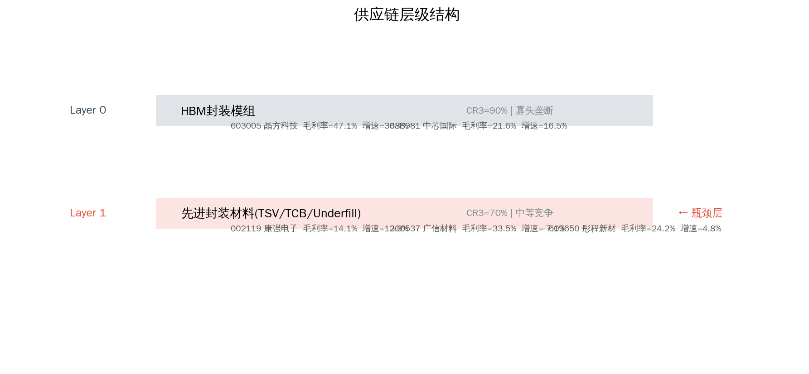
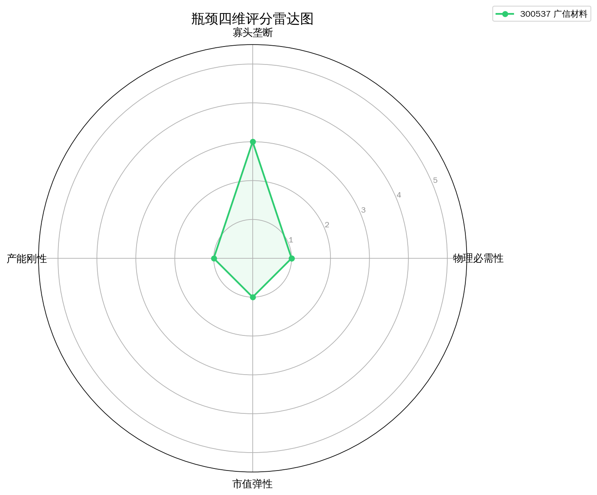
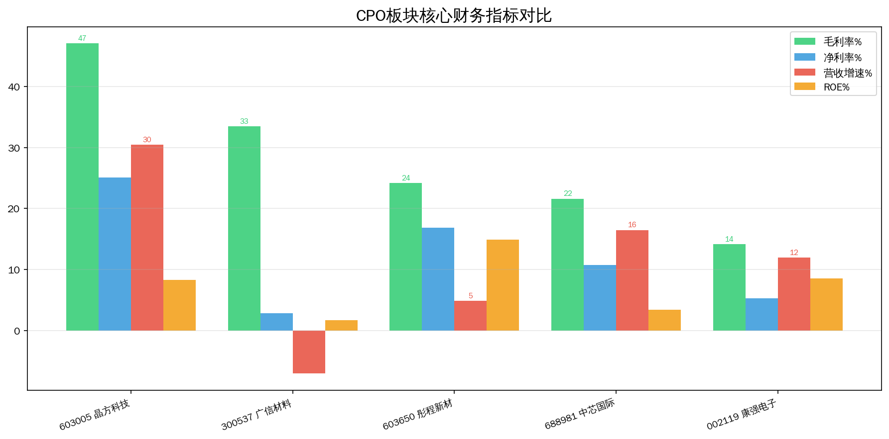
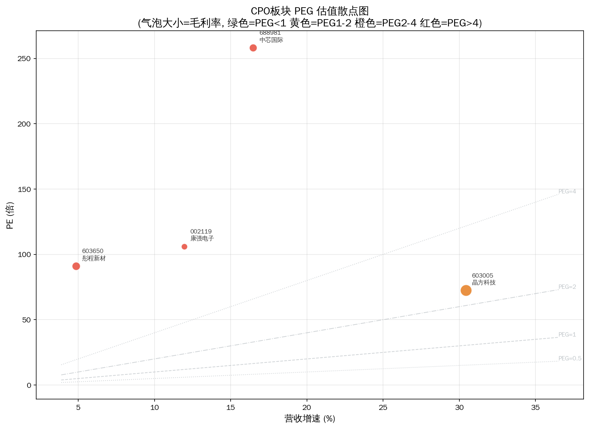

# HBM存储 Serenity 瓶颈分析报告

> 分析日期: 2026-07-09 | 方法论: Serenity Choke Point Theory | 数据源: Tushare

## 1. 板块周期定位

高带宽内存(High Bandwidth Memory)，AI GPU核心配套存储。

**驱动因素**: 英伟达H200/B200推动HBM3e需求爆发

## 2. 供应链结构

**Layer 0: HBM封装模组**  CR3=90%  oligopoly
  - 603005 晶方科技  PE=72.4836  毛利率=47.1026%  增速=30.44%
  - 688981 中芯国际  PE=258.3153  毛利率=21.6242%  增速=16.48%

**Layer 1: 先进封装材料(TSV/TCB/Underfill)**  CR3=70%  moderate ← **瓶颈层**
  - 002119 康强电子  PE=106.1694  毛利率=14.1281%  增速=11.96%
  - 300537 广信材料  PE=400.0935  毛利率=33.4696%  增速=-7.07%
  - 603650 彤程新材  PE=90.9751  毛利率=24.1965%  增速=4.85%

## 3. 瓶颈评分

| 排名 | 代码 | 名称 | 综合分 | 必要性 | 垄断 | 刚性 | 弹性 |
|------|------|------|--------|--------|------|------|------|
| 1 | 300537 | 广信材料 | 1.6 | 1.0 | 3.0 | 1.0 | 1.0 |

**已过滤标的:**

- 002119 康强电子: 毛利率<20%，议价能力弱，商品化业务
- 603005 晶方科技: 市值>100亿，弹性有限
- 603650 彤程新材: 市值>100亿，弹性有限
- 688981 中芯国际: 市值>100亿，弹性有限

## 4. 瓶颈分析

**理论瓶颈层**: Layer 1 — 先进封装材料国产化率低，HBM扩产受限封装产能

瓶颈层标的通过筛选: 1 只
瓶颈层标的被过滤: 2 只 — 当前财务数据未体现垄断定价权

## 5. 财务对比

## 6. 风险提示

- ⚠️ **技术路线风险**: HBM存储涉及多条技术路线并行，路线收敛方向决定瓶颈归属
- ⚠️ **产能兑现风险**: 扩产计划可能因设备交付、良率爬坡延迟
- ⚠️ **政策风险**: 产业补贴退坡或技术管制升级可能影响供需格局
- ⚠️ **流动性风险**: 部分标的市值偏小，日内波动可能超10%
- ⚠️ **信息验证风险**: 供应链产能数据需通过公司公告和行业调研独立验证

---
数据截至: 2026-07-08 | 生成时间: 2026-07-09
⚠️ 本报告不构成投资建议。