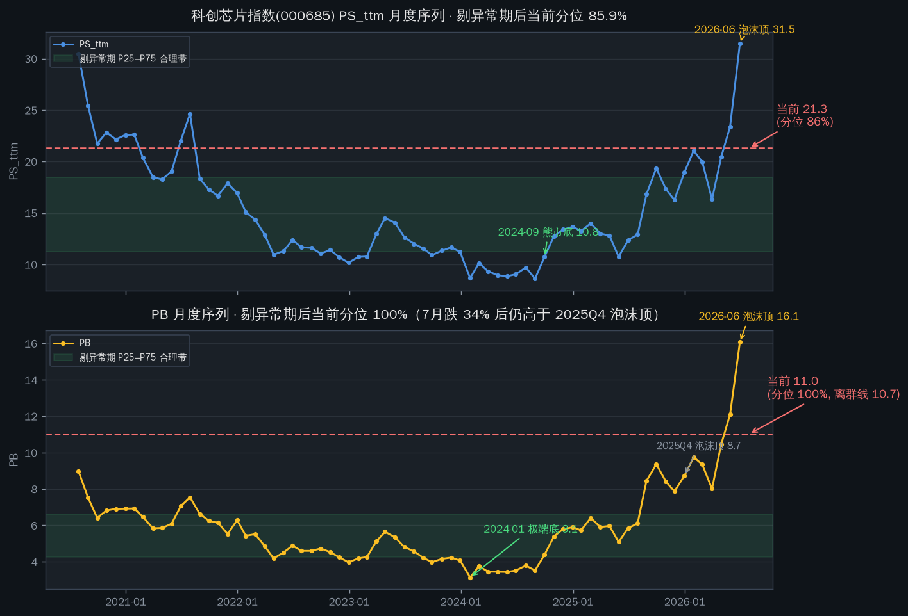
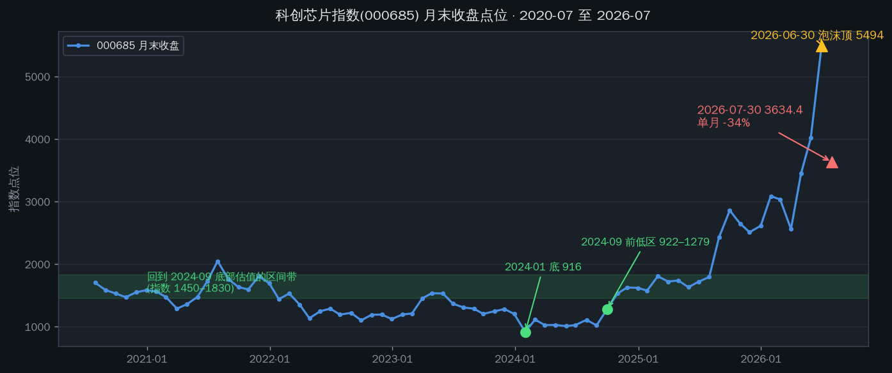
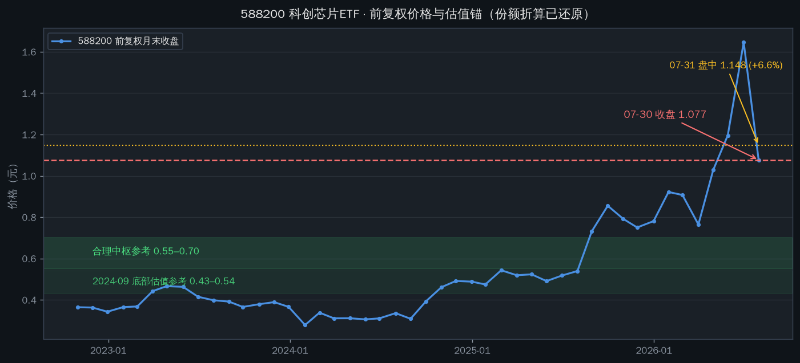

# 科创芯片ETF(588200)估值分析：跌了 34%，还在历史高位

2026-07-31 · 数据截至 2026-07-30 收盘（估值）/ 2026-07-31 11:05（实时价）· 黄阳异常时期分位法

先说结论。按黄阳分位法（复权 + 剔异常期），7 月大跌 34% 之后，588200 跟踪的科创芯片指数（000685）估值仍在历史高位：PB 分位 97%–100%、PS 分位 85%–86%、PE 分位 89%–91%。**当前不在合理区间。**按历史中位锚定，588200 需要跌到 0.55–0.70 元一带才回到"合理中枢"；按 2024 年 9 月熊市底部估值为锚，需要到 0.43–0.54 元。今天（07-31）盘中 +6.6% 的反弹，就是黄阳说的"技术性反弹"。

## 先说价格：7/21 做过 3:1 份额折算

588200 在 **2026-07-21 进行了 3:1 份额折算**（复权因子 1.0 → 2.9992）。K 线上从 4.94 跌到 1.08 的断崖里，约 2/3 是折算造成的视觉落差，只有 1/3 是真实下跌。

| 口径 | 2026-06-30（顶） | 2026-07-30 | 跌幅 |
|---|---|---|---|
| 指数点位（000685） | 5494 | 3634 | **-33.9%** |
| ETF 前复权价 | 1.646 | 1.077 | **-34.6%** |
| ETF 未复权价 | 4.936 | 1.077 | -78.2%（含折算） |

7 月单月跌幅创科创芯片指数历史之最，但这是从 6 月 30 日泡沫顶（5494 点、PB 16 倍）摔下来的——跌完之后的估值仍远高于任何历史正常时期。

## 数据口径：黄阳方法怎么落地

TuShare 不提供 000685 的官方估值序列（科创类指数均无），因此用**成分股聚合法**重建：取 2026-06-30 指数权重（50 只成分），在每个月末用全市场 daily_basic 快照聚合出指数 PS_ttm / PB / PE_ttm，得到 2020-07 至 2026-07 共 72 个月度点 + 2026-07-30 当日点。

方法校验：用同一方法算科创50（000688），7-30 PB 聚合值 7.94，对照蛋卷基金口径 7.52，偏差在 6% 以内，方法可信。

黄阳方法的核心是：**分位计算必须剔除异常期**（双侧：极端高估和极端低估都剔除）。本报告用 Tukey 离群线（Q1−1.5×IQR / Q3+1.5×IQR）标记异常月并剔除。被剔除的异常月：PE 剔除 2020-07（上市首月）和 2026-06（泡沫顶）；PS 剔除 2026-06；PB 剔除 2026-05、2026-06。

## 跌了 34% 之后，还在什么位置

| 指标 | 当前（07-30） | 全样本分位 | 剔异常期分位 | 历史中位 |
|---|---|---|---|---|
| PE_ttm | 177.6 | 88.9% | **91.4%** | 91.9 |
| PS_ttm | 21.3 | 84.7% | **85.9%** | 13.4 |
| PB | 11.0 | 97.2% | **100%** | 5.7 |

三个读数都很极端：

**PB 是其中最刺眼的。**当前 11.0 倍甚至高于 2025 年四季度泡沫顶（8.7），只低于 2026 年 5、6 月两个月；而且它本身已经超过统计离群线（10.7）——即使剔除异常期，当前值依然是"异常"。7 月跌 34% 只是把 PB 从 16 倍（6 月）打回 11 倍，离历史中枢 5.7 倍还有一倍距离。

**交叉验证：**科创50（蛋卷口径）7-30 PE 分位 97.8%、PB 分位 88.7%——科创板整体都在历史极高位，不是科创芯片一个板块的问题。

PE 口径有保留：聚合时剔除了 pe_ttm 为空的成分（每个时点 12–17 只，含亏损股），所以 177.6 是"只算盈利成分"的下界，官方口径（含亏损）只会更高。

## 合理区间在哪里（价格锚）

把剔异常期后的分位分布映射回价格（假设成分盈利不变）：

| 估值锚 | PS 口径 → ETF 价 | PB 口径 → ETF 价 | 指数点位 |
|---|---|---|---|
| 当前（07-30 收盘 1.077） | 21.3 倍 | 11.0 倍 | 3634 |
| 合理区上沿（P75） | 0.94 元 | 0.65 元 | 2190–3150 |
| 历史中位 | 0.67 元 | 0.55 元 | 1860–2260 |
| 2024-09 熊市底部估值 | 0.54 元 | 0.43 元 | 1450–1830 |
| 2024-01 极端底部 | 0.44 元 | 0.31 元 | 1040–1480 |

把话说直白：现价 1.08–1.15 元，**比历史中位（0.55–0.67）贵 60%–110%，比 2024-09 熊市底部估值（0.43–0.54）贵 100%–170%**。黄阳框架下要等到"合理"，先看 PS 回到 16 倍以内（对应 ETF 约 0.81 元以下，进入合理区上沿），再看 PS 回到 11–13 倍（0.55–0.70 元）才算历史中枢。

## 与黄阳 7/30 判断的交叉

黄阳 2026-07-30 第 1236 日投资记录（科创创业历史最大阴线）：科创板月线 -30.36% 创历史之最，但背景是前期涨了 160%，泡沫程度远超上一轮；他认为**需要再跌 60–80% 才回到上一轮熊市的估值水平**；短期反弹是技术性的，长期由于流动性被持续抽走只会更差。

本报告的分位映射：回到 2024-09 底部估值需要再跌 50%–60%（指数 1450–1830，ETF 0.43–0.54）。**方向与黄阳一致，量级略温和**（他说的是科创板整体，本报告是科创芯片细分指数，7 月科创芯片 -34% 比综指 -30% 跌得更快）。今天盘中 +6.6% 的反弹，正好落在他说的"技术性反弹"剧本里。

## 什么情况下结论会变

**盈利兑现（时间换空间）。**8 月底–9 月中报披露完毕，如果成分股盈利大幅增长，PS 分母变大、分位会被动下降。这条路径不需要价格下跌，但需要基本面兑现——这也是黄阳框架下"财务指标做后验、不做前置"的含义。

**成分调样。**8 月是科创芯片指数半年调样窗口，若换出高估值成分，指数估值中枢会整体下移。

**样本太短。**000685 只有 2020-07 以来的 6 年、一轮半牛熊，分位锚是量级参考，不是精确锚。且用当前成分回看历史存在幸存者偏差（2024 年还没有寒武纪等暴涨股进指数），历史 PS/PB 可能被低估，"贵"的程度可能被夸大——但方向不变。

## 观察点

| 时点 | 事件 | 看什么 |
|---|---|---|
| 8 月底–9 月初 | 中报披露完毕 | 成分股盈利兑现度；PS 分母是否变大 |
| 8 月 | 指数调样公告 | 高估值成分是否被换出 |
| 每周 | 估值快照 | PS 是否回到 16 以内（进入合理区上沿）；PB 是否回到 7 以内 |
| 持续 | 科创板资金面 | 黄阳框架下"流动性被抽走"逻辑是否缓解 |

---
Data as of: 2026-07-30（估值）/ 2026-07-31 11:05（实时价）
Generated: 2026-07-31

数据源：TuShare（daily_basic / index_daily / index_weight / fund_daily / fund_adj）、蛋卷基金指数估值（科创50 交叉校验）、新浪实时行情。
口径说明：指数 PE/PS/PB 为成分股聚合近似（2026-06-30 权重），PE 仅含盈利成分；分位样本为 2020-07 至 2026-06 月度 + 2026-07-30；异常期按 Tukey 离群线双侧剔除。
