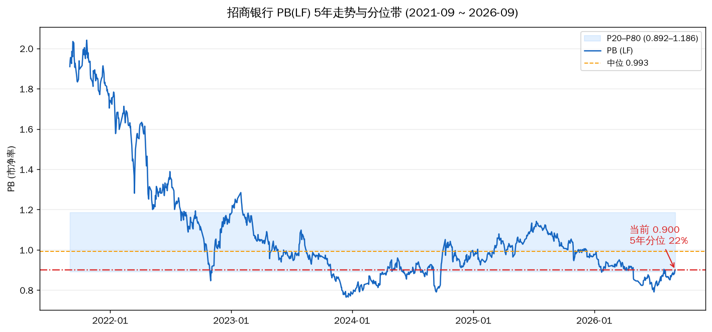
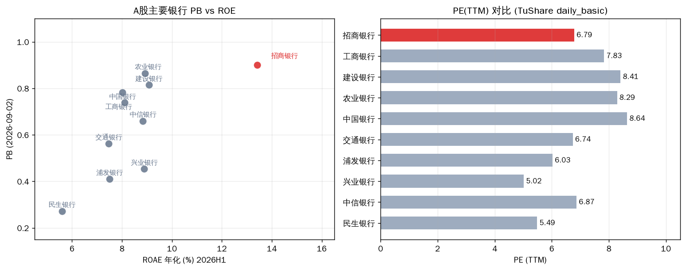
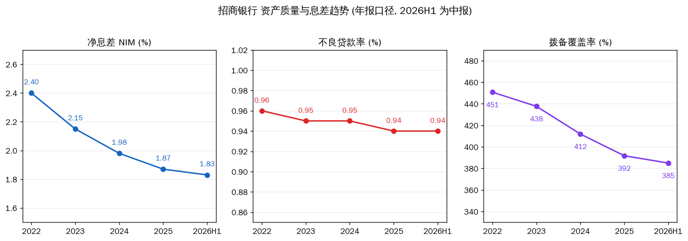
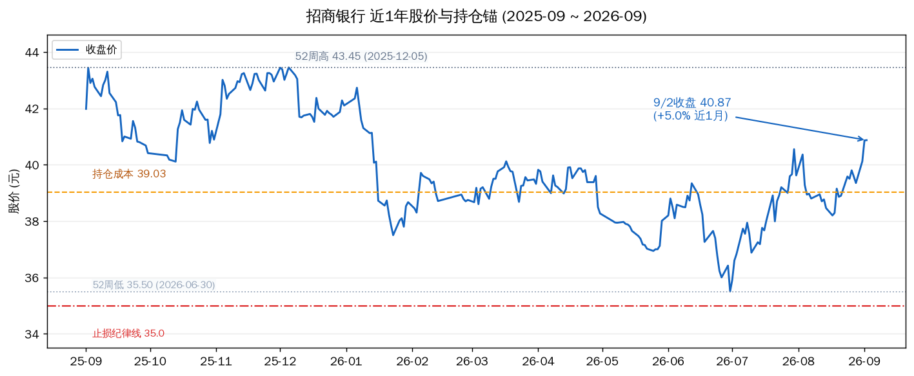

# 招商银行估值分析(2026-09-03)

先说结论。**当前 PB 0.90,5 年分位 22%——中性偏便宜,不是极端便宜**;从 8/13 的 PB 12% 分位上来了一档,主要是 8 月底以来银行板块行情推动(近 1 月 +5.0%),基本面没有变好多少、也没有变坏。招行的定价逻辑是**低个位数利润增长 + 4.9% 股息 + 全行业最好的资产质量**,这类标的的估值判断要看三件事:PB 分位、股息率、ROE 相对同业的溢价是否还在。

---

## 一、估值读数:三把尺子

| 指标 | 当前值 | 历史位置 | 读数 |
|---|---|---|---|
| PB(9/2 收盘) | 0.90 | 5 年分位 **22%**(P20 0.892 / 中位 0.993 / P80 1.186) | 中性偏便宜 |
| 股息率(TTM) | 4.93% | 5 年分位 56%(中位 4.78%) | 中等 |
| PE(TTM) | 6.79 | 5 年分位 55% | 中等 |
| 价格 | 40.87(9/2 收) | 1 年分位 67%,52 周区间 35.50~43.45 | 中上 |

三个读数指向同一个位置:**招行当前处在"不算贵、也不算便宜"的中性区间**。PB 5 年分位 22% 看起来低,但要注意 5 年中位 0.993 本身不高——过去 5 年招行大部分时间都贴着净资产交易,0.90 只是相对自己的历史偏低,不是 2022 年那种 0.76 的极端值。

股息率 4.93% 相对自身 5 年(中位 4.78%)在均值附近。相比 2024 年 5%+ 的"高股息"叙事,现在股息率对保险/红利资金的吸引力从"稀缺"降为"正常配置"。这是 8 月以来股价上涨的直接结果(近 1 月 +5.0%)。

**为什么银行不用 P/S 分位**:银行的"销售额"是息差收入,与资产质量、拨备无关,P/S 对银行无区分度。银行定价的核心是 PB(资产质量 + ROE)和股息率(股东回报)。

## 二、同业横向:ROE 溢价还在,PE 反而便宜

| 银行 | PB | ROAE 年化(2026H1) | PE(TTM) |
|---|---|---|---|
| **招商银行** | **0.90** | **13.42%** | **6.79** |
| 农业银行 | 0.87 | 8.92% | 8.29 |
| 建设银行 | 0.81 | 9.08% | 8.41 |
| 中国银行 | 0.78 | 8.02% | 8.64 |
| 工商银行 | 0.74 | 8.11% | 7.83 |
| 交通银行 | 0.56 | 7.47% | 6.74 |
| 兴业银行 | 0.45 | 8.89% | 5.02 |
| 浦发银行 | 0.41 | 7.50% | 6.03 |
| 中信银行 | 0.66 | 8.84% | 6.87 |
| 民生银行 | 0.27 | 5.60% | 5.49 |
| **Max** | **0.90** | **13.42%** | **8.64** |
| **75th%ile** | **0.82** | **8.96%** | **8.39** |
| **中位** | **0.66** | **8.40%** | **6.87** |
| **25th%ile** | **0.46** | **7.50%** | **5.87** |
| **Min** | **0.27** | **5.60%** | **5.02** |

横向看招行有个少见组合:**ROE 全行业最高(13.42% vs 中位 8.40%),PB 全行业最高(0.90),但 PE 低于四家大行(6.79 vs 7.83~8.64)**。这说明市场仍在给招行"最优银行"的溢价——PB 0.90 的溢价是 ROE 撑起来的,不是情绪溢价。PE 低于大行是因为招行盈利含金量高(中收占比高、信用成本低),利润里没有水分。

同类股份行(兴业/浦发/民生)PB 0.27~0.66 深度破净,ROE 7~9%,与招行的差距是"零售之王"的商业模式差距,不是简单的估值差。**招行 0.90 PB 对应 13.4% ROE,隐含的是市场对零售优势的信任**;这份信任 2026H1 财报没有破坏(大财富管理收入 +18.4%)。

## 三、基本面锚:中报验证了什么

2026H1(8/28 披露):营收 1781.81 亿(+4.8%),归母净利 764.45 亿(+2.0%)。**增速不高,但方向对——营收连续两年下滑后,2025 年转正,2026H1 增速继续扩大**。

| 指标 | 2022A | 2023A | 2024A | 2025A | 2026H1 | 趋势 |
|---|---|---|---|---|---|---|
| 净息差 | 2.40% | 2.15% | 1.98% | 1.87% | 1.83% | 降幅收窄(Q2 环比 -1bp) |
| 不良率 | 0.96% | 0.95% | 0.95% | 0.94% | 0.94% | 稳定在 1% 以下 |
| 拨备覆盖率 | 450.8% | 437.7% | 412.0% | 391.8% | 385.0% | 高位缓释,仍有厚垫 |

三个关键判断:

1. **息差下行接近尾声**。净息差从 2022 年 2.40% 一路降到 2026H1 1.83%,但降幅逐年收窄(2024 -17bp → 2025 -11bp → 2026H1 同比仅 -5bp),Q2 单季环比只降 1bp。管理层口径是"收窄幅度减小、尽快企稳"。低利率环境下 1.8% 附近大概率是底部区域,不是底部最低点,但最陡的下行段已经过去。

2. **资产质量是真金白银的稳**。不良率 0.94% 连续 5 年低于 1%,拨备覆盖率 385% 是监管要求(约 150%)的 2.5 倍。这意味着**利润没有水分**:不需要靠拨备释放来凑增速,反而有释放空间支撑未来 3-5 年利润不出现断崖。

3. **财富管理是增长引擎**。大财富管理收入 247 亿(+18.4%),其中代销基金 +61%、信托 +44%。在息差不涨的环境里,中收是 ROE 能不能守住 13% 的关键。2026H1 ROAE 13.42% 已基本止住下滑(2025A 13.44%)。

## 四、持仓视角

你持有 800 股,成本 39.03。9/2 收盘 40.87 浮盈约 +4.7%;今日(9/3)盘中 41.25,浮盈约 +5.7%。

| 锚 | 价格 | 状态 |
|---|---|---|
| 持仓成本 | 39.03 | 已越过,浮盈 |
| 止损纪律线 | 35.0 | 距现价 -14%,安全垫充足 |
| 52 周高 | 43.45(2025-12-05) | 距现价 +6.3% |
| 52 周低 | 35.50(2026-06-30) | 已远离 +15% |

这只票在你组合里是**防守角色**:成本线已收复、止损距离远、波动小(今日大盘科技股大跌时它 +0.9%),不需要也不应该成为操作重点。它的意义是组合里"跌得少、有股息、睡得着"的部分。

## 五、我的判断

**估值结论:中性偏便宜,维持持有合理,不是加仓位置。**

- 说它便宜:PB 5 年分位 22%、0.90 倍净资产买 ROE 13.4% 的银行、4.93% 股息率,放在"优质银行"这个筐里不贵。
- 说它不便宜:近 1 月 +5% 已经把 8/13 的低分位窗口吃掉一截;PE/股息率分位都在 55% 左右,属均值附近;年内的上涨是风格(红利/险资)驱动多于基本面驱动,风格反转时银行也会回吐。
- 中间最难判断的是**"什么时候银行涨到头"**——这轮银行行情(工行/建行/农行 9/1 创新高)靠的是低利率 + 险资欠配 + 高股息,基本面只提供了"不跌"的支撑。招行作为零售龙头,上行弹性不如四大行,回撤时也不会比四大行少。

**操作上**(参考,不替你拍板):
- 持有者:拿住,止损线 35 不动。基本面没坏、估值没疯,没有卖出理由。
- 想加仓:等回调到 PB 0.85 附近(约 38.5,接近 5 年 P20 0.892 下方)再考虑;现价追 41+ 性价比一般。
- 想卖出止盈:如果组合需要降银行敞口或调仓到更有弹性的方向,现价 40.9~41.3 是年内偏上位置,可以出部分;但要清楚这是"风格止盈"不是"基本面止盈"。

## 六、风险

| 风险 | 触发条件 | 跟踪点 |
|---|---|---|
| 息差二次下行 | LPR 再降 + 存款成本降不动 | Q3 财报净息差是否跌破 1.80% |
| 零售资产质量恶化 | 信用卡/消费贷不良生成率上升 | 每季不良率 + 拨备覆盖率变动 |
| 风格反转 | 红利资金流出、科技回潮 | 银行板块成交占比、股息率 vs 10Y 国债利差 |
| 财富管理中收回落 | 资本市场转弱 → 代销基金/理财规模掉头 | 大财富管理收入季度增速 |

## 验证锚点

| 类型 | 锚 | 看什么 |
|---|---|---|
| 价格 | 38.5 / 40.87 / 43.45 / 35.0 | PB 0.85 加仓参考 / 现价 / 52 周高 / 止损 |
| 数据 | 2026Q3 财报(10 月底) | 净息差、不良率、财富管理收入增速 |
| 事件 | 中期分红落地 | 每股分红与股息率兑现 |
| 行业 | LPR 报价、10Y 国债收益率 | 息差压力与红利风格的生命线 |

---

Data as of: 2026-09-03(盘中价 41.25 / 估值为 9/2 收盘 daily_basic)
Generated: 2026-09-03
