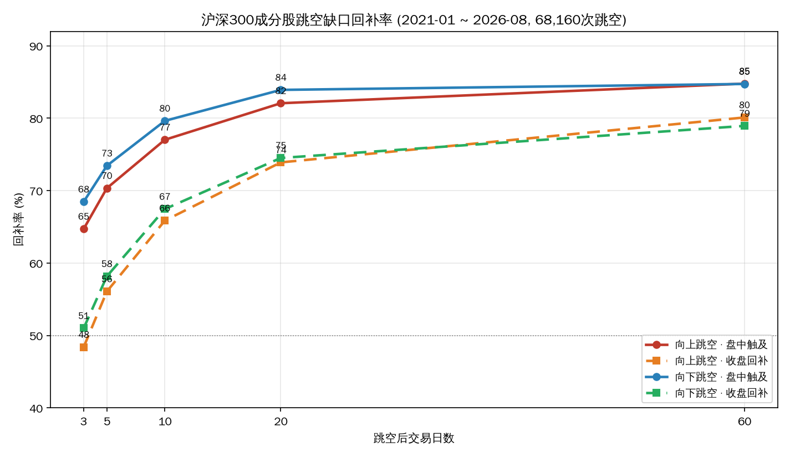
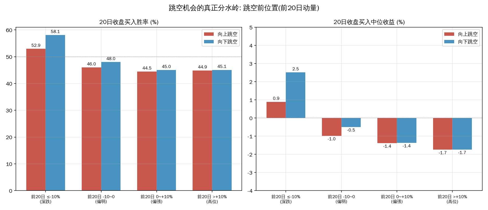
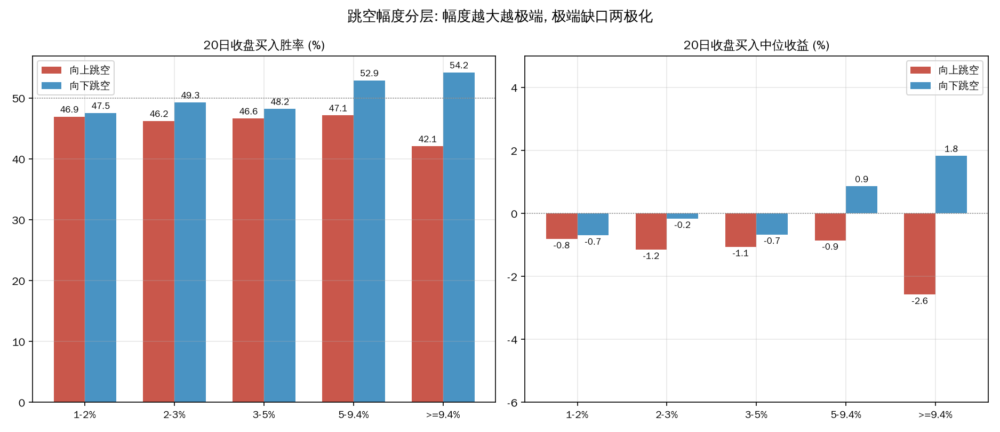
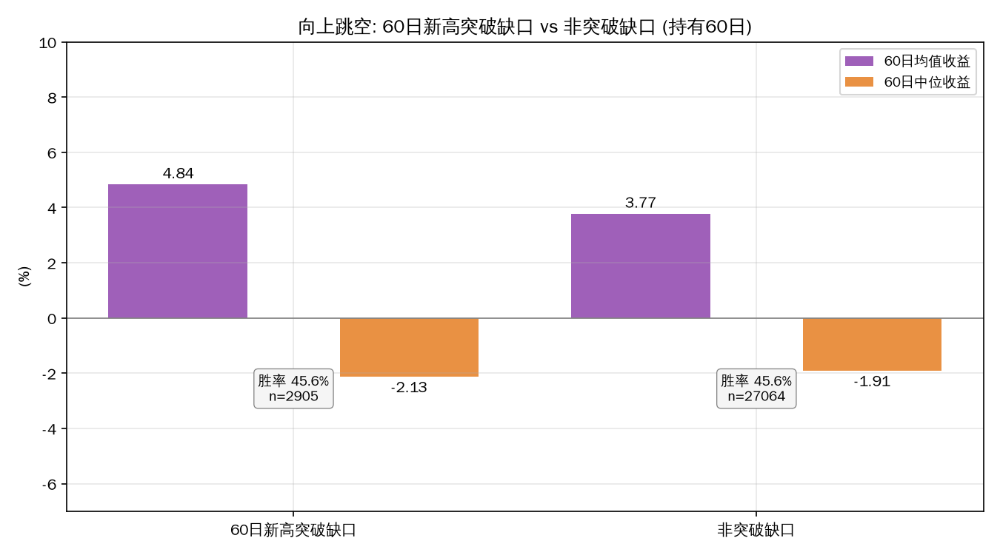

# A股跳空缺口机会实证研究

**样本：沪深300 成分股 300 只 · 2021-01-04 ~ 2026-08-28 · 68,160 次跳空事件（缺口 ≥1%）**

## 结论摘要

1. **"缺口必补"在大盘股上大体成立，但速度比想象慢。** 60 个交易日内，收盘口径回补率约 79~80%，盘中触及约 85%；而 3 日收盘回补率只有约 48~51%。"等缺口回补再买"是低效策略，等不到短线节奏。
2. **跳空本身不是买入信号。** 全部跳空后收盘买入持有 20 日：胜率 45~48%、中位收益为负、均值微正（+1.1~1.5%）。典型右偏长尾——多数时候小亏，少数大赚，盲追是负期望的中位体验。
3. **真正分水岭是跳空前的位置（前 20 日动量），不是方向。** 前 20 日深跌（≤-10%）后的跳空，无论上下，是全场唯一胜率 >52%、中位数转正的格子；其中**向下跳空（恐慌加速段）最优：20 日胜率 58.1%、中位收益 +2.5%**。高位（前 20 日 >+10%）后的跳空最差：20 日中位收益 -1.7~-1.8%。
4. **幅度两极化。** 接近涨停开盘（≥9.4%）的向上跳空 5 日胜率仅 35.2%（追高被套），但 20/60 日均值高（少数连板妖股拉长尾）；向下大跳空（5~9.4%）20 日胜率 52.9%、中位数转正，是超跌反弹信号。
5. **教科书"突破缺口"没有神话。** 60 日新高的向上突破缺口 60 日均值 +4.84% vs 非突破 +3.77%，但两者胜率同为 45.6%、中位数均为负——突破缺口有超额但仍是低胜率结构，不能当独立买入理由。

---

## 一、样本与方法

| 项目 | 口径 |
|---|---|
| 样本 | 沪深300 当前成分 300 只（最新调样 2026-07-31） |
| 区间 | 2021-01-04 ~ 2026-08-28，共 399,871 行日线 |
| 跳空定义 | 开盘价 vs 前收盘（pre_close，除权自动调整）≥ ±1% |
| 事件数 | 向上 31,790（可交易 31,246）· 向下 36,370（可交易 36,264） |
| 可交易判定 | 开盘价未触及涨停/跌停价（一字板不可成交） |
| 回补定义 | 盘中触及 = 后续 low ≤ 前收（向上）/ high ≥ 前收（向下）；收盘回补 = 后续 close 越过前收 |
| 收益口径 | 跳空日收盘买入（另统计开盘追入），持有 5/10/20/60 个交易日，未计交易成本 |

## 二、回补规律

- 收盘回补率随窗口单调上升：3 日 48~51% → 10 日 66~68% → 20 日 74~75% → 60 日 79~80%。
- 盘中触及口径比收盘高 10~15 个百分点（60 日约 85%）：很多缺口"盘中碰过又收回去"。
- 向下跳空短期回补率略高于向上（3 日 51% vs 48%）：下跌后的反弹填补略强于上涨后的回落填补。

## 三、位置是分水岭（核心发现）

**20 日收盘买入，按跳空前 20 日动量分层：**

| 跳空前 20 日 | 向上跳空胜率 | 向上中位收益 | 向下跳空胜率 | 向下中位收益 |
|---|---|---|---|---|
| ≤-10%（深跌） | 52.9% | +0.9% | **58.1%** | **+2.5%** |
| -10~0（偏弱） | 46.0% | -1.0% | 48.0% | -0.5% |
| 0~+10%（偏强） | 44.5% | -1.4% | 45.0% | -1.4% |
| >+10%（高位） | 44.9% | -1.8% | 45.1% | -1.7% |

- 唯一统计优势场景：**前 20 日深跌 + 向下跳空**（恐慌加速段），20 日胜率 58.1%、中位 +2.5%，5 日胜率 55.9%，60 日胜率 56.9%——超跌反弹效应稳定。
- 深跌后的向上跳空同样转正（52.9% / +0.9%），可视为反转确认信号。
- 高位跳空（无论方向）胜率 44~45%、中位 -1.7~-1.8%：**高位向下跳空是最危险的减仓信号，高位向上跳空也不值得追**。

## 四、幅度分层

**20 日收盘买入，按缺口幅度分层：**

| 幅度 | 向上胜率 | 向上中位 | 向下胜率 | 向下中位 |
|---|---|---|---|---|
| 1-2% | 46.9% | -0.8% | 47.5% | -0.7% |
| 2-3% | 46.2% | -1.2% | 49.3% | -0.2% |
| 3-5% | 46.6% | -1.1% | 48.2% | -0.7% |
| 5-9.4% | 47.1% | -0.9% | **52.9%** | **+0.9%** |
| ≥9.4% | 42.1% | -2.6% | 54.2%* | +1.8%* |

*向下 ≥9.4%（跌停开盘）样本仅 134 次，参考性弱。

- 向上跳空在所有幅度档都是负中位；**≥9.4%（近涨停开盘）5 日胜率仅 35.2%**——一字/开盘涨停追入是全场最差短线行为，其 20/60 日均值高来自少量连板股的右偏长尾，中位数 -2.6%。
- 向下跳空幅度越大越偏多：5-9.4% 档胜率 52.9%、中位转正。恐慌性抛售比温和阴跌后的跳空更具反弹价值。

## 五、突破缺口没有神话

60 日新高向上突破缺口（2,905 次）vs 非突破缺口（27,064 次），持有 60 日：

| 指标 | 突破缺口 | 非突破缺口 |
|---|---|---|
| 均值 | +4.84% | +3.77% |
| 中位数 | -2.13% | -1.91% |
| 胜率 | 45.6% | 45.6% |

均值更高但中位数更低、胜率相同：突破缺口只是把"少数大赢"的尾部拉得更长，不是稳定盈利模式。教科书"突破缺口看多"在沪深300成分股上不构成可交易优势。

## 六、可操作纪律

1. **追跳空（向上）整体放弃。** 除深跌位置外，任何幅度向上跳空的中位收益都为负，≥9.4% 追入 5 日胜率 35%。
2. **唯一有统计优势的玩法：深跌后（前 20 日 ≤-10%）出现向下跳空的恐慌段**，收盘或次日买入，持有 5~20 日，胜率 56~58%。本质是超跌反转，跳空只是恐慌确认信号。
3. **高位（前 20 日 >+10%）向下跳空 = 减仓/回避信号**（20 日胜率 45%、中位 -1.7%）。
4. **回补规律当止损参考用，不当入场信号用**：买入后若持有 20 日缺口仍未回补且亏损，说明该缺口是趋势缺口而非普通缺口，别等回补。
5. 开盘追 vs 收盘确认差别很小（20 日收益差 <0.3 个百分点），没必要为抢开盘付出滑点和情绪成本。

## 七、局限与风险

- **幸存者偏差**：样本为当前沪深300成分，剔除了期间退市/降级股票，收益可能高估。
- **未计交易成本**：佣金 + 滑点 + 印花税对 5-20 日持仓影响约 0.5~1%，短线收益需打折。
- **未区分跳空原因**：重大利空（业绩暴雷）的向下跳空与情绪超卖的向下跳空不可事前区分，58% 胜率是统计平均，单次事件可能连续下跌。
- **样本期 2021-2026 含一轮牛熊**，结构特征（如大盘股缺口回补率）在不同市场环境下可能漂移。
- 涨停开盘、跌停开盘（≥9.4% 档）样本占比小，结论参考性弱。

---

## 数据附录

- 原始事件数据：`data/events_up.csv`（31,790 次）、`data/events_down.csv`（36,370 次）
- 全部分层统计：`data/stats.json`
- 图表脚本：`/tmp/gap_study/charts.py`、`/tmp/gap_study/analyze.py`

---
Data as of: 2026-08-28
Generated: 2026-08-29
