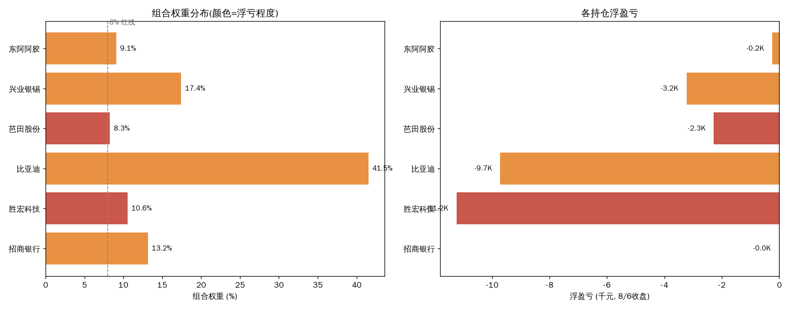
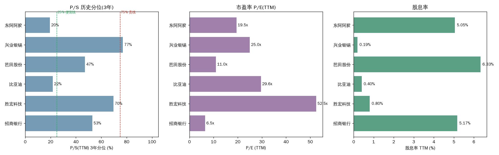

# 持仓估值体检(组合视角)

> 2026-08-06 收盘数据 · 持仓来源:hold-status Sheet(价格已用 8/6 收盘更新)

先说结论。**组合不是"整体贵"或"整体便宜",而是两头分化**:比亚迪 + 东阿阿胶两只是便宜的(PS 分位 20% 上下),胜宏 + 兴业两只已经偏贵(PS 分位 70-77%)。组合最大的问题不是估值,是**结构**——比亚迪一只占 41.5%,远超单票上限;而两只偏贵的票(胜宏、兴业)合计又占 28%,把组合估值整体抬高了一截。**组合浮亏 -11.3%,没有一只盈利,全部靠成本线以下撑着。**

---

## 一、组合快照(2026-08-06 收盘)

| 股票 | 持仓 | 成本 | 8/6收盘 | 市值 | 占比 | 浮盈亏 | 浮盈亏% |
|---|---:|---:|---:|---:|---:|---:|---:|
| 比亚迪 | 1100 | 98.29 | 89.45 | 98,395 | **41.5%** | -9,719 | -9.0% |
| 兴业银锡 | 1100 | 40.52 | 37.58 | 41,338 | 17.4% | -3,231 | -7.2% |
| 招商银行 | 800 | 38.98 | 38.97 | 31,176 | 13.2% | -10 | 0.0% |
| 胜宏科技 | 100 | 362.59 | 250.15 | 25,015 | 10.6% | -11,244 | **-31.0%** |
| 东阿阿胶 | 400 | 54.46 | 53.85 | 21,540 | 9.1% | -243 | -1.1% |
| 芭田股份 | 1700 | 12.87 | 11.53 | 19,601 | 8.3% | -2,283 | -10.4% |
| **合计** | | | | **237,065** | 100% | **-26,729** | **-11.3%** |

- 现金(流水推算):-1,443.59(负值,说明流水缺口,以账户实际为准)
- 单票红线 8%:比亚迪 41.5%、兴业 17.4% 双双超标

---

## 二、估值分位(3年 P/S TTM,黄阳法剔除异常口径)

| 股票 | P/S(TTM) | 3年分位 | 位置 | P/E(TTM) | P/B | 股息率 |
|---|---:|---:|---|---:|---:|---:|
| 东阿阿胶 | 5.07x | **19.5%** | 便宜 | 19.5x | 3.19 | 5.05% |
| 比亚迪 | 1.04x | **21.7%** | 偏便宜 | 29.6x | 3.52 | 0.40% |
| 芭田股份 | 2.12x | 47.1% | 中性 | 11.0x | 2.76 | 6.33% |
| 招商银行 | 2.88x | 52.9% | 中性 | 6.5x | **0.87** | 5.17% |
| 胜宏科技 | 11.99x | **69.6%** | 偏贵 | 52.5x | 14.13 | 0.80% |
| 兴业银锡 | 10.21x | **77.1%** | 偏贵 | 25.0x | 6.16 | 0.19% |

**按行业换尺子(重要,不能用同一把尺子量所有票):**

- **比亚迪(汽车)**:PS 是主尺子。1.04x、21.7% 分位 → **便宜区**。7 月产销 +21.8%、出口创新高,基本面在修复但股价没买账;市场在等 8 月底中报毛利率。8/6 收盘 89.45,较 7/23 分析时 PS 17% 分位略升但仍低于 P20。
- **兴业银锡(有色周期)**:周期股用 PS 分位 + 商品价双确认。PS 10.2x、77.1% 分位 → **不便宜了**。8/5 估值报告已提示"7 月中旬那种便宜状态已结束",银价破 60 美元带动反弹,但银漫停产(7/26 事故)是暗雷。
- **招商银行(银行)**:看 PB + 股息率,不看 PS。PB 0.87x(破净)、股息率 5.17% → **银行股里典型的便宜估值**。防御属性,组合里的压舱石。
- **东阿阿胶(消费)**:PS 19.5% 分位 + 股息率 5.05% → 便宜。但股价分位 74.3%(近 3 年),说明价格从低点已经反弹了不少,估值便宜主要靠利润修复。
- **胜宏科技(PCB/科技)**:PS 69.6% 分位 + PE 52.5x + PB 14.1x → **贵**。浮亏 -31% 是组合最大亏损来源。8/5-8/6 连续大涨(+17%、+5.8%)后估值进一步抬升。
- **芭田股份(化工)**:PS 47.1% 中性,PE 11x、股息率 6.33% → 估值不贵不便宜,靠股息撑着。

---

## 三、逐票判断

### 比亚迪(41.5% 权重)——便宜,但权重是问题

PS 1.04x / 21.7% 分位,估值没问题。7 月销量 +21.8%、出口创新高,累计缺口收窄到 -10.5%,基本面在好转。**问题在权重:41.5% 是单票红线的 5 倍**。这只票如果跌 10%,组合净值 -4.1%;涨 10%,组合 +4.1%。组合的命运一半押在它身上。持仓浮亏 -9%,在 86 止损线上方。

### 兴业银锡(17.4% 权重)——反弹修复中,不是加仓位

8/5 已出过单票估值报告:PS 77% 分位,银价驱动的反弹,基本面有停产暗雷。当前浮亏 -7.2%(1100 股/成本 40.52),已从 7/17 的 -31% 大幅修复。**这里的关键不是估值,是停产复产时点**——银漫占净利约 79%,每停一个月都是实打实缺口。

### 胜宏科技(10.6% 权重)——组合里最贵的票 + 最深浮亏

PS 69.6% 分位、PE 52.5x、PB 14.1x,三项都贵;浮亏 -31%(100 股/成本 362.59)。8/5-8/6 两天 +23% 属于 AI 硬件反弹,估值不便宜。**它是组合里"贵 + 亏"双料最差的票**,唯一持有理由是博 AI 算力需求反弹。

### 招商银行(13.2% 权重)——便宜,防御压舱石

PB 0.87 破净、PE 6.5x、股息率 5.17%。银行股不用 PS 衡量,这组数字在银行板块里是标准低估区。浮亏基本持平(-0.03%),是组合里最稳的一只。8/3 高低切换行情里它 +1.87%,确实扮演了防御角色。

### 东阿阿胶(9.1% 权重)——便宜,但涨幅已兑现一部分

PS 19.5% 分位 + 股息率 5.05%,估值便宜。但股价 3 年分位 74.3%,说明 2026 年以来已从低点反弹不少,便宜的"利润修复"部分已经 price in 了一部分。浮亏 -1.1%,接近回本。

### 芭田股份(8.3% 权重)——中性,靠股息

PS 47.1% 中性,PE 11x,股息率 6.33%。化工小票,没有明显的低估或高估,股息率是主要持有理由。浮亏 -10.4%,在止损线 10.75 附近。

---

## 四、组合层面观察

**1. 集中度是最大风险,不是估值。** 比亚迪 41.5% + 兴业 17.4% = 58.9% 押在两只票上。按 8% 单票红线,理想仓位下这两只合计最多 16%。即便不执行 8% 硬红线,41.5% 的单票权重意味着**组合盈亏基本等于比亚迪的盈亏**。

**2. 估值两头分化,中间缺配置。** 便宜端(东阿、比亚迪)占 50.6%,偏贵端(胜宏、兴业)占 28%,中性端(招行、芭田)占 21.5%。组合不是均匀分散,是"一半押便宜、三成押偏贵"。

**3. 全部浮亏,没有盈利仓。** 6 只票全在成本线以下,总浮亏 -11.3%。这意味着**没有一只票可以靠"已有利润垫"从容持有**,每一只都在等回本,情绪压力大。

**4. 数据口径提醒(重要):**
- 7/28 对账单重建显示持仓 8 个标的(含 588200 科创芯片ETF 9000 股、588930 科创AI ETF 2500 股、华胜天成 300 股、紫金 200 股),**hold-status 只记录了 6 只**。如果那些 ETF/小仓位还在,组合实际结构与我上面算的不同,需要 John 确认是否已卖出。
- Sheet 最后一行空代码(37.26/29808)是 6/18 重建时的旧招行重复行,已忽略。
- 现金 -1,443.59 是流水推算值,可能不准,以账户实际为准。

---

## 五、风险与触发条件

| 风险 | 触发条件 | 影响 |
|---|---|---|
| 比亚迪权重失衡 | 组合净值因比亚迪单票波动过大 | 单票跌 10% → 组合 -4.1% |
| 胜宏高估值回落 | AI 硬件行情结束 / 中报不及预期 | 估值 PE 52x + 浮亏 -31%,跌回 200 以下浮亏 -45% |
| 兴业停产延长 | 银漫复产公告迟迟不出(超 2 个月) | Q3 净利缺口,股价回 30 以下 |
| 银价回落 | 银价跌破 57 美元 | 兴业反弹逻辑结束 |
| 比亚迪中报毛利率 | 8 月底中报毛利率低于预期 | 量增利不增,PS 低估值也撑不住 |

---

## 六、参考建议(不是指令,John 拍板)

1. **比亚迪**:估值便宜,但 41.5% 权重不可持续。若中报毛利率验证(≥18.5%),保留为主仓;若跌破 86 止损线,至少减半。**不加仓,先解决集中度。**
2. **兴业银锡**:利用反弹(已 -7.2%)修复仓位,反弹到 38-40 解套区可减仓,不建议在 PS 77% 分位加仓。等复产公告。
3. **胜宏科技**:组合里唯一"贵 + 深亏"双料票,建议设硬止损(如 230),跌破就执行,不恋战。
4. **招行/东阿/芭田**:估值不贵,防御/股息属性,可持有。芭田在 10.75 止损线附近,跌破按纪律执行。

---

## 验证锚点

**价格锚**:比亚迪 86(止损)/89.45(8/6);兴业 38-40(解套)/33(支撑);胜宏 230(建议止损)/250(8/6);招行 35(止损)/38.97;芭田 10.75(止损)/11.53;东阿 45(止损)/53.85
**时间锚**:8 月底比亚迪中报 + 成都车展;兴业银漫复产公告(随时);9 月初 8 月产销快报
**事件锚**:比亚迪秦MAX 8/13 上市;长鑫科技 8/10 纳入 MSCI(存储链情绪锚)
**数据锚**:比亚迪 7月销量 419,211(+21.8%)/出口 180,538;兴业 H1 预告 21.4-23.7亿;胜宏 8/5-8/6 +23%

---

Data as of: 2026-08-06(收盘)
Generated: 2026-08-07
