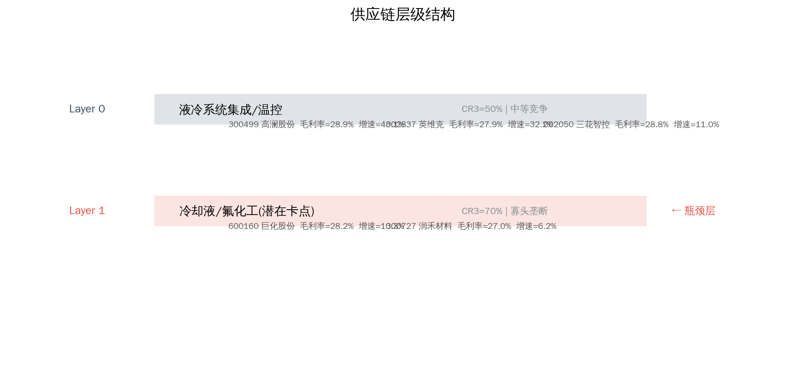
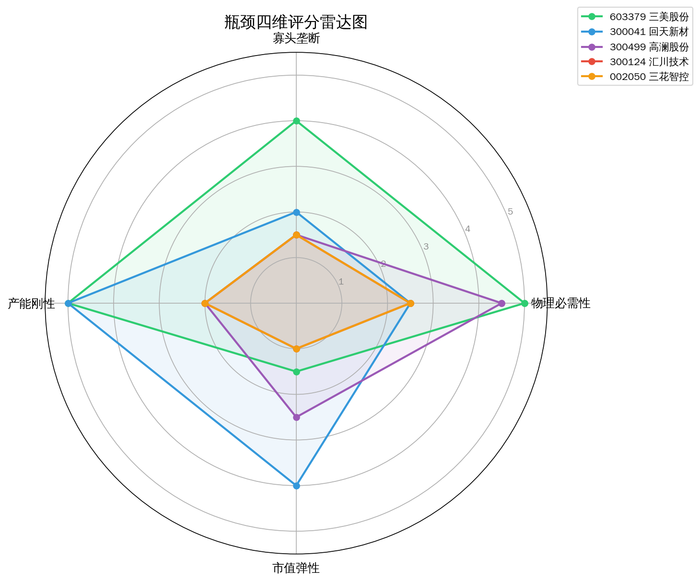
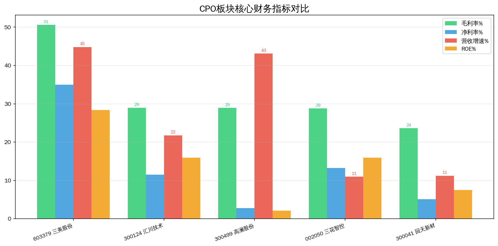
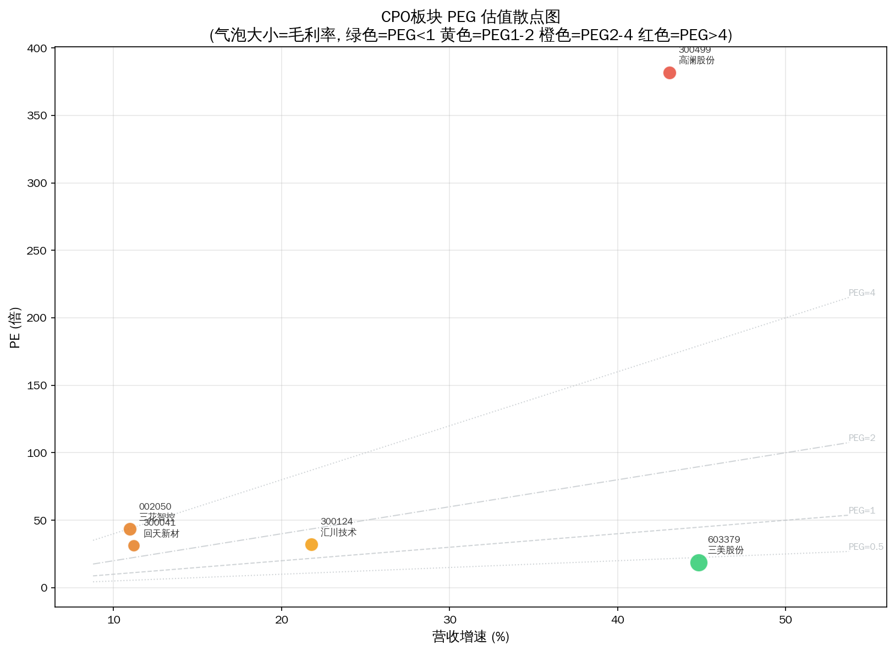
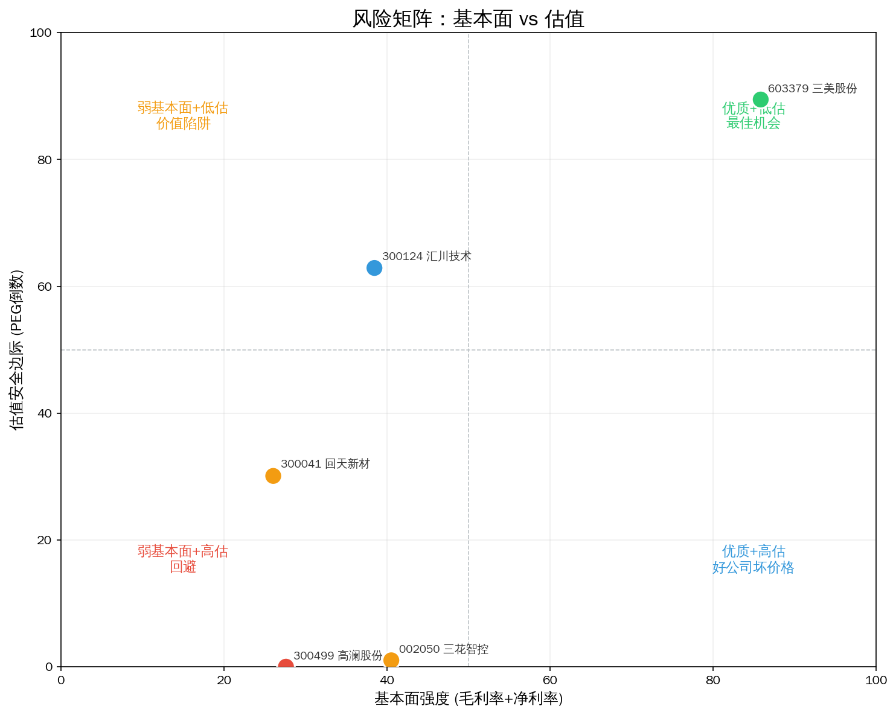
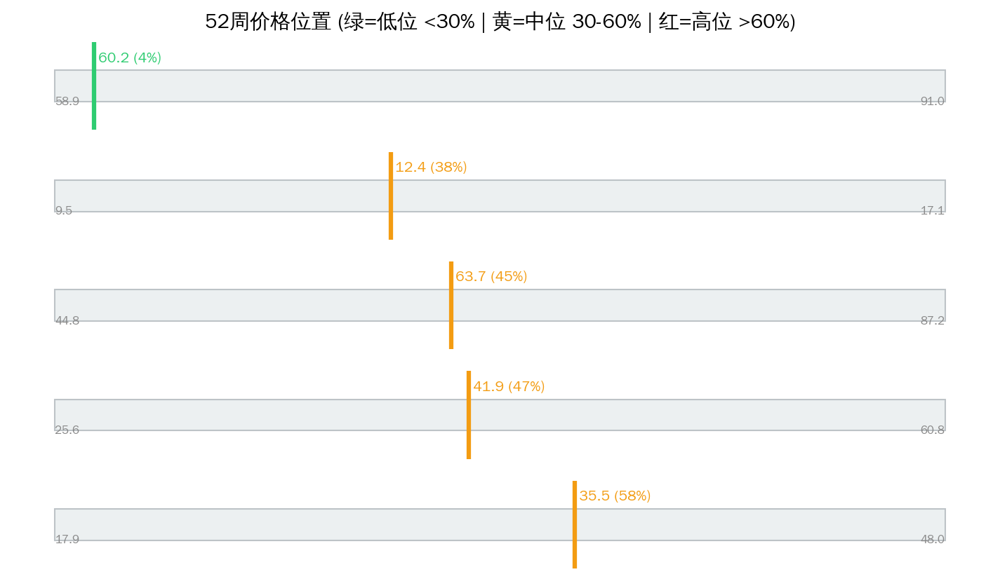

# AI服务器散热 Serenity 瓶颈分析报告

> 分析日期: 2026-07-14 | 数据截止: 2026-07-14 收盘 | 方法论: Serenity Choke Point Theory | 数据源: Tushare  
> 评分: 四维加权 + 供应链层级修正（上游产能刚性↑ / 小市值弹性↑）

## 1. 板块周期定位

**产业触发：** 英伟达GB300功耗超1200W，风冷无法满足

**图谱描述：** 液冷散热，GPU功耗持续攀升驱动需求

**瓶颈层（图谱）：** Layer 1 — 冷却液/冷媒  
**瓶颈理由：** 氟化液产能高度集中，环保管制限制扩产

**本次结论：** 图谱瓶颈层 **冷却液/冷媒** 映射标的平均毛利率 **37.1%**，与寡头叙事基本一致。

---

## 2. 供应链结构



```
Layer 0: 液冷系统集成  CR3=55%  竞争: moderate
  ├── 300499 高澜股份  PE=381.8  毛利率=28.9%  增速=43.1%  市值=108.4亿
  ├── 002050 三花智控  PE=43.4  毛利率=28.8%  增速=11.0%  市值=1764.8亿
  ├── 300124 汇川技术  PE=32.3  毛利率=29.0%  增速=21.8%  市值=1631.3亿

**Layer 1: 冷却液/冷媒  CR3=80%  竞争: oligopoly  ← 理论瓶颈层**
  ├── 300041 回天新材  PE=31.3  毛利率=23.6%  增速=11.2%  市值=69.1亿
  ├── 603379 三美股份  PE=18.9  毛利率=50.6%  增速=44.8%  市值=388.8亿

```

---

## 3. 瓶颈标的排序



| 排名 | 代码 | 名称 | 综合分 | 必要性 | 垄断性 | 产能刚性 | 市值弹性 | PEG | 市值(亿) | 判断 |
|------|------|------|--------|--------|--------|---------|---------|-----|---------|------|
| 1 | 603379 | 三美股份 | 4.2 | 5.0 | 4.0 | 5.0 | 1.5 | 0.42 | 388.8 | likely_genuine |
| 2 | 300041 | 回天新材 | 3.2 | 2.5 | 2.0 | 5.0 | 4.0 | 2.80 | 69.1 | potential |
| 3 | 300499 | 高澜股份 | 2.7 | 4.5 | 1.5 | 2.0 | 2.5 | 8.86 | 108.4 | unlikely |
| 4 | 300124 | 汇川技术 | 1.8 | 2.5 | 1.5 | 2.0 | 1.0 | 1.48 | 1631.3 | unlikely |
| 5 | 002050 | 三花智控 | 1.8 | 2.5 | 1.5 | 2.0 | 1.0 | 3.96 | 1764.8 | unlikely |

**已过滤：**

| 代码 | 名称 | 原因 |
|------|------|------|
| — | — | 无 |

---

## 4. 核心发现



### 名义瓶颈 vs 财务现实

图谱瓶颈层 **冷却液/冷媒** 映射标的平均毛利率 **37.1%**，与寡头叙事基本一致。

### Top 财务快照

| 名称 | 毛利率 | 净利率 | 营收增速 | ROE | PE | PEG | 52周位置 |
|------|--------|--------|---------|-----|----|-----|---------|
| 三美股份 | 50.6% | 34.9% | 44.8% | 28.4% | 18.9 | 0.42 | 44.5% |
| 回天新材 | 23.6% | 5.1% | 11.2% | 7.5% | 31.3 | 2.80 | 37.7% |
| 高澜股份 | 28.9% | 2.8% | 43.1% | 2.1% | 381.8 | 8.86 | 58.4% |
| 汇川技术 | 29.0% | 11.5% | 21.8% | 15.9% | 32.3 | 1.48 | 4.4% |
| 三花智控 | 28.8% | 13.2% | 11.0% | 15.9% | 43.4 | 3.96 | 46.5% |

### 角色映射（非投资建议）

- **综合分最高**: 三美股份（603379）— 综合分 4.2
- **紫苏叶候选**: 回天新材（300041）— 市值 69.1亿 / 分 3.2
- **赔率优先**: 三美股份（603379）— PEG=0.42
- **位置观察**: 三美股份（603379）— 52周位置 44.5%
- **谨慎/回避倾向**: 高澜股份（300499）— PEG=8.86 / 分 2.7

**Serenity 四条件提醒：** 物理必需 × 寡头垄断 × 产能刚性 × 小市值弹性，缺一不可。综合分高但市值过大 → 降为景气龙头而非紫苏叶；综合分中等但 PEG 极低 → 可作赔率仓，不作纯瓶颈仓。

---

## 5. 估值与风险







| 标的 | 收盘 | 52周高 | 距高点 | 位置% | 信号 |
|------|------|--------|--------|-------|------|
| 高澜股份 | 35.50 | 48.04 | -26.1% | 58.4% | 🟡 |
| 三花智控 | 41.94 | 60.77 | -31.0% | 46.5% | 🟢 |
| 三美股份 | 63.68 | 87.20 | -27.0% | 44.5% | 🟢 |
| 回天新材 | 12.36 | 17.11 | -27.8% | 37.7% | 🟢 |
| 汇川技术 | 60.25 | 91.00 | -33.8% | 4.4% | 🟢 |

---

## 6. 信号对照表

| 做多信号 ✅ | 做空信号 ❌ |
|------------|------------|
| ✅ 产业触发: 英伟达GB300功耗超1200W，风冷无法满足 | ❌ 高澜股份 PEG=8.86 — 估值脆弱 |
| ✅ 图谱瓶颈: 氟化液产能高度集中，环保管制限制扩产 | — |
| ✅ 三美股份 PEG=0.42 — 增长覆盖估值 | — |
| ✅ 三美股份 毛利率 50.6% — 具备壁垒特征 | — |

**综合判断：** 做多信号(4)显著强于做空(1)，板块可积极精选。

---

## 7. 风险提示

- ⚠️ **技术/路线风险：** 替代技术或工艺切换可能旁路当前瓶颈层（需跟踪产业验证进度）。
- ⚠️ **估值风险：** 高 PEG / 高 52 周位置标的对增速放缓极度敏感，易戴维斯双杀。
- ⚠️ **政策风险：** 国产替代、出口管制、环保配额等政策双向影响供给与需求。
- ⚠️ **流动性风险：** 小市值标的（<100 亿）日内波动可达 ±20%，极端日流动性枯竭。
- ⚠️ **图谱滞后风险：** 供应链 CR3/竞争格局数据可能滞后，新进入者扩产需用公告交叉验证。
- ⚠️ **映射错位风险：** 海外垄断环节在 A 股可能无纯标的（业务混杂），财务无法体现瓶颈溢价。
- ⚠️ **持仓纪律：** 单票建议不超过总仓位 15%；景气龙头与紫苏叶分逻辑管理。

---

Data as of: 2026-07-14  
Generated: 2026-07-14

---
⚠️ 本报告基于 Tushare 公开财务数据、预构建供应链图谱及 LLM 推理生成，**不构成投资建议**。供应链与技术路线信息需独立验证。投资有风险，入市需谨慎。
🤖 Generated with [Claude Code](https://claude.com/claude-code)
