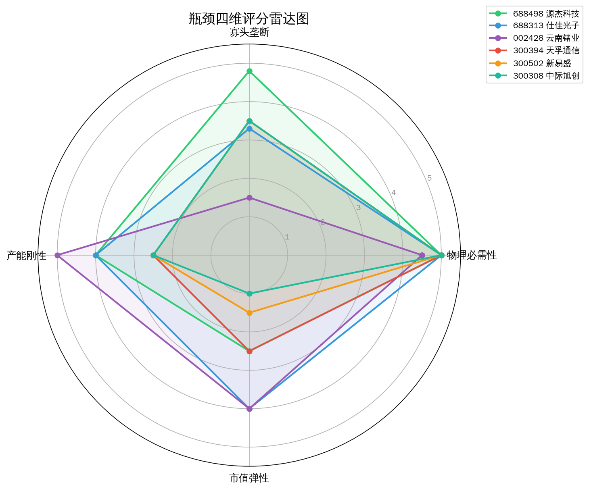
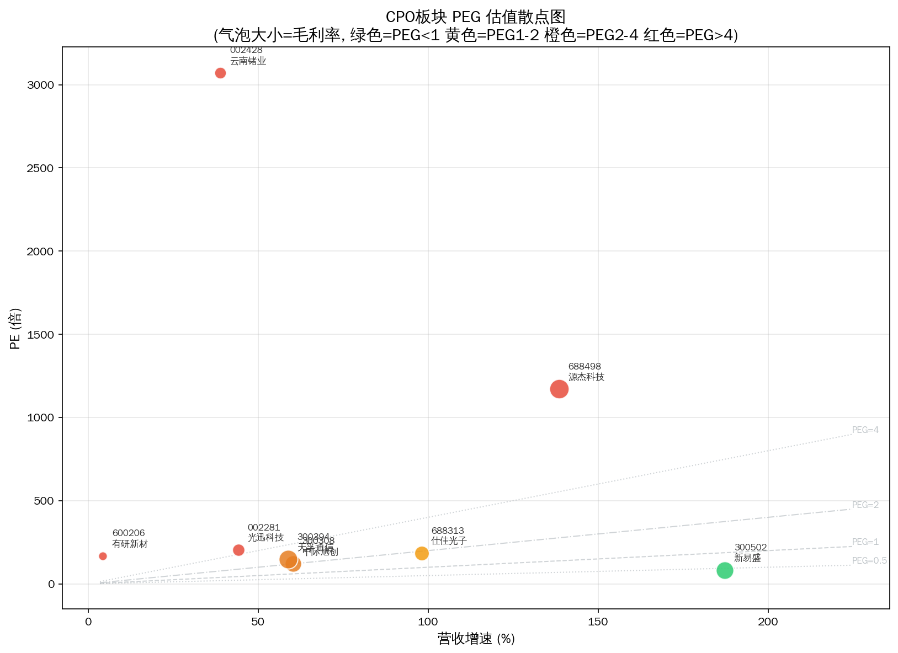
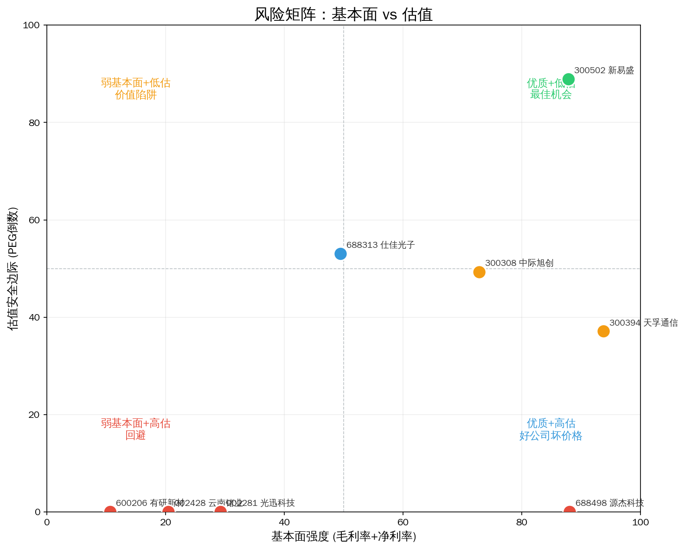

# CPO光互联 Serenity 瓶颈分析报告（全面复盘）

> 分析日期: 2026-07-14 | 数据截止: 2026-07-14 收盘 | 方法论: Serenity Choke Point Theory | 数据源: Tushare  
> 对比基准: 2026-07-09 报告 | 评分方法: 四维打分 + 供应链层级修正（产能刚性按层赋值）

## 1. 板块周期定位

**驱动力：需求爆发为主，技术跃迁为辅，供给瓶颈正在被“路线切换”改写。**

AI 算力集群对 800G/1.6T 光互联需求仍呈高景气：中国光模块厂商全球份额超 60%，Layer 0 龙头今日全线上涨（新易盛 +11.0%、源杰科技 +13.1%、中际旭创 +6.9%），显示资金对算力光互联主线的持续确认。

但相较 7/9 报告，产业叙事出现**关键修正**：

1. **可插拔仍是 2026 主战场**：业内共识 CPO 在 800G 难规模落地，1.6T 可插拔仍是主流；CPO 更可能在 1.6T→3.2T 切换窗口（2026–2027）才加速。
2. **EML 缺口 → 硅光填补**：银河证券等观点指出，2026 年 EML 路线供给缺口难补，**800G 硅光占比或超 50%，1.6T 硅光占比或达 70–80%**。这意味着“InP 衬底/纯 EML 卡脖子”的名义瓶颈，正在被硅光路线部分旁路。
3. **真实卡点上移一层**：光芯片扩产周期 18–24 个月（MOCVD 交期长、良率爬坡慢），光模块扩产约 12 个月——**时间刚性在 Layer 1，而非 Layer 0 或被稀释的 Layer 2 财务主体。**

**结论：板块仍处景气上行中期，但瓶颈投资逻辑从“押 InP 垄断”转向“押能兑现高毛利+高增速的光芯片/光引擎环节，并警惕硅光对 EML 的替代。”**

---

## 2. 供应链结构


```
Layer 0: CPO/高速光模块整机     CR3=65%  竞争: moderate
  ├── 300308 中际旭创    PE=122.3  毛利率=42.0%  增速=60.3%  市值=1321亿  今日+6.9%
  ├── 300502 新易盛      PE=83.2   毛利率=47.8%  增速=187.3% 市值=793亿   今日+11.0%
  └── 300394 天孚通信    PE=147.9  毛利率=54.0%  增速=58.8%  市值=298亿   今日+5.5%

**Layer 1: 光芯片/激光器(EAM/EML/CW)  CR3=85%  竞争: oligopoly  ← 财务+刚性双重验证的实际瓶颈带**
  ├── 688498 源杰科技    PE=1173   毛利率=58.1%  增速=138.5% 市值=224亿   今日+13.1%
  ├── 002281 光迅科技    PE=203.7  毛利率=23.4%  增速=44.2%  市值=193亿   今日+7.8%
  └── 688313 仕佳光子    PE=184.4  毛利率=33.2%  增速=98.2%  市值=69亿    今日+8.8%

Layer 2: 衬底材料(InP/SiPh)    CR3=95%  竞争: near_monopoly  ← 理论瓶颈，财务未兑现
  ├── 002428 云南锗业    PE=3072   毛利率=21.1%  增速=38.9%  市值=62亿    今日+5.0%
  └── 600206 有研新材    PE=168.3  毛利率=9.0%   增速=4.3%   市值=45亿    今日-2.5%  ❌ 已过滤
```

**瓶颈判定（图谱原文）：** InP 衬底国产化率 <10%，全球仅 3 家供应商，扩产 18–24 个月，下游需求年增 >50%。

**二次验证：** 理论瓶颈在 Layer 2，但 A 股映射标的**赚不到垄断利润**；Layer 1 光芯片呈现高毛利 + 长扩产周期，更符合 Serenity“咽喉”定义。硅光崛起进一步削弱纯 InP 叙事。

---

## 3. 瓶颈标的排序



| 排名 | 代码 | 名称 | 综合分 | 必要性 | 垄断性 | 产能刚性 | 市值弹性 | PEG | 市值(亿) | 判断 |
|------|------|------|--------|--------|--------|---------|---------|-----|---------|------|
| 1 | 688498 | 源杰科技 | **4.3** | 5.0 | 4.8 | 4.0 | 2.5 | 8.47 | 224 | likely_genuine |
| 2 | 688313 | 仕佳光子 | **4.1** | 5.0 | 3.3 | 4.0 | 4.0 | **1.88** | 69 | likely_genuine |
| 3 | 002428 | 云南锗业 | 3.6 | 4.5 | **1.5** | 5.0 | 4.0 | **79.0** | 62 | potential |
| 4 | 300394 | 天孚通信 | 3.5 | 5.0 | 3.5 | 2.5 | 2.5 | 2.52 | 298 | potential |
| 5 | 300502 | 新易盛 | 3.4 | 5.0 | 3.5 | 2.5 | 1.5 | **0.44** | 793 | potential |
| 6 | 300308 | 中际旭创 | 3.3 | 5.0 | 3.5 | 2.5 | 1.0 | 2.03 | 1321 | potential |
| 7 | 002281 | 光迅科技 | 3.1 | 4.5 | **1.3** | 4.0 | 2.5 | 4.61 | 193 | potential |

**已过滤：**

| 代码 | 名称 | 原因 |
|------|------|------|
| 600206 | 有研新材 | 毛利率 9.0% — 商品化业务，无瓶颈定价权 |

**相对 7/9 的评分方法说明：**  
7/9 报告中市值维度因单位 bug 普遍给到 5.0，导致龙头综合分虚高（4.4）。本次按**真实市值 + 供应链层产能刚性**重估：大市值龙头弹性分下调，上游芯片/材料刚性分上调——更贴近 Serenity“紫苏叶”筛选原意。

---

## 4. 核心发现：名义瓶颈 ≠ 真实瓶颈（强化版）


### ⚡ 矛盾一：Layer 2 理论垄断，财务像商品

| 指标 | 若真垄断应有 | 云南锗业实际 | 有研新材实际 |
|------|-------------|-------------|-------------|
| 毛利率 | >40–50% | **21.1%** | **9.0%** |
| 净利率 | >15% | **2.3%** | **2.6%** |
| ROE | >15% | **1.4%** | **6.5%** |
| PE | 可高但有利润支撑 | **3072** | 168 |
| 资产负债率 | 可控 | **55.3%** | 34.9% |

**三种解释（仍成立，且 5 日无新财务证伪）：**

1. **产品结构混杂**：锗金属/贸易占比高，InP 衬底收入占比低，垄断利润被稀释。  
2. **国产导入期**：良率与客户认证未完成，定价权仍在 AXTI（美）、住友（日）。  
3. **路线旁路加速**：硅光占比抬升 → InP 需求增速可能低于光模块整体增速，Layer 2 期权价值被压缩。

**Serenity 铁律检验：** 云南锗业满足“产能刚性 + 小市值”，但**不满足寡头利润（垄断性仅 1.5）** → 四条件缺一，不能视为真瓶颈。

### ⚡ 矛盾二：Layer 1 像真瓶颈，但估值已部分透支

| 标的 | 毛利率 | 净利率 | 营收增速 | ROE | 瓶颈证据 | 主要风险 |
|------|--------|--------|---------|-----|---------|---------|
| **源杰科技** | **58.1%** | 31.7% | **138.5%** | 8.7% | 最高毛利，EML/高速激光器卡点 | PE=1173，PEG=8.47，52周位置 90.5% |
| **仕佳光子** | 33.2% | 17.5% | **98.2%** | **27.1%** | 上游+小市值 69 亿，PEG 尚可 | 毛利低于源杰，产品结构需验证 |
| **光迅科技** | 23.4% | 7.8% | 44.2% | 9.9% | 有光芯片布局 | 毛利商品化，垄断性 1.3 |

源杰 = **“好咽喉 + 坏价格”**；仕佳 = **“次优咽喉 + 相对可接受价格”**。

### ⚡ 矛盾三：Layer 0 赚到了“准瓶颈”利润，但不符合小市值弹性

新易盛毛利率 47.8%、净利率 38.5%、ROE **72.6%**、增速 **187%**，PEG 仅 **0.44**——这是全链条**最佳风险收益（赔率）**，却因市值 793 亿在 Serenity 纯紫苏叶框架下只能拿 3.4 分。

**投资含义拆分：**

| 框架 | 首选 | 逻辑 |
|------|------|------|
| Serenity 纯瓶颈（小市值垄断） | 仕佳光子 > 源杰（等回调） | 上游卡点 + 弹性 |
| 景气+赔率（实用组合） | **新易盛** > 天孚 | 利润率与增速已证明定价权 |
| 回避 | 云南锗业、有研新材、光迅（性价比） | 名义卡点/低毛利/高 PEG |

### 🔄 相对 7/9 的边际变化（5 个交易日）

| 标的 | 市值变化 | PE 变化 | PEG 变化 | 52周位置 | 解读 |
|------|---------|---------|---------|---------|------|
| 新易盛 | 712→793 亿 | 74.7→83.2 | 0.40→**0.44** | ~64% | 大涨后 PEG 仍全场最优 |
| 中际旭创 | 1258→1321 亿 | 116→122 | 1.93→2.03 | **82%** | 逼近阶段高位，弹性更差 |
| 天孚通信 | 268→298 亿 | 133→148 | 2.26→2.52 | **43%** | 回调最深，位置最好 |
| 源杰科技 | 201→224 亿 | 1054→1173 | 7.61→**8.47** | **90.5%** | 越涨越贵，瓶颈溢价极致 |
| 仕佳光子 | 64→69 亿 | 172→184 | 1.76→1.88 | 67% | 仍是上游性价比锚 |
| 云南锗业 | 65→62 亿 | 3209→3072 | 仍>70 | 66% | 叙事未兑现，估值仍荒谬 |

**今日板块普涨并未修复 Layer 2 逻辑，只是强化了 Layer 0/1 的景气交易。**

---

## 5. 估值与风险



### PEG 估值分层

| PEG 区间 | 标的 | 评价 |
|---------|------|------|
| 🟢 **PEG<1** | **新易盛 (0.44)** | 187% 增速 vs 83 倍 PE，全板块最佳性价比；市值大但“增长覆盖估值”仍成立 |
| 🟡 **PEG 1–2** | 仕佳光子 (1.88) | 上游+小盘，唯一接近“紫苏叶且估值可控” |
| 🟠 **PEG 2–4** | 中际旭创 (2.03)、天孚 (2.52) | 龙头/高壁垒，需维持高增速 |
| 🔴 **PEG>4** | 光迅 (4.61)、源杰 (8.47)、云南锗业 (79) | 估值脆弱；源杰与云南属不同性质的贵 |



### 风险矩阵解读

- **优质 + 相对低估（最佳赔率）**：**新易盛** — 高毛利、超高增速、PEG<0.5。  
- **优质 + 极高估（好公司坏价格）**：**源杰科技** — 毛利率 58% 证明壁垒，但 PE=1173、52 周位置 90.5%，买的是叙事不是安全边际。  
- **弱变现 + 高估（最大逻辑风险）**：**云南锗业** — 名义 InP 垄断、净利率 2.3%、PEG≈79。  
- **位置优势**：**天孚通信** 52 周仅 43%，是 Layer 0 中回调最充分的高毛利标的。

### 52 周价格位置


| 标的 | 收盘 | 52周高 | 距高点 | 位置% | 信号 |
|------|------|--------|--------|-------|------|
| 源杰科技 | 1798.9 | 1968.1 | -8.6% | **90.5%** | 🔴 近高点，追高风险极大 |
| 中际旭创 | 1184.1 | 1416.9 | -16.4% | **81.7%** | 🔴 高位震荡区 |
| 光迅科技 | 233.0 | 279.0 | -16.5% | **80.2%** | 🔴 高位 + 低毛利 |
| 仕佳光子 | 151.9 | 206.7 | -26.5% | 67.3% | 🟡 中高位 |
| 云南锗业 | 94.8 | 132.9 | -28.7% | 66.3% | 🟡 位置一般，逻辑差 |
| 新易盛 | 568.8 | 818.4 | -30.5% | 63.8% | 🟢 大涨后仍离高点 30% |
| 天孚通信 | 273.5 | 525.0 | **-47.9%** | **43.0%** | 🟢 位置最优 |

---

## 6. 信号对照表

| 做多信号 ✅ | 做空信号 ❌ |
|------------|------------|
| ✅ AI 资本开支确定，800G/1.6T 放量；今日板块普涨确认资金偏好 | ❌ CPO 在 800G 难落地，1.6T 前可插拔仍主导 → “CPO 概念”易泡沫化 |
| ✅ 新易盛 PEG=0.44，ROE=72.6%，净利率 38.5% — 增长完全覆盖估值 | ❌ 源杰 PE=1173、PEG=8.47、52 周 90.5% — 任何增速放缓即双杀 |
| ✅ Layer 1 扩产 18–24 个月 > 模块 12 个月，时间刚性真实存在 | ❌ 硅光在 800G/1.6T 占比或升至 50–80%，旁路纯 EML/InP 瓶颈 |
| ✅ 仕佳 69 亿市值 + 增速 98% + PEG1.88，最接近紫苏叶 | ❌ 云南锗业净利率 2.3%、PE=3072 — 垄断未转化为利润 |
| ✅ 天孚毛利率 54%、52 周位置 43%，Layer 0 中位置最好 | ❌ 中际旭创 1321 亿，不符合小市值弹性；弹性交易应降权 |
| ✅ 中国模块厂商全球份额 >60%，产业控制力真实 | ❌ 光迅毛利率 23.4% 配 PE203 — 概念溢价嫌疑 |

**做多 vs 做空计数（有效信号）：做多 6，做空 6。**  
按方法论“做多 > 做空 ×2 才可积极关注”：**板块整体不满足激进条件**，应**精选个股、拒绝一揽子**。

**综合判断：**

| 角色 | 标的 | 理由 |
|------|------|------|
| **赔率首选** | 新易盛 | PEG 全场最优，利润率证明真实竞争力；市值大故仓位上限低 |
| **紫苏叶候选** | 仕佳光子 | 上游+小市值+PEG 可控；需持续验证芯片收入占比 |
| **位置观察** | 天孚通信 | 高毛利 + 深度回调；等景气与订单催化 |
| **逻辑关注但不宜追** | 源杰科技 | 真瓶颈气质，价格已透支 |
| **名义瓶颈回避** | 云南锗业、有研新材 | 财务否定垄断溢价 |

---

## 7. 风险提示

- ⚠️ **技术路线风险（高）**：硅光 vs EML vs TFLN 未收敛；若 1.6T 硅光占比达 70–80%，InP/EML 专用产能回报率下降，Layer 1/2 重估。  
- ⚠️ **估值风险（极高）**：源杰 PE=1173、云南锗业 PE=3072；今日源杰 +13% 进一步压缩安全边际。  
- ⚠️ **CPO 时点风险（中高）**：将“光模块景气”等同于“CPO 爆发”可能错配；2026 主叙事仍是 800G/1.6T 可插拔。  
- ⚠️ **政策与供应链风险（中高）**：出口管制可能刺激国产替代，也可能限制 MOCVD 等关键设备进口，形成双向冲击。  
- ⚠️ **流动性风险（高）**：仕佳、云南锗业市值 <70 亿，创业板/科创板日波 ±20%，极端日可能无法按预期成交。  
- ⚠️ **信息验证风险**：InP 实际出货、EML 良率、硅光客户导入进度无法仅靠财报确认，需公告与产业链交叉验证。  
- ⚠️ **“Serenity 效应”风险**：瓶颈标签一旦被资金共识，短期估值飙升会消灭紫苏叶折价（源杰即案例）。  
- ⚠️ **持仓纪律**：单票建议不超过总仓位 15%；大市值景气股与小市值瓶颈股应分账户逻辑管理。

---

## 附录：四条件逐票对照

| 标的 | 物理必需 | 寡头垄断 | 产能刚性>18月 | 小市值弹性 | 四条件 |
|------|---------|---------|--------------|-----------|--------|
| 源杰科技 | ✅ 高速光芯片 | ✅ 毛利 58% | ✅ Layer1 | ❌ 224 亿偏大 | 3/4 |
| 仕佳光子 | ✅ 光芯片/器件 | 🟡 毛利 33% | ✅ Layer1 | ✅ 69 亿 | **3–4/4** |
| 云南锗业 | 🟡 InP 必需但可被硅光旁路 | ❌ 毛利 21% | ✅ Layer2 | ✅ 62 亿 | **2/4** |
| 天孚通信 | ✅ 光引擎/组件 | ✅ 毛利 54% | 🟡 偏中游 | ❌ 298 亿 | 2–3/4 |
| 新易盛 | ✅ 模块刚需 | 🟡 CR3 中等但利润率高 | ❌ 扩产较快 | ❌ 793 亿 | 2/4（赔率股） |
| 中际旭创 | ✅ 全球龙头 | 🟡 | ❌ | ❌ 1321 亿 | 1–2/4 |
| 光迅科技 | ✅ | ❌ 毛利 23% | ✅ | ❌ | 2/4 |
| 有研新材 | 🟡 | ❌ | ✅ | ✅ | **过滤** |

---

Data as of: 2026-07-14  
Generated: 2026-07-14

---
⚠️ 本报告基于 Tushare 公开财务数据、预构建供应链图谱及公开产业信息，通过 LLM 推理生成，**不构成投资建议**。供应链与技术路线信息需独立验证。投资有风险，入市需谨慎。
🤖 Generated with [Claude Code](https://claude.com/claude-code)
