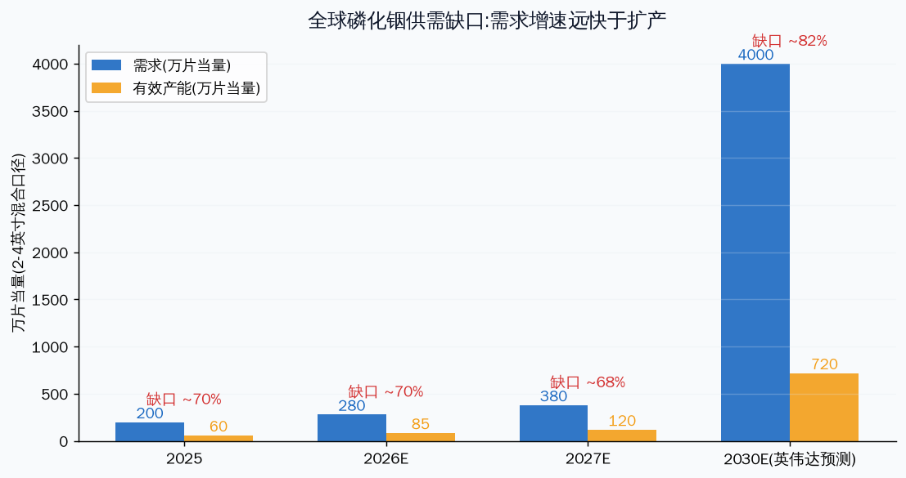
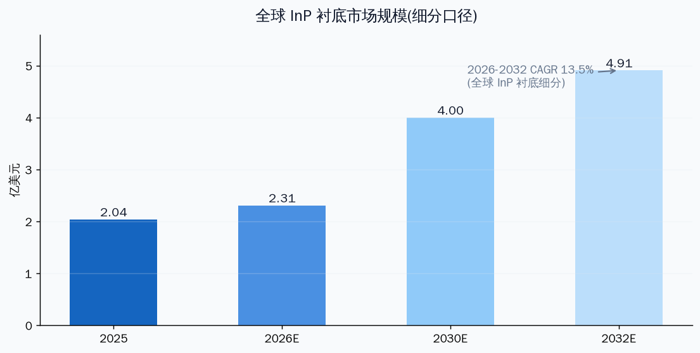
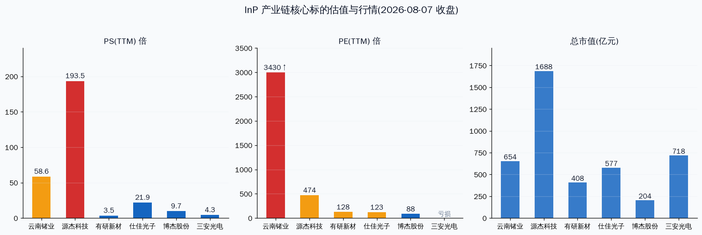

# 磷化铟(InP)行业分析:AI 光互连的"隐形基石"

先说结论。磷化铟是高速光通信芯片(激光器、探测器)的不可替代衬底材料,本轮行情的核心逻辑是:**AI 算力把光互连从配套环节推成基础设施瓶颈,而 InP 衬底的供给弹性极弱——需求端英伟达要求 5 年扩 20 倍,上游只答应扩 12 倍,缺口到 2030 年仍约 50%。** 供需剪刀差是硬逻辑,但 A 股核心标的的估值已经把未来 2-3 年的景气度提前定价,当前位置谈的是"贵不贵",不是"逻辑真不真"。

---

## 一、这是什么行业:从"小众衬底"到"战略刚需"

磷化铟(InP)是 III-V 族化合物半导体,直接带隙、高电子迁移率,工作波长完美匹配光纤通信最低损耗窗口(1310nm/1550nm),是 DFB、EML 激光器、CW 激光器和 PIN 光电探测器的**唯一衬底基底**。硅、砷化镓、碳化硅在高速长距单模光通信的光源侧都替代不了它。

产业链分五层:

| 层级 | 内容 | 全球格局 | 国产化率 |
|------|------|---------|---------|
| 上游原料 | 高纯铟(6N以上)、高纯红磷(6N-7N) | 铟:中国产量占全球 70%;红磷:日本 NCI/RASA 垄断 | 红磷国产化刚起步 |
| 中游衬底 | InP 单晶生长、切割抛光成晶片 | 住友 42%、AXT/北京通美 36%、JX 13%,合计 >90% | 高端衬底 10-15% |
| 中游外延 | MOCVD 生长外延片 | 相对分散,定制化强 | 有研新材等布局 |
| 下游光芯片 | DFB/EML/CW 激光器、探测器 | Lumentum+Coherent 占高端 InP 光芯片 >80% | 源杰全球第六、中国第一(3.1%) |
| 终端应用 | 光模块、CPO、激光雷达、6G | 中国光模块全球市占率最高 | — |

**为什么 2026 年突然火:** 800G 光模块已是 AI 数据中心标配(单颗模块需 4-8 颗 InP 激光器),1.6T 加速上量(衬底面积需求较 800G 提升 300%+),CPO 光电共封装落地后硅光仍需要外置 InP 高功率 CW 激光器供能——**架构怎么变,InP 在光源侧都不被替代,反而越来越依赖**。这是与普通周期品最大的区别:需求是结构性抬升,不是一轮补库。

---

## 二、供需:缺口是真缺口,而且不是短期

几个关键数字(截至 2026-08 数据源汇总):

- **需求:** 2025 年全球 InP 器件需求约 200 万片(当量),实际产能仅约 60 万片,缺口 70%。英伟达预测 2026-2030 全球 InP 晶圆需求激增约 20 倍。
- **供给:** 上游厂商只同意规划约 12 倍扩容。即便完成,2030 年行业供给仍落后需求约 50%(东吴证券引用 Rosenblatt 数据)。
- **价格:** 2 英寸光通信级 InP 衬底从 2025 年初到 2026 年 4 月涨幅近 2 倍(约 2300-2500 美元/片);高纯铟(≥99.99%)从 2024 年初 1950 元/千克涨至 2026 年 7 月 5470 元/千克,涨约 180%。
- **扩产表态:** 住友 180 亿日元改产线(2028 财年产能为 2024 的 3.1 倍)、AXT 募 6.3 亿美元扩 6 英寸、JX 四年最多 1200 亿日元扩 7-10 倍、Coherent 建全球首个 6 英寸产线(2026 前扩至 5 倍)、英伟达投 Lumentum 和 Coherent 各 20 亿美元。
- **Lumentum CEO(2026-08-07):** InP 供需缺口已超过 DRAM 和 NAND,是 AI 数据中心光互连扩展的最关键制约因素。Coherent 判断失衡至少持续整个 2026 和 2027 年。

供给为什么这么慢:①铟是稀散金属,伴生于锌铅冶炼,无独立矿产,提纯到 6N 以上多段工艺;②红磷纯度直接决定晶体缺陷,日企 2026 年主动收紧对华配额;③单晶生长要在高温高压下控制位错,良率爬坡 3-5 年,设备交期长;④下游客户验证周期以年计。**每一个环节都是时间的朋友,也是涨价的燃料。**

市场规模口径提醒:衬底细分市场 2025 年约 2.04 亿美元、2032 年预计 4.91 亿美元(CAGR 13.5%),这个口径看着不大——**真正的弹性在"量价齐升"而非市场规模**。2025 年全球 InP 化合物半导体整体市场约 67.3 亿美元,2030 年预计 115 亿美元。做投资判断时,衬底环节赚的是"缺口溢价+国产替代份额",不是大盘子的线性增长。

---

## 三、竞争格局与国产替代:从"能做"到"做精"

全球衬底是三重寡头:住友(VB 法 4 英寸掺 Fe 半绝缘)、AXT/北京通美(VGF 法 6 英寸量产)、JX 金属。国产高端衬底国产化率仅 10-15%,但 2026 年突破明显:

| 公司 | 环节 | 关键进展(2026) |
|------|------|---------------|
| 云南锗业(002428) | 衬底 | 云南鑫耀 15 万片/年(2-4 英寸),2026 计划产 18 万片;4 月启动扩产 30 万片/年(含 6000 片 6 英寸),最终 45 万片/年;6 英寸通过华为海思验证;7/23 签 5.7-8.55 亿元供货协议(占 2025 营收 53%-80%) |
| 有研新材(600206) | 外延/靶材 | InP 外延片布局,与国内光模块厂商合作;同时加码高纯溅射靶材(4.86 亿二期) |
| 三安光电(600703) | 衬底 | 募 65 亿扩产,武汉基地月产 1 万片 6 英寸,进入华为供应链 |
| 华芯晶电(未上市) | 衬底 | 4 英寸良率 70%,价格仅进口一半,进入苹果供应链 |
| 源杰科技(688498) | 光芯片 | 全球第六、中国第一;CW 70mW 批量出货、CW 100mW 客户验证;EML 布局 |
| 仕佳光子(688313) | 光芯片 | 国内唯一 500mW+ 高功率 CW 量产,1000mW 级全球领先;AWG 全球龙头 |
| 博杰股份(002975) | 衬底 | 投资鼎泰芯源,国内首条自主知识产权 InP 衬底产线 |
| 欧莱新材(688530) | 靶材 | 溅射靶材,受益光芯片扩产配套 |

国产替代的路径很清晰:2-4 英寸中低端先全面替代(价格降 30-50%),6 英寸小批量试产,良率爬到 60% 以上后切主流光模块厂商。**短期看衬底,中期看 6 英寸量产,长期看外延和高端光芯片。**

---

## 四、技术路线风险:硅光/CPO 会不会杀死 InP?

这是判断这条逻辑长期成色的关键,我的结论是:**InP 在光源侧没有被替代,反而被 CPO 强化。**

光芯片技术演进四代:EML(现行)→ CW+硅光(高速渗透)→ CPO+外置光源(2026-2028)→ 硅基单片 III-V(2030+,远期)。关键点:

- 硅光方案并不"省掉"InP——硅不发光,硅光模块的光源恰恰是 InP 基 CW 激光器(外置泵浦)。
- EML 被英伟达等锁产能、交付延至 2027 年后,800G 缺口 40-60%,反而推动 CW+硅光加速渗透,CW 的 InP 基底仍依赖住友/AXT。
- 薄膜铌酸锂(TFLN)抢的是"调制器"环节,不是光源环节,和 InP 是互补关系。
- 真正的远期威胁是硅基单片 III-V 集成(2030+),但那需要把 InP 直接长在硅上,短期是利好(更多 InP 需求)而非利空。

**一句话:当前所有主流技术路线都离不开 InP 光源,行业被替代的风险在 2030 年以后,不在当下。**

---

## 五、A 股标的:谁在兑现,谁在讲预期

截至 2026-08-07 收盘:

| 标的 | 收盘价 | 当日 | 市值(亿) | PS(TTM) | PE(TTM) | 环节 | 业绩兑现 |
|------|--------|------|---------|---------|---------|------|---------|
| 云南锗业 | 100.08 | +10%(4连板) | 654 | 58.6 | 3430 | 衬底 | H1 净利 0.55-0.8 亿(+148%~261%),签 5.7-8.55 亿合同 |
| 源杰科技 | 1355.5 | +1.7% | 1688 | 193.5 | 474 | 光芯片 | 2025 前三季营收 +115%,净利 +193 倍(低基数);2026Q1 毛利率 77.8% |
| 有研新材 | 48.17 | +10%(3连板) | 408 | 3.5 | 128 | 外延/靶材 | InP 外延尚未规模化贡献 |
| 仕佳光子 | 127.7 | +7.5% | 577 | 21.9 | 123 | 光芯片 | CW 光源量产,AWG 放量 |
| 博杰股份 | 97.94 | +5.2% | 204 | 9.7 | 87.5 | 衬底(参股) | 主业是测试设备,InP 为投资逻辑 |
| 三安光电 | 14.4 | +5.0% | 718 | 4.3 | 亏损 | 衬底/化合物 | 6 英寸衬底进入华为,但体量小 |

三个提醒:

1. **云南锗业的 PE 3430 倍没有参考意义**——H1 净利只有 0.55-0.8 亿,市值 654 亿。市场买的是 2027 年 45 万片产能满产后、衬底价格继续上涨的盈利预期,不是当前利润。要跟踪的是合同履约进度、衬底出货均价、6 英寸良率。
2. **源杰科技 PS 193 倍是 A 股最贵的光芯片**——高估值来自稀缺性(最纯粹高端光芯片)+ 国产替代 + 量价齐升,但 1688 亿市值对应 2026 年券商预测净利 3.6 亿(PE 约 470),乐观预测 7.1 亿(PE 约 238)。这票的风险不是逻辑,是任何低于预期的扩产/良率/价格信号。
3. **有研新材、博杰股份、三安光电是"沾边"逻辑**——InP 对它们的利润贡献占比很小,股价弹性来自主题催化,兑现度远低于云南锗业和源杰。

---

## 六、风险:逻辑有多硬,估值就有多贵

| 风险 | 触发条件 |
|------|---------|
| 估值透支 | 云南锗业一年涨 3.4 倍(22.87→100.08),6/25 曾到 130.1 后一个月内回撤 52%——情绪退潮时波动极大 |
| 扩产超预期 | 住友/AXT/JX/Coherent 扩产若提前兑现,缺口收敛速度会快于市场预期 |
| AI 资本开支放缓 | 英伟达及超大规模数据中心 2027 年 capex 若增速回落,光模块需求基数下修 |
| 技术路线突变 | LPO(线性驱动可插拔光模块)等省激光器方案渗透超预期,或硅基 III-V 提前(2030 前) |
| 出口管制双向影响 | 中国铟出口管制推高全球价格(利好),但若 InP 相关技术/设备被反向管制,国产扩产设备受制约 |
| 高纯红磷断供 | 日企收紧配额若持续,国内衬底厂阶段性原料受限(拓材科技 30 吨/年刚投产,量尚小) |
| 客户集中 | 云南锗业 5.7-8.55 亿合同集中在单一客户,履约与回款需跟踪 |

---

## 七、验证锚点(Verifiable Anchors)

**价格锚:**
- 云南锗业:22.87(2025/8 起点)、130.1(2026/6 高点)、61.8(2026/7 低点)、100.08(2026/8/7)
- 源杰科技:1138.4 元(2026/3/20 千元股首日)、1592 元(高盛 12 个月目标价)
- 2 英寸 InP 衬底:2025 年初→2026/4 涨约 2 倍;高纯铟 5470 元/千克(2026/7)

**时间锚:**
- 2025/2:商务部对 InP 等实施出口管制(商务部+海关总署第 10 号公告)
- 2026/4:云南锗业启动"高品质磷化铟单晶片建设项目"(扩 30 万片/年)
- 2026/6:拓材科技 7N 高纯红磷 30 吨/年发布
- 2026/7/13:云南锗业 H1 业绩预告(+148%~261%)
- 2026/7/23:云南鑫耀签 5.7-8.55 亿供货协议(履约期 2026/8/1-2027/12/31)
- 2026/8/1-8/7:云南锗业 4 连板、有研新材 3 连板

**数据锚:**
- 云南锗业:2026 年产 18 万片(2-6 寸)→扩产后 45 万片/年(2027+);合同金额占 2025 营收 53%-80%
- 全球:2025 需求 200 万片 vs 产能 60 万片;英伟达要求 2030 扩 20 倍、厂商同意 12 倍
- 国产化率:高端衬底 10-15%;6 英寸良率目标 60%+

**回查清单(报告发布后任何时点可对照):**
1. 云南锗业 2026Q3 财报:合同履约收入确认多少?衬底出货均价环比?
2. 6 英寸衬底良率是否爬过 60%?何时进入头部光模块厂商批量供应?
3. Coherent 2026Q3 产能翻倍是否兑现?Lumentum EML 产能 +50% 是否落地?
4. 2 英寸衬底价格 2026H2 是否继续上涨(东吴预期上涨)?
5. 英伟达 2027 年 capex 指引:光模块/CPO 需求基数是否上修或下修?
6. 高纯红磷国产替代:拓材/先导/兴发进展,日企配额是否放松?

---

## 八、参考思路(不构成操作指令)

- **逻辑层面:** 供需缺口 + 国产替代 + 技术路线不可替代,行业景气度大概率延续至 2027-2028。这是 2026 年 A 股少数"业绩兑现+产业趋势"双驱动的方向。
- **估值层面:** 衬底龙头和光芯片龙头已经 price in 相当多的未来 2 年景气。当前位置追高的风险收益比不占优,更适合"等回调 + 验证锚点确认"的节奏。
- **配置视角:** 若有意配置,衬底(云南锗业)看合同与产能兑现,光芯片(源杰/仕佳)看产品放量与毛利率,沾边标的(有研/博杰/三安)弹性大但兑现度低。
- **纪律前置:** 这类高波动标的,买入前先定好价格区间、触发器和止损线,不要凭"涨了所以能涨"的本能进场。

---

Data as of: 2026-08-08
Generated: 2026-08-08
