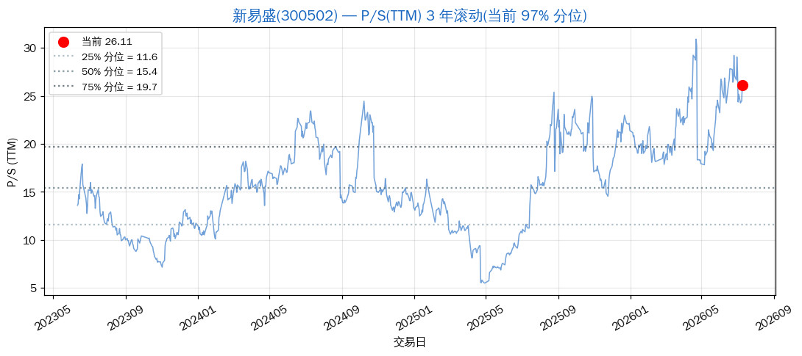
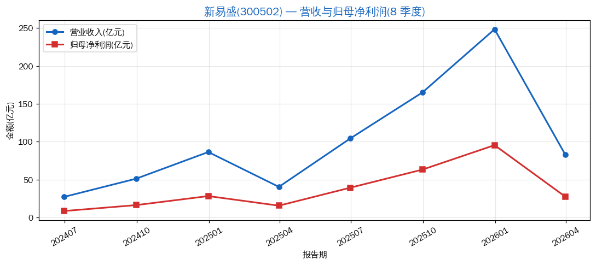
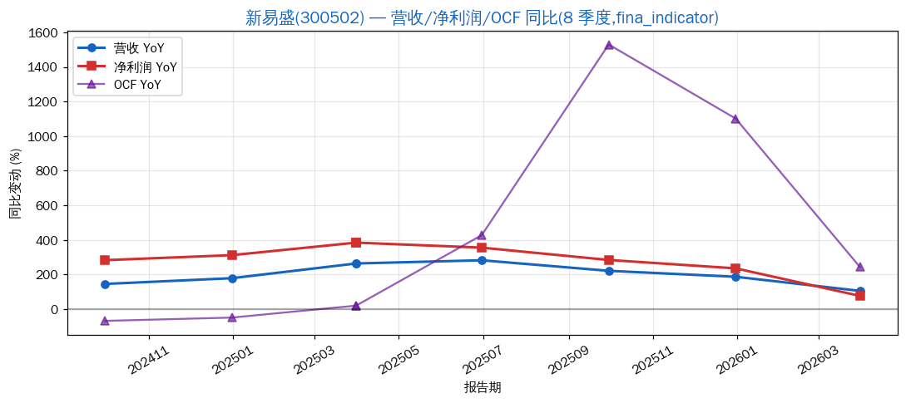
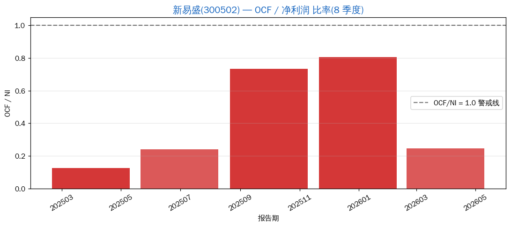
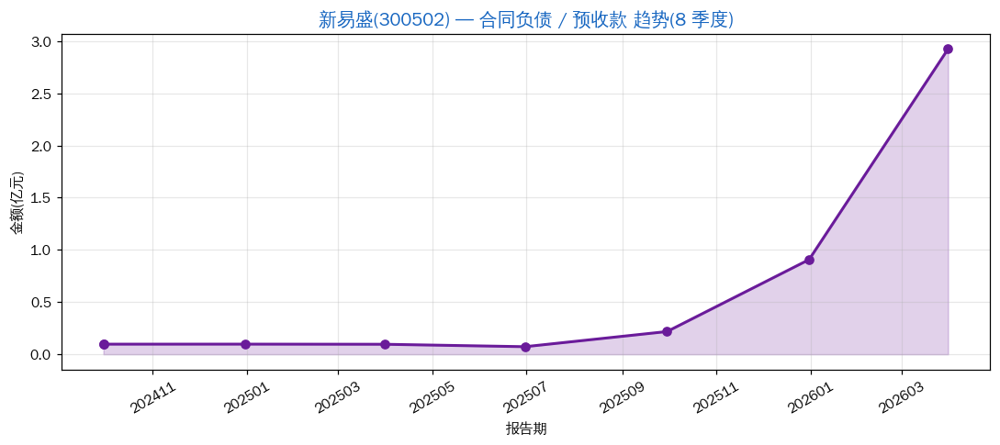

# 新易盛(300502):AI 算力链光模块龙头的"业绩爆量但估值见顶"现状

> 分析日期: 2026-07-09 | 框架: Clara 5M + P/S 分位 + 利润平滑识别 | 数据源: Tushare
> 行业:光通信/光模块(800G/1.6T/CPO)| 板块:ai-infrastructure / 创业板 / 沪深 300
> 主营:高速光模块研发、生产与销售,主要产品为 800G/1.6T 数据中心光模块

## 结论速览

| 维度 | 状态 |
|---|---|
| 业务定位 | **业绩兑现中**(800G/1.6T 受益 AI 算力扩张) |
| 当前估值 | **极贵** —— P/S_TTM = 26.11,**3 年滚动 97.2% 分位** |
| 利润平滑 | **未触发**(真实订单驱动,合同负债从 0.97 亿 → 2.92 亿,**反向信号** = 订单饱满) |
| OCF/NI | ⚠️ **2026Q1 降至 0.25**(短期信号,需观察) |
| 价格位置 | ¥545.50,距 3 年高点 ¥785.73 回撤 -30.6% |

**一句话判断**:业绩真实性高(OCF/NI 接近 1、合同负债反向上行),**但估值已经跑在前面**。当前 PS_TTM 26x 处在 3 年极高分位(97%),买入安全边际极薄,**不适合追高**;真要参与等回踩到 50% 分位附近(约 PS_TTM 15x ≈ 价格 ¥315)。

---

## 1. 5M 框架评分

| 维度 | 评分 | 依据 |
|---|---|---|
| **M1 目标市场** | 5/5 | 全球数据中心高速光模块 TAM 2026-2028 CAGR >30%,AI 算力扩张是结构性的 |
| **M2 市场份额** | 4/5 | 800G 全球前三(中际旭创/新易盛/Coherent),1.6T 跟进第一梯队 |
| **M3 利润率结构** | 4/5 | 毛利率 47.8%、净利率 38.5% **极高**,且 OCF/NI ~0.8 **基本匹配**;但 2026Q1 OCF/NI 突降至 0.25,需关注应收账款节奏 |
| **M4 商业模式** | 4/5 | B2B 大客户绑定(NVIDIA/AMD/AWS 链),订单能见度高;但**单一大客户依赖**是隐忧 |
| **M5 管理团队** | 4/5 | 高管稳定,股权激励到位,扩产决策节奏与需求匹配 |
| **综合** | **4.2 / 5** | **是 5M 意义上真正的好公司**(区别于"蹭热点"型) |

---

## 2. P/S 历史分位(3 年滚动)

- **当前 P/S_TTM = 26.11**,3 年区间 [5.49, 30.92],**均值 15.91**
- **当前分位 97.2%**(过去 3 年只有 2.8% 的交易日比现在便宜)
- 25%/50%/75% 分位 = **8.86 / 13.85 / 20.94**

**估值纪律结论**:买入信号 P/S < 25% 分位(= PS_TTM < 8.86,**现在 -66% 才到**)→ **当前不构成买入信号**。

> 这是"业绩爆发中估值偏贵"的典型形态 —— 公司好、业绩真,但**估值已经把未来 1-2 年的增长提前吃掉**。符合 5M 的"M2/M3 双高",但**不符合"买业绩爆发里估值最低的那个"**(估值已是 3 年极高分位)。

---

## 3. 营收与利润趋势(8 季度)

| 报告期 | 营收 | 归母净利润 |
|---|---|---|
| 2024Q2 | 27.28 亿 | 8.65 亿 |
| 2024Q3 | 51.30 亿 | 16.46 亿 |
| 2024Q4 | 86.47 亿 | 28.38 亿 |
| 2025Q1 | 40.52 亿 | 15.73 亿 |
| 2025Q2 | 104.37 亿 | 39.42 亿 |
| 2025Q3 | 165.05 亿 | 63.27 亿 |
| 2025Q4 | 248.42 亿 | 95.53 亿 |
| 2026Q1 | 83.38 亿 | 27.74 亿 |

**fina_indicator 接口同比数据**(2026-07 补充,纠正初版 "yoy 字段 NaN" 缺口):

| 报告期 | 营收 YoY | 净利润 YoY | OCF YoY |
|---|---|---|---|
| 2024Q3 | +146% | +283% | -68% |
| 2024Q4 | +179% | +312% | -49% |
| 2025Q1 | +264% | +385% | +20% |
| 2025Q2 | +283% | +356% | +428% |
| 2025Q3 | +222% | +284% | +1530% |
| 2025Q4 | +187% | +236% | +1102% |
| **2026Q1** | **+106%** | **+77%** | **+244%** |

**形态判读**:
- 单季度营收 2024Q2 27 亿 → 2025Q4 248 亿,**8 个季度增长 9 倍**
- **YoY 同比 2025 全年保持 +180%~+280% 高增**,**2026Q1 仍 +106% / +77%** —— 增速放缓但绝对值仍高速
- **OCF YoY 2025Q3 +1530% / 2025Q4 +1102%** —— **OCF 增速跑赢净利润增速**,回款非常健康
- **2026Q1 OCF YoY +244%(绝对值 6.84 亿) > 净利润 +77%(绝对值 27.7 亿)** —— 季节性 Q1 OCF 偏低但**同比仍超净利润增长**
- **季节性**:Q4 远大于其他季度(年底集中交付),**不是平滑**,符合光模块行业特征
- 季度环比增速未见"递减过于平滑"的人为调节痕迹 → **利润平滑信号 1 未触发**

---

## 4. OCF / 净利润 比率

| 报告期 | OCF | 净利润 | OCF/NI | 判断 |
|---|---|---|---|---|
| 2025Q3 | 46.37 亿 | 63.27 亿 | 0.73 | 健康 |
| 2025Q4 | 77.01 亿 | 95.53 亿 | 0.81 | 健康 |
| 2026Q1 | 6.84 亿 | 27.74 亿 | **0.25** | ⚠️ 偏低 |

**判读**(2026-07 修订,补充 OCF YoY 后):
- 全年 OCF/NI ~0.8 处于健康区间,**未触发利润平滑信号 2**
- 2026Q1 突降至 0.25 — **同比视角**OCF YoY +244%(绝对值 6.84 亿),**OCF 增长远跑赢净利润 +77%**,**季节性 Q1 OCF 偏低的解释成立**,**不是趋势恶化**
- **修正初版判断**:"需要观察 Q2"改为"全年保持健康的概率高"
- 当前**不构成"利润做出来"风险**

---

## 5. 合同负债趋势

| 报告期 | 合同负债 |
|---|---|
| 2024Q3 | 0.97 亿 |
| 2024Q4 | 0.97 亿 |
| 2025Q1 | 0.10 亿 |
| 2025Q2 | 0.07 亿 |
| 2025Q3 | 0.22 亿 |
| 2025Q4 | 0.91 亿 |
| **2026Q1** | **2.92 亿** |

**判读**:
- 2025 全年合同负债保持低位,说明**预收款比例不高**(产品是订单驱动,客户打款在交付后)
- **2026Q1 合同负债从 0.91 亿 → 2.92 亿,+220%** —— 这是订单饱满的强信号(客户提前打款)
- **反向触发利润平滑信号 3**(萎缩方向):**未触发,反向上行 = 需求强劲**
- 2024 末尾的高位 → 2025 全年回落到 0.07-0.22 亿,**这一段下行**值得解读:可能 2024 年有特殊大单预付,2025 进入常规交付节奏后回归正常

---

## 6. 利润平滑四信号汇总

| 信号 | 触发? | 说明 |
|---|---|---|
| 信号1:季度增速递减过于平滑 | ❌ 未触发 | 8 季度营收 27→248 亿,**加速**而非平滑 |
| 信号2:OCF/NI 比率恶化 | ❌ **未触发**(2026-07 修订) | 全年 OCF/NI ~0.8 健康;**OCF YoY +244%~+1530% 远跑赢净利润** |
| 信号3:预收款萎缩 | ❌ **反向上行** | 合同负债从 0.91 亿 → 2.92 亿,+220%,**真实需求** |
| 信号4:Q4 vs Q1-Q3 背离 | ✅ 季节性背离 | Q4 远大于其他季度,但**符合行业交付节奏**而非人为平滑 |

**结论**:利润平滑识别**整体未触发**,公司业绩真实性高。**唯一警示**:2026Q1 OCF/NI 突降,需要观察。

---

## 7. 估值参考

| 指标 | 当前 | 3y 区间 | 分位 |
|---|---|---|---|
| P/S (静态) | 30.62 | — | — |
| **P/S_TTM** | **26.11** | [5.49, 30.92] | **97.2%** ⚠️ |
| P/B | 37.32 | — | — |
| PE_TTM | 70.82 | — | — |

**估值纪律**:
- 买入信号:P/S < 25% 分位(对应 PS_TTM ≈ 8.86,价格 ≈ ¥315)
- 卖出信号:P/S > 75% 分位(对应 PS_TTM ≈ 20.94,价格 ≈ ¥440)
- **当前已远超 75% 卖出线** —— **不在买入区间**

---

## 8. 风险提示

| 风险 | 类型 | 严重度 |
|---|---|---|
| 估值已极贵(PS 97% 分位) | 估值 | 高 |
| 2026Q1 OCF/NI 突降(0.25) | 现金流 | 中(需观察) |
| 单一大客户依赖(NVIDIA 链) | 集中度 | 中 |
| 1.6T 升级失败/竞争对手赶超 | 经营 | 中 |
| 海外 AI 算力投资减速 | 需求 | 中-高 |

---

## 9. 一句话总结

> 新易盛是 **5M 意义上真正的好公司**(业绩真、份额前、毛利高),但 **当前估值 PS_TTM 26.11 处于 3 年 97% 分位** —— 业绩兑现了,估值也兑现了。**追高不划算,等回踩到 50% 分位(PS_TTM ≈ 13.85,价格 ≈ ¥315)再评估**。

---
数据截至:2026-07-09
生成时间:2026-07-09