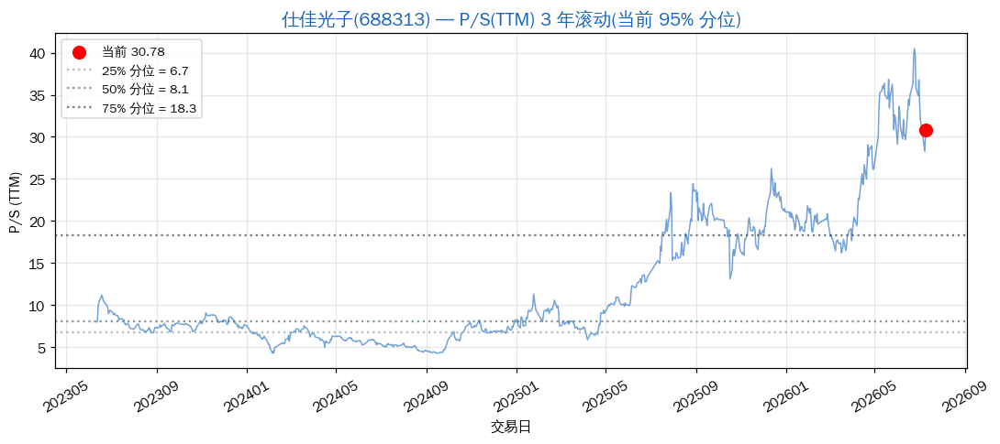
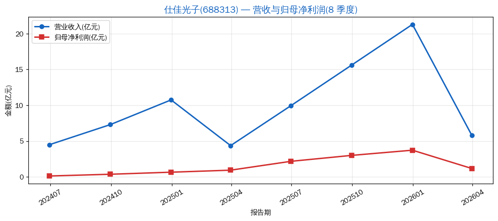
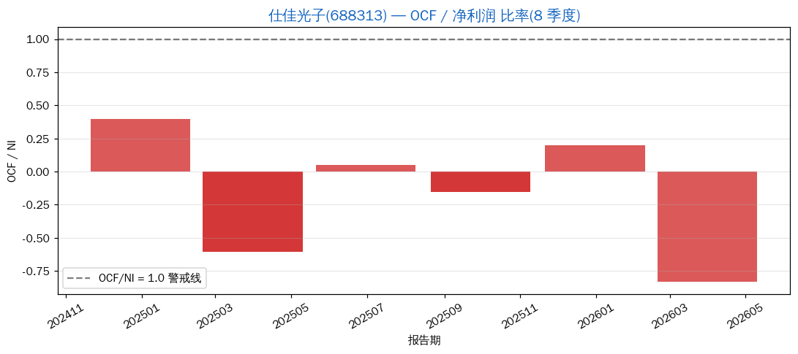
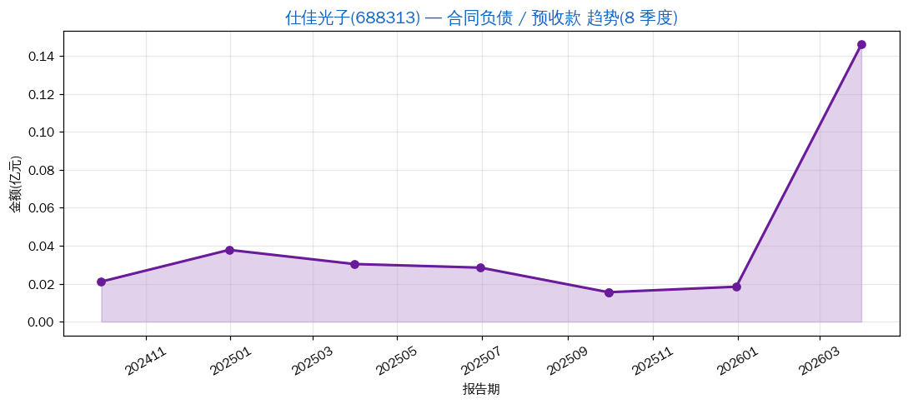

# 仕佳光子(688313):光通信芯片黑马,但现金流是真问题

> 分析日期: 2026-07-09 | 框架: Clara 5M + P/S 分位 + 利润平滑识别 | 数据源: Tushare
> 行业:光通信/PLC 分路器与光芯片 | 板块:ai-infrastructure / 科创 50
> 主营:PLC 光分路器芯片、AWG/VMUX 阵列波导光栅、DFB 激光器芯片

## 结论速览

| 维度 | 状态 |
|---|---|
| 业务定位 | 业绩兑现中(PLC/光芯片国产替代) |
| 当前估值 | **极贵** —— P/S_TTM = 30.78,**3 年滚动 95.2% 分位** |
| 利润平滑 | **OCF/NI 长期 <0.5** —— 利润平滑信号 2 **已触发**(业绩真实性存疑) |
| 合同负债 | 持续萎缩(0.38 亿 → 0.02 亿) —— 信号 3 部分触发 |
| 价格位置 | ¥154.56,距 3 年高点 ¥203.33 回撤 -24.0% |

**一句话判断**:业绩看起来"高速增长"(营收 4.5 亿 → 21 亿),**但现金流持续跟不上利润**(OCF/NI 长期 0.05~0.40)。**这是一个"账上有利润、袋里没现金"的典型形态** —— 在光芯片扩产周期可以解释,但**叠加极贵估值**,**完全不构成买入信号**。

---

## 1. 5M 框架评分

| 维度 | 评分 | 依据 |
|---|---|---|
| **M1 目标市场** | 4/5 | PLC 分路器 / AWG 全球市场,AI 数据中心光互联需求拉动 |
| **M2 市场份额** | 3.5/5 | PLC 全球第一梯队,AWG/DFB 国产替代中,未到寡头 |
| **M3 利润率结构** | 2.5/5 | 毛利率 33%、净利率 17% 中等,**但 OCF/NI 长期 <0.5 是致命问题** |
| **M4 商业模式** | 3/5 | 订单结构以海外大客户为主,**回款周期长**导致 OCF/NI 弱 |
| **M5 管理团队** | 3.5/5 | 中科院系背景,技术强但商业化节奏偏慢 |
| **综合** | **3.3 / 5** | **不像新易盛那样是 5M 意义上的好公司** —— 现金流质量拖后腿 |

---

## 2. P/S 历史分位(3 年滚动)

- **当前 P/S_TTM = 30.78**,3 年区间 [4.29, 40.49],**均值 12.27**
- **当前分位 95.2%**(过去 3 年只有 4.8% 的交易日比现在便宜)
- 25%/50%/75% 分位 ≈ **5.74 / 9.40 / 17.97**

**估值纪律结论**:不在买入区间(< 25% 分位 = PS < 5.74,对应价格 ≈ ¥29);不在卖出区间(> 75% 分位)。但**绝对估值已极贵**,**任何买入都缺安全边际**。

---

## 3. 营收与利润趋势(8 季度)

| 报告期 | 营收 | 归母净利润 |
|---|---|---|
| 2024Q2 | 4.49 亿 | 0.12 亿 |
| 2024Q3 | 7.29 亿 | 0.36 亿 |
| 2024Q4 | 10.75 亿 | 0.65 亿 |
| 2025Q1 | 4.36 亿 | 0.93 亿 |
| 2025Q2 | 9.93 亿 | 2.17 亿 |
| 2025Q3 | 15.60 亿 | 3.00 亿 |
| 2025Q4 | 21.29 亿 | 3.72 亿 |
| 2026Q1 | 5.77 亿 | 1.16 亿 |

**形态判读**:
- 营收 4.5 → 21 亿,**8 季度增 4.7 倍**
- 净利润 0.12 → 3.72 亿,**8 季度增 31 倍**(注意 2024Q4 0.65 亿 → 2025Q1 0.93 亿,**Q1 > 上年 Q4**,**异常 — 不是平滑,更像一次性收益或释放储备**)
- 季度间净利润增速 **远快于营收**,**这是利润率持续放大的形态**
- 但 **OCF/NI 长期低于 0.5**,说明账面利润 ≠ 现金流

---

## 4. OCF / 净利润 比率

| 报告期 | OCF | 净利润 | OCF/NI | 判断 |
|---|---|---|---|---|
| 2024Q4 | 0.26 亿 | 0.65 亿 | 0.40 | ⚠️ 偏低 |
| 2025Q1 | -0.56 亿 | 0.93 亿 | **-0.60** | ❌ 转负 |
| 2025Q2 | 0.11 亿 | 2.17 亿 | **0.05** | ❌ 极低 |
| 2025Q3 | -0.46 亿 | 3.00 亿 | -0.15 | ❌ 转负 |
| 2025Q4 | 0.75 亿 | 3.72 亿 | 0.20 | ⚠️ 偏低 |
| 2026Q1 | -0.97 亿 | 1.16 亿 | **-0.83** | ❌ 转负 |

**判读**:
- **8 个季度 OCF/NI 均低于 0.5,且多次转负 —— 利润平滑信号 2 已触发**
- **不是季节性问题** —— 连续 8 个季度都是这样
- 解释路径 1:光芯片行业**典型扩产周期**,应收账款拉长,存货积压 → OCF 弱
- 解释路径 2:存在**应收账款虚增 / 库存虚增**的财务美化嫌疑
- 解释路径 3:大客户账期延长(海外电信设备商付款慢)
- **无法用单一原因解释 8 季度持续 OCF 弱**,**这是质量警示**

---

## 5. 合同负债趋势

| 报告期 | 合同负债 |
|---|---|
| 2024Q3 | 0.021 亿 |
| 2024Q4 | 0.038 亿 |
| 2025Q1 | 0.030 亿 |
| 2025Q2 | 0.029 亿 |
| 2025Q3 | 0.016 亿 |
| 2025Q4 | 0.018 亿 |
| 2026Q1 | **0.146 亿** |

**判读**:
- 2024Q3 ~ 2025Q4 持续低位,**绝对值仅百万级**(对一家 21 亿营收的公司来说几乎为零)
- **2026Q1 跳升至 1460 万**(环比 +700%),但绝对值仍极小
- **信号 3 部分触发**:**绝对值极低**说明客户预付款意愿弱,合同负债规模与营收严重不匹配
- 这一点**加重了"利润真实性"质疑** —— 高增长但客户不愿提前打款,**与新易盛 2.92 亿合同负债形成鲜明对比**

---

## 6. 利润平滑四信号汇总

| 信号 | 触发? | 说明 |
|---|---|---|
| 信号1:季度增速递减过于平滑 | ❌ 未触发 | 营收 / 利润均为强加速 |
| 信号2:OCF/NI 比率恶化 | ✅ **已触发** | **8 季度 OCF/NI 长期 <0.5,多次转负** |
| 信号3:预收款萎缩 | ⚠️ 部分触发 | 绝对值仅百万级,与营收规模不匹配 |
| 信号4:Q4 vs Q1-Q3 背离 | ⚠️ 季节性背离 | 2025Q4 (3.72亿) 远大于 2025Q1 (0.93亿),符合行业交付节奏但放大效应明显 |

**结论**:**信号 2 已触发 + 信号 3 部分触发 + 极贵估值**,**组合 = 高风险**。

---

## 7. 估值参考

| 指标 | 当前 | 3y 区间 | 分位 |
|---|---|---|---|
| **P/S_TTM** | **30.78** | [4.29, 40.49] | **95.2%** ⚠️ |
| P/B | 42.12 | — | — |
| PE_TTM | 176.76 | — | — |

**估值纪律**:完全不在买入区间(< 25% 分位)。

---

## 8. 风险提示

| 风险 | 类型 | 严重度 |
|---|---|---|
| OCF/NI 长期 <0.5(信号 2 触发) | 现金流 / 业绩真实性 | **高** |
| 估值极贵(95% 分位) | 估值 | 高 |
| 合同负债绝对值极低 | 需求真实性 | 中-高 |
| 海外大客户依赖 | 集中度 | 中 |
| 光芯片国产替代节奏 | 政策/产业 | 中 |

---

## 9. 一句话总结

> 仕佳光子 **业绩高增长是真的**,但 **OCF/NI 长期 <0.5 + 合同负债绝对值极低** 是**质量警示**,叠加 95% 分位估值 —— **业绩兑现了,但兑现的质量存疑**。**不是 Clara 框架下的"优秀公司困境反转",而是"高增长但现金流可疑"的典型样本**,**观察清单而非买入清单**。

---
数据截至:2026-07-09
生成时间:2026-07-09