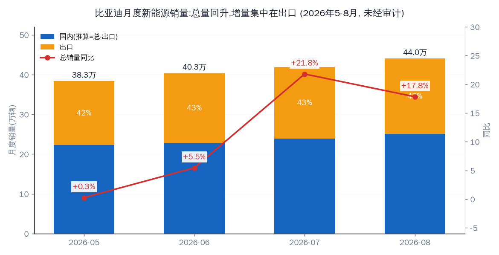
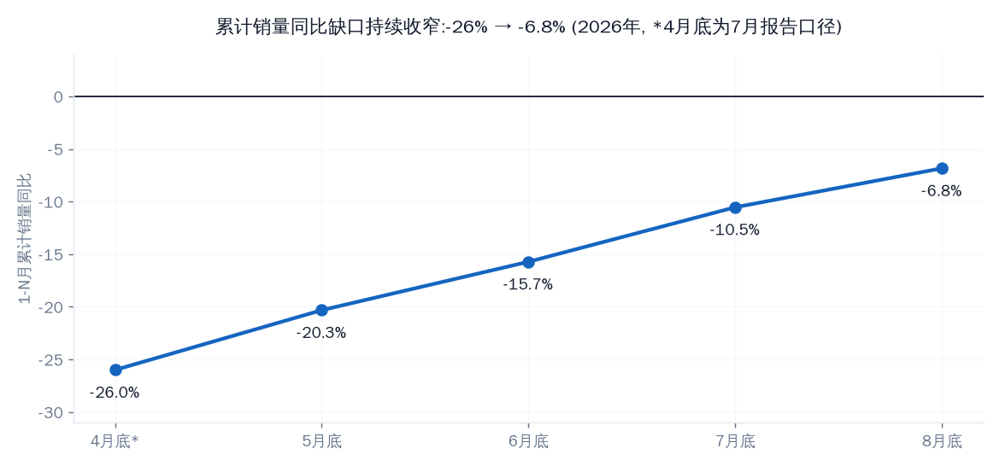
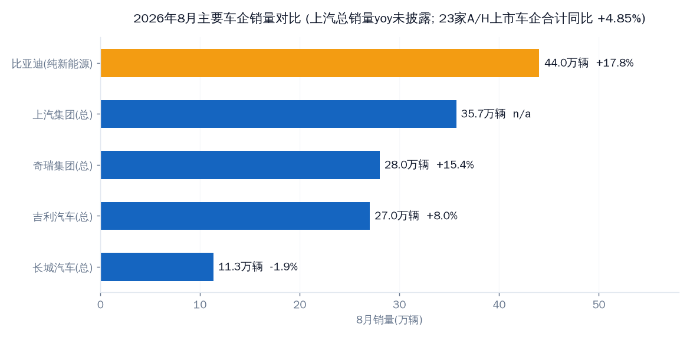
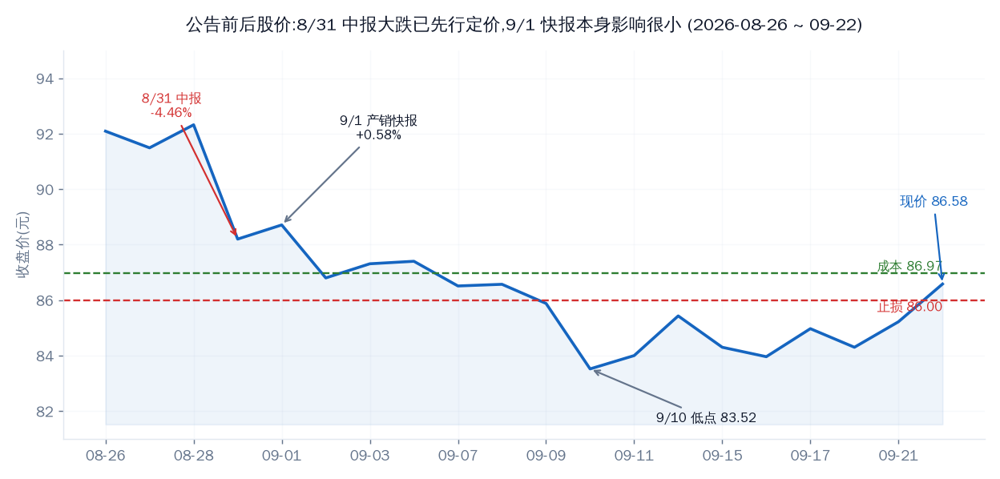
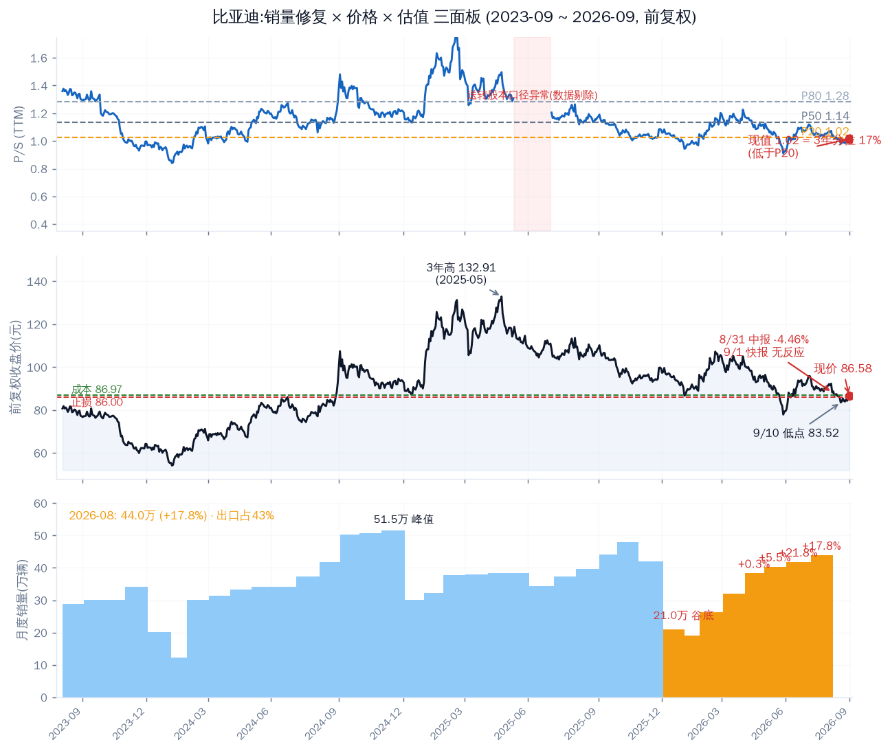

# 比亚迪 2026 年 8 月产销快报分析

快报是 9 月 1 日发的，9 月的那份要到 10 月初才出，所以这是目前能拿到的最新一期。结论先说：**数据本身是连续第四个月改善，但增长几乎全部来自出口，国内仍在两位数下滑，而且增速跑输行业新能源大盘——市场对这份快报没有反应（9/1 当日 +0.58%），因为 8/31 中报大跌已经把利润担忧先定价了。**

产销量数字均为公司公告口径，**未经审计**。

---

## 快报核心数据（2026 年 8 月）

| 项目 | 本月销量 | 去年同期 | 同比 | 1-8 月累计 | 累计同比 |
|---|---|---|---|---|---|
| 新能源汽车合计 | **440,293** | 373,626 | **+17.84%** | 2,668,015 | **-6.84%** |
| 纯电动乘用车 | 256,230 | 199,585 | +28.4% | 1,356,814 | -3.14% |
| 插电混动乘用车 | 177,154 | 171,916 | +3.0% | 1,265,017 | -11.22% |
| 商用车 | 6,909 | 2,125 | +225% | 46,184 | +21.30% |
| 其中：出口 | **189,466** | ~80,400* | **+134.45%** | — | — |

\* 8 月出口同比 +134.45% 为新浪/读财报披露口径，去年同期基数由此推算。

分品牌（公司海报口径）：王朝+海洋 375,373；方程豹 41,568（+155.6%）；腾势 16,001；仰望 442。海外销售 188,746 辆（+134.6%），**1-8 月海外累计 1,157,954 辆，已超过 2025 年全年**。

月度序列看，5 月 +0.26% → 6 月 +5.46% → 7 月 +21.8% → 8 月 +17.84%，连续四个月正增长；单月绝对量从 38.3 万爬到 44.0 万。国内（推算=总-出口）从 22.3 万升到 25.1 万，环比在恢复，但同比仍是负的。

累计缺口是最干净的改善指标：5 月底 -20.32% → 6 月底 -15.72% → 7 月底 -10.54% → 8 月底 **-6.84%**，每月收窄 4-5 个百分点。按这个斜率，累计转正在四季度有机会，但前提是单月同比别再掉回个位数。

---

## 出口：唯一确定的增长引擎

出口占比已经连续 4 个月稳在 42-43%：5 月 160,644（41.9%）→ 6 月 175,349（43.5%）→ 7 月 180,538（43.1%）→ 8 月 189,466（43.0%）。8 月出口同比 +134%，连续第五个月刷新纪录。

反过来看国内：8 月国内销量推算约 250,800 辆，去年同期（总 373,626 - 出口约 80,400）约 293,200 辆，**国内同比估算约 -14%**（口径：出口基数由海报同比推算，存在小误差）。也就是说，把出口拿掉，国内大盘子还在两位数下滑。

---

## 同行对比（2026 年 8 月）

| 车企 | 8 月销量 | 同比 | 口径 |
|---|---|---|---|
| 比亚迪 | 44.03 万 | **+17.8%** | 纯新能源 |
| 上汽集团 | 35.70 万 | n/a（新能源 19 万 +47%） | 总销量 |
| 奇瑞集团 | 28.01 万 | +15.4% | 总销量 |
| 吉利汽车 | 27.02 万 | +8.0% | 总销量 |
| 长城汽车 | 11.34 万 | -1.9% | 总销量 |

关键的一行不在表里：**19 家披露新能源数据的上市车企 8 月合计 144.16 万辆，同比 +24.33%**。比亚迪 +17.8% 低于行业 +24.3%，意味着新能源大盘子的份额仍在被同行蚕食——奇瑞新能源 +69.8%、上汽新能源 +47%、零跑 +80.7%。规模还是第一（约占披露样本 30.5%），但增速排名不占优。

---

## 成因拆解

| 因子 | 类型 | 事实 | 可逆性 |
|---|---|---|---|
| 出口放量 | 结构性 | 8 月 +134%，占比 43%，海外累计超 2025 全年 | 部分可逆（关税/地缘） |
| 2025 高基数出清 | 外生性 | 补贴冲量基数，累计缺口 -26% → -6.8% | 一次性，正在消化 |
| 产品周期 | 周期性 | 大唐 EV 连续两月破万、二代刀片电池、闪充网络 | 短中期，已在兑现 |
| 国内份额流失 | 结构性 | 国内估算 -14%，增速跑输行业新能源 +24.3% | 难，长期 |
| 插混疲弱 | 结构性 | 插混 +3.0% vs 纯电 +28.4%，插混累计 -11.2% | 部分可逆 |

**逐项判定**：单月同比 ✅ 连续四月正增长；累计缺口 ✅ 持续收窄；出口 ✅ 连续新高；国内 🔴 仍约 -14%；相对行业 🔴 增速跑输大盘；插混 ⚠️ 弱修复；利润 ⏳ 中报已确认下滑，毛利率验证要等三季报（10 月底）。

---

## 股价与估值：市场在等利润，不是销量

时间线很清楚：8/31 半年报披露，当日 **-4.46%**（收盘 88.20）；9/1 产销快报发布，当日仅 +0.58%；随后继续阴跌到 9/10 低点 83.52，近两日反弹回 86.58（9/22 收盘，+1.60%）。

**销量利好已经完全 price in，市场对快报钝化，现在定价的是利润率。** 这与 7 月快报时的判断一致：销量反转 ≠ 利润反转。

估值（2026-09-22，TuShare daily_basic）：

| 指标 | 数值 | 位置 |
|---|---|---|
| P/S (TTM) | 1.015x | **3 年分位 16.5%（低于 P20=1.025）** |
| P/E (TTM) | 26.8x | — |
| P/B | 3.29x | — |
| 市值 | 7,894 亿 | — |
| 前复权股价 3 年分位 | 38.3% | 距 3 年高点 -34.9% |

P/S 在 16.5% 分位、低于 P20，便宜是事实。但便宜已经持续了一个月，缺的不是估值空间，是利润拐点的证据。

---

## 三面板：销量 × 股价 × 估值叠看

三个面板共享同一时间轴（2023-09 ~ 2026-09，741 个交易日），上为 P/S(TTM) 与 P20/P50/P80 分位带（已剔除 2025 年 6-7 月送转股本口径异常段），中为前复权股价，下为月度销量柱。图里能看到两段背离：

- **2024 年**：销量一路创峰值（2024-12 51.5 万），估值却一路走低——量增价跌的背离从那时候就开始了；
- **当前（2026 年）**：销量 5-8 月连升四个月到 44 万，股价横在成本线附近，P/S 压在 P20 以下——**销量已修复到去年同期之上，估值还在 3 年低位**，这是第二段背离，也是"价格是否合理"的核心证据。

---

## 近期趋势（2026-09-22）

**走势量化**：近 1 月 -4.3%（8/21 90.47 → 86.58），近 3 月 -1.2%（6/22 87.59 → 86.58），距 3 年前复权高点 -34.9%（132.91，2025-05-23）；9/10 低点 83.52 以来反弹 +3.7%。9/11 → 9/22 比亚迪 +3.1% vs 上证 +1.6%，略跑赢（超跌反弹段）。

**原因层**：8/31 半年报利润 miss（当日 -4.46%）→ 9/1 销量快报无反应（利好钝化）→ 阴跌至 9/10 低点 → 随大盘 9/18（+0.94%）、9/21（+0.97%）两连阳做超跌修复。未检索到 9 月中旬个股层面的单一新催化——本轮反弹是 beta + 超跌，不是新消息驱动。

**状态判定**：下行趋势后的反弹初期。现价仍低于成本线 86.97、贴着止损 86.00，趋势本身尚未修复。

**对结论的修正**：估值便宜 + 销量连续修复，但价格趋势和利润验证都还没跟上——所以"合理"只能给分层结论，见下节。

---

## 价格是否合理：分层结论

| 维度 | 判断 | 依据 |
|---|---|---|
| 销量维度 | **合理偏低** | 销量回到 44 万/连续 4 月正增长/累计缺口 -6.8% 收窄中，P/S 却在 3 年 17% 分位、低于 P20——价格没有对销量修复定价 |
| 利润维度 | **未证明** | 中报已确认利润下滑，市场定价的是单车盈利与毛利率，不是量；销量→营收→利润的传导有单车均价和毛利率两道缺口 |
| 趋势维度 | **未修复** | 近 1 月仍 -4.3%，反弹未收复成本线 86.97 |

**结论**：便宜有依据，合理未证明。若 10 月底三季报毛利率企稳，"销量修复 + P20 以下"的组合对应的是明显合理甚至偏低的价格；若毛利率继续下滑，低 P/S 就是价值陷阱，86 止损必须无条件执行。在三季报落地前，操作上按"便宜但未证明"处理：不加仓、守止损，让 10 月底的利润数据来裁决。

---

## 持仓与风险

当前持仓（hold-status，价格日期 2026-09-11，已用 9/22 收盘更新）：2100 股，成本 86.97，**现价 86.58，距成本 -0.45%，距止损线 86.00 只有 +0.68%**。

| 风险 | 触发条件 |
|---|---|
| 止损贴线 | 任一交易日**收盘 < 86.00**，纪律执行（现价仅高 0.58 元） |
| 出口单腿依赖 | 出口占比 43%，若欧盟/巴西关税政策生变，增长引擎直接打折 |
| 国内继续流失 | 国内月度同比持续 <-10% 且行业 >+20%，份额流失被重新定价 |
| 低估值变价值陷阱 | 10 月底三季报毛利率若环比继续下滑，P/S 低分位失去意义 |
| 插混恶化 | 插混月度同比转负（当前 +3.0% 已在临界） |

---

## 观察点

| 时间 | 事件 | 看什么 |
|---|---|---|
| 10/1 前后 | 9 月产销快报 | 单月同比能否守住 +15%；累计缺口能否收到 -4% 以内 |
| 10 月底 | 三季报 | 毛利率、单车净利、OCF/NI 是否企稳 |
| 每月 | 快报 | 国内月度何时转正；出口占比是否守住 40%+ |
| 每日 | 收盘价 | 86.00 止损线得失 |

---

## 验证锚点

| 类型 | 锚点 |
|---|---|
| 价格锚 | 止损 86.00 / 成本 86.97 / 9-10 低点 83.52 / 前复权 3 年高点 132.91（现价距 -34.9%） |
| 时间锚 | 10/1 前后 9 月快报；10 月底三季报（日期待公告） |
| 数据锚 | 8 月销量 440,293（+17.84%）；出口 189,466（43.0%）；1-8 累计 -6.84%；P/S 1.015x = 3 年 16.5% 分位 |
| 事件锚 | 国内月度同比转正；累计同比转正；三季报毛利率环比回升 |

**数据缺口披露**：国内/出口同比拆分为推算值（出口去年基数由海报同比反推），存在口径小误差；4 月底累计 -26% 沿用 7 月报告口径未重新验证；上汽总销量同比未披露；9 月快报尚未发布，本报告无法回答"9 月怎么样"。三面板底部 2023-2025 月度销量为已核实基线（部分 2024 中段月份为公开资料整理值），2026 年各月均来自公司快报原文。

---
Data as of: 2026-09-22
Generated: 2026-09-22
