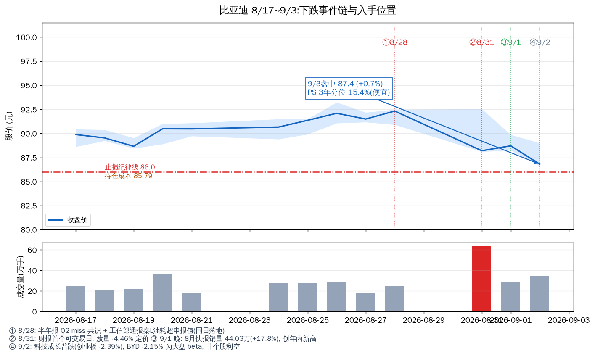
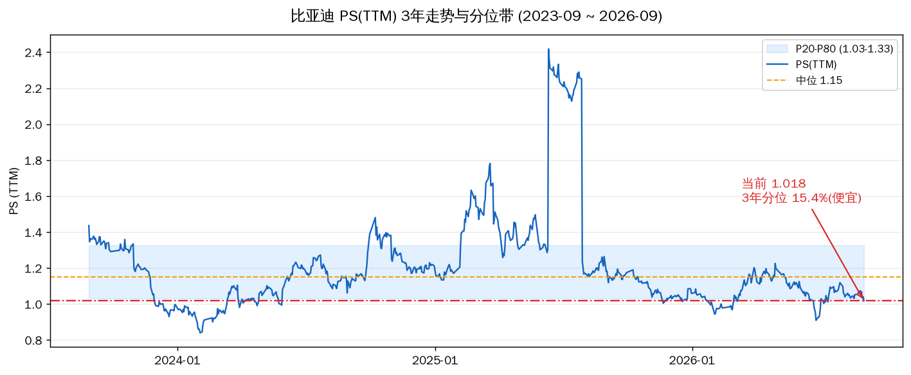

# 比亚迪近几天下跌归因与入手判断(2026-09-03)

先说结论。**近几天的下跌是"财报利空落地 + 大盘 beta"的组合,不是新的基本面恶化;8 月产销快报(9/1 晚)确认了销量修复,今日已止跌反弹。但"便宜"不等于"该加"——你已持有 1600 股占组合 56.5%,止损线 86.0 距现价只有 1.7%,在这个位置谈加仓,先回答的是纪律问题,不是估值问题。**

---

## 一、下跌事件链(8/28 → 9/3)

| 日期 | 收盘/涨跌 | 发生了什么 | 性质 |
|---|---|---|---|
| 8/28(五) | 92.32(+0.9%) | 盘后披露半年报(Q2 归母 82.4 亿,miss 共识 ~91.4 亿);**同日工信部通报**秦L DM-i 电量保持模式油耗超申报值 | 双利空落地,当日未反应 |
| 8/29-30 | 周末 | 油耗通报经媒体发酵(知乎/凤凰/东财等集中解读) | 情绪扩散 |
| 8/31(一) | 88.20(**-4.46%**),放量 64 万手(2.5 倍) | 财报首日定价 + 油耗通报叠加 | **个股利空定价** |
| 9/1(二) | 88.71(+0.58%) | 盘中修复;晚 8 点发布 8 月产销快报 | 修复 + 数据落地 |
| 9/2(三) | 86.80(**-2.15%**) | 创业板 -2.39%、深成 -1.88%,科技成长普跌;BYD 跌幅与板块相当 | **大盘 beta,非个股利空** |
| 9/3(四,盘中) | 87.4(+0.7%) | 大盘企稳反弹,BYD 跟涨且跑赢同业(长城 -0.2%/赛力斯 +0.2%) | 止跌信号初现 |

**8/28 的油耗通报需要单独说明**:工信部 2025 年度生产一致性检查,秦L DM-i(电量保持模式)油耗超申报值 3.8L/100km;同一批被点名的还有吉利星愿(轴距误差)。性质是监管抽检一致性偏差(行业惯例偏差 5-10%),责令整改(1-3 个月),不是安全缺陷。8/28 当天股价还涨 0.9%,说明通报本身不构成重击——它给 8/31 财报首日下跌加了情绪砝码,但不是主因。主因仍是 Q2 miss。

## 二、9/2 的下跌为什么是 beta

9/2 全市场成长股普跌:创业板 -2.39%、深成 -1.88%、上证 -0.97%。BYD -2.15% 恰好落在板块中间,没有任何个股专属利空(无新公告、无减持、无评级下调)。同时 9/1 晚的快报明明是利好(8 月销量 44.03 万辆,**同比 +17.8%,环比 +5.4%,创年内新高**;出口 18.95 万辆创新纪录),9/2 却跟跌——这是典型的"利好被大盘拖累",不是利好不兑现。9/3 反弹中 BYD +0.7% 跑赢板块,说明市场开始消化快报的正面信息。

## 三、基本面验证:8 月快报说了什么

9/1 晚快报(8 月):新能源车销量 44.03 万辆(去年 37.36 万,同比 +17.8%),其中乘用车 43.34 万(同比 +16.7%);出口 18.95 万辆创单月纪录;1-8 月累计 266.8 万辆,累计同比仍 -6.84%。

| 验证点(9/1 报告设置) | 结果 |
|---|---|
| 8 月销量是否延续 7 月修复 | **是**:连续第二个月同比正增长(7 月 +21.8% → 8 月 +17.8%),增速回落但基数更高 |
| 出口是否维持 | **是**:18.95 万辆创新纪录 |
| 国内跌幅是否收窄 | 累计仍 -6.8%,1-8 月缺口未填平,全年 500-550 万目标仍偏紧 |

定性:修复在延续,但斜率未加速。快报公布当日(9/2)股价被大盘拖累没反应,9/3 才开始定价——**这是近几天唯一一次"数据利好"尚未充分反映的机会点**。

## 四、估值:PS 15.4% 分位,便宜档

| 尺子 | 当前值 | 位置 |
|---|---|---|
| PS(TTM) | 1.018 | 3 年分位 **15.4%**(P20 1.032 / 中位 1.154 / P80 1.334),便宜档 |
| 价格 | 87.4(9/3 盘中) | 3 年价格分位 ~39%,距窗口高点 -34.7% |
| 持仓成本 | 85.79 | 现价浮盈 +1.9% |

8/31 大跌后 PS 分位从 ~21% 降到 15.4%——**估值保护比 8/31 更厚了**。这也是 9/1 报告说"估值已出清"的原因:利空落地 + PS 回便宜档,价格层面的风险释放完毕。

## 五、入手判断:三个约束先于估值

估值说便宜(PS 15.4%),但"是不是好机会"要过三个约束:

**约束 1:集中度(最硬)**
你已持有 1600 股,今日盘中市值约 14 万,**占组合股票市值 56.5%**(8 只持仓实时价重算)。8% 单票红线早就超了 7 倍。在这个占比上再加仓,不是"抄底",是"把组合命运进一步押在单票上"。9/2 已经演示过:B YD 跟跌 beta 时,你的组合一天波动就取决于它。

**约束 2:止损线距离(纪律硬约束)**
止损纪律线 86.0 是 9/1 报告里确认的(你成本 85.79 下方 0.2 元)。现价 87.4 距止损线只有 **1.7%**——一个正常的日内波动(±2%)就能触发。在这个位置加仓,若次日破 86,新加的仓位立刻浮亏 + 触发止损,等于在止损位上方接刀。**加仓位置和止损位置相距 1.7%,这不是"加仓结构",是"止损要不要执行"的结构。**

**约束 3:基本面修复的确认度**
8 月快报连续两月正增长是修复信号,但累计 -6.8% 未填平、Q2 单季 miss 共识(-10%)的伤口还在。修复斜率没有加速,9 月的环比数据(10/1 前后披露)才能确认趋势。现在加仓是"左侧赌修复",不是"右侧确认修复"。

## 六、结论

**基本面:近几天下跌已归因完毕——8/31 是财报+通报定价,9/2 是纯 beta,9/3 开始反映 8 月快报利好。没有新的基本面恶化,估值保护(PS 15.4%)比 8/31 更厚。**

**操作纪律:不建议现在加仓。三个理由,按权重排:① 集中度 56.5% 已是红线 7 倍,加仓是结构性风险;② 现价距止损线 1.7%,加仓位置与止损位置重叠,不符合任何分批买入逻辑;③ 修复斜率未确认加速。**

如果一定要给"何时可以加"的触发器(参考,不替你拍板):
- **右侧确认**:股价放量站稳 90+(8/31 大跌后反弹结构修复),且 9 月快报(10/1)延续正增长——这是"修复确认"后加仓,不是赌
- **左侧纪律**:若回调至 82-83(前低 78.2 上方 + 成本线下沿)且不破 78.2 年内低点,止损距离拉开到 -5% 以上,分批第一批可行
- **破 78.2**:停止一切加仓想法,那是趋势破位,不是机会

现在的 87.4 处在两者之间——不上不下,不值得为 1.7% 的止损距离冒险。

## 风险(本判断的)

- 9/3 是盘中价,收盘可能变化;若尾盘翻绿,明日需重新评估
- 工信部油耗通报的整改要求(2026 年内)可能升级,需跟踪
- 组合占比按 8 只股票市值计算,未计现金(表内现金推算可能不全)
- 港股 BYD 今日数据未取,若 A/H 联动异动需补充

---

Data as of: 2026-09-03(盘中 ~14:15,新浪实时 / TuShare 9/2 收盘)
Generated: 2026-09-03
