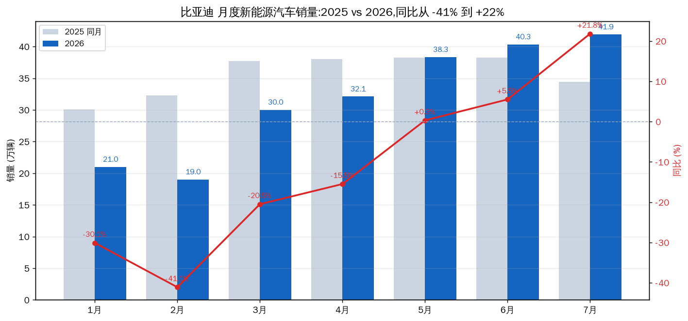
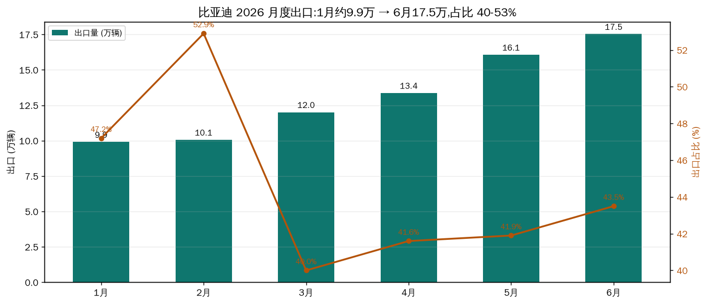
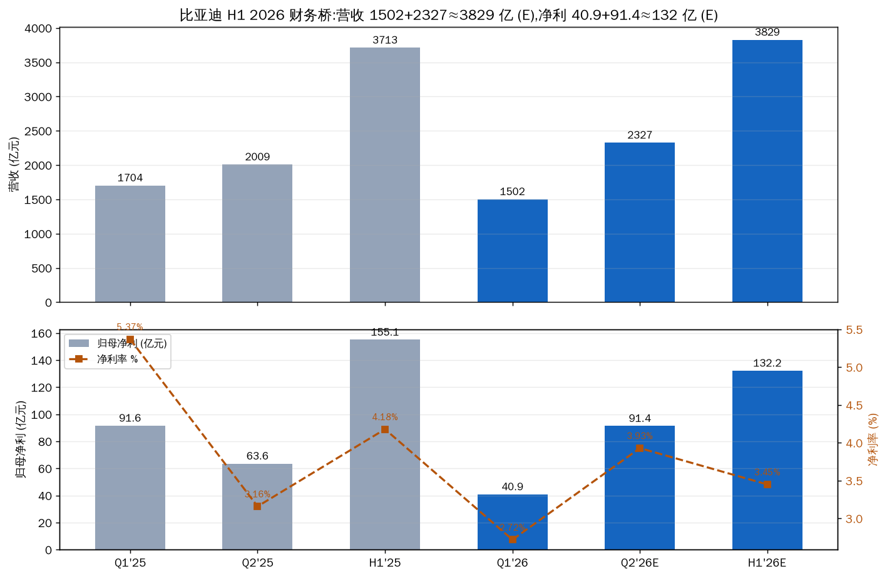

# 比亚迪 2026 半年报前瞻:产销快报已经说了什么

先说结论。可以评估,而且方向已经比较清楚:中报(8/29 披露)营收大概率与去年持平到小幅增长——上半年销量 180.9 万辆、同比 -15.7%,但出口占比 43.6% + 高端化把单车收入抬高了约四分之一(Q1 单车收入 21.45 万 vs 去年同期 17.02 万)。归母净利预计在 125-145 亿区间、同比 -20% 到 -7%(Q1 已确认 40.85 亿,是年内低点;Q2 预计 ~91 亿,同比 +43%)。真正要盯的不是总量,是毛利率能不能守住 18.8%,以及汇兑损失会不会再来一次。

---

## 一、产销快报:上半年销量的事实

2026 上半年新能源汽车销量 1,808,511 辆,同比 -15.72%。但节奏比总量重要:一季度 -30%,二季度收窄到 -3.2%,5 月同比转正,7 月 +21.8%。

| 月份 | 2026 销量 | 2025 同期 | 同比 |
|------|-----------|-----------|------|
| 1月 | 21.0 万 | 30.1 万 | **-30.1%** |
| 2月 | 19.0 万 | 32.3 万 | **-41.1%** |
| 3月 | 30.0 万 | 37.7 万 | -20.5% |
| 4月 | 32.1 万 | 38.0 万 | -15.5% |
| 5月 | 38.3 万 | 38.2 万 | +0.3% |
| 6月 | 40.3 万 | 38.3 万 | +5.5% |
| 7月 | 41.9 万 | 34.4 万* | **+21.8%** |

*2025 年 7 月按同比反推。Q1 累计 -30.0%,Q2 累计 -3.2%,H1 累计 -15.7%。数据源:公司月度产销快报(巨潮/港交所公告)。

2026 年前 4 个月深度负增长,5 月起转正,7 月同比 +21.8%——周期项已经反转。

结构上,上半年出口 78.9 万辆(乘用车及皮卡,同比 +68%),占总销量 43.6%,Q1 一度达 45.7%。这是 2026 年最核心的结构变化:国内销量约 101.9 万、同比 -39%,海外几乎补上了全部缺口还有余。品牌层面,海洋网 79.9 万反超王朝网 71.4 万;方程豹约 16 万(+162%),腾势 6.6 万(-16.7% 但 6 月单月破 2 万),仰望 1,972 辆。

出口从 1 月约 9.9 万爬升到 6 月 17.5 万;1/4 月为按累计口径反推。

电池是报表里容易被忽略的第二引擎:4 月累计装机 81.2 GWh,同比增速约 22% 的节奏;行业层面上半年储能电池销量同比 +83.4%,6 月已进入电池涨价周期。比亚迪在国内动力电池装车份额 17.1%、同比 -6.4pct(二代刀片切换期),但外供和储能在补。

## 二、从销量到财务:这座桥怎么搭

一季度已经披露(4/28):营收 1502.25 亿(-11.82%),归母净利 40.85 亿(-55.38%),扣非 41.48 亿(-49.24%),经营现金流 27.9 亿(-67.5%)。公司明确说净利下滑主因是汇兑损失。毛利率 18.8%,环比 Q4 提升 1.4pct,是近一年最高——量在跌,单位盈利能力在修复。

关键桥接:Q1 单车收入 21.45 万元,比去年同期 17.02 万高 26%。销量 -30% 但收入只 -11.8%,差额就是出口占比翻倍(45.7% vs ~22%)+ 高端品牌放量 + 电池外供。二季度销量 110.8 万(-3.2%),按不同单车收入假设,营收在 2216-2377 亿之间。

| 情景 | Q2 单车收入假设 | Q2 营收 | H1 营收 | H1 同比 |
|------|----------------|---------|---------|---------|
| 保守 | 20.0 万/辆 | 2216 亿 | 3718 亿 | +0.2% |
| 中性 | 21.0 万/辆 | 2327 亿 | 3829 亿 | **+3.1%** |
| 乐观 | 21.45 万/辆(维持 Q1) | 2377 亿 | 3879 亿 | +4.5% |

利润端,媒体汇总的机构共识是 Q2 归母净利约 91.4 亿(+43.7% vs 去年同期 63.6 亿),对应 Q2 净利率约 3.9%。加上 Q1 的 40.85 亿,H1 约 132 亿、同比 -14.8%。一个值得注意的对照:H1 2025 单车净利 7,228 元,H1 2026E 约 7,300 元——利润的下滑几乎全部来自量,不是每辆车赚得少了。

财务桥:Q1 已披露 + Q2 中性预测。净利率 Q1 2.7% 是年内低点,Q2 预计回升到 ~3.9%。

## 三、中报要盯的四个变量

### 1. 毛利率(最关键)

Q1 18.8% 是近一年最高。支撑:出口占比(海外定价更高)+ 电池涨价周期(6 月行业开始)+ 高端品牌放量。逆风:国内价格战和下半年新车密集上市(成都车展 8 月)。若中报毛利率守住 18%+,净利有望落在区间上沿。

### 2. 汇兑(最大单点弹性)

Q1 财务费用同比变动 -210%,归母净利下滑的一半以上解释来自汇兑损失。Q2 汇率方向未定,若转为收益,净利可上修 10-20 亿;若再来一次损失,下沿看 120 亿。

### 3. 研发(持续压制项)

2025 上半年研发 308.8 亿(+53.1%),Q1 2026 单季 113 亿,节奏未放缓。研发高于净利润的状态短期不会变,中报研发费用增速如果回落,反而释放利润弹性。

### 4. 电池/储能(收入端第二引擎)

行业储能上半年 +83.4%、电池出口 +42.5%、6 月进入涨价周期。中报的电池外供与储能收入是营收超预期的主要潜在来源。

## 四、动态对照:哪些已走出,哪些没有

| 因子 | 状态 | 证据 |
|------|------|------|
| 销量周期 | 已走出 | Q1 -30% → 5月转正 → 7月 +21.8% |
| 出口结构 | 兑现中 | H1 +68%、占比 43.6%;巴西/印尼/匈牙利产能落地 |
| 国内份额 | 仍承压 | 国内销量 H1 -39% vs 大盘 -5%;电池国内份额 -6.4pct |
| 毛利率 | 已走出 | 18.8% 近一年最高,环比 +1.4pct |
| 归母净利 | 正在走出 | Q1 40.85 亿低点 → Q2 预计 ~91 亿;H1 仍 -15% |
| 汇兑 | 未到验证时点 | Q1 是损失;Q2 方向中报见分晓 |

中间这段最难判断的是国内份额。出口故事市场已经买账(股价、估值里已经反映),国内 -39% 是 2026 年真正的结构性裂缝——它决定的是 2027 年总量天花板,而不是 8 月中报的读数。

## 五、验证锚点(8/29 中报)

| 类型 | 锚点 |
|------|------|
| 价格锚 | A 股 92.09(8/26 收盘)/ H 股 92.85;PS TTM 1.07x,PE TTM 30.5x,PB 3.62x,市值 8396 亿 |
| 时间锚 | 中报预约披露 8/29(周六,部分数据平台标 8/28,以巨潮公告为准) |
| 数据锚 | 毛利率 vs 18.8%;单车净利 vs ~7,300 元;出口收入占比;汇兑损益;研发费用;电池/储能收入 |
| 事件锚 | 9 月初 8 月产销快报(验证下半年销量斜率);年底 2 万座闪充站目标;海豹08/大唐等新车爬坡 |

## 风险

- 国内份额结构性流失:国内销量 H1 -39%,电池国内份额 -6.4pct——看每月产销快报国内能否止跌
- 汇兑:Q2 若再现损失,净利落到 120 亿下沿
- 价格战:8 月成都车展 + 下半年新车密集,国内促销加码 → 毛利率回落
- 估算本身:Q2 净利为媒体汇总机构共识,非公司指引;实际中报可能偏离 ±10%

---

数据源:公司月度产销快报(2026 年 2-7 月,巨潮/港交所)、2026 一季报(4/28)、TuShare 利润表(2025 年各期)、公司官网、乘联会/动力电池联盟行业数据。2025 年 7 月销量为按同比反推;1 月/4 月出口为按累计口径反推;Q2 财务为预测值。未经审计。

Data as of: 2026-08-26
Generated: 2026-08-27
