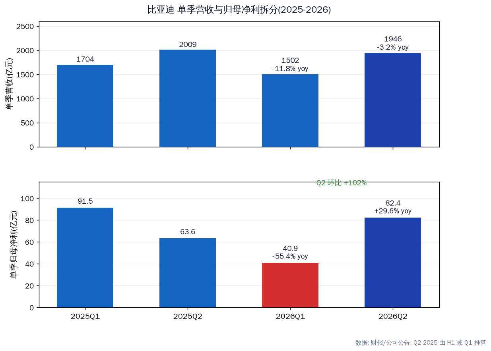
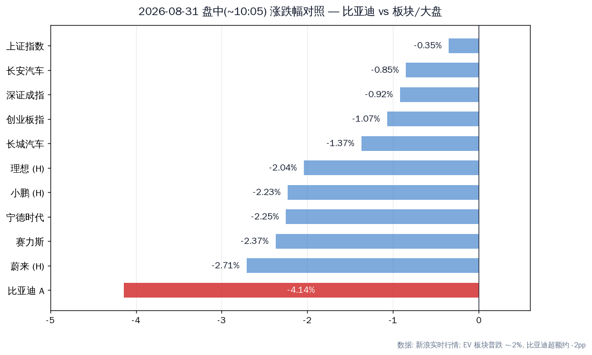
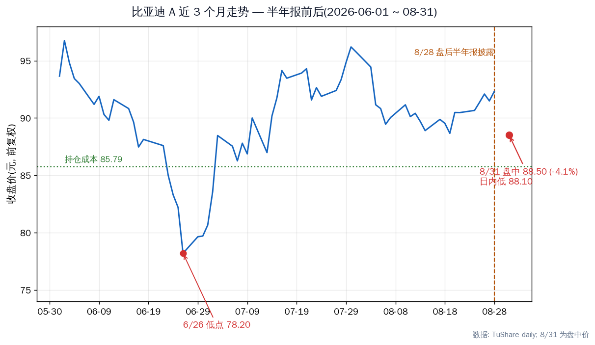

# 比亚迪 2026 半年报:数字拆解与 8/31 下跌归因

先说结论。今天(8/31)A 股 -4.1%、H 股 -4.1%,主要是半年报的反应:8/28 盘后披露,今天是第一个可交易日,比亚迪跑输 EV 板块约 2 个百分点,开盘 35 分钟成交量就超过前一天全天。但跌的是"不及预期"那一面——营收净利双降、Q2 利润低于机构共识、不派息;半年报里毛利率、现金流、合同负债这些改善信号,市场暂时没有定价。

---

## 半年报到底怎么样

| 指标 | H1 2026 | H1 2025 | 同比 |
|---|---|---|---|
| 营业收入 | 3448.15 亿 | 3712.81 亿 | **-7.13%** |
| 归母净利 | 123.25 亿 | 155.11 亿 | **-20.54%** |
| 扣非净利 | 123.73 亿 | ~135.99 亿 | **-9.02%** |
| 经营性现金流 | 373.35 亿 | ~318.3 亿 | +17.28% |
| 毛利率 | 18.85% | 18.01% | +0.84pp |
| 汽车业务毛利率 | 22.33% | ~20.35% | +1.98pp |
| 研发投入 | 288.6 亿 | ~308.8 亿 | -6.54% |
| 合同负债(期末) | 797.97 亿 | 461.41 亿 | **+72.9%** |
| 资产负债率 | 70.96%;中期不派息、不送转 | | |

注:H1 2025 扣非/OCF/汽车毛利率由同比反推;合同负债来自 TuShare balancesheet(2025/6/30 与 2026/6/30 同口径)。

单季拆分:H1 的 -20.5% 几乎全部来自 Q1(-55.4%);Q2 单季归母 82.4 亿,同比 +29.6%、环比 +102%。

### 三个关键读数

- **扣非 -9.0% vs 归母 -20.5% 的差距几乎全是汇兑。** 非经常性损益从去年同期 +19.1 亿变为今年 -0.5 亿(去年汇兑收益→今年汇兑损失)。主业经营利润实际下滑约 9%,不是 20%。
- **低于预期,这就是今天卖压的来源。** 营收 3448 亿 vs 8/27 前瞻中性估算 3829 亿;Q2 归母 82.4 亿 vs 机构共识 91.4 亿,miss 约 10%。
- **合同负债 798 亿,同比 +73%、环比 +47%。** 经销商订金大幅回补,与 7 月销量 +21.8% 互相印证。这是半年报里被忽略的最强前瞻信号。

---

## 今天的下跌:是半年报的体现,但不全是

| 核对项 | 证据 | 结论 |
|---|---|---|
| 时间 | 8/28 盘后披露,今天是首个可交易日 | 吻合 |
| 幅度 | -4.14% vs 板块 -0.9~-2.7%、大盘 -0.35~-1.07% | 超额约 2pp |
| 量能 | 开盘 35 分钟 2918 万股 > 8/28 全天 2503 万股 | 放量下跌 |
| 其他催化 | 今日无专属利空;8 月销量快报未出 | 无干扰项 |

### 市场在卖什么

- headline 营收净利双降(-7.1% / -20.5%)
- Q2 归母 miss 机构共识约 10%(82.4 vs 91.4 亿)
- 中期不派息,资本开支(闪充 2 万站 + 海外建厂)仍在高位
- 国内销量 -39%,内需疲弱被财报坐实
- 研发投入下降 6.5%,被解读为利润保卫

### 市场没定价什么

- 毛利率 18.85% 创近一年新高,汽车业务毛利率 +1.98pp
- 经营现金流 +17.3%,利润含金量提升
- 合同负债 +73%(yoy),渠道订金回补
- 出口 78.9 万辆 +67.9%,海外收入占比 52.6%(+33.9%)
- 高端三品牌(仰望/腾势/方程豹)+61%,占比 12.8%
- Q2 单季归母 +29.6%,盈利修复已启动

我的判断:这是"业绩落地 + 预期差"的定价,不是"基本面恶化"的定价。Q2 已经验证盈利修复,市场要的是连续验证——8 月销量、Q3 毛利率、汇兑是否转回。EV 板块今天整体约 -2%,比亚迪超额跌幅约一半来自半年报,另一半来自板块 beta。

---

## 持仓视角

当前持仓 1600 股,成本 85.79。现价 88.50,仍浮盈 +2.7%;今日盘中低 88.10,距成本线只剩 2.7%。

价格锚:今日低 88.10 / 成本 85.79 / 6/26 低点 78.20 / 52 周低 77.60 / 3 个月高 93.65。

组合占比约 57%(股票市值口径,按今日价重算;sheet 现价列停在 8/13)。远超此前组合分析采用的 8% 单票红线——8/7 组合体检时 BYD 已点名 41.5%。单票集中度是比今天跌 4% 更值得处理的问题。

---

## 验证锚点

| 类型 | 锚点 | 看什么 |
|---|---|---|
| 时间 | 9/1-3 8 月产销快报 | 销量 yoy 能否延续 7 月 +21.8% |
| 数据 | Q3 财报(10 月底) | 毛利率守住 18.5%+;汇兑是否转回;合同负债环比 |
| 事件 | 闪充站建设 | 年底 2 万座目标(6/30 已 7018 座) |
| 价格 | 85.79 / 88.10 / 78.20 | 成本线、今日低、6 月低 |

---

## 风险

- 8 月销量回落 → 内需恢复证伪(9/1-3 快报验证)
- 海外价格战 / 关税 → 出口毛利率能否维持(汽车业务毛利率 22.33%)
- 国内价格战再起 → 毛利率见顶回落
- 汇兑损失延续至 Q3
- 组合集中度:BYD 占约 57%,单票事件即组合事件

---
Data as of: 2026-08-31(盘中 ~10:05,新浪实时 / TuShare)
Generated: 2026-08-31
