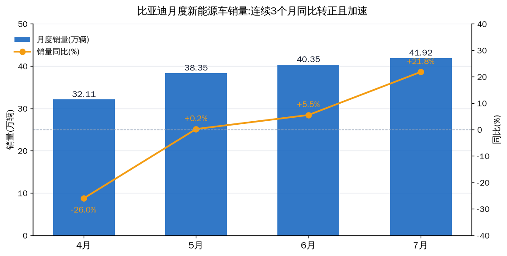
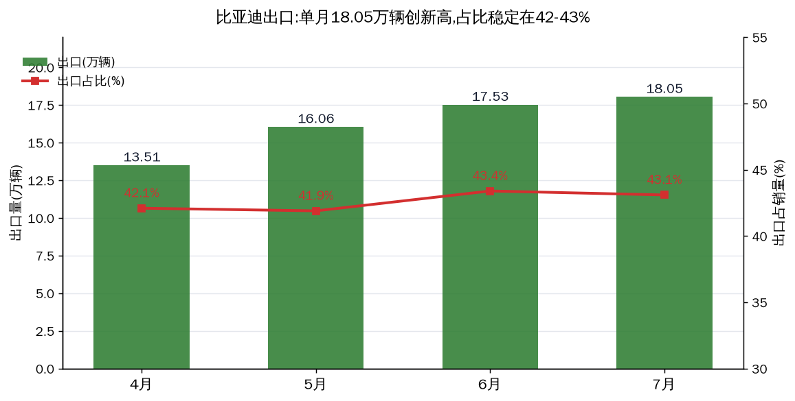
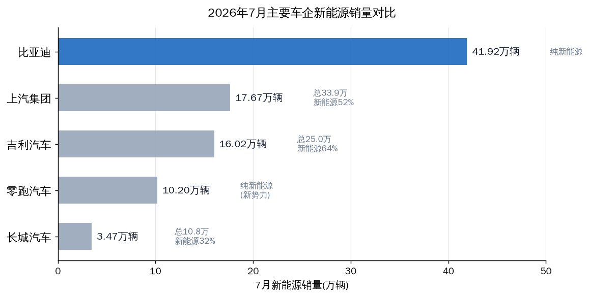

# 比亚迪 2026年7月产销快报:销量 +21.8%,出口创新高,但股价没买账

公告编号 2026-027 · 2026-08-02 晚间披露 · 行情数据 as of 2026-08-04 14:07 盘中

先说结论。7 月新能源车销量 41.92 万辆,同比 +21.8%,连续第三个月同比转正且加速(5月 +0.2% → 6月 +5.5% → 7月 +21.8%);出口 18.05 万辆创单月新高,占销量 43%。数据本身是强势的。但公告后两个交易日 A 股累计跌约 5%,今天(8/4)盘中 90.98 元、-3.67%,同期创业板大涨 6%。销量数据市场早就预期到了,现在市场等的是利润——8 月底中报的毛利率才是真正的裁判。

---

## 数据:快报原文

产销快报未经审计,单位:辆。

| 项目 | 7月产量 | 同比 | 7月销量 | 同比 |
|---|---|---|---|---|
| 新能源汽车合计 | 420,249 | **+32.2%** | 419,211 | **+21.8%** |
| — 乘用车 | 411,791 | +30.6% | 411,072 | +20.5% |
| &nbsp;&nbsp;纯电动 | 233,785 | +46.1% | 233,105 | **+31.0%** |
| &nbsp;&nbsp;插电混动 | 178,006 | +14.7% | 177,967 | +9.1% |
| — 商用车 | 8,458 | +222% | 8,139 | +149% |
| 其中:出口 | colspan=4 | 7月出口新能源汽车合计 180,538 辆,单月新高 | | |

1-7 月累计销量 2,227,722 辆,同比 **-10.5%**(去年同期 2,490,250);累计产量 2,234,379 辆,-9.0%。上半年欠的账还在,但缺口从 4 月底的 -26% 一路收窄到 -10.5%。

## 三个月趋势:销量周期反转已经确认

| 月份 | 销量(万辆) | 同比 | 环比 | 出口(万辆) |
|---|---|---|---|---|
| 4月 | 32.11 | -26.0% | — | 13.51 |
| 5月 | 38.35 | +0.2% | +19.4% | 16.06 |
| 6月 | 40.35 | +5.5% | +5.2% | 17.53 |
| 7月 | 41.92 | **+21.8%** | +3.9% | 18.05 |

两个细节值得注意。第一,纯电恢复快于插混:纯电 +31.0% vs 插混 +9.1%,动力结构在向纯电回摆(去年插混基数高)。第二,7 月是传统淡季,6 月冲量后环比仍 +3.9%,说明需求不是脉冲,是趋势。

## 出口:唯一确定性引擎

7 月出口 180,538 辆,占销量 43%。这是全行业逻辑:6 月全国新能源乘用车出口 49.9 万辆、同比 +152.7%,比亚迪是其中最大的单一贡献者。泰、巴、匈、乌兹别克四个海外整车厂投产,叠加高油价推升海外新能源需求,出口从"补充"变成了"主引擎"。反过来说,这也是最大外部依赖:油价回落、欧盟关税落地,都会直接打这条腿。

## 同行对比:7 月谁在抢份额

| 车企 | 7月总销量(万辆) | 新能源(万辆) | 新能源同比 | 出口(万辆) |
|---|---|---|---|---|
| 比亚迪 | 41.92 | 41.92 | **+21.8%** | 18.05 |
| 上汽集团 | 33.86 | 17.67 | +50.7% | 14.17 |
| 奇瑞 | 27.60 | — | — | 20.20 |
| 吉利汽车 | 25.02 | 16.02 | +23% | 10.67 |
| 长城汽车 | 10.81 | 3.47 | — | 6.20 |
| 零跑汽车 | 10.20+ | 10.20+ | — | — |

行业 7 月前 19 天新能源批发同比仅 +5%,比亚迪 +21.8% 明显跑赢行业——份额至少在企稳,没有继续丢。但吉利 25 万辆创同期新高、零跑成为首家月销破 10 万的新势力,国内竞争烈度没有下降,只是比亚迪在出口上拉开了身位。

## 成因:7 月为什么能 +21.8%

| 因子 | 性质 | 证据 | 可逆性 |
|---|---|---|---|
| 出口爆发(占比43%) | 结构性 | 出口 18.05 万,连续4个月新高;6月行业出口 +152.7% | 部分可逆,依赖油价与关税 |
| 去年同期低基数 | 周期性 | 2025年7月销量 344,296,是去年价格战低谷 | 短期 |
| 新品+产能爬坡 | 结构性 | 二代闪充刀片电池产能释放,新车密集上市 | 持续 |
| 国内价格战/份额竞争 | 行业性 | 吉利25万创新高、零跑破10万;渗透率已69% | 部分可逆,需供给侧出清 |
| 高油价+置换补贴 | 外生性 | 霍尔木兹海峡扰动推升油价,新能源替代加速 | 一次性/可逆 |

## 动态对照:哪些已走出,哪些还没有

| 维度 | 当前状态 | 判断 |
|---|---|---|
| 单月销量同比 | 5-7月连续转正且加速 | **已走出** |
| 出口 | 18.05万,连续4个月新高 | **已走出** |
| 纯电结构 | 7月纯电 +31%,占比回升至55.6% | 正在走出 |
| 国内份额 | 增速(+21.8%)跑赢行业(+5%),但吉利/零跑强势 | 企稳未确认,竞争仍在 |
| 累计销量缺口 | -26% → -10.5%,持续收窄 | 正在走出 |
| 利润/毛利率 | 待8月底中报验证 | 未到验证时点 |

用 7/24 那次分析的话说:周期性因子(低基数、冲量透支)已出清,结构性因子(出口)已兑现,现在唯一没验证的是利润。销量反转确认 ≠ 利润反转确认。

## 股价与估值:利好兑现,市场不买账

公告后第一天(8/3)A 股收 94.45、-1.38%;今天(8/4)盘中 90.98、-3.67%,港股 93.20 HKD、-1.79%。同一天创业板 +5.99%、深成指 +3.50%,汽车板块整体走弱(长城 -3.5%、上汽 -2.3%)。数据强、股价跌,不是基本面问题,是资金问题:出口和销量逻辑早已 price in,增量资金当天在追科技成长,不在追汽车。

| 指标 | 数值 | 说明 |
|---|---|---|
| A股现价(8/4 14:07) | 90.98 元 | -3.67% |
| 总市值 | 8,611 亿元 | 8/3 收盘口径 |
| PS_TTM | 1.10x | 8/3 收盘口径 |
| PE_TTM | 31.3x | 8/3 收盘口径 |
| PB | 3.71x | 8/3 收盘口径 |

PS 1.10x 处于自身历史低位区(2026-07-24 分析时 P/S 历史分位约 17%),估值没有透支。但 31x PE 意味着市场已经按"利润修复"定价,如果 8 月底毛利率不及预期,估值杀的是利润预期而不是销量。

## 我的判断

### 短期(未来1-2个月)

销量底确认,股价在等利润。8/13 秦MAX 上市、8月底成都车展(大汉亮相)是事件窗口;中报是最大变量。数据层面我倾向认为 8 月销量仍能守住 40 万辆上方(出口托底),但股价短期方向由市场风格决定,不由销量决定。

### 中期(3-12个月)

出口占比 43% 后,比亚迪的叙事已经从"国内价格战赢家"切换成"全球化车企"。海外工厂产能释放 + 新车投放,出口这条腿的确定性最高;国内份额企稳(增速跑赢行业)是第二层。最不确定的是利润:价格战没有结束,量增利平甚至量增利降的可能仍然存在。

这一段最难判断。销量数据能证明"困境反转"中的"量",证明不了"利"。中报毛利率(2026Q1 已回升到 18.8%)能否站稳 19% 以上,是我评估全年利润的核心阈值。

### 长期

全球新能源渗透率仍在早期,比亚迪是少数具备全产业链+海外产能+规模成本三重优势的车企。方向没有问题,问题在节奏和价格战烈度。

## 风险(带触发条件)

| 风险 | 触发条件 |
|---|---|
| 出口逻辑弱化 | 油价显著回落;欧盟/美国关税加码落地 |
| 利润不及预期 | 中报毛利率跌破18%(2026Q1为18.8%) |
| 国内份额再失 | 吉利/零跑持续高增且比亚迪国内增速转负 |
| 价格战升级 | 行业批发增速转负+库存回升(目前批发+5%尚可) |
| 利好兑现回落 | 股价已连跌2日,若跌破90元观察是否有资金承接 |

## 观察点

| 日期 | 事件 | 看什么 |
|---|---|---|
| 2026-08-13 | 秦MAX 上市(闪充B级) | 上市定价、订单节奏 |
| 8月底 | 成都车展,大汉亮相 | 旗舰车型热度 |
| 8月底 | 2026 中报 | 毛利率、单车净利、海外盈利 |
| 9月初 | 8月产销快报 | 淡季后能否守住40万+ |
| 月度 | 出口数据 | 是否维持18万+ |

## 验证锚点

| 类型 | 锚点 |
|---|---|
| 价格锚 | A股 90.98(8/4盘中)、市值8,611亿;PS 1.10x / PE 31.3x / PB 3.71x |
| 时间锚 | 公告 2026-08-02 晚;中报 8月底;8月快报 9月初 |
| 数据锚 | 7月销量 419,211(+21.8%)、出口 180,538、累计 -10.5%、纯电 +31.0% |
| 事件锚 | 秦MAX 8/13 上市;成都车展大汉;海外工厂产能爬坡 |

## 数据来源与口径

产销数据:比亚迪公告(2026-027,8/2;6月快报 7/1;5月快报 6/1;4月快报 5/3),未经审计。行业数据:乘联分会(6月批发151万辆+22%;7月1-19日批发+5%)。同行数据:各公司公告(吉利8/1、长城/上汽8/2、奇瑞/零跑媒体披露)。行情与估值:TuShare / 新浪财经,2026-08-04 14:07 盘中。所有销量数字均以公司公告口径(含出口),与批发/零售口径存在差异。

---
Data as of: 2026-08-04
Generated: 2026-08-04
