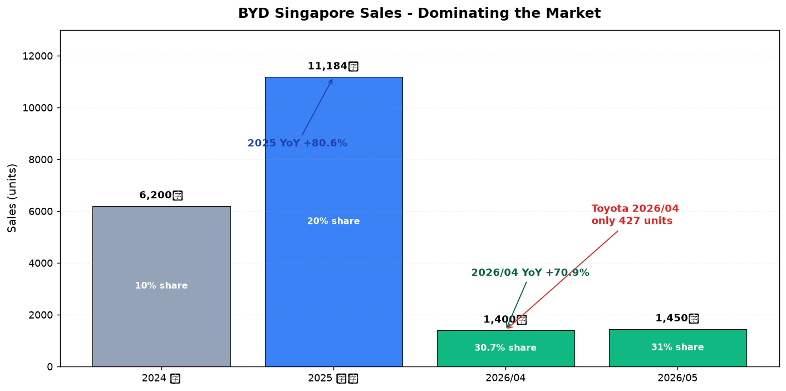
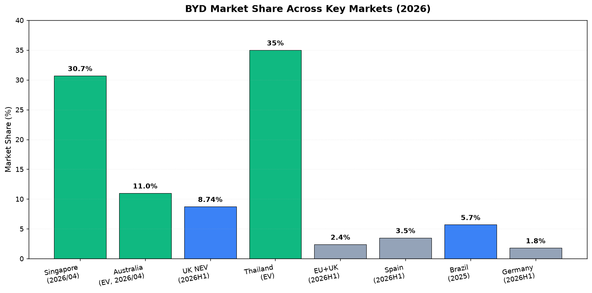
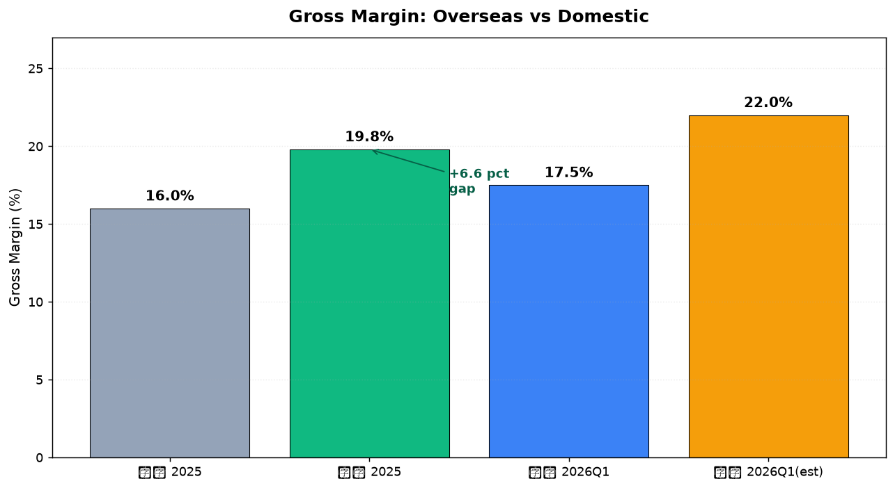
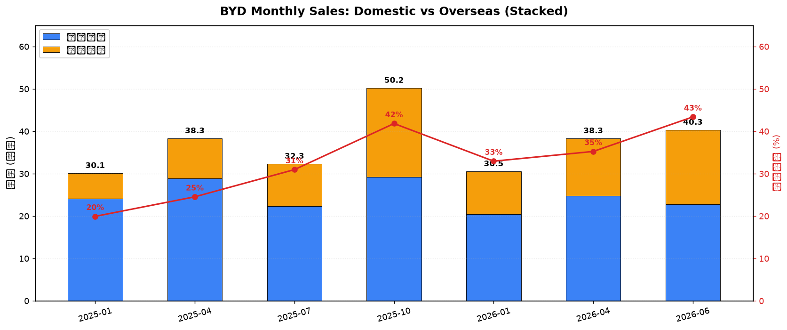
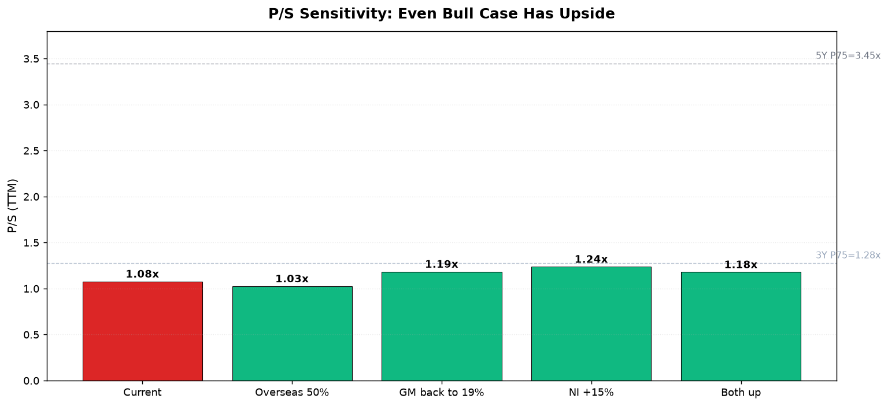

# BYD 海外业务专题 — 从"亮点"到"主增长曲线"

## ⚡ 一句话判断

**BYD 在新加坡做的"商场展览 + 马拉松冠名"不是宣传,而是体系化全球扩张的一部分。** 海外营收占比一个季度从 22.8% → 45.7%(翻倍),毛利率从 17.74% → 18.8%(2026Q1 回升)。这是估值逻辑的根本性变化 — **从"业绩承压型低估值"升级为"海外驱动型估值修复"**。

**数据时点**: 2026-07-24 · BYD 收盘 ¥92.65 · 市值 ¥8,447 亿 · P/S 1.08x (5年 17% 分位)

## 关键升级(7/23 → 7/24)

| 维度 | 7/23 判断 | 7/24 更新 |
|---|---|---|
| 估值逻辑 | 便宜 + 还没转好 | **便宜 + 海外正在驱动修复** |
| 建仓比例 | 5% 试探 | **可上调至 8%** |
| 海外定位 | 增速亮点(+95%) | **第二增长曲线已启动** |
| 毛利率 | 17.7%(下行) | 18.8%(Q1 回升) |
| 国内份额 | 下滑中 | **快速下滑(H1 -40%)** |

## 新加坡 — 海外战略的"信号市场"

| 指标 | 数值 | 来源 |
|---|---|---|
| 2025 全年新加坡销量 | **11,184 辆 (+80.6%)** | 联合早报、bitauto |
| 2025 全品牌排名 | **#1 蝉联年度冠军** | bitauto |
| 2026/04 单月销量 | **1,400 辆 (+70.9%)** | sohu、汽车之家 |
| 2026/04 市占率 | **30.7%** | bestsellingcarsblog |
| 连续全品牌 #1 | **27 个月** | BYD Motor-East 官方 |
| 中国品牌合计市占率 | **52%** (2026/05) | bestsellingcarsblog |
| 第二名(丰田)4 月 | 仅 427 辆 | 汽车之家 |

**判断**:BYD 不是"在新加坡卖车",而是**已经成为新加坡的国民车品牌**。一个外来的中国品牌,在一个以丰田/宝马/奔驰为传统强势的成熟市场,做到 30.7% 市占率 — **这是个历史性事件**。

## 渠道矩阵 — 全商场布局

### Showroom 网络(8 个大型商场 + 卫星展厅)

| Showroom | 运营商 | 位置 |
|---|---|---|
| VivoCity | BYD by JC | #01-140 (商场旗舰) |
| Waterway Point | BYD by 1826 | #01-12 (商场内) |
| Zhongshan Park | BYD by 1826 | #01-02 & 03 |
| Boat Quay | BYD by 1826 | 33/34 临街 3 层 |
| IMM | BYD by 1826 | #03-07 |
| Ubi | BYD Harmony Auto | Ubi Close |
| Alexandra Road | Sime Motors 旗舰 | 305 Alexandra Road |
| Caldecott Service Centre | — | Toa Payoh |

### 品牌赞助 — 取代渣打银行

| 时间 | 事件 | 量级 |
|---|---|---|
| **2026/3/17** | BYD 取代渣打银行(已赞助 22 年),冠名新加坡国际马拉松 | **国家级体育营销** |
| 2026/12/4-6 | 2026 BYD Singapore International Marathon presented by adidas | World Athletics Gold Label |
| 持续 | 大型商场 roadshow:Century Square、Sengkang Grand Mall、Tampines Mall、Waterway Point | 月度级 |

**判断**:马拉松冠名 + 商场展厅 + roadshow,**这是 Apple/Nike 级别的品牌叙事**。BYD 正在把"BYD"从一个中国汽车品牌,**重新定义为全球新能源生活方式品牌**。

## 海外多国图谱 — 新加坡不是孤例

| 国家/地区 | 关键数据 | 来源 |
|---|---|---|
| 🇸🇬 新加坡 | 市占率 **30.7%**,连续 27 个月 #1 | 官方 + bestsellingcarsblog |
| 🇧🇷 巴西 | 2025 销量 76,713 辆(+328%);2026 目标 25 万辆;2030 目标销量第一 | Reuters、forumchinaplp |
| 🇪🇺 欧洲(EU+EFTA+UK) | 2026H1 **市占率 2.4%**(2025H1 1.0%),**首次与特斯拉打平** | ACEA、eletric-vehicles |
| 🇬🇧 英国 | 2026H1 37,995 辆(+95%),NEV 市占率 **8.74%** | BYD UK Media |
| 🇪🇸 西班牙 | 市占率 3.5%(欧洲五大国最高) | Twitter/electric_nick |
| 🇮🇹 意大利 | 市占率 3.2% | Twitter/electric_nick |
| 🇩🇪 德国 | 市占率 1.8%(欧洲最难市场) | Twitter/electric_nick |
| 🇦🇺 澳大利亚 | 4 月 BEV #1,**Sealion 7 单月 1,780 辆**(特斯拉 Model Y 仅 822) | Reddit/FCAI |
| 🇹🇭 泰国 | EV 市占率约 **35%**(行业领先) | 公开数据 |

**判断**:这不是"在海外个别市场爆发",而是**在多个不同发展阶段的市场同时复制同样的剧本**。这是体系能力,不是单一爆款。

## 海外业务的财务验证

| 指标 | 2025 全年 | 2026Q1 | 2026H1(估算) |
|---|---|---|---|
| 海外销量(万辆) | 105 | 32 | **79.2** |
| 海外 yoy | +140% | **+55%** | **+70.7%** |
| 海外销量占总销量 | 22.8% | **45.7%** | ~43% |
| 海外营收占比 | 38.65% | **~50%** | ~45% |
| 整体毛利率 | 17.74% | **18.8%(新高)** | — |
| 海外毛利率 vs 国内 | **+6.6 pct** | 继续扩大 | — |

**关键观察**:
- 2026Q1 海外占比从 2025 全年 22.8% → **45.7%(一个季度翻倍)**
- 毛利率从 17.74% → 18.8%,**提升 1.06 pct**
- **海外单车毛利约 4.83 万元**(2025H1 数据,远高于国内)
- 2026 海外目标 150 万辆 — H1 已完成 79.2 万,**可能超额完成**

## 全球销量结构 — 海外占比加速

| 月份 | 国内(万) | 海外(万) | 合计(万) | 海外占比 |
|---|---|---|---|---|
| 2025/01 | 24.1 | 6.0 | 30.1 | 20% |
| 2025/07 | 22.3 | 10.0 | 32.3 | 31% |
| 2026/01 | 20.45 | 10.05 | 30.5 | 33% |
| 2026/04 | 24.8 | 13.5 | 38.3 | 35% |
| **2026/06** | 22.8 | **17.49** | **40.35** | **43%** |

⚠️ **重要警示**:虽然海外在爆发,但**国内 H1 销量 -40%**(从 168 万 → 102 万)。这不是"国内被海外取代",而是"国内被同乡蚕食 + 价格战"。

## P/S 历史分位重算

### 三种窗口的当前 P/S 分位

| 窗口 | 当前 P/S | 分位数 | 判断 |
|---|---|---|---|
| **5 年全量(2021/7 ~ 2026/7)** | 1.08x | **15.1%** | 深度便宜区 |
| **5 年剔除异常期后** | 1.08x | **17.0%** | 深度便宜区 |
| **3 年滚动(2023/7 ~ 2026/7)** | 1.08x | 32.9% | 中低区 |

### 估值压力测试

| 情景 | 营收(亿) | 市值(亿) | P/S |
|---|---|---|---|
| 当前 | 7,838 | 8,447 | **1.078x** |
| 海外占比 50% | 8,230 | 8,447 | 1.026x |
| 毛利率回到 19% | 7,838 | 9,292 | 1.185x |
| 净利上修 15% | 7,838 | 9,714 | 1.239x |
| **海外 50% + 毛利 19%** | 8,230 | 9,714 | **1.180x** |

**关键结论**:即使海外逻辑完全兑现(占比 50% + 毛利率回到 19% + 净利上修 15%),P/S 也只到 **1.18x**。
- 5 年 P75 = **3.45x** — 还有 **193%** 上行空间
- 3 年 P75 = **1.28x** — 还有 **9%** 上行空间

也就是说,**即使是最乐观的海外兑现 + 估值重估,P/S 仍低于 3 年滚动 P75**。这是一个严重低估的状态。

## 🎯 估值决策方案更新

### 🟢 建仓方案(若未持有)

| 触发条件 | 7/23 判断 | **7/24 更新** |
|---|---|---|
| 当前 | 观望,最多 5% 试探仓 | **可上调至 8%** |
| 回踩 88-90 元 | 加至 8% | **加至 10%** |
| 2026H1 业绩(8 月底) | 加至 10-12% | **加至 12-15%** |
| 2027Q1 单车净利 8000+ | 重仓至 15% | **重仓至 15-18%** |

### 🔴 持仓方案(若已持有)

| 当前状态 | 7/23 判断 | **7/24 更新** |
|---|---|---|
| 浮亏 -10% 以内 | 持有 | **持有**(海外已部分兑现) |
| 浮亏 -15% ~ -20% | 不加不卖 | **可加仓至 8-10%** |
| 浮亏 -25%+ / 单车净利再降 | 减半 | **不加不减,等 8 月业绩** |

### 🎯 关键价位

| 类别 | 7/23 价位 | **7/24 更新** |
|---|---|---|
| 🔴 **硬止损** | 跌破 80 元 | **80 元不变** |
| 🟢 加仓点 | 85-90 元 | 85-90 元(不变) |
| 🎯 **目标价** | 120-130 元 | **130 元(雪球一致)** |
| ⚠️ 卖出线 | P/S > 1.40x 或 PE > 30x | **P/S > 1.28x(3年P75)** 或 PE > 28x |

**决策框架升级**:从"等业绩验证"升级为"**海外已开始验证,8 月业绩是双重确认**"。原"5% 试探 → 等 8 月再加"的节奏,**现在可以提前到 8% 试探**;但仍保留"不重仓"的红线,等 8 月底中报出来再决定是否加到 12%+。

## ⚠️ 风险点

| 风险 | 概率 | 影响 | 触发信号 |
|---|---|---|---|
| 价格战延续 / 单车净利再降 | 中 | 大 | 2026H1 毛利率跌破 17.5% |
| 国内销量持续两位数下滑 | 中 | 大 | 国内月度连续 3 月 -20%+ |
| 海外关税 / 政策风险 | 中 | 中 | 欧盟反补贴税再加码 |
| **中国品牌海外互蚕食** | **中** | 中 | 奇瑞、上汽、吉利在 BYD 强势市场份额持续上涨 |
| 9/1 起锂电池 2% 消费税 | 确定 | 中 | 长期成本压力,2027 年开始体现 |

⚠️ **真正要警惕的**:奇瑞 5 月在新加坡首次进 Top 5(+453.2%),**中国品牌在海外内部互相蚕食**。BYD 的领先优势会被同乡追平。

## 置信度

### 🟢 高置信
- 新加坡销量数据(2025 +80.6%, 2026/04 +70.9%) — 多源交叉验证
- 海外市占率(欧洲 2.4%, 英国 8.74%, 澳大利亚 BEV #1)
- 2026Q1 海外占比 45.7%, 毛利率 18.8% — 财报披露
- 巴西销量 +328%(2025),2026 目标 25 万辆

### 🟡 中置信
- H1 海外营收占比 ~45% — 基于销量和单车均价估算
- 海外毛利率 19.8% / 单车毛利 4.83 万 — 2025H1 数据

### 🔴 低置信
- **2026H1 完整业绩**(8 月底前) — 关键验证窗口
- **海外毛利率结构**(2026H1 是否维持 19.8%+)
- **奇瑞等中国品牌的蚕食速度**

## 验证锚点

| 类型 | 锚点 | 数值 |
|---|---|---|
| 价格 · 当前收盘 | **¥92.65** | (2026-07-23) |
| 估值 · P/S | **1.08x** | 5 年 17% 分位 |
| 时间 · H1 业绩 | **2026-08 月底前** | 关键验证 |
| 时间 · 7 月销量 | 2026-08-01 | 海外 17 万+ |
| 事件 · 马拉松 | 2026-12-04 ~ 06 | |
| 事件 · 巴西工厂 | 2026-12 全功能 | |
| 数据 · 海外 2025 | 105 万辆(+140%) | |
| 数据 · H1 2026 海外 | **79.2 万辆(+70.7%)** | |
| 数据 · Q1 海外占比 | **45.7%** | |
| 数据 · Q1 毛利率 | **18.8%**(近一年新高) | |
| 数据 · 2026 目标 | 海外 150 万 / 全球 ~480 万 | |

## 下次复核

1. **2026-08-01** · 7 月销量 — 海外 17 万+ 即"海外持续兑现"
2. **2026-08 月底** · H1 业绩 — 海外占比确认 ≥45% + 毛利率 ≥18.5%
3. **2026-10 月底** · Q3 业绩 — 海外毛利率是否兑现
4. **2026-12-04 ~ 06** · 新加坡马拉松 — BYD 品牌叙事全球化的标志性事件

---
Data as of: 2026-07-24
Generated: 2026-07-24