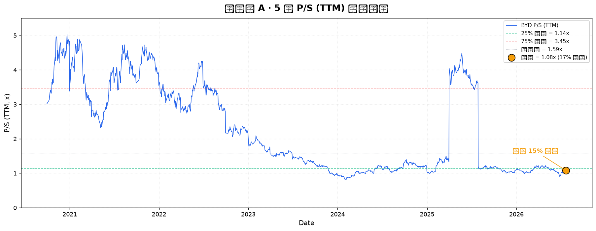
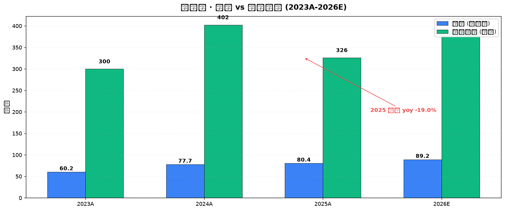
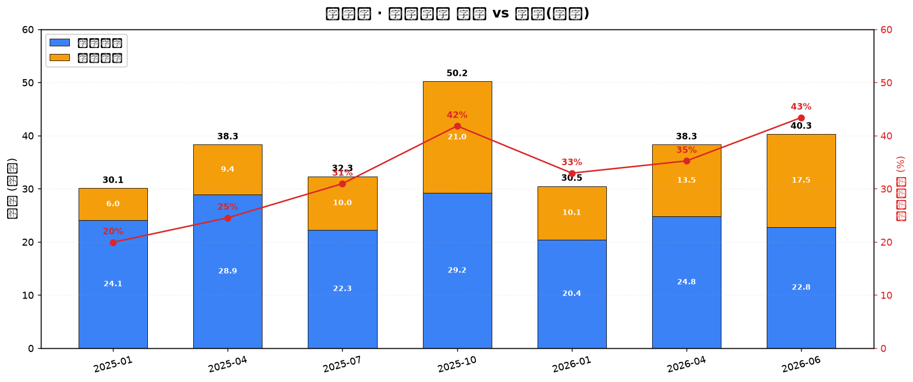
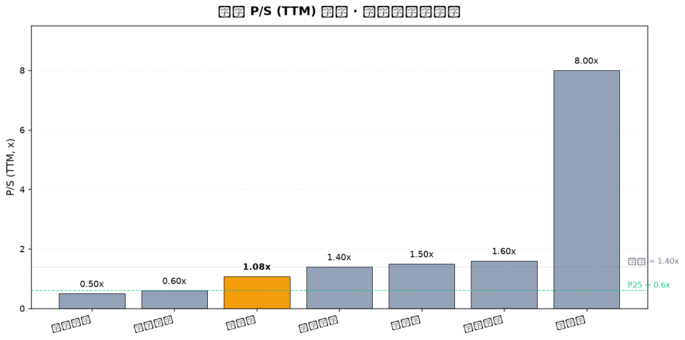
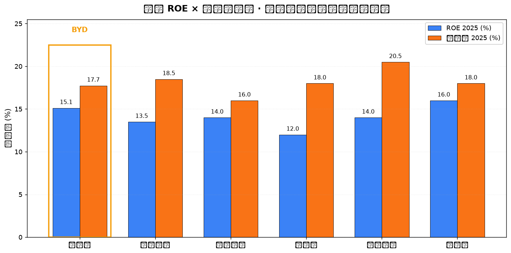

# 比亚迪 A (002594.SZ) · 估值分析

## 一句话判断

业绩承压型低估值龙头 — P/S 5 年 17% 分位,但净利还在探底。**困境反转的左侧**,不是右侧。当前适合"先观察、建仓≤5%、不重仓"。真正的左侧买点可能在 2026Q2 业绩验证(8 月底)前后。

**数据时点**: 2026-07-23 15:00 CST · 收盘 ¥92.65 · 市值 ¥8,447 亿

## 关键数据

| 指标 | 当前值 | 5年区间 | 分位 | 解读 |
|---|---|---|---|---|
| **P/S (TTM)** | **1.08x** | [0.81, 5.03] | **17%** | 便宜;略低于 25% 分位 1.143x |
| PE (2025A) | 25.9x | — | — | 静态 PE 偏高,因净利下滑 |
| PE (2026E) | 21.8x | — | — | 券商中性预测 |
| PB | 3.71x | — | — | 重资产,但 ROE 15% 匹配 |
| 当前 vs 历史高 | -77.1% | 405 → 92.65 | — | 5 年最大回撤 -80.7% |
| 52 周区间 | [77.60, 346.54] | — | 下沿附近 | 已接近 52 周低位 |

**关键校准**:5 年 P/S 中位数 1.586,25% 分位 1.143。当前 1.08 **略低于 25% 分位** —— 按 P/S 择时策略是**触发买入信号**。

## 业绩承压点

| 期间 | 营收 (亿) | yoy | 归母净利 (亿) | yoy | 毛利率 |
|---|---|---|---|---|---|
| 2024A | 7,771 | +29.0% | 402.5 | +34.0% | 19.5% |
| **2025A** | **8,040** | **+3.5%** | **326.2** | **-19.0%** | **17.7%** |
| 2026Q1 | 1,502 | -11.8% | — | — | — |
| 2025Q4 | 2,377 | -13.5% | 92.9 | -38.2% | 17.4% |

**承压本质**:**量在增,价格在跌,单车净利下降**

- 2025 销量 460.24 万辆 (+7.7%) ,2026/6 单月 40.35 万辆 (+5.46%)
- 2025 单车均价 13.57 万(**-3.4%**)
- 2025 单车净利 **6,398 元**(2024: 8,657 元,**-26%**)
- 行业整体进入存量博弈 — 2025 行业利润率仅 4.1%,12 月一度跌至 1.8%

## 海外销量爆发 · 核心增长引擎

**亮点**:2025 全年海外销量 105 万辆(**+140%**),2026/6 单月 17.49 万辆(**+95%**),境外营收占比已达 **38.65%**。全球化是比亚迪未来 2-3 年的核心 alpha。

## 同业对比 · 横向四分位

| 指标 | 比亚迪 | Min | P25 | 中位 | P75 | Max | 分位 |
|---|---|---|---|---|---|---|---|
| PE (2026E) | 21.8 | 9.5 | 11.5 | 21.8 | 25.0 | 80.0 | 中位 |
| PB | 3.71 | 1.6 | 1.7 | 3.5 | 5.0 | 15.0 | P75 |
| **P/S (TTM)** | **1.08** | 0.5 | 0.6 | 1.4 | 1.6 | 8.0 | **P25** |
| **ROE (2025)** | **15.12** | -5.0 | 12.0 | 14.0 | 15.12 | 16.0 | **并列最高** |
| 毛利率 | 17.74 | 16.0 | 17.0 | 18.0 | 18.5 | 20.5 | P25 |
| 营收 yoy | 3.46 | -2.0 | 3.46 | 13.7 | 30.0 | 50.0 | 最低 |

**横向读法**:P/S 在 P25(便宜)、ROE 在 P75+(强),但毛利率 P25 + 营收增速垫底 → 反映"**便宜有便宜的道理(增长失速),但底层资产质量仍是最强那一档**"。

## 5M + Moat 速判

| 维度 | 评分 | 关键点 |
|---|---|---|
| M1 目标市场 | ⭐⭐⭐⭐⭐ | 全球乘用车 + 储能 + 三电供应链,空间足够大 |
| M2 市场份额 | ⭐⭐⭐⭐⭐ | 全球新能源第一,但**国内份额在下滑** |
| M3 利润率结构 | ⭐⭐⭐ | OCF/NI ≈ 1.81(健康),但毛利率下行 |
| M4 商业模式 | ⭐⭐⭐⭐⭐ | 自研电池/电机/电控/智驾,可复制难 |
| M5 管理团队 | ⭐⭐⭐⭐ | 王传福主导研发;淘汰赛判断需验证执行力 |
| Moat 护城河 | **强** | 规模经济 + 电池技术壁垒 + 海外产能先发 |

## 风险与情景

### 主要风险

| 风险 | 概率 | 影响 | 触发信号 |
|---|---|---|---|
| 价格战延续 / 单车净利再降 | 中 | 大 | 2026Q2 毛利率跌破 17% |
| 国内销量持续两位数下滑 | 中 | 大 | 月度销量连续 3 月 -10%+ |
| 海外关税 / 政策风险 | 中 | 中 | 巴西/欧盟反补贴关税 |
| 库存减值 (1,384 亿,+19%) | 低中 | 中 | 库存周转率恶化 |
| 新能源技术替代 | 低 | 极大 | 固态电池革命 |

### 建仓方案(若未持有)

| 触发条件 | 动作 |
|---|---|
| **当前** | **观望,最多 5% 试探仓**(92-95 元区间) |
| 回踩 88-90 元 | 加至 8%(单票 ≤8% 红线) |
| 2026Q2 业绩验证(8 月底) | 若毛利率回升 + 单车净利回升,加至 10-12% |
| 2027Q1 单车净利回到 8000+ | 重仓至 15% |

### 持仓方案(若已持有,假设成本 100-120 元)

| 当前状态 | 动作 |
|---|---|
| 浮亏 -10% 以内(成本 100-104) | 持有,等 2026Q2 验证 |
| 浮亏 -15% ~ -20% | 不加不卖,观察 8 月业绩 |
| 浮亏 -25%+ / 单车净利再降 | 减半,留底仓观察 |

### 关键价位(纪律触发器)

| 类别 | 价位 | 触发动作 |
|---|---|---|
| **硬止损** | **跌破 80 元** (-13.7%) | 减仓至 ≤5%(基本面证伪) |
| **加仓点** | 85-90 元 | 单票加仓但 ≤8% |
| **目标价** | 120-130 元 | PE 25-28x(2026E 净利兑现) |
| **卖出线** | P/S > 1.40x 或 PE > 30x | 减仓(估值过热) |

## 置信度

### 🟢 高置信
- P/S 分位 17% — 5 年数据 + 异常期剔除双修
- 当前价格 92.65 元(实盘 2026/7/23 收盘)
- 2025 财务数据(年报)

### 🟡 中置信
- 同业估值数据 — 港股/美股估值口径略有时点差异
- 2026 业绩预测(东吴 404 亿 / 银河 370 亿)

### 🔴 低置信(需补充)
- **2026H1 业绩**(7 月底即将披露) — 关键验证窗口
- **2026Q2 单车净利** — 是否企稳回升
- **海外毛利率结构** — 出海真能撑住利润吗?

## 验证锚点(可事后回查)

| 类型 | 锚点 | 数值/日期 |
|---|---|---|
| 价格 · 当前收盘 | **¥92.65** | (2026-07-23) |
| 价格 · 关键阻力 | 90 / 100 / 120 元 | |
| 价格 · 历史最高 | ¥405.00 | (未复权) |
| 时间 · 2026H1 业绩 | **2026-08 月底前** | 关键验证窗口 |
| 时间 · 2026Q3 业绩 | 2026-10 月底 | |
| 时间 · 7 月销量 | 2026-08-01 公布 | |
| 事件 · 第二代刀片闪充 | 已落地(2026-03) | |
| 事件 · 大唐/海豹 08 | 已上市 | |
| 事件 · 巴西/匈牙利产能 | 推进中 | |
| 数据 · 单车净利(2025) | **6,398 元** | 行业第二,赛力斯 9,936 |
| 数据 · 单车均价(2025) | 13.57 万元 | |
| 数据 · 海外销量占比 | 22.7% (2025) | |

## 下次复核

1. **2026-08 月底** · 2026H1 业绩 — 毛利率 + 单车净利企稳验证
2. **2026-08-01** · 7 月销量 — 38 万+ / 海外 16 万+ 即"需求修复"
3. **2026-10 月底** · 2026Q3 业绩 — 海外毛利率是否兑现

---
Data as of: 2026-07-23
Generated: 2026-07-23