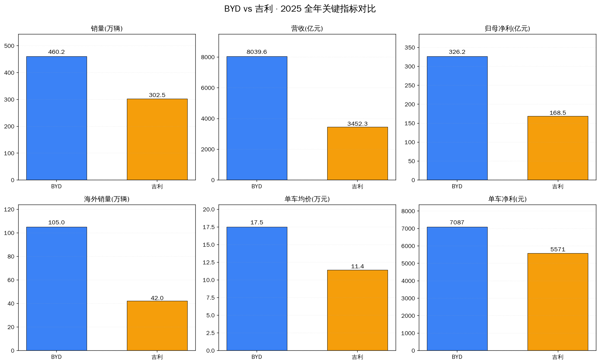
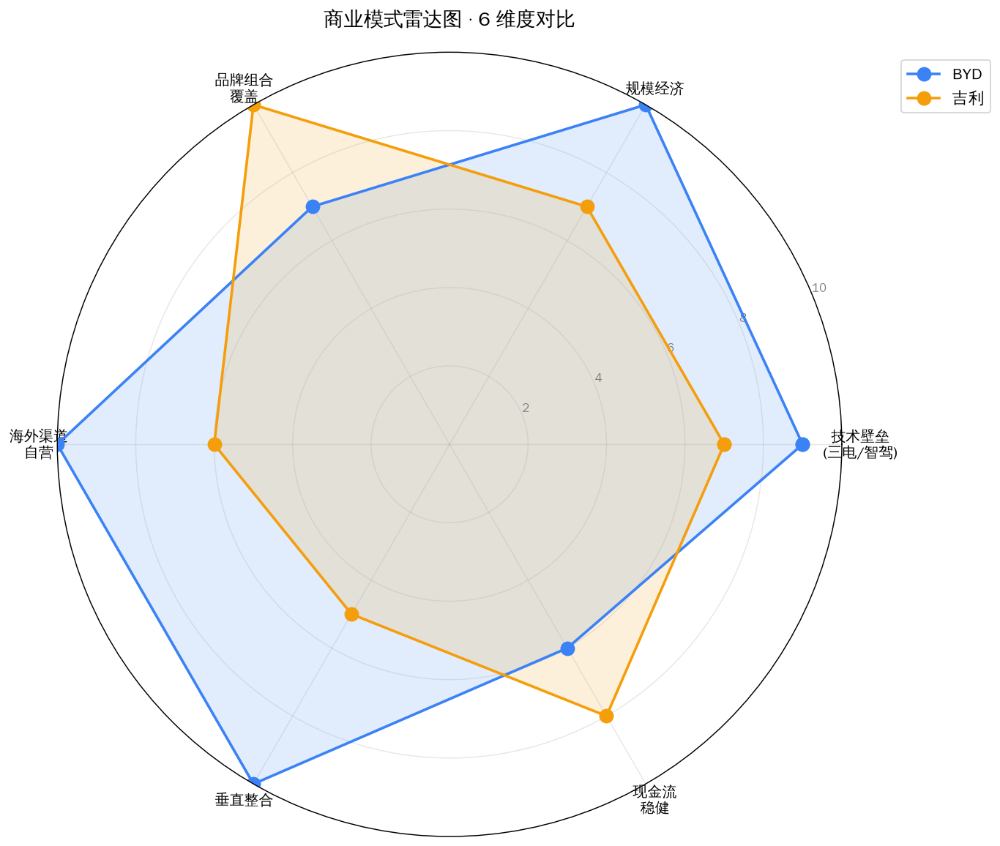
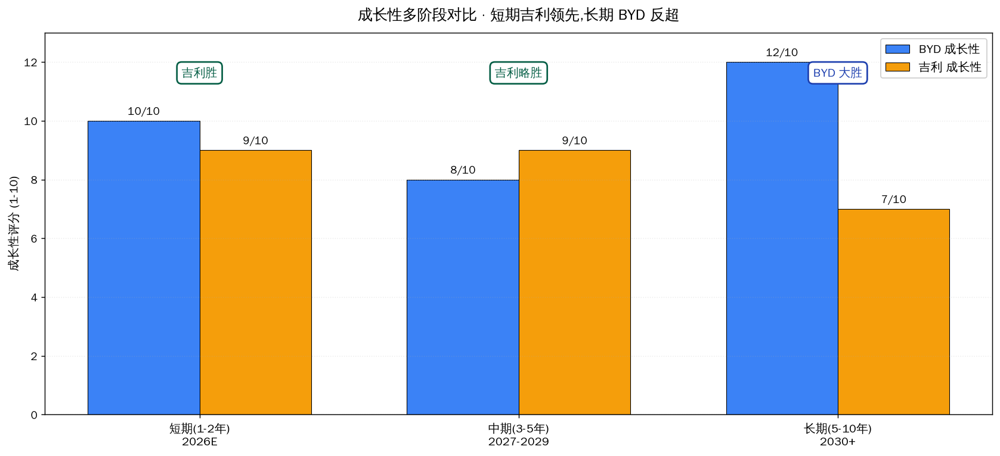

# BYD vs 吉利汽车 · 商业模式 + 成长性对比

## ⚡ 一句话判断

**两家是不同物种** —— BYD 是"垂直整合的全球巨头",吉利是"多品牌组合的全球操盘手"。
**成长性结论**:**短期(1-2 年)吉利胜**(销量 +14% vs +4%,估值修复空间 50%+),**长期(5-10 年)BYD 反超**(第二曲线已启动,全球巨头天花板更高)。

## 关键事实

| 指标 | BYD (002594.SZ) | 吉利 (0175.HK) |
|---|---|---|
| 当前价(7/23) | ¥92.65 | HK$20.90 |
| 市值 | **¥8,447 亿** | ¥2,067 亿(BYD = 吉利 × 4.1) |
| 2025 销量 | **460.2 万辆** | 302.5 万辆 |
| 2025 销量 yoy | +7.7% | **+39%** |
| 2025 营收 | ¥8,039.6 亿 | ¥3,452 亿 |
| 2025 营收 yoy | +3.5% | **+25%** |
| 2025 归母净利 | ¥326.2 亿 | ¥168.5 亿 |
| 2025 净利 yoy | **🔴 -19.0%** | **🟢 +1.3%** |
| 2025 毛利率 | **17.74%** | 16.61% |
| 2025 ROE | 15.12% | **18.20%** |
| 2025 海外销量 | **105 万(+140%)** | 42 万(+1%) |
| 2025 海外营收占比 | **38.65%** | 21.41% |
| PE 2025A | **25.90x** | 12.27x |
| PE 2026E | **21.83x** | 9.50x |

## 商业模式本质区别

### BYD:垂直整合型(像特斯拉)
- 从锂矿(扎布耶)→ 电池(刀片电池)→ 电控/电机/IGBT → 整车制造 → 自营滚装船队 → 海外工厂 → 销售 showroom
- **全产业链 80% 自给**
- 决策统一,执行快,**风险集中**

### 吉利:多品牌组合型(像大众集团)
- 吉利控股集团 → 吉利 / 领克 / 极氪 / 沃尔沃 / 路特斯 / 宝腾 / 极星
- **通过收购获取技术**(沃尔沃、路特斯)
- 每个品牌独立运营,**风险分散**

## 2025 关键指标对比

**核心发现**:
- BYD **单价经济性更强**(单车均价 ¥17.5 万 vs ¥11.4 万,单车净利 ¥7k vs ¥5.6k)
- 吉利 **增速更快、ROE 更高**(ROE 18.2% vs 15.1%)
- **反差本质**:BYD 是"成熟巨头",吉利是"放量期组合"

## 估值倍数对比

**BYD 是吉利的 2x+**,原因:
- A 股 vs 港股流动性溢价
- BYD 是"全球新能源龙头"叙事
- 基本面分化(BYD 单车经济性更强)

## 海外业务对比 — 真正的差距点

| 指标 | BYD | 吉利 |
|---|---|---|
| 2025 海外销量 | **105 万(+140%)** | 42 万(+1%) |
| 2025 海外营收 | **¥3,107 亿** | ¥739 亿 |
| 2026Q1 海外销量 | 32 万(+55%) | **20.3 万(+126%)** |
| 海外单车均价 | **¥29.6 万** | ¥17.6 万 |

**关键观察**:
- BYD 海外营收是吉利的 **4.2x**(历史积累差距)
- 吉利 2026Q1 海外 **+126%** 远超 BYD +55%(吉利在加速追赶)
- BYD 是"重资产海外"(壁垒高),吉利是"借船出海"(速度快)

## 五维度成长性深度分析

### 维度 1:天花板(行业空间)谁更高?
- **吉利更高** —— BYD 已 #1,边际增长靠抢份额;吉利还在上升通道

### 维度 2:护城河谁更深?
- **BYD 更深** —— 全产业链 + 海外运营(壁垒高,难复制)
- **吉利更宽** —— 品牌组合覆盖(壁垒低,易复制)

### 维度 3:盈利能力谁更强?
- **BYD 短期更强**(单车净利 ¥7k vs ¥5.6k)
- **吉利单位资本效率更高**(ROE 18.2% vs 15.1%)

### 维度 4:扩张可复制性谁更强?
- **BYD 壁垒高**(自建船队、海外工厂)
- **吉利速度快**(收购沃尔沃渠道 + 收购品牌)

### 维度 5:执行风险谁更大?
- **吉利更大**(多品牌协调、沃尔沃文化整合)
- **BYD 集中风险**(一个大决策失误就完蛋)

## 三段成长性拆解

| 阶段 | BYD 增长 | 吉利 增长 | 胜出 |
|---|---|---|---|
| **短期(1-2 年)** | +10% 净利增速 | **+29% 净利增速** | 🟡 **吉利** |
| **中期(3-5 年)** | 第二曲线已启动 | 智能驾驶合作 | 🔵 **BYD 略胜** |
| **长期(5-10 年)** | 全球巨头目标 | 国内组合目标 | 🔵 **BYD 大胜** |

## 投资视角建议

### 分投资期限

| 投资期限 | 推荐 | 核心理由 |
|---|---|---|
| **< 1 年** | 🟡 **吉利 >> BYD** | 销量增速 14% vs 4%,海外增速 90% vs 71% |
| **1-3 年** | 🟡 **吉利 ≥ BYD** | BYD 估值已含溢价,吉利严重低估 |
| **3-5 年** | 🔵 **BYD > 吉利** | 第二曲线已启动,毛利率有结构性提升空间 |
| **5-10 年** | 🔵 **BYD >> 吉利** | BYD 是全球巨头目标,天花板差距 5x |

### 按风险偏好

| 你的偏好 | 建议 |
|---|---|
| 想赚"估值修复"的钱 | 🟡 **吉利** —— 港股折价修复 + 多品牌放量 |
| 想赚"长期增长"的钱 | 🔵 **BYD** —— 等 8 月业绩兑现 + 海外占比破 50% |
| 平衡配置 | **BYD 5-6% + 吉利 5-6%** —— 两边下注 |

## ⚠️ 风险提示

| 风险 | BYD | 吉利 |
|---|---|---|
| 国内份额持续被蚕食 | 🔴 高 | 🟡 中(吉利银河反而在蚕食) |
| 海外政策风险(关税) | 🔴 高(海外占比高) | 🟡 中 |
| 多品牌执行风险 | — | 🔴 高(极氪/领克/宝腾) |
| 港股流动性折价 | — | 🔴 高(估值修复最大不确定性) |
| 新业务落地 | 🟢 已落地(储能+三电外供) | 🟡 依赖英伟达合作 |

## 关键事件

- **2026-04-17** · 极氪 8X 上市,**30 分钟大定破万**,Ultra+ 占比 95.6%,均价超 40 万
- **2026-04-14** · 吉利控股 Q1 新能源销量 49.1 万(+5.8%),渗透率 52.4%
- **2026-03** · 吉利 2025 年报发布,营收 ¥3,452 亿(+25%),海外占比 21.41%
- **2026-07-24** · 6 月新能源车企排名:BYD 39.7 万 / 吉利 15.9 万

## 下次复核

- **2026-08-01** · BYD 7 月销量公告 → 海外持续兑现?
- **2026-08 月底** · BYD H1 业绩 → 毛利率 + 海外占比 + 单车净利三维验证
- **2026-08 月** · 吉利 H1 业绩 → 出海 +126% 是否持续?

---
Data as of: 2026-07-24
Generated: 2026-07-24