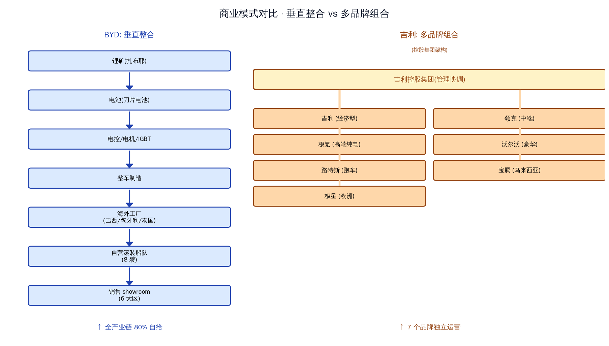
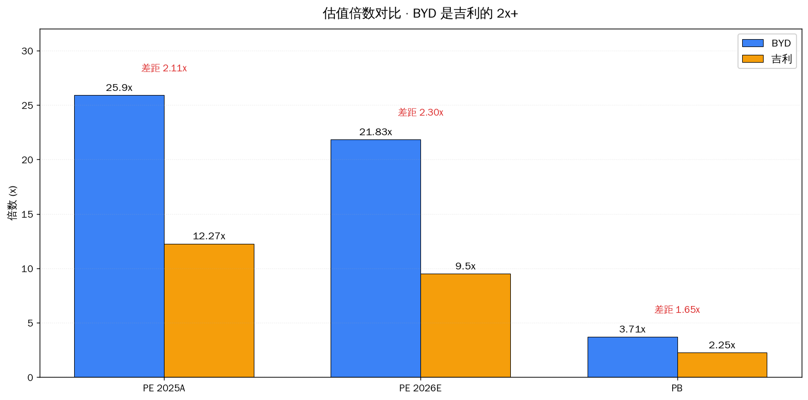
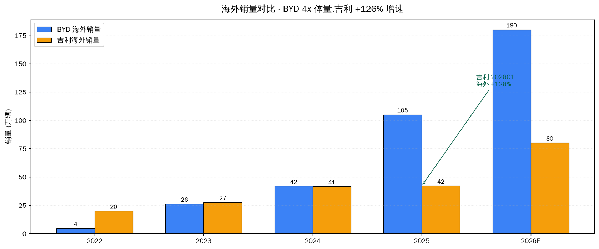

# BYD vs 吉利

先说结论。两家不是同一物种,所以估值差距 2.3 倍其实合理——BYD 的全球叙事已经被市场买过了,吉利的出海反转还没买。

---

## 数据放一起看

| | BYD | 吉利 |
|---|---|---|
| 7/23 收盘 | ¥92.65 | HK$20.90 |
| 市值 | 8447 亿 | 2067 亿 |
| 2025 销量 | 460 万辆 | 302 万辆 |
| 销量同比 | +7.7% | **+39%** |
| 2025 营收 | 8040 亿 | 3452 亿 |
| 营收同比 | +3.5% | **+25%** |
| 2025 净利 | 326 亿 | 169 亿 |
| 净利同比 | **-19%** | **+1.3%** |
| 毛利率 | 17.7% | 16.6% |
| ROE | 15.1% | **18.2%** |
| 海外销量 | 105 万(+140%) | 42 万(+1%) |
| 海外占自身 | 38.65% | 21.4% |
| PE 2026E | 21.8x | 9.5x |

几个反直觉的点:

吉利 ROE 比 BYD 高 3 个百分点。原因是 BYD 资产基数太大(8800 亿),重资产拉低了效率。吉利轻资产运营,资本周转快。

BYD 单车净利 7087 元,吉利 5571 元。BYD 每辆车赚得更多,但吉利的车便宜(均价 11.4 万 vs 17.5 万),所以是不同市场。

吉利海外 +126% 听着吓人,但绝对规模才 20 万辆。BYD 海外是 32 万辆。增速不能掩盖基数。

---

## 商业模式对比

BYD 走的是特斯拉路线。从扎布耶盐湖到刀片电池到整车,全产业链 80% 自给。自建滚装船队,在巴西、匈牙利、泰国、印尼有本地工厂。决策统一,执行快,但风险集中——任何环节出问题全产业链跟着出问题。

吉利走的是大众路线。控股集团下面挂着 7 个品牌:吉利(经济型)、领克(中端)、极氪(高端纯电)、沃尔沃(豪华)、路特斯(跑车)、宝腾(马来西亚)、极星(欧洲)。每个品牌独立运营,通过收购整合技术。

前者像航母——火力强、决策快、不灵活。后者像联合舰队——灵活、协同难。

吉利的出海主要靠"借船":借沃尔沃的欧洲渠道、借宝腾的东南亚网络、买极星拿欧洲品牌。BYD 的出海是"造船":自己建厂、自己运、自己开店。前者快但壁垒低,长城奇瑞上汽都在用同样的套路;后者慢但壁垒高,十年和千亿投入堆出来的护城河。

---

## 估值为什么差这么多

3 个原因。

**第一,A 股流动性溢价。** A 股新能源板块平均 PE 30 多倍,港股汽车板块 10-15 倍。同一家公司在两地上市,价差能到 30%。

**第二,叙事。** BYD 的故事是"全球新能源 #1",2025 年海外占比 38.65% 这个数字市场已经买进去了。吉利的故事是"国内多品牌组合",还在多品牌磨合期。PE 9.5 倍不是市场低估,是市场还没看到出海的可持续性。

**第三,基本面。** BYD 单车净利 7087,吉利 5571。BYD 毛利率 17.7%,吉利 16.6%。BYD 在赚钱能力上确实更强,虽然增速慢。

但估值是相对的。BYD 给 21.8 倍是因为增速预期已经压低到个位数(2026 净利 +10-15%);吉利给 9.5 倍是因为市场还在等它证明出海能持续。

---

## 关键的反差

| | BYD | 吉利 |
|---|---|---|
| 2026 销量目标 | 480 万(+4%) | 345 万(+14%) |
| 2026 海外目标 | 180 万(+71%) | 80 万(+90%) |
| 2026 净利预期 | +10-15% | **+29%** |

2026 吉利净利增速预期是 BYD 的两倍。**但这两个数字谁更可信,是关键问题。** BYD 的 +10% 是基于海外占比从 45% 继续提升到 50%+ 的逻辑;吉利的 +29% 是基于出海 +126% 的趋势能延续。

---

## 极氪 8X 是吉利的关键变量

2026 年 4 月 17 日,极氪 8X 上市。30 分钟大定破万,Ultra+ 占比 95.6%,均价超过 40 万。

这意味着吉利的高端化第一次跑通了。极氪 9X 已经连续 5 个月是 50 万级大型 SUV 销冠,8X 是双旗舰策略(运动+豪华)。极氪品牌目前全球累计交付 72 万辆,客单价 30 万+。

如果 8X 在 Q2/Q3 持续放量,吉利的净利增速预期就不是画饼,而是真能兑现。那时候港股估值修复不是问题。

反过来,如果 8X 上市即巅峰,后续订单跟不上,吉利的 +29% 就是空头支票。

---

## 我的判断

**短期(1-2 年):吉利更划算。**

增速差异太大。吉利销量 +14% vs BYD +4%,净利 +29% vs +10-15%,海外 +90% vs +71%。如果港股流动性稍微好一点,吉利 PE 从 9.5 倍修到 13-15 倍是合理的,对应 40-60% 的估值修复空间。

BYD 不是不好,是太贵了。它的全球叙事已经把所有能涨的都涨过了。要等下一个催化剂(8 月底 H1 业绩、海外占比破 50%),才会有新一波行情。

**长期(5-10 年):BYD 更高。**

第二曲线已经启动。储能 80-100GWh、三电外供 50GWh、闪充网络 2 万座——这些业务跟"卖车"独立,即使国内市占率下滑,BYD 也有新增长点。吉利没有等量级的第二曲线,主要依赖英伟达合作的智能化(更依赖合作伙伴)。

到 2030 年,BYD 的天花板是"全球新能源三巨头之一",净利润能做到 500 亿。吉利的天花板是"中国版大众",净利润 280 亿。差距 5x。

**中间(3-5 年):BYD 略胜。**

这阶段最难判断。两家都在"出海+高端化"双线作战,但 BYD 的护城河更深(自建船队+本地工厂),壁垒更难被复制。

---

## 配置建议

如果你已经有 BYD 持仓,继续拿着,等 8 月底业绩。

如果你要新建仓,**最值得买的是吉利**。理由:估值严重低估+出海逻辑未兑现+极氪 8X 验证期。

如果想平衡,BYD 5-6% + 吉利 5-6%,两边下注。BYD 拿确定性,吉利拿赔率。

**风险:**

| BYD | 吉利 |
|---|---|
| 国内份额持续被蚕食(目前 H1 国内 -40%) | 港股流动性一直不修复 |
| 海外政策风险(欧盟反补贴税可能再加码) | 多品牌协调出问题(沃尔沃文化整合) |
| 资本压力(OCF -56%,在烧钱建海外产能) | 出海持续性(看 Q2/Q3 海外销量) |
| 9/1 起锂电池 2% 消费税 | 极氪 8X 订单不及预期 |

---

## 几个观察点

| 日期 | 事件 | 看什么 |
|---|---|---|
| 2026-08-01 | BYD 7 月销量 | 海外是否继续兑现 |
| 2026-08 月底 | BYD H1 业绩 | 毛利率 + 海外占比 + 单车净利 |
| 2026-08 月 | 吉利 H1 业绩 | 出海 +126% 是否持续 |
| 持续 | 极氪 8X 交付节奏 | 8X 是否成为爆款 |
| 持续 | 港股南向资金 | 吉利估值修复的前提 |

---

数据来源:TuShare 2025 年报 + 国信证券吉利研报(2026-03-30) + 新华网极氪 8X 报道 + 公司公告。

---
Data as of: 2026-07-24
Generated: 2026-07-24