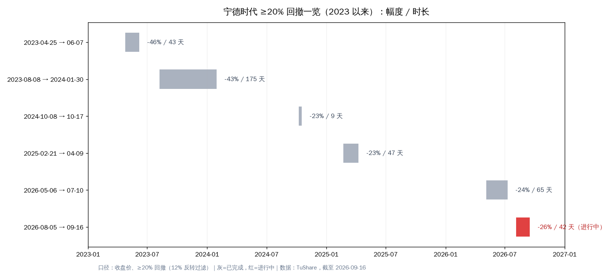

# 宁德时代：调整还要多久、到多少、要不要把比亚迪挪过来

2026-09-16 盘中（现价 305.45，盘中新低 299；持仓按 9/11 对账单口径，总资产约 30.6 万按今日盘中价）。

三个问题，三个答案：**时间**——不给日期，给"信号清单+验收窗口"，最近的验收点在 10 月；**价位**——不给点位，给三条参考带和一条修复线（278-290 / 236-246 / ~211 / 345-355）；**移仓**——不建议，理由在第四节，和纪律直接冲突。以下每个数字都能回查。

---

## 一、近期趋势与当前位置

**走势量化。** 9/15 收 316.36（-6.16%）；今日盘中最低 299，创近一年低点，自 5/6 高点 467.3 回撤 **-36%**。近 20 个交易日 -20.2%，同期上证 -3.2%、创业板 -12.4%。今天尤其说明问题：创业板 +1.7%、科创芯片 +4.1% 的背景下，它独自下跌——这不是大盘的问题，是它自己的问题。

**原因层（逐条带日期，详见 9/15 报告）。** 8/26-28 理想业绩会预告"全系自研电池"→ 9/4 小米官宣"龙甲"（中创新航+欣旺达双供）、理想 26.5 亿入股欣旺达动力 → 9/7 理想官宣全系自研落地 → 9/8 单日 -3.65% → 9/11 回购首笔 2 亿（330-332 区间，本周已被跌破）→ 9/15 电池消费税（9/1 起 2%，明年升至 4%）发酵冲上热搜，单日 -6.16%。叠加 8 月装机份额 44.46%（环比 -2.84pp，LFP 细分创年内新低）与 307 亿融资盘的高位压力。截至今日上午，未检索到新增的公告级利空——盘面是既有叙事的延续，不是新事件。

**状态判定。** 下行趋势中，无企稳信号：连续破位、放量、独立于市场走弱。价格上处于 299 低点与 333 认错线之间的空档区上沿。

**对结论的修正。** 估值端 P/S 2.81（3 年 39% 分位）、PB 3.86（3 年 6% 分位）、PE 17.2x——"偏便宜"成立，但这是**利空砸出来的便宜，不是错杀**。趋势层给出的修正很直接：不左侧接、不摊平、不移仓进来；任何"抄底"动作都必须等右侧信号（见第二节）。

---

## 二、"还要多久"：拆成三件事，用信号替日历

"调整完"其实是三件不同的事：①价格主跌段结束（技术面）；②利空叙事出清（基本面/消息面）；③估值修复启动（资金面）。三件事的时钟不一样，混在一起问就会得到玄学答案。

历史参照（2023 年以来 6 次 ≥20% 回撤，收盘价口径）：快速段 9～65 天（4 次），结构性熊市 175 天（1 次）。本轮从 5/6 高点算已 133 天、-36%；从 8/5 第二段算 42 天、-26%。**时间上已进入历史"主跌段中后段"的常见区间**——但这次的下跌是叙事重定价（去宁化+固态替代+税），历史上这类结束从不靠天数，靠证据。

最近三个硬验收窗口：

- **10 月中旬**：9 月装机份额（看环比是否止跌——这是"去宁德化"是否恶化的直接读数）
- **10 月下旬**：三季报（利润、毛利率，以及回购执行进度）
- **年底**：固态电池国标征求意见稿（此前的叙事利空来源，靴子落地可能反而利空出尽）

企稳信号清单（出现任意两个再谈"调整完"）：①月频份额环比不再下降；②连续两周不创新低且缩量横住；③回购执行明显加速；④消息面不再出现新的"车企切换"官宣。信号出现前，所有反弹都按超跌反抽处理，不改变"下行中"的定性。

---

## 三、"会到多少"：三条参考带 + 一条修复线

| 参考带 | 价位 | 依据 | 失效条件 |
|---|---|---|---|
| 平台带 | **278-290** | 2025-08 起涨平台（8/29 +10.4% 的起点区域） | 放量直接跌穿 → 看深水区 |
| 深水带 | **236-246** | P/S P20～P25 估值映射价（假设营收不变） | — |
| 尾部参考 | **~211** | 2025-04 低点（2025 年内最低） | 需要系统性利空叠加才会到 |
| 修复首目标 | **345-355** | P/S 中位（345）+ 原反弹窗口（350-355）共振 | 需先有企稳信号 |

现价 305 就夹在 299 低点与第一条带之间。我的建议是**别把这张表当"预测底部"用**——它是检查表：跌到某一带时，去核对"失效条件"里写的那件事有没有发生，而不是去猜下一带在哪。

**反方观点也说全**：摩根士丹利 9 月认为车企切换供应商的机会成本高、宁德份额反而会继续扩大；UBS、JPM 维持买入。他们可能是对的。但我们的规则是"当期数据没支持就先不采信"——8 月份额 -2.84pp、LFP 创年内新低、出口 -21.7%，这些是事实；份额企稳之前，看多观点先放"待验证"栏。

---

## 四、"要不要把比亚迪挪一些到宁德？"

**不建议。** 三个理由，都是数字。

**1）相对位置站反了。** P/S 分位：比亚迪 10.5% vs 宁德 39.5%；8 月电池份额：比亚迪 +2.14pp vs 宁德 -2.84pp；1-8 月电池出口：比亚迪 +125.6% vs 宁德 -21.7%。从"边际在变好的便宜一侧"换到"边际在变差的偏贵一侧"，方向是反的。（两把尺子有分歧：PE 17x vs 26x，利润率结构不同——但组合日常用的 P/S 尺子明确指向比亚迪更便宜。）

**2）和纪律正面冲突。** 宁德现在的状态是"执行态"（两次收盘破 333，口径还没定）。把仓位移进一只"自己的体系说该减不宜加"的股票，等于把两个相反的信号强行叠在一起。

**3）解决不了真正的问题。** 移仓不改变超过 68% 的新能源链条集中度（比亚迪 57.7% + 宁德 10.0%）。而且换个最小的：卖 400 股比亚迪（≈3.36 万）买 100 股宁德（3.05 万），宁德权重立刻从 10% 升到约 20%——8% 红线的 2.5 倍。真要降集中度，方向是跨链条配置，不是链条内部搬家。

正确的顺序：**① 先给宁德口径（执行 / 明确改承担）；② 给比亚迪 86 线口径；③ 再谈任何结构调整。**

---

## 五、验证锚点（事后回查用）

| 类型 | 锚点 | 看什么 |
|---|---|---|
| 价格 | 299 / 278-290 / 236-246 / 333 / 345-355 | 突破哪一带、以"收盘+两日"口径确认 |
| 时间 | 10 月中旬 / 10 月下旬 / 年底 | 份额数据 / 三季报 / 固态意见稿 |
| 事件 | 回购公告节奏；新增"车企切换"官宣；份额环比回升 | 频率与方向 |
| 数据 | 月频（联盟份额）、季频（财报） | 是否出现企稳信号清单里的任意两项 |

> 一句话收尾：把 333 和 68% 两个数字先处理掉，这份表才有意义——在这之前，它只是一张地图，不是路线。

---
Data as of: 2026-09-16（盘中）
Generated: 2026-09-16
