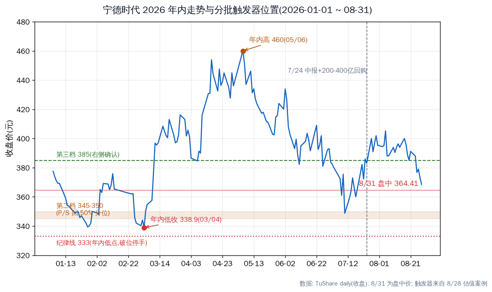
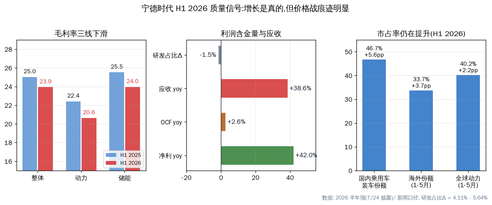
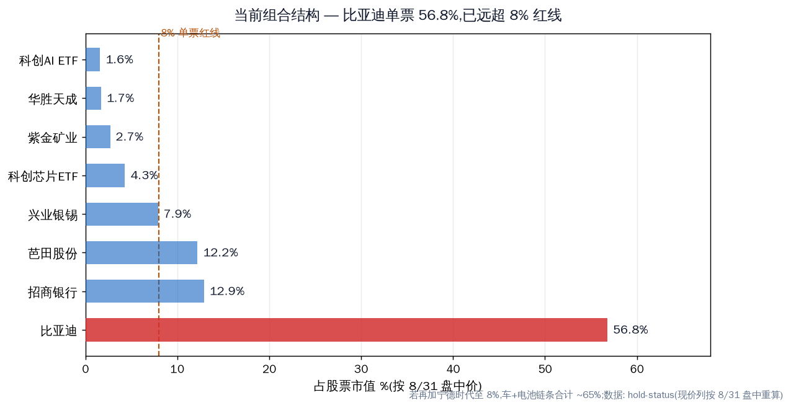

# 宁德时代买入风险清单(2026-08-31)

结论先行。近期买宁德的风险是真实存在的,分四层:估值不在便宜区、半年报质量信号走弱、组合集中度(比亚迪已占 56.8%,再加宁德就是约 65% 的车+电池链条)、以及 8 月阴跌未止的时机风险。8/28 的判断不变——现价是建仓区间起点,不是黄金坑;买不买服从纪律,不是价格落下来就想接。

---

## 先说价格:现价 364.41 在哪

- PE_TTM ~19.8(3 年分位 ~33%,中位以下);P/S ~3.23(3 年分位 ~61%,中位以上);PB 4.49;市值 ~1.69 万亿
- 年内位置:收盘低 338.90(3/4)~高 460(5/6),现价距年内低点 +7.5%
- 8 月阴跌未止:8/21 391.15 → 8/28 368.50(-5.8%);今日盘中一度 357.30(-3.0%),午后回到 364.41(-1.1%)
- 8/28 案例触发器:第一批(1/3)现价附近 / 第二档 345-350(P/S 回 50% 分位)/ 第三档 385(右侧确认)/ 纪律线 333(年内低点)
- 现价 364.41 在第一档与第二档之间——按纪律,现在买 = 第一批仓位;要更舒服的价,等 345-350

---

## 基本面风险:增长是真的,价格战痕迹明显

- **毛利率三线下滑**:整体 23.93%(-1.1pp)、动力 20.63%(-1.78pp)、储能 23.96%(-1.56pp);成本增速(57.1%)> 收入增速(54.8%)= 以价换量
- **碳酸锂成本冲击**:锂价 7.5 万→20 万/吨(年内 +160%),已传导进 H1 报表;锂价维持高位则下半年毛利率继续承压
- **利润含金量边际变弱**:OCF +2.6% vs 净利 +42%;应收 +38.6%,应收/利润 122%——给下游开了更长账期,价格战里保份额的常见手段
- **研发强度下降**:研发占比 4.11%(去年 5.64%),发生在钠电/固态竞赛期
- 正面(风险的另一面):市占率全线提升(国内 46.7% +5.6pp、海外 33.7% +3.7pp、全球 40.2% +2.2pp);产能利用率 94.9%;中报分红 64.9 亿 + 回购 200-400 亿(上限 573 元);OCF/NI 1.39 仍健康

---

## 行业/技术风险

- **去宁德化**:理想/问界/小米/小鹏部分旗舰与走量车型换二线电池(车企成本压力),国内份额长期在 43-48% 区间震荡——H1 46.7% 是回升,但天花板叙事仍在
- **固态电池**:曾毓群口径"技术成熟度 4/9 级,2027 小批量,批量 3-5 年";三星 2027H2 量产计划——2027 年前无实质冲击,短期波动主要来自情绪
- **产能扩张**:在建 764GWh → 太瓦时级;需求不及预期则折旧压力上升

---

## 组合风险(这次的新重点,比价格更值得处理)

- 比亚迪已占组合 56.8%(按今日盘中价),远超 8% 单票红线(8/7 组合体检时已点名 41.5%)
- 若再买宁德时代至 8%,车+电池链条合计约 65%
- 今天就是活例子:早盘 BYD -4.2%、宁德 -3.0%、亿纬 -3.0% 同步下跌——相关性很高的链条,一荣俱荣一损俱损
- 今天组合整体承压:兴业银锡 -4.8%、紫金 -2.7%;在集中度问题未解决前,新增任何仓位都会放大单一链条暴露

---

## 结论与纪律

风险清单:估值中位偏上(不是便宜货)、毛利率/应收/OCF 质量信号走弱、去宁德化与固态叙事、组合 65% 新能源链条、8 月动量偏弱。但基本面没证伪:份额在涨、产能利用率 94.9%、回购 200-400 亿托底、9 月钠电池首批交付是近期催化。

若决定买,按 8/28 触发器分批:现价(364)第一档可以开始,更舒服的是 345-350;站回 385 右侧加;跌破 333 停手重估。若犹豫,先想清楚的不是价格——而是比亚迪 56.8% 的集中度要不要处理,再决定给不给宁德开新仓。

---

## 验证锚点

| 类型 | 锚点 | 看什么 |
|---|---|---|
| 价格 | 364.41 / 345-350 / 385 / 333 | 分批触发器与纪律线 |
| 数据 | Q3 财报(10 月底) | 毛利率能否企稳;应收周转;OCF 增速 |
| 事件 | 9 月钠电池首批交付;回购落地节奏 | 技术叙事与股东回报兑现 |
| 行业 | 碳酸锂价格、月度装车份额 | 成本压力与去宁德化进展 |

---

## 风险(报告自身的)

- 8/31 数据为盘中价(新浪实时),收盘后可能有变化
- PE/P/S 分位沿用 8/28 案例口径,今日价格仅变动 -1.4%,分位变化 <1pp
- 组合占比按 hold-status 股数 + 8/31 盘中价重算,未计现金

---
Data as of: 2026-08-31(盘中 ~14:45,新浪实时 / TuShare)
Generated: 2026-08-31
