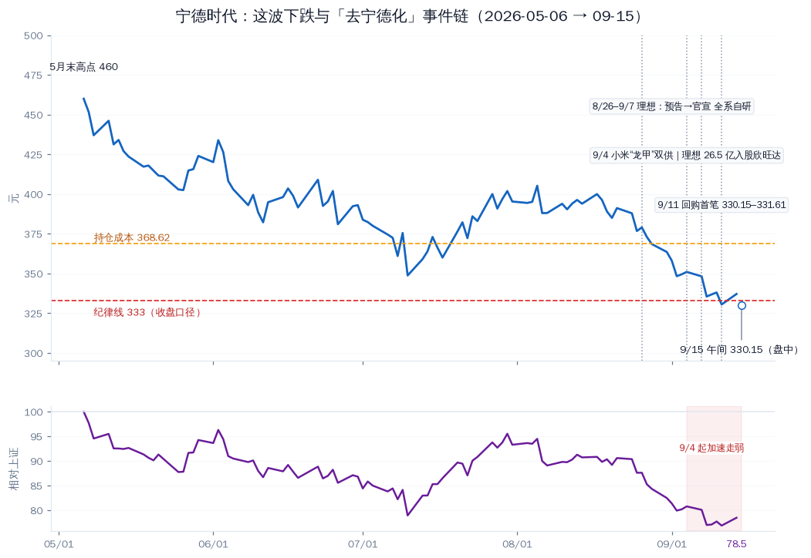

# 宁德时代：这波下跌的"原因层"补充（2026-09-15）

先说结论。这轮下跌是三层叠加：**结构性主线是"去宁德化"事件链**（理想全系自研、小米双供、理想入股欣旺达），直接重估的是"份额天花板 + 议价权"叙事；市场性因素（大盘回调、FOMC 前利率高位）放大波动；叠加上 5 月以来的高位估值消化。性质上，目前属于**"估值与逻辑重估"，不属于"基本面证伪"**——经营数据仍然强（H1 营收 +54.8%、净利 +42%）。对持仓的直接含义：**摊平/定投的前提目前不成立**，按既有纪律线处理，盯验证锚点。

> 补课说明：8/28（估值）、8/31（风险）、9/10（价位与执行）三篇覆盖的是估值分位、风险清单与执行纪律；本文补的是"为什么在跌、利空是什么"的原因层。

## 一、把"跌"量化

| 区间 | 宁德时代 | 上证指数 | 相对 |
|---|---|---|---|
| 5/6 → 9/14（收盘） | 460.0 → 337.11（**-26.7%**） | 4160.17 → 3885.33（-6.6%） | 跑输约 20pp |
| 8/25 → 9/14 | 376.73 → 337.11（-10.5%） | 3889.44 → 3885.33（-0.1%） | **跑输约 10.4pp** |
| 9/8 单日 | -3.65%（事件窗口最大单日跌幅） | — | — |
| 9/11 | 收 330.51（-2.23%，区间最低收盘） | — | — |
| 9/15 午间 | 约 330（盘中） | 基本平盘 | — |

（行情：TuShare 日线；9/15 为盘中数据。）

## 二、事件链（时间线）

| 日期 | 事件 |
|---|---|
| 8/26–28 | 理想 Q2 业绩会：李想预告"下半年起全系陆续搭载自研电池" |
| 9/4 | 三连击：①小米"龙甲电池"发布会，官宣中创新航、欣旺达为战略合作伙伴（供应商由 2 家扩至 4 家）；②理想 26.5 亿元增资欣旺达动力，完成后持股 11.17%、成为第二大股东；③工信部申报显示 2026 款理想 i6 供应商由"宁德+欣旺达"调整为"欣旺达+中创新航" |
| 9/7 | 理想正式官宣全系自研：L8/L6/i8 已搭载；新一代 MEGA 自 9/7 15:00 起锁单切换（11 月交付）；i9 首批用宁德、产能爬坡后全切；Q4 i6 全自研 |
| 9/8 | 股价 -3.65%（当日媒体标题："宁德时代霸主地位遭遇重大挑战"） |
| 9/11 | 回购首笔落地：60.43 万股、约 2.0 亿元、成交区间 330.15–331.61 |
| 背景 | 鸿蒙智行（引入国轩/中创新航）、小鹏（MONA 换芯）、零跑、广汽等同步推进多供应商；二线电池报价低约 10–15% |

来源：公司公告/官网、新浪财经、证券时报、界面新闻、每日经济新闻、凤凰网（2026-08 ~ 09）。

## 三、四类分解（结构 vs 噪音）

| 因子 | 类型 | 性质与可逆性 | 当前判断 |
|---|---|---|---|
| 去宁德化（自研 + 双供） | 结构性 | 车企降本 + 供应链安全 + 技术平权；战略级动作，短期不可逆，但"切换速度"未定局 | 进行中（斜率未验证） |
| 行业价格战与成本传导 | 行业性 | 车企压价、二线以价换量；对宁德毛利率影响目前有限（H1 动力电池毛利率 20.63%，-1.78pp） | 持续，可控区 |
| 大盘与利率环境 | 市场性 | FOMC 前加息定价 + A 股回调；短期 | 放大器 |
| 高位估值消化 | 自身 | 5 月高点以来估值回归；P/S 3 年分位 42.4%（中位区） | 部分完成 |

## 四、反方证据（不能只讲空逻辑）

- 全球份额仍在提升：1–5 月全球动力电池使用量份额 40.2%（+2.2pp）、海外份额 33.7%（+3.7pp）；国内 1–7 月约 45%–48%（两口径），未见断崖
- 第二曲线：储能收入 H1 +87.5%、海外收入占比 31.5%
- 切换到目前有质量成本：欣旺达曾被吉利系索赔 23.14 亿元（后和解赔付）；中创新航有网约车鼓包案例——"二供替代"是双向试验
- 资本回报信号：200–400 亿元注销式回购（A 股最大单次）+ 上限 573 元 + 中期分红 64.9 亿元；首笔已落于 330–331.6
- 行业博弈细节：车企"开二供"同时保留高端采购与首发权（麒麟/凝聚态等），最终份额变化要看月度装机数据，不看单条新闻

## 五、对持仓的含义

- 持仓：100 股 @368.62；9/15 午间约 330 → 浮亏约 -10.4%；纪律线 333（收盘口径）：9/11 收起破、9/14 收回，9/15 盘中再度贴线，待收盘确认
- **摊平前置检查（四要素）**：①基本面（"利空斜率"）未验证——不满足；②无既定分批计划——不满足；③无更新后的认错线——不满足；④仓位余量受限（组合集中度已高）。**结论：现在不摊平**
- "增配"的两条合法触发（二选一）：①9 月装机份额数据企稳（10 月中旬公布）②右侧确认（收复并站稳 350 一线）
- 反之，若份额连续 2 个月实质下滑 → 那不是加仓理由，而是**重估持仓**的理由

## 六、验证锚点

| 时间 | 事件 | 看什么 |
|---|---|---|
| 10 月中旬 | 9 月动力电池装机/装车数据 | 份额是否稳住（"去宁化"的量化裁判） |
| Q4 | 理想 i9/MEGA 切换、i6 上市 | 自研电池爬坡速度 vs 官方口径 |
| 10 月下旬 | Q3 财报 | 电池毛利率、海外/储能结构、合同负债 |
| 持续 | 回购执行公告 | 330 附近承接力度 |
| 持续 | 小米等车企供货结构 | 二供份额与质量事件 |

---
Data as of: 2026-09-15
Generated: 2026-09-15
