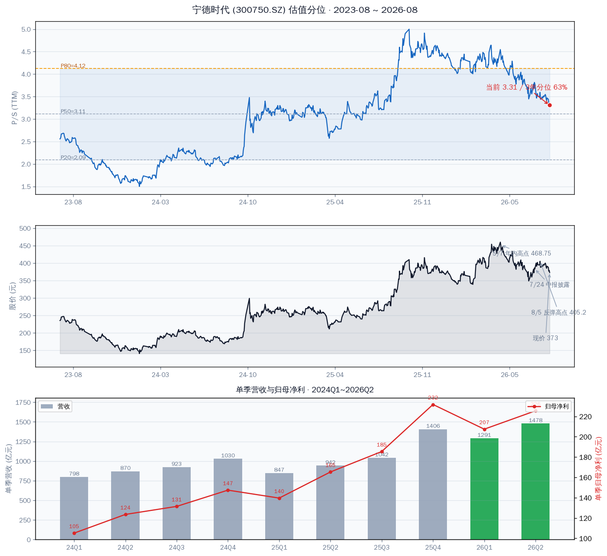
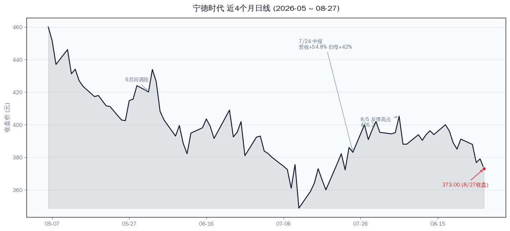
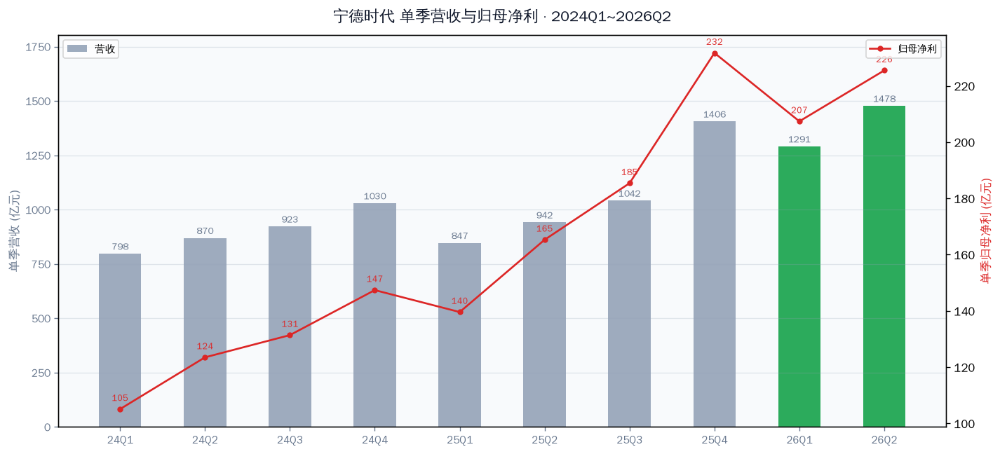

# 宁德时代（300750.SZ）估值分析 — 这个价格好不好

**全球动力电池龙头 / 新能源动力与储能 / 创业板 / 沪深300 + 创业板指成分**

分析日期：2026-08-28 盘中（Data as of: 2026-08-27 收盘，盘中价另标）

一句话：**这个价格可以买，但不是最低点，按纪律分批进。** 现价 369.49 元对应 PE_TTM 20.3 倍，处于三年 34.7% 分位——盈利已经把估值消化到位，这是"业绩爆发 + 估值不贵"的组合（2026H1 归母 +42%、营收 +55%，机构预期 2026E 净利 958 亿、Forward PE 18 倍）。但 P/S 3.31 仍在 63.3% 分位（营收端不便宜），且 8 月从 405 一路阴跌到 369，趋势未止。结论：现价是合理的建仓区间起点，分三批买，别一把梭。

---

## 行情快照

| 项目 | 数值 | 说明 |
|---|---|---|
| 盘中价（8/28 10:19） | **369.49 元** | -0.9%，成交 48.9 亿 |
| 收盘价（8/27） | 373.00 元 | 8 月从 8/5 高点 405.2 回落 -8.8% |
| 总市值 | 17,257 亿 | A 股口径 |
| PE(TTM) | **20.3x** | 3 年分位 **34.7%**（P50=22.1） |
| P/S(TTM) | **3.31** | 3 年分位 **63.3%**（P20=2.09 / P50=3.11 / P80=4.12） |
| PB | 4.55 | 3 年高位区间 |
| 2026 年内区间 | 333.01（1/28）~ 468.75（5/7） | 现价在年内区间 27% 位置 |

P/S 从 2026 年初 4.1 附近回落到 3.31，处于 P50 与 P80 之间。股价从 5/7 高点 468.75 回落 21%，年内低点 333 在 1 月底。

5/7 见顶 468.75 → 6-7 月回调（7 月初最低 ~350）→ 7/24 中报（营收 +54.8%、归母 +42%）后反弹至 8/5 的 405 → 8 月再次阴跌至 369。

---

## 业绩：爆发没有断档

2026H1（7/24 披露）：

| 指标 | 2026H1 | 同比 | 说明 |
|---|---|---|---|
| 营业收入 | 2769.17 亿 | +54.8% | Q1 1291.3 亿 / Q2 1477.9 亿（+56.9%） |
| 归母净利 | 432.84 亿 | +42.0% | Q2 单季 225.5 亿（+36.4%） |
| 扣非归母 | 390.13 亿 | +43.4% | 与归母基本同步，无非经常项注水 |
| EPS | 9.51 元 | +37.4% | |
| 经营现金流 | 336.8 亿（Q1） | — | 2025 全年 OCF 1332 亿，OCF/NI ≈ 1.85，利润质量优 |

单季营收从 24Q1 的 798 亿一路到 26Q2 的 1478 亿，归母净利从 105 亿到 226 亿，趋势持续向上，没有出现类似金风 Q4 计提季那种利润塌陷（Q4 是收入确认高峰、费用计提后净利仍高于 Q2 是宁德的特点）。

两点读法：

**第一，Q2 增速放缓但未断档。** Q2 归母 +36.4%（Q1 为 +48.6%），营收 +56.9% 还在加速。营收增速（+55%）持续高于净利增速（+42%），说明毛利率仍受价格竞争压制——这是锂电池行业价格战的结构性背景，不是新问题。2025 年全球动力电池市占率 39.2%、储能 30.4%，份额优势在扩大。

**第二，利润质量优秀。** OCF/NI 1.85（2025 全年），Q1 OCF 336.8 亿 vs 归母 207 亿，现金流大幅跑赢账面利润。扣非 +43.4% 与归母 +42% 一致，没有"做出来"的利润迹象。

---

## 估值：三把尺子，结论是"不贵"

| 尺子 | 读数 | 判断 |
|---|---|---|
| PE_TTM | 20.3x / 3 年分位 **34.7%** | 便宜档——盈利增长把估值消化到位 |
| P/S 3 年分位 | 3.31x / **63.3%** | 中性偏高——营收端不算便宜 |
| Forward PE | 2026E 净利 958 亿（39 家一致预期）→ **18.0x**；2027E 1194 亿 → 14.5x | 业绩兑现则不贵 |
| 同业 PE（8/27） | 亿纬锂能 20.7x / 国轩高科 14.8x / 宁德 20.3x | 龙头估值与二线持平，无溢价 |
| PEG | 20.3 / 42（H1 增速）≈ 0.48 | 显著低于 1 |

**判断**：现价 369 附近，PE 分位 34.7% 意味着在过去三年里，大约三分之二的时间宁德比现在更贵——这不是"贵"的位置。Forward PE 18 倍对 32.7% 的 2026E 净利增速预期，PEG 约 0.55，属于成长龙头的合理偏低区。P/S 63.3% 分位提示：如果营收增速回落（价格战导致单 GW 收入下滑），P/S 会自然下修，所以 P/S 不是当前的主要锚，PE 才是。

**为什么 8 月还在阴跌？** 5/7 高点 468.75 以来是估值消化过程（年初 P/S 4.1 → 现在 3.31），8 月这波是 7 月底反弹（405）后的获利回吐 + 大盘偏弱。基本面没有新的利空（中报 7/24 已出且不差），下跌是估值和情绪层面的事，不是业绩证伪。

---

## 风险

| 风险 | 具体触发条件 | 性质 |
|---|---|---|
| 毛利率继续承压 | 营收增速持续快于净利增速；锂价/加工费竞争加剧 | 行业性，中期 |
| 电池价格战 | 动力电池单价再下台阶，P/S 下修压力 | 行业性 |
| 海外政策 | 美国 IRA 细则、欧盟电池法案对中国电池的限制落地 | 外生，未决 |
| Q2 增速放缓延续 | Q3 归母增速跌破 30%（中报 Q2 已放缓到 36%） | 业绩验证 |
| 估值回撤 | 若回到 P/S 分位 50%（3.11x）对应约 347 元，-6%；到 P/E 分位 20%（约 15x）对应约 280 元，-24% | 估值 |

---

## 📌 验证锚点（Verifiable Anchors）

| 类型 | 锚点 | 看什么 |
|---|---|---|
| 时间锚 | 2026 年三季报（10 月下旬） | Q3 归母增速是否守住 30%+；毛利率环比 |
| 数据锚 | 月度装机/电池出货 | 动力 + 储能出货量同比（2025 年 541GWh，+41.9%） |
| 事件锚 | 海外政策 | 美国 IRA / 欧盟电池法案细则 |
| 事件锚 | 储能业务 | 储能毛利率（2025 年 26.7%）与订单增速 |
| 价格锚 | **333-350 元** | 年内低点 333；P/S 分位 50%（3.11x）对应约 347 |
| 价格锚 | **385-405 元** | 8 月反弹高点 405；站回 385 是短线转强信号 |

---

## 参考思路：这个价格好不好

**结论：价格不贵，是建仓区间，但按纪律分批。**

- **第一批（1/3 仓位）**：现价 369 附近可以开始。PE 20x 以下是历史便宜档，业绩没有证伪，不需要等到"完美价格"。
- **第二批（1/3 仓位）**：回调到 **345-350**（P/S 分位回到 50% 附近、接近年内低点区）加仓。
- **第三批（1/3 仓位）**：**右侧确认**——站回 385（8 月阴跌结构破坏）或三季报验证增速守 30%+ 后再补。
- **纪律线**：跌破年内低点 333 → 停止加仓，重新评估（基本面未变坏前不清仓，但不再补）。
- **仓位上限**：单票不超过组合 8% 红线（按持仓表推算组合规模时执行）。

**不适用的情况**：如果想一把买满、或者等"绝对最低点"，这个价格不是；但那是赌运气，不是纪律。

---

Data as of: 2026-08-27 收盘（盘中价标注除外）
Generated: 2026-08-28

数据源：TuShare（行情/估值/财报）、新浪财经（实时行情）、公司 2026 半年度报告、同花顺一致预期（39 家）。机构盈利预测为一致预期中值，非本公司预测。Q2 单季数据为 H1 累计 - Q1 披露值推算。
