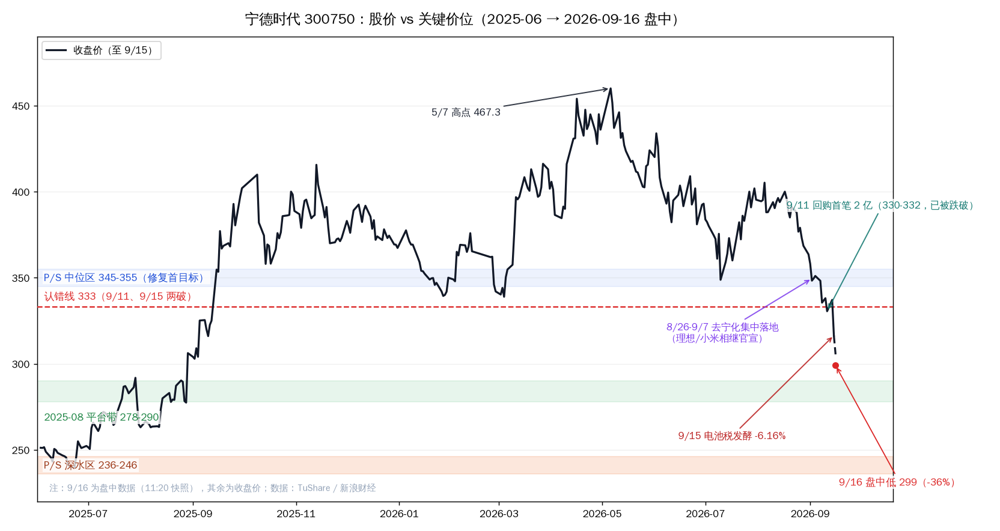
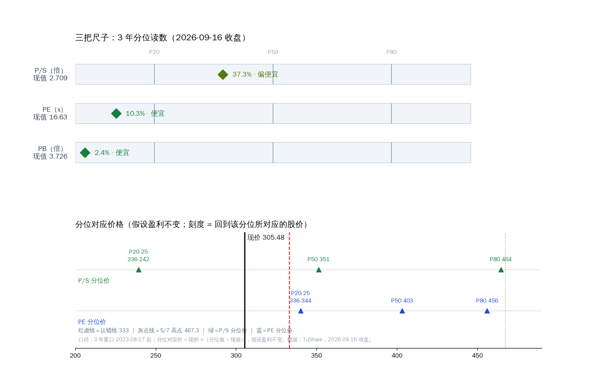

# 宁德时代估值分析：三把尺子都在便宜侧，但便宜的原因还没走

2026-09-16 收盘（305.48，-3.44%）。持仓口径：100 股，成本 368.62，浮亏 -17.1%，占组合约 10%（持仓表价格日期 9/11 未回写，本报告按 9/16 收盘重算）。

**先说结论：PE 10.3% 分位、PB 2.4% 分位、P/S 37.3% 分位——三把尺子全部落在便宜侧，两把在 10% 分位以下；但这轮"便宜"是利空砸出来的折价，不是错杀。** 估值分析在这里的作用是确认"跌的不是基本面"，以及给修复/深水两条参考带——它不构成买入信号，也不改变既定的纪律问题。

---

## 一、近期趋势（先说位置）

**走势量化。** 今日收 305.48（-3.44%），盘中低点 299；同日上证 +0.7%、创业板 +2.0%——继续独自走弱。近 20 个交易日 **-21.5%**（同期上证 -0.1%）；近 60 日 -22.7%；距 5/7 高点 467.3 回撤 **-34.6%**；今天是连续第二个交易日收在 333 之下。

**原因层。** 与 9/15 报告一致，无新增：去宁德化事件链（8/26–9/7）+ 电池消费税发酵（9/1 起 2%）+ 固态电池叙事 + 筹码结构（融资余额约 238 亿仍处高位；4 月 50 亿美元配售的供给仍在消化）。补充一条 7 月业绩会披露的行业数据：**储能竞争也在加剧**——阿布扎比 19GWh 大单被阳光电源/比亚迪分食（宁德出局）；其全球大规模储能电芯份额从 2023 年 32% 降至 2025 年 20%（Wood Mackenzie 口径）。份额压力不止在车端。

**状态判定。** 下行趋势中、破位延续（连续两日收盘 < 333）、无企稳信号。估值分位再低，也是"在下行趋势里变便宜"。

**对结论的修正。** 所有便宜读数 → 不构成抄底依据；在企稳信号（见第五节）出现前，"便宜"只描述价格，不描述催化。

---

## 二、三把尺子（3 年分位，窗口 2023-08-17 起）

| 尺子 | 现值 | 3 年分位 | 档位 | P20 | P50 | P80 | 分位对应价（P20/P25/P50） |
|---|---|---|---|---|---|---|---|
| **PE(TTM)（主锚）** | 16.6x | **10.3%** | 便宜 | 18.3x | 21.9x | 24.8x | 336 / 344 / 403 |
| PB | 3.73 | **2.4%** | 便宜 | 4.14 | 4.76 | 5.37 | 340 / 346 / 390 |
| P/S(TTM) | 2.71 | **37.3%** | 偏便宜 | 2.09 | 3.11 | 4.12 | 236 / 242 / 351 |

口径：锂电沿用 **PE 为主锚**（P/S 受出货放量与价格战影响，读数偏钝）；分位对应价 = 现价 ×（分位值 ÷ 现值），假设盈利端（分母）不变。市值约 1.41 万亿。

读法：

- **PE 16.6x 落在近 3 年 10% 分位**——比 90% 的时间便宜，且已低于它自己的 P20（18.3x）。市场给的是"利润可持续性存疑"的折价。
- **PB 2.4% 分位**，叠加 ROE 仍在 20% 上下（2025 年 20.7%）。低 PB + 高 ROE 的组合，历史上要么是深度机会，要么是市场在定价"ROE 将下行"。结合去宁化，市场在押后者。
- **P/S 37.3%** 是三把里最钝的一把——注意它 8/28 时还有 63.3%：不是跌出来的便宜，是"跌着跌着变便宜了"。
- 三把尺子的**中位价共振在 344–351**（PE P25 344 / PS P50 351 / PB P25 346）——这是修复的第一观察带（与上一份报告的 345–355 一致）。
- 下方深水：P/S P20–P25 → **236–242**。PE/PB 的分位对应价已在现价上方（两把尺子已低于自身 P20）——但低分位不构成"跌不动了"的保证。

---

## 三、行业专属指标：利润质量与份额

- **增速**：H1 营收 +54.8%、净利 +42.0%；Q2 毛利率 23.15%（环比回落）。"利润增速略慢于营收"是价格战背景，不是新利空。
- **OCF/NI**：H1 经营现金流 602.2 亿 / 净利 432.8 亿 = **1.39**（2025 全年 1.85）——利润是真的。
- **份额**：半年度维度仍在提升（1-6 月国内乘用车装车 46.7%、+5.6pp；海外 33.7%、+3.7pp；全球 40.2%）；单月维度在丢（8 月 44.46%、-2.84pp，LFP 细分创年内新低）。管理层口径："很多人说单月份额下滑，但半年度份额是增长的。"两句话都是真的——分歧在趋势斜率。
- **税**：消费税"自产自用豁免"条款结构性利好垂直整合（比亚迪自给率 >80% 完全规避），对宁德这类外供龙头是成本与议价上的逆风（约 400–800 元/车）。
- **同业横向**（9/16，含统计行）：亿纬 18.1x / 国轩 13.9x / 欣旺达 45.5x / 鹏辉 23.4x；**宁德 16.6x ≈ 同业 25 分位（中位 18.1x）——龙头无溢价**。PB 横向：宁德 3.73 高于同业（高 ROE 的代价，横向对比注意口径）。统计行：PE min 13.9 / 25th 16.6 / med 18.1 / 75th 23.4 / max 45.5。
- **Forward**：按 H1×2 年化 ≈ 16.3x；按机构一致预期（39 家，2026E 净利约 958 亿）≈ **14.7x**、2027E ≈ 11.8x，PEG ≈ 0.45。注意：这些分母正是市场在质疑的部分（去宁化打的就是 2027–28 的假设）——forward 便宜 ≠ 安全边际。
- **回购**：200–400 亿进行中（9/11 首笔 2 亿，买价区 330–332）。管理层在业绩会明确："股价低估是回购的核心逻辑。"

---

## 四、结论

三把尺子把"贵不贵"说清楚了：**便宜，而且不是一点点（两把尺子在 10% 分位以下）**。但它同时被三件事按住：①下行趋势（破位延续、无企稳信号）；②利空的性质——"去宁化"是结构性叙事的重估，不是一份好财报能证伪的事（好财报恰恰是这个叙事的成因之一）；③筹码（杠杆盘未去化、配售供给消化期）。

对持仓者的用法，两句话：

1. **不摊平，也不必用"估值便宜"去和"执行态"打架**——估值说"它值多少"（相对），纪律说"你判断错了没有"（绝对），两件事不在一个维度。
2. 修复的验收看**信号**不看分位：三把尺子共振带 **344–351** 是第一个估值修复观察位；深水带 **236–242**；真正让折价收窄的，是 10 月的份额数据。

8/28 那套买入触发器（345-350 / 385 / 333）已被价格逐一击穿——标注为"已失效、待重建"；重建条件 = 份额企稳 + 右侧站稳。

---

## 五、观察点（可回查）

| 类型 | 锚点 | 看什么 |
|---|---|---|
| 价格 | 299 / 278-290 / 236-242 / 333 / 344-351 | 收盘 + 两日口径确认 |
| 时间 | 10 月中旬（月度份额） / 10 月下旬（三季报） / 年底（固态意见稿） | 份额环比、毛利率、回购进度 |
| 事件 | 回购公告节奏；新增"车企切换"官宣；机构一致预期调整方向 | 频率与方向 |
| 数据 | OCF/NI 保持 >1；单月份额止跌；毛利率企稳 | 任一恶化 = "便宜"的前提被蚕食 |

---
Data as of: 2026-09-16
Generated: 2026-09-16
