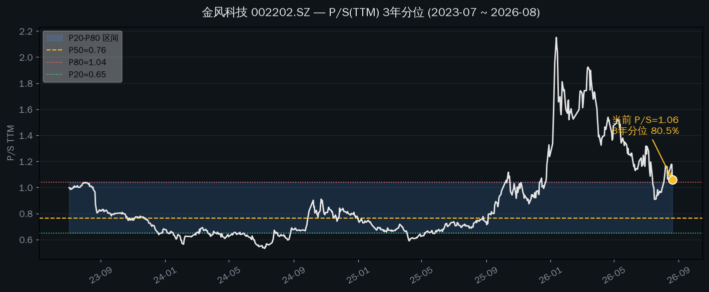
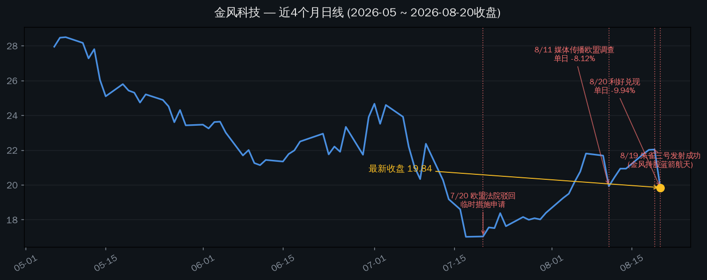
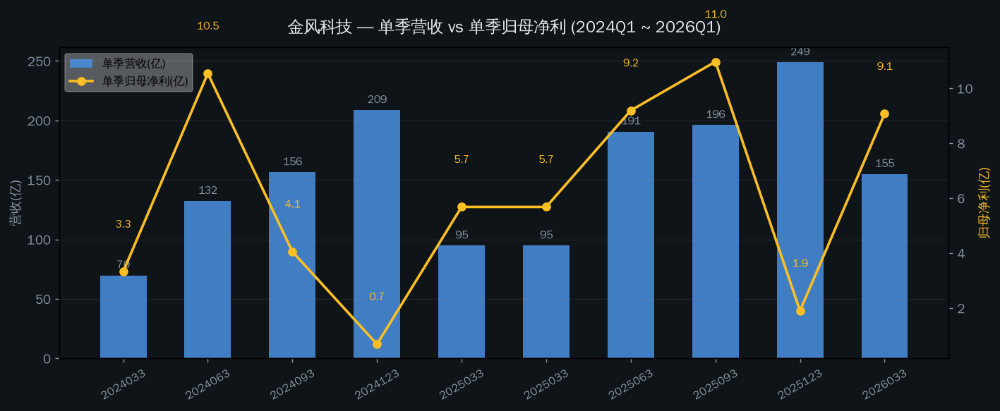
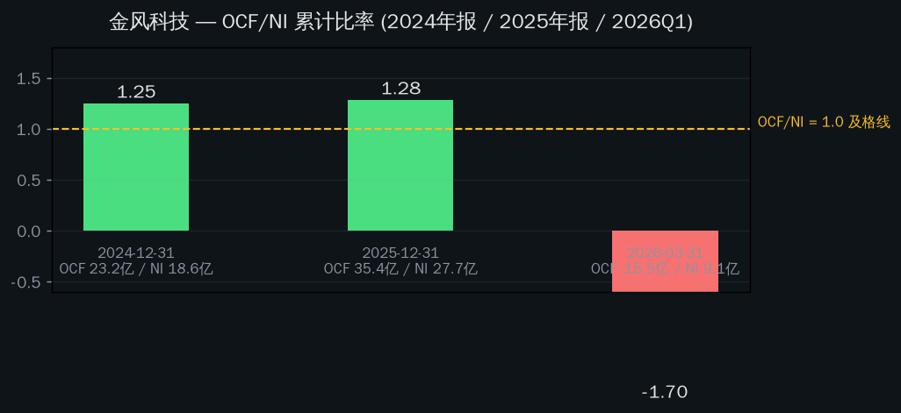

# 金风科技（002202.SZ）分析

**风电整机全球龙头 / 新能源发电设备 / 深主板 / A+H 两地上市（02208.HK）**

分析日期：2026-08-21 09:35 盘中（Data as of: 2026-08-20 收盘，除非标注盘中）

一句话：金风科技正处于业绩爆发期（2026Q1 营收 +63%、归母净利 +60%，2025 年净利 +49%），行业周期向上 + 海外放量的双引擎都成立，盈利质量也健康（OCF/NI 1.28）。但 P/S 三年分位已到 80.5%、同业估值最贵，8/20 刚经历 -9.94% 的利好兑现大跌，8/26 中报是下一个方向选择点。业绩很好，但当前价格已经把不少预期算进去了。

---

## 行情快照

| 项目 | 数值 | 说明 |
|---|---|---|
| 收盘价（8/20） | **19.84 元** | 8/20 单日 **-9.94%**，成交 54.75 亿（换手 8.01%） |
| 盘中价（8/21 09:33） | 18.93 元 | 再跌 -4.6%，大盘同期仅 -0.3%（上证 3894） |
| 总市值 | 838 亿 | A 股口径 |
| PE(TTM) | 26.9x | 8/20 收盘 |
| P/S(TTM) | **1.06** | 3 年分位 **80.5%**（P20=0.65 / P50=0.75 / P80=1.04） |
| PB | 2.11 | 8/20 收盘 |
| 港股对照 | 9.84 港元 | 02208.HK，A 较 H 溢价约 110%（同股同权） |
| 52 周区间 | 10.71 ~ 36.83 元 | 3 年前复权高点 34.79，现价较之 -43% |

P/S 从 2025 年中 0.7 附近拉到 2026 年初 2.15 的高点，随后回落至 1.06。当前仍高于 P80 线。

7/20 欧盟法院驳回临时措施申请（当时市场还不知情）→ 8/11 媒体传播后单日 -8.12% → 8/12-8/18 修复（含商业航天概念）→ 8/19 朱雀三号发射成功 → 8/20 利好兑现 -9.94%。

---

## 业绩：量价齐升，爆发兑现中

| 财季 | 单季营收（亿） | 单季归母净利（亿） | 备注 |
|---|---|---|---|
| 2024Q1 | 69.8 | 3.3 | 低基数 |
| 2024Q2 | 132.2 | 10.5 | 装机旺季 |
| 2024Q3 | 156.4 | 4.1 | |
| 2024Q4 | 208.6 | 0.7 | 费用集中计提，单季利润低 |
| 2025Q1 | 94.7 | 5.7 | |
| 2025Q2 | 190.6 | 9.2 | |
| 2025Q3 | 196.1 | 11.0 | 全年净利最高单季 |
| 2025Q4 | 248.8 | 1.9 | 收入最大、利润最小（计提） |
| **2026Q1** | **154.8（+63%）** | **9.1（+60%）** | 扣非 +65.5%，超市场预期 |

单季营收与归母净利。注意 Q4 是计提季（2024Q4 仅 0.7 亿、2025Q4 仅 1.9 亿），看单季利润别拿 Q4 说事。

几个支撑业绩爆发的具体事实：

- **销量**：2026Q1 风机销售 6040MW，同比 +133%；6MW 以上大兆瓦机型占比超九成，10MW 以上占 19%。
- **订单**：在手订单 53.9GW（+5.6%），其中外部订单 50.7GW、海外订单 9.6GW（占 18.4%）。
- **海外**：2025 年海外收入占比已近 25%；2026Q1 海外订单同比 +215%，海外盈利超预期。
- **价格**：2025 年 1-10 月陆上风机中标均价 1618 元/kW（+6.9%），含塔筒 2096 元/kW（+9.8%），行业价格战转向修复。金风 2024 年主动停止低价抢单，2025H1 风机毛利率逆势升至 7.97%，2026Q1 机构口径"风机毛利率持续改善"。
- **行业**：2026 国内新增装机预期破 1.2 亿千瓦（历史新高），海上风电预计并网 14.9GW，欧洲北海 100GW 规划。

### 利润质量：现金流合格

2024、2025 全年 OCF/NI 均 >1.2，利润是"做出来"的而不是"算出来"的。2026Q1 为负是季节性（Q1 备货垫资，去年同期同样为负）。

---

## 估值：贵与便宜同时成立

**贵的证据（P/S 口径）**：P/S(TTM) 1.06 处于 3 年 80.5% 分位，高于 P80 线；且是同业里最贵的：

| 公司 | P/S(TTM) | PE(TTM) | PB | 市值 |
|---|---|---|---|---|
| **金风科技** | **1.06** | 26.9 | 2.11 | 838 亿 |
| 明阳智能 | 0.62 | 63.6 | 0.92 | 243 亿 |
| 运达股份 | 0.28 | 27.1 | 1.32 | 89 亿 |
| 三一重能 | 0.77 | 20.8 | 1.57 | 225 亿 |
| 电气风电 | 0.63 | 亏损 | 2.92 | 105 亿 |
| *中位数* | *0.63* | *27.1* | *1.57* | — |

金风 1.06 的 P/S 是运达的 3.8 倍、明阳的 1.7 倍。市场给的溢价来自：全球龙头地位、海外占比高（25% vs 同行个位数）、风电场运营资产、盈利确定性。这溢价有道理，但已经反映在价格里了。

**便宜的证据（Forward PE 口径）**：机构一致预期 2026 年净利中值 44.9 亿（+62%）、2027 年 58.1 亿。对应 forward PE：2026E ≈ 18.7x，2027E ≈ 14.4x。如果中报证明全年 44.9 亿的预期靠谱，当前价格并不贵。

**判断**：估值处在"业绩追着价格跑"的阶段。2026 年初 P/S 曾冲到 2.15（分位接近极值），现在已经回落到 1.06——泡沫部分挤掉了，但还没到便宜区间（P/S <0.9、分位 <60% 才算有安全边际）。

---

## 近期股价为什么这样走

四件事按时间顺序：

1. **7/20 欧盟法院驳回暂停调查的临时措施申请**（外生性，未公开）——公司 8/17 在互动易确认"依法配合调查、业务正常开展、尚未收到最终结果"。8/10 媒体传播后 8/11 单日 -8.12%。
2. **8/12-8/18 修复**——超跌反弹 + 中报预期 + 商业航天概念（金风持股蓝箭航天，朱雀三号 8/19 发射）。
3. **8/19 朱雀三号遥二发射成功、一子级陆地回收**——商业航天概念兑现点。
4. **8/20 单日 -9.94%、放量 54.75 亿**——利好兑现 + 获利盘出逃 + 中报前资金离场。8/21 早盘继续 -4.6%，且明显弱于大盘（上证 -0.26%）。

形态上是典型的"概念炒作后利好兑现 + 等财报验证"：火箭发射成功这个"事件"结束了，下一件事是中报。

---

## 风险

| 风险 | 具体触发条件 | 性质 |
|---|---|---|
| 欧盟反补贴调查 | 终裁若加征关税，欧洲订单承压；当前欧洲收入占比不高但增速最快（Q1 海外订单 +215% 中含欧洲） | 外生，未决 |
| 8/26 中报不及预期 | Q2 单季净利 <8 亿（2025Q2 为 9.2 亿）即同比转弱；或风机毛利率环比下滑 | 业绩验证 |
| 价格战反复 | 陆上中标价 1618 元/kW 若重新跌破 1500，行业修复逻辑证伪 | 行业性 |
| 估值回落 | P/S 分位 80.5% 无安全边际，中报后若业绩不超预期，回落到 P50（0.75）意味着约 -30% 空间 | 估值 |
| A/H 溢价收敛 | A 股较 H 股溢价约 110%，同股同权；若市场风险偏好下降，A 向 H 收敛是长期压制 | 结构性 |
| 应收账款/垫资 | 整机商普遍垫资；Q1 信用减值 5734 万，需跟踪 H1 减值是否放大 | 财务 |

---

## 📌 验证锚点（Verifiable Anchors）

| 类型 | 锚点 | 看什么 |
|---|---|---|
| 时间锚 | **2026-08-26 A 股中报**（港股 8/25） | Q2 单季归母净利 vs 2025Q2 的 9.2 亿；H1 风机销量 vs 2025H1 |
| 数据锚 | H1 海外收入占比 | 2025 全年 25% → H1 是否继续升 |
| 数据锚 | 风机毛利率 | 2025H1 7.97% → 2026H1 是否 >10% |
| 事件锚 | 欧盟调查终裁 | 是否加税、加多少、何时落地 |
| 事件锚 | 海风开工/招标节奏 | 2026 并网 14.9GW 预期能否兑现 |
| 价格锚 | 18.5-19.0 元 | 8/21 盘中低点 18.9，若跌破 18.5 则 8 月反弹结构破坏 |
| 价格锚 | 21.5-22.0 元 | 8/18 高点 22.01，反弹到此位是二次出货压力区 |

---

## 参考思路（John 未持有金风）

- **现在不是买入点**：P/S 分位 80.5% + 中报在即，风险收益比不佳。
- **等两个信号之一**：① 8/26 中报 Q2 净利 ≥10 亿（环比继续走强）且股价回调至 P/S 分位 60% 以下（约 17 元下方）；② 中报后若有情绪性杀跌到 P/S 0.9 附近（约 16.5-17 元），再评估。
- **如果就是想配风电龙头**：港股 02208.HK（9.84 港元）比 A 股便宜约 55%，同股同权、同样受益，是更保守的选择（需接受港股流动性/汇率）。
- **持仓者**：中报前反弹到 21 元上方是减仓机会；跌破 18.5 需评估欧盟调查新进展。

---

Data as of: 2026-08-20 收盘（盘中标注除外）
Generated: 2026-08-21

数据源：TuShare（行情/估值/财报）、新浪财经（实时行情）、公开新闻与公告。机构盈利预测为同花顺一致预期中值，非本公司预测。
