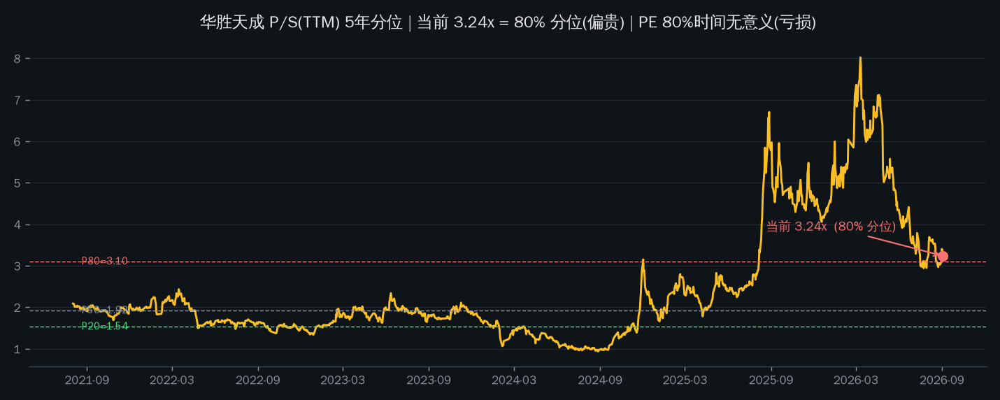
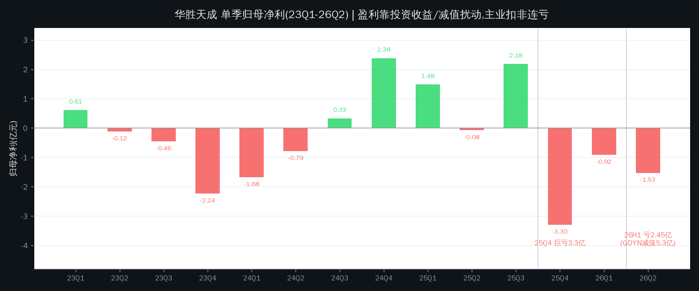
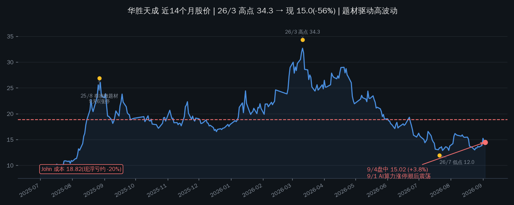

# 华胜天成(600410.SH)估值与持仓分析

**结论:这是一只没法用 PE 估值的股票——5 年里 80% 的交易日是亏损的。** 当前 P/S 3.24x 处 5 年 80% 分位、P/B 3.81x,对一个扣非连亏的公司来说不便宜。2026H1 亏 2.45 亿主因是 GDYN 减值 5.31 亿一次性出清,同时国内算力业务 +29.7%、OCF 转正——市场按"利空出尽 + AI 算力题材"给了溢价。John 持仓 300 股、成本 18.82,现价 15.02 浮亏约 -20%,未设止损价。这类标的的价值不在"估值多便宜",而在纪律。

Data as of: 2026-09-04(盘中 15.02,+3.8%;估值分位基于 9/3 收盘)

## 估值读数:PE 失效,只能看 P/S 与 P/B

| 尺子 | 当前值 | 5年分位 | 读数 |
|---|---|---|---|
| P/S(TTM) | **3.24x** | **80.4%** | 偏贵(P20=1.54, P50=1.92, P80=3.11) |
| P/E(TTM) | 无意义 | — | 亏损;5年只有 242/1235 个交易日 PE 为正 |
| P/B | **3.81x** | — | 贵(归母净资产 41.6 亿 vs 市值 158.7 亿) |
| 股息率 | 0.05% | — | 无支撑 |

华胜天成营收相对平稳(2025 年 46.6 亿),股价是 P/S 波动的全部来源。80% 分位意味着股价隐含了相当多"算力故事"预期——目前只有订单叙事和 +29.7% 国内营收支撑,扣非利润还没兑现。

## 财务画像:盈利靠投资收益和减值扰动,主业扣非连亏

| 期间 | 营收 | 同比 | 归母净利 | 扣非 | OCF | 关键项 |
|---|---|---|---|---|---|---|
| 2024 全年 | 42.7 亿 | +2.6% | +0.24 亿 | 亏损 | 7.0 亿 | 全年微利靠年末浮盈 |
| 2025 全年 | 46.6 亿 | +9.1% | +0.28 亿 | 亏损 | -1.1 亿 | Q4 单季 -3.3 亿 |
| 2026H1 | 25.0 亿 | +10.6% | **-2.45 亿** | **-2.98 亿** | **+2.35 亿** | GDYN 减值 5.31 亿(一次性) |

1. **2026H1 亏损是一次性减值,不是经营恶化。** GDYN(美股 SaaS)股价大跌计提 5.31 亿 → 归母 -2.45 亿。剔除后:国内业务营收 13.4 亿、**+29.7%**(智算中心建设/运维中标);OCF +2.35 亿同比转正(上年 -1.93 亿)。9/1 涨停打的正是"利空出尽"。
2. **但主业不赚钱是长期事实。** 扣非连续 5 年为负。历史上的盈利年靠两类非经常性收益:投资泰凌微(688591)浮盈(2025/8 曾因泰凌微暴涨 9 天 6 涨停炒到 26.85 元)、处置股权收益。这是"投资公司披着 IT 服务外衣",不适用困境反转框架。
3. **海外包袱没卸干净。** ASL 营收 11.6 亿、-1.1% 无增长;GDYN 减值后美股 SaaS 估值波动仍是风险源。处置对外投资回收约 2.8 亿现金,流动性改善是真的。

## 价格位置与持仓纪律(重点)

| 关键位 | 价格 | 含义 |
|---|---|---|
| John 成本 | **18.82** | 现价距成本 -20.2%,浮亏约 -1,140 元 |
| 9/1 涨停价 | 15.22 | AI 算力板块涨停潮(15+ 只涨停、净流入 60 亿+) |
| 6 月平台 | 15.2 - 16.4 | 反弹顶在平台下沿,上方有套牢盘 |
| 7 月低点 | 11.95 | 最近一次恐慌底 |
| 2026/3 高点 | 34.31 | 年内高点(AI 算力+泰凌微双题材) |

**持仓决策框架(300 股 @ 18.82,现价 15.02,未设止损):** 不属于"深套但值得扛"的类型——扣非连亏 5 年、盈利靠投资收益波动、P/S 80% 分位。扛单的隐含假设是"算力故事带回成本 18.82",但题材股的情绪退潮 1-2 个月就打回原形(2025/8 → 12 月跌回 17.9;2026/3 → 7 月跌回 11.95)。

1. **反弹减仓位:** 16.5-17.5(6 月平台上方+涨停潮回补区),把浮亏收窄到 -7~-12%;
2. **硬止损位:** 回落跌破 13.5(9/1 涨停潮起点下方,约 -10% 于现价)说明 AI 算力联动结束,离场而不是等回本;
3. **不做的事:** 不因"P/S 80%"或"利空出尽"加仓摊薄——加仓前提是扣非转正 + 算力订单兑现为利润,目前只有叙事。

## 为什么 9/1 涨停

三层叠加:①中报"利空出尽"(GDYN 减值一次性计提完);②AI 算力板块涨停潮联动(15+ 只涨停、板块净流入 60 亿+);③经营改善叙事(国内算力 +29.7%、OCF 转正、回收 2.8 亿现金)。当日超大单净买 1.2 亿、机构席位占比 55% 以上——游资+机构合力,不是基本面单独驱动。9/2-9/3 连续回落,今日 +3.8% 回到 15.02,跟随大盘与板块。持续性取决于:AI 算力板块整体能否延续(9/1 是普涨联动,非华胜天成独有逻辑)+ 智算订单能否转利润(现在只有营收增速,毛利率/扣非无改善证据)。

## 风险清单

| 风险 | 触发条件/观察信号 |
|---|---|
| 题材退潮回撤 | 历史上题材退潮后 1-2 个月跌回起涨点(25/8→25/12 跌回 17.9;26/3→26/7 跌回 11.95) |
| 估值透支 | P/S 80% 分位 + 扣非亏损;算力订单未转利润则 Q3/Q4 财报证伪 |
| 海外投资余波 | ASL 的 GDYN 等美股资产估值波动;ASL 营收 -1.1% 无增长 |
| 主营商业模式 | IT 服务/集成毛利率低;智算中心是项目制,现金流与利润转化待验证 |
| 持仓无止损 | hold-status 未设止损价;仓位约 2% 不重,但纪律缺失会演变成"等回本"心态 |

## 验证锚点

- **价格锚:** 现价 15.02(9/4 盘中)· 成本 18.82 · 9/1 涨停 15.22 · 6 月平台 15.2-16.4 · 7 月低 11.95 · 3 月高 34.31
- **估值锚:** P/S 3.24x / 80% 分位 · P50=1.92x · P80=3.11x
- **时间锚:** Q3 财报约 10 月下旬(扣非是否收窄/转正)· 智算大单公告(中移动天津、长银消金等)· GDYN 股价
- **数据锚:** 扣非单季是否收窄 · 国内算力毛利率 · ASL 有无新减值 · 回收现金投向

---
Data as of: 2026-09-04
Generated: 2026-09-04
