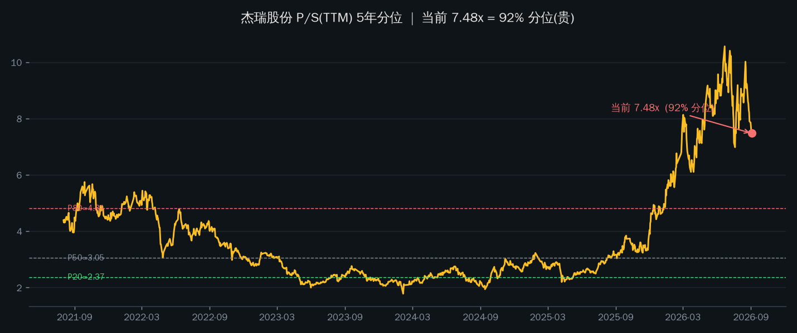
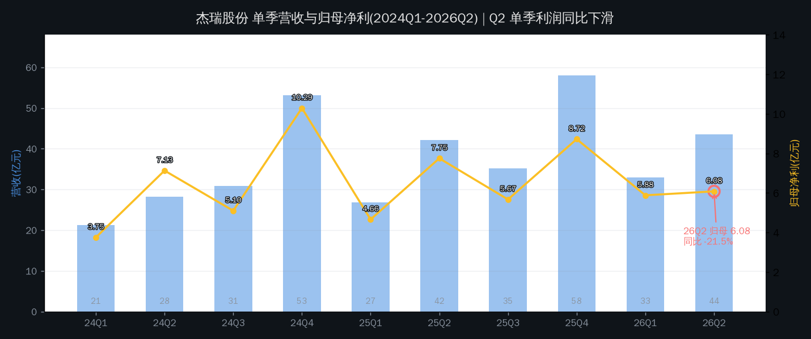
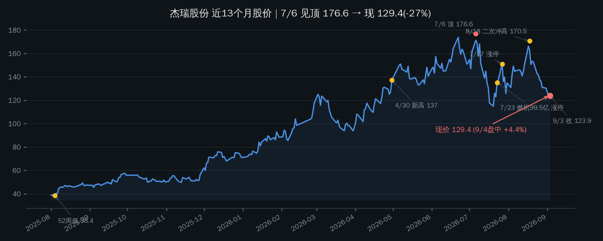

# 杰瑞股份(002353.SZ)估值分析

**结论:估值 5 年 92% 分位,贵得理直气壮但也贵得危险。** 市场不是在为当前油气装备利润定价,而是在为「燃气轮机 + AI 数据中心电源」故事定价。故事成真前,当前 48x PE / 7.5x PS 全靠订单预期撑着;而刚披露的 2026H1 利润同比 -3.7%、Q2 单季 -21.5%、经营现金流转负——基本面与股价叙事出现了两个方向。

Data as of: 2026-09-04(盘中 129.38,+4.4%;估值分位基于 9/3 收盘)

## 估值读数:三把尺子全是历史高位

| 尺子 | 当前值 | 5年分位 | 读数 |
|---|---|---|---|
| P/S(TTM) | **7.48x** | **92.1%** | 贵(P50=3.05x, P80=4.81x) |
| P/E(TTM) | **48.2x** | — | 贵(净利受H1拖累,静态失真偏贵) |
| P/B | **5.45x** | — | 贵(净资产 233 亿,市值 1269 亿) |
| 股息率(TTM) | 0.68% | — | 无估值支撑作用 |

2023-2024 P/S 长期在 2-3x,2025 下半年起随燃机叙事直线拉升,7 月一度冲破 10x,当前回落至 7.48x,仍高于 5 年 92% 位置。

## 同业对照:溢价不是一点半点

| 公司 | 市值 | P/S(TTM) | P/E(TTM) | P/B | 主业 |
|---|---|---|---|---|---|
| **杰瑞股份** | 1269 亿 | **7.48x** | 48.2x | 5.45x | 压裂设备/油服/燃机 |
| 中海油服 | 598 亿 | 1.18x | 15.4x | 1.26x | 油服(国央企) |
| 中曼石油 | 104 亿 | 2.84x | 33.6x | 2.37x | 油服/钻井 |
| 石化机械 | 53 亿 | 0.78x | — | 1.69x | 压裂设备(国企) |

杰瑞 P/S 是中海油服的 6.3 倍、中曼石油的 2.6 倍。同是油服,溢价只能由「燃机/AIDC 电力」叙事解释——传统油服估值框架在它身上已失效。

## 基本面:叙事向左,财报向右

| 期间 | 营收 | 同比 | 归母净利 | 同比 | 毛利率 | OCF |
|---|---|---|---|---|---|---|
| 2024 全年 | 133.6 亿 | -4.0% | 26.3 亿 | +7.0% | 33.7% | 25.9 亿 |
| 2025 全年 | 162.2 亿 | +21.5% | 26.8 亿 | +2.0% | 31.7% | **53.8 亿** |
| 2026Q1 | 32.9 亿 | +22.5% | 5.88 亿 | +26.3% | 33.6% | -12.6 亿 |
| 2026H1 | 76.5 亿 | +10.8% | 11.96 亿 | **-3.7%** | 31.0% | **-7.5 亿** |

1. **全年现金流质量一直很好,H1 突然转负。** 2025 OCF/NI ≈ 2.0;2026H1 OCF -7.5 亿(去年同期 +31.4 亿)。公司归因:地缘冲突致油气工程项目交付延期 + 汇率波动 + 出售光明能源。是否可信需 Q3 验证。
2. **利润不是「爆发的业绩」,是「被订单叙事抢跑的业绩」。** 杰瑞现在是反过来的:利润端 H1 负增长、Q2 单季掉档,估值却因燃机订单预期被推到 92% 分位。市场买的是 200 亿燃机订单的远期兑现,不是已发生的利润。
3. **海外占比是真实的结构性亮点。** 2025 海外收入 78.4 亿(占 48%),海外新增订单占比超 50%、+19.4%;2026Q1 海外占比接近 60%。

## 价格与故事:一年 3.5 倍后的位置

| 时间 | 事件 | 性质 |
|---|---|---|
| 2026-07-06 | 176.6 元见顶(5年最高) | 情绪/资金顶 |
| 2026-07-23 | 子公司签 99.5 亿燃气轮机合同,涨停 | 利好催化 |
| 2026-07-27/28 | 涨停次日跌停,龙虎榜机构净卖 6.2 亿、深股通净卖 2.4 亿 | 高位分歧 |
| 2026-08-11 | 大宗交易 144.4 元(机构接货) | 中性 |
| 2026-08-18 | 二次冲高 170.5 元,未破前高 | 双顶风险 |
| 2026-08-30/31 | 燃机订单预计突破 200 亿;CEO 称 Q4 有望明显增长;高管 7 月在 139-142 元增持 | 叙事加码 |
| 2026-09-01~03 | 三日连跌至 123.6(大盘回调拖累) | 随市调整 |
| 2026-09-04 | 盘中 +4.4% 至 129.4(地缘油价+油服板块走强) | 板块驱动 |

朱少醒富国天惠 2026 半年报新进重仓;高管增持均价约 141 元已在现价上方(内部人浮亏)。

## 我的判断:不是「低估买入」标的,是「高预期跟踪」标的

### 短中期(1-2 个季度):估值消化 vs 故事兑现的拉锯

P/S 92% 分位 + 48x PE + 单季利润下滑,任何框架下都不便宜。若燃机收入确认慢于预期(Q4 验证 CEO 的「明显增长」),估值向 P50-P80 区间回归(按 2026E 营收 200 亿口径,P80≈95 元下方);若订单如期落地且 Q3 现金流回正,高估值能被业绩追上来。决定权在订单交付节奏,不在估值模型。

### 参考方案(John 当前未持仓,关注清单标的)

**不建议现价追入。** 这不是 P/S <25% 分位的「困境反转」标的,业绩也没爆发到能撑起 92% 分位。两类触发器二选一:

1. **等估值回到合理带**:回落至 P80 附近(约 95-100 元,按 2026E 营收口径估算)且 Q3 利润同比不再恶化;
2. **等右侧确认**:燃机订单转正式合同并开始贡献收入(Q4 财报/公告验证),再按纪律分批。

## 风险清单

| 风险 | 触发条件/观察信号 |
|---|---|
| 估值透支 | P/S 92% 分位;燃机收入延迟则 48x PE 无支撑;8/18 双顶未破 |
| H1 利润下滑 + OCF 转负 | Q3 现金流仍不回正则「地缘延期」解释不成立,需下调盈利预期 |
| 订单 ≠ 收入 | 200 亿是「预计突破」口径,含授标/框架;关注正式合同与交付节奏 |
| 油价/地缘双刃 | 今日 +4.4% 是地缘油价驱动;冲突缓和或交付区域再生变,两头都是波动源 |
| 高位筹码松动 | 7/27 龙虎榜机构净卖 6.2 亿、7/28 跌停;8/18 二次冲高未破前高 |
| 高管增持被套 | 内部人 141 元增持、现价 129;续跌则护盘效应消失甚至成反向信号 |

## 验证锚点

- **价格锚**:现价 129.4 · 7/6 顶 176.6 · 8/18 二次顶 170.5 · 高管增持区 139-142 · 52 周低 38.4
- **估值锚**:P/S 7.48x / 92% 分位 · P50=3.05x · P80=4.81x
- **时间锚**:2026H1 已披露(8/13)· Q3 财报约 10 月下旬 · 燃机正式合同/收入确认(待公告)
- **数据锚**:Q3 单季利润同比转正? · OCF 回正? · 海外收入占比守住 55%+? · 燃机订单 200 亿上修还是停滞?

---
Data as of: 2026-09-04
Generated: 2026-09-04
