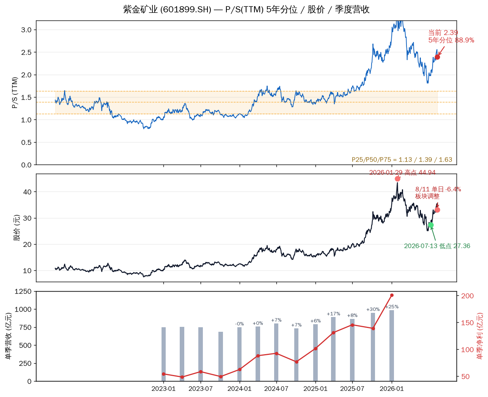
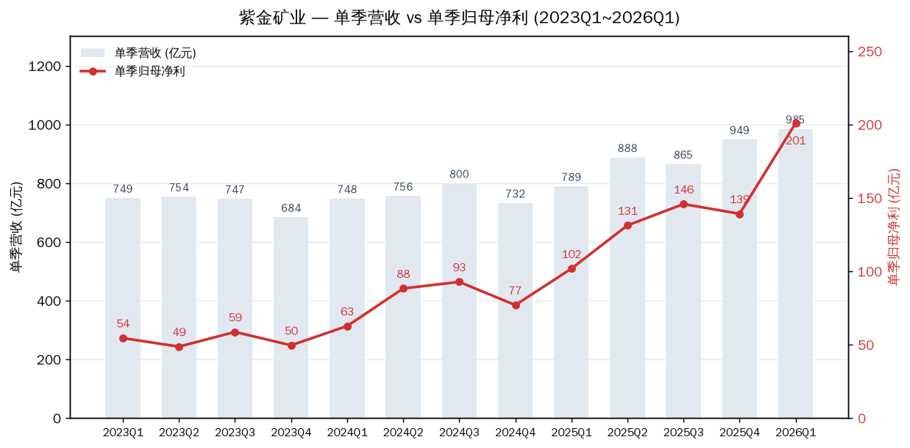

# 紫金矿业估值分析

**紫金矿业 (601899.SH / 02899.HK) — 全球矿业龙头，金铜双主业。** 现价 33.53 元（2026-08-12 盘中），总市值约 8823 亿元。

先说结论。**紫金的估值现在是"贵与便宜同时成立"：P/S 站在 5 年 88.9% 分位（贵），P/E 只有 14.3 倍（5 年 27.7% 分位，便宜）。** 这个矛盾是周期股的标准形态——盈利处在历史峰值，分母（盈利）把 P/E 压低了，但市场给公司整体的定价（市值/营收、市值/净资产）其实已经在历史高位。**用 P/E 判断会误判，用 P/S 判断会偏空。真正的锚是金价和铜价，不是任何一档估值指标。**

---

## 估值三把尺子

| 指标 | 当前值 | 5年中位 | 5年75%分位 | 当前分位 | 含义 |
|---|---|---|---|---|---|
| P/S (TTM) | 2.39 | 1.39 | 1.63 | **88.9%** | 偏贵 |
| P/E (TTM) | 14.30 | 16.22 | 19.45 | 27.7% | 便宜 |
| P/B | 4.47 | 3.67 | 4.23 | **82.3%** | 偏贵 |

Data as of: 2026-08-11 收盘（daily_basic，5年序列 2021-08 至 2026-08，1218 个交易日）

P/S 分位 88.9% 意味着：过去 5 年里只有 11% 的时间市场给紫金的营收定价比现在更贵。P/E 分位 27.7% 意味着：过去 5 年有 72% 的时间 P/E 比现在更贵。

这不是市场精神分裂，而是**盈利爆发把 P/E 分母撑大了**。2025 年净利 517.8 亿（+61.6%），2026Q1 单季净利 200.8 亿（同比近翻倍），TTM 盈利大约 617 亿，是 5 年前的好几倍。分母变大，P/E 自然变低。但 P/S 和 P/B 反映的是市值相对营收/净资产的绝对水平，这两个没有跟随盈利爆发而变便宜——它们已经在高位。

**周期股铁律：在盈利峰值期，P/E 低是陷阱不是机会。** 商品价格一旦回落，盈利缩水，P/E 会迅速"变贵"。所以紫金的估值判断必须绑定商品价，不能脱离金价铜价谈贵贱。

三面板读法：上面板 P/S 从 2021 年的 1 倍出头一路爬到当前 2.39，黄色带是 25-75% 分位区间（1.13-1.63），当前值明显在带上方。中面板股价 2026 年 1 月冲高 44.94 后 7 月跌到 27.36，8 月反弹后又遇 8/11 单日 -6.4%。下面板季度营收稳步上升，单季净利 2026Q1 飙到 200.8 亿创历史单季新高。

## 8/11 大跌：板块性调整，不是个股利空

8/11 A股紫金 -6.4%（35.45 → 33.18），同一天有色金属板块整体跌 3%，赤峰黄金 -8.7%、西部矿业 -7.7%、洛阳钼业 -7.8%，港股紫金也跌超 6%。**这是板块同步下跌，不是紫金独有事件。**

背景是 8 月初金价单周大涨 7.28%（伦敦金从 4041 涨到 4341 美元/盎司，创近半年最大单周涨幅），紫金从 7 月中旬低点 27.36 反弹到 8/10 的 35.45，一个多月涨了近 30%。8/11 的回调更像是反弹途中的获利了结 + 8/12 美国 CPI 公布前的观望（金价对通胀数据敏感）。8/12 早盘 A股紫金现价 33.53，小幅反弹 1.1%，说明没有形成恐慌性抛售。

## 基本面：业绩爆发是真实的，且现金流质量高

| 指标 | 数值 | 判断 |
|---|---|---|
| 2025 全年归母净利 | 517.8 亿，+61.6% | 创历史纪录 |
| 2026Q1 单季归母净利 | 200.8 亿，同比近翻倍 | 历史单季新高 |
| 2026H1 业绩预告 | 391 亿，+68% | 已公告，确定性高 |
| 2025 经营现金流 | 754.3 亿 | OCF/NI = 1.46，盈利有现金流支撑 |
| 2026Q1 资产负债率 | 51.4% | 稳定，货币资金 993.9 亿 |
| 2026 产量计划 | 矿产金 105 吨、矿产铜 120 万吨 | 金 +16.7%、铜 +10.1% |

关键点：**这不是"做出来"的利润。** 经营现金流/净利润 1.46 倍，说明 517 亿净利背后有 754 亿真金白银的现金流支撑，不是应收款堆出来的账面利润。负债率 51.4% 对重资产矿业公司来说可控，且账上近千亿货币资金。**业绩爆发部分来自价格上涨（金、铜），部分来自产量释放（矿产金 2025 年 +22.8%、2026 年计划再 +16.7%，碳酸锂 2026 年计划 12 万吨，2025 年约 5 倍）——量价齐升，不是纯价格虚胖。**

唯一要盯的瑕疵：2026Q1 矿产铜产量同比下滑约 10%（卡莫阿-卡库拉阶段性减产），这是 8/11 某篇分析提到的一个压制因素，全年 120 万吨计划能否兑现要等中报和月度产量数据验证。

## 商品价锚：金铜价格决定紫金估值中枢

紫金的盈利本质是"卖金、卖铜赚商品价格的钱"。商品价的位置就是估值的位置。

| 商品 | 当前价 (2026-08-11/12) | 位置 |
|---|---|---|
| 伦敦金 | 4390 美元/盎司 | 8 月初单周 +7.3% 反弹，站上 4300 关键位，距 1 月高点 5600 还有 22% 距离 |
| LME 铜 | 14000 美元/吨上方 | 连续 5 个交易日站上 14000，接近历史高位区 |
| COMEX 铜 | 6.63 美元/磅 | 8 月初触及 6.7485 历史新高 |

金价的驱动逻辑：8 月这波反弹来自三件事——中东局势缓和（油价周跌 11% 缓解通胀预期）、7 月非农走弱点燃美联储宽松预期、全球央行持续购金（中国央行连续 21 个月增持，7 月增 19.9 吨；世界黄金协会统计 Q2 全球央行购金 289 吨创季度纪录）。**但金价短期最大的变量是 8/12 晚公布的美国 7 月 CPI。** 数据强 → 加息预期升温 → 金价承压回落；数据温和 → 宽松预期强化 → 金价冲 4450-4500。技术位上，4300 是当前多头生命线，跌破则本轮反弹逻辑破坏。

铜价的驱动逻辑：刚果（金）8/6-8/7 宣布禁止铜钴精矿出口（紫金已回应旗下产品不在禁止之列，影响有限但情绪利多）、印尼 Grasberg 配套冶炼厂停产、美国囤铜潮（关税预期）抽紧 LME 库存。供给端是硬约束，需求端 AI 算力 + 电网 + 新能源的铜需求叙事还在。**铜价目前是紫金三大商品里最强势的。**

## 动态判断（per-factor）

| 因子 | 类型 | 当前状态 |
|---|---|---|
| 金价 | 周期性 | ⚠️ 反弹已启动未确认，8/12 CPI 是验证点；站稳 4300 算走出，跌破 4300 反弹逻辑破坏 |
| 铜价 | 周期性 | ✅ 已走出，14000+ 历史高位区，供给扰动 + 需求叙事共振 |
| 盈利爆发 | 周期性+结构性 | ✅ 已确认，2026H1 预告 391 亿 +68%，量价齐升 |
| 估值（P/S、P/B） | 情绪/定价 | 🔴 已在历史高位区，88.9% / 82.3% 分位 |
| 股价位置 | 技术面 | ⚠️ 反弹通道中段，8/11 回调后 33.18，未破位但需观察 |

综合判断：**基本面（盈利、现金流）和商品价（铜强势、金反弹）支持紫金"不是周期顶部崩塌"的判断，但估值端已经提前反映了大部分利好。** 当前价位是"商品价驱动上涨"和"估值已高、透支增长"之间的平衡点。真正能推动下一波的是金价确认突破 4450-4500、或者中报产量数据超预期；真正要防的是金价跌破 4300 叠加铜价回落。

## 验证锚点

| 类型 | 锚点 | 数值/日期 |
|---|---|---|
| 价格锚 | 7 月低点 | 27.36 (2026-07-13) |
| 价格锚 | 8/10 反弹高点 | 35.45 |
| 价格锚 | 1 月历史高点 | 44.94 (2026-01-29) |
| 价格锚 | 8/11 收盘 | 33.18 |
| 事件锚 | 美国 7 月 CPI | 2026-08-12 晚公布，前值 3.5% |
| 事件锚 | 2026 中报正式披露 | 8 月下旬（业绩预告已出 391 亿 +68%） |
| 数据锚 | 矿产铜产量验证 | 2026Q1 -10% 需确认是否恢复，全年计划 120 万吨 |
| 数据锚 | 矿产金产量 | 2026 计划 105 吨 (+16.7%) |
| 数据锚 | 碳酸锂产量 | 2026 计划 12 万吨 (约 2025 年 5 倍) |
| 事件锚 | 刚果铜精矿出口禁令 | 已实施，关注执行细节及对铜价影响 |

## 风险

| 风险 | 触发条件 |
|---|---|
| 金价回落 | 伦敦金跌破 4300 美元/盎司（当前 4390） |
| 铜价见顶回落 | LME 铜跌破 13000 美元/吨（当前 14000+） |
| CPI 超预期 | 8/12 美国 CPI 高于 3.5%，加息预期升温压制金价 |
| 矿产铜产量不及预期 | 卡莫阿-卡库拉减产延续，全年 120 万吨计划落空 |
| 估值消化 | P/S 已在 88.9% 分位，即便商品价高位横盘，股价也可能先回调等盈利跟上 |
| 海外资产风险 | 刚果（金）等地区政策变动、地缘事件（公司 2026 年刚收购赤峰黄金，外延扩张增加整合风险） |

## 参考思路

紫金的定位是**"商品价格 + 产量释放"的双击标的**，不是"低估值价值股"。用 P/E 14 倍当便宜买，是在赌商品价不回落；用 P/S 88.9% 分位判断贵而卖出，可能错过商品牛市后半程。给一个可执行的判断框架：

- **商品价是唯一可靠的先行指标**：金价站稳 4450 上方 → 估值仍有支撑；金价跌破 4300 → 反弹逻辑破坏，无论 P/E 多便宜都先离场。
- **中报是下一个验证点**：8 月下旬正式中报，重点看矿产铜产量是否恢复（Q1 -10%）、矿产金产量是否兑现 105 吨进度、碳酸锂 12 万吨爬坡进度。
- **仓位纪律**：估值分位在 85%+ 时，加仓的赔率已经不对称——向上的空间靠商品价续涨，向下的空间是估值 + 盈利双杀。若持有，用金价 4300 / 铜价 13000 作为硬性离场触发器；若未持有，等回调到 P/S 75% 分位以下（对应股价大约在 30 元下方区间）再谈，或者等商品价突破后的右侧确认。

---

Data as of: 2026-08-12
Generated: 2026-08-12
