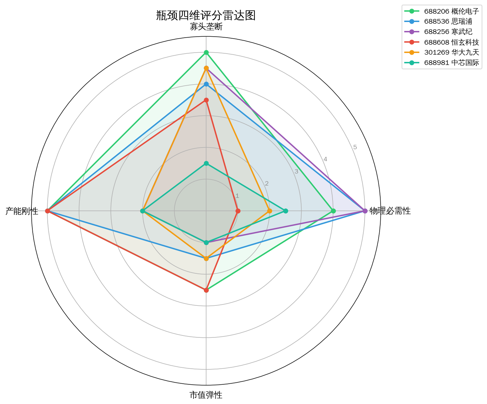
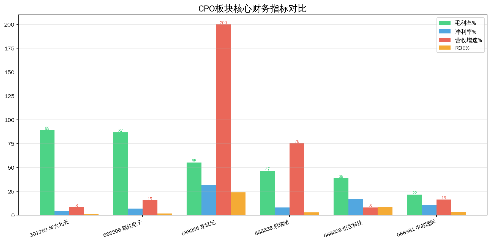
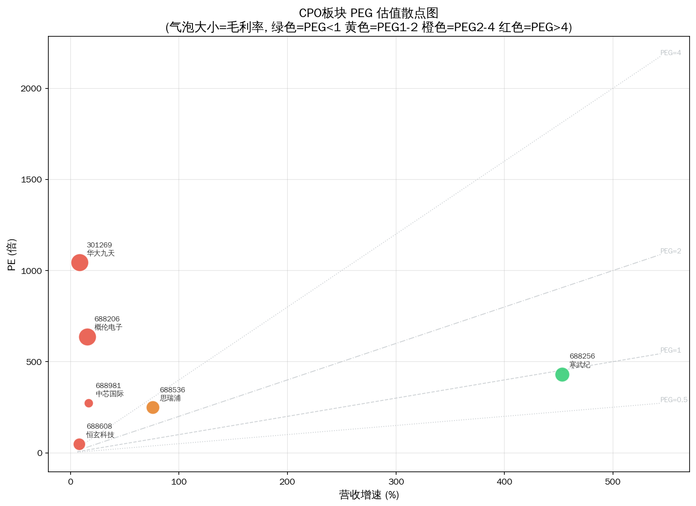
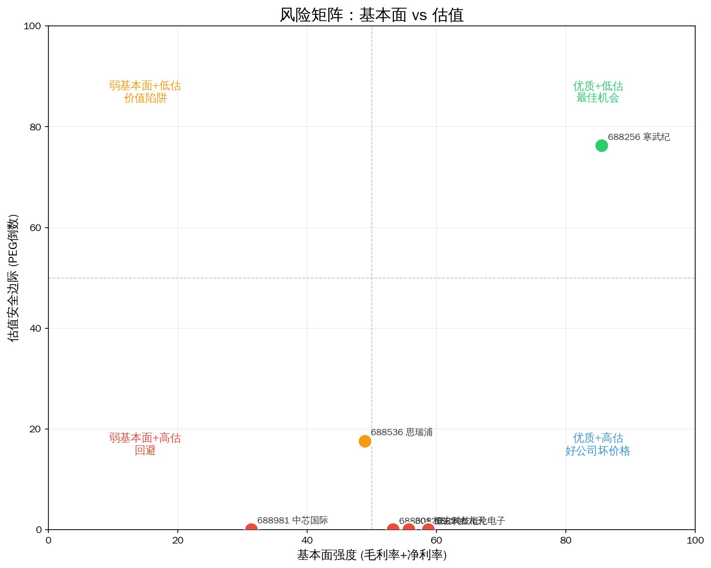
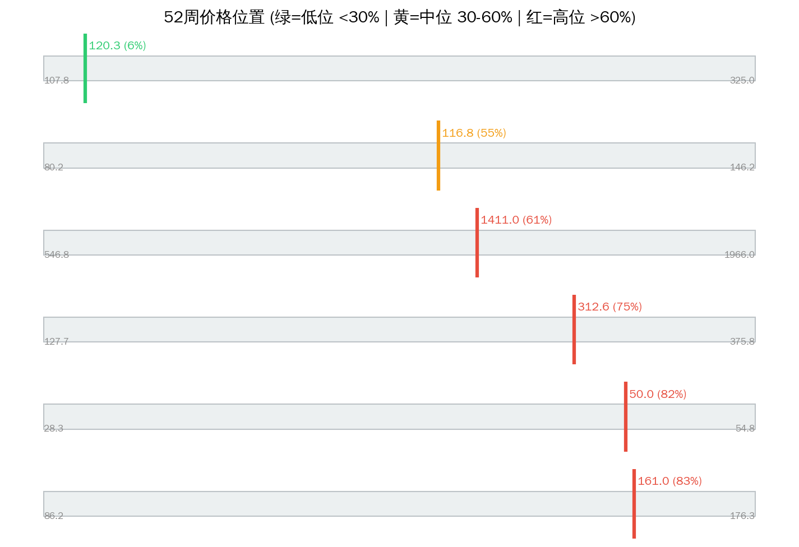

# EDA软件 Serenity 瓶颈分析报告

> 分析日期: 2026-07-14 | 数据截止: 2026-07-14 收盘 | 方法论: Serenity Choke Point Theory | 数据源: Tushare  
> 评分: 四维加权 + 供应链层级修正（上游产能刚性↑ / 小市值弹性↑）

## 1. 板块周期定位

**产业触发：** 国产替代紧迫+AI辅助芯片设计推动工具链升级需求

**图谱描述：** 芯片设计电子自动化工具，集成电路产业链最上游的设计工具

**瓶颈层（图谱）：** Layer 0 — EDA全流程平台  
**瓶颈理由：** EDA全流程平台国产化率<5%，Synopsys/Cadence断供风险+国内晶圆厂扩产需求，替代空间巨大但技术壁垒极高

**本次结论：** 图谱瓶颈层 **EDA全流程平台** 映射标的平均毛利率 **55.3%**，与寡头叙事基本一致。

---

## 2. 供应链结构


```
**Layer 0: EDA全流程平台  CR3=95%  竞争: near_monopoly  ← 理论瓶颈层**
  ├── 301269 华大九天  PE=1044.6  毛利率=89.3%  增速=8.4%  市值=637.0亿
  ├── 688981 中芯国际  PE=273.4  毛利率=21.6%  增速=16.5%  市值=13782.0亿
  ├── 688256 寒武纪  PE=430.5  毛利率=55.2%  增速=453.2%  市值=8865.2亿

Layer 1: EDA点工具/IP核  CR3=80%  竞争: oligopoly
  ├── 688206 概伦电子  PE=637.5  毛利率=86.9%  增速=15.4%  市值=218.3亿
  ├── 688536 思瑞浦  PE=249.5  毛利率=46.6%  增速=75.7%  市值=431.7亿
  ├── 688608 恒玄科技  PE=48.0  毛利率=38.7%  增速=8.0%  市值=285.0亿

```

---

## 3. 瓶颈标的排序



| 排名 | 代码 | 名称 | 综合分 | 必要性 | 垄断性 | 产能刚性 | 市值弹性 | PEG | 市值(亿) | 判断 |
|------|------|------|--------|--------|--------|---------|---------|-----|---------|------|
| 1 | 688206 | 概伦电子 | 4.3 | 4.0 | 5.0 | 5.0 | 2.5 | 41.37 | 218.3 | likely_genuine |
| 2 | 688536 | 思瑞浦 | 4.2 | 5.0 | 4.0 | 5.0 | 1.5 | 3.30 | 431.7 | likely_genuine |
| 3 | 688256 | 寒武纪 | 3.5 | 5.0 | 4.5 | 2.0 | 1.0 | 0.95 | 8865.2 | potential |
| 4 | 688608 | 恒玄科技 | 3.0 | 1.0 | 3.5 | 5.0 | 2.5 | 5.98 | 285.0 | potential |
| 5 | 301269 | 华大九天 | 2.7 | 2.0 | 4.5 | 2.0 | 1.5 | 124.35 | 637.0 | unlikely |
| 6 | 688981 | 中芯国际 | 1.8 | 2.5 | 1.5 | 2.0 | 1.0 | 16.59 | 13782.0 | unlikely |

**已过滤：**

| 代码 | 名称 | 原因 |
|------|------|------|
| — | — | 无 |

---

## 4. 核心发现



### 名义瓶颈 vs 财务现实

图谱瓶颈层 **EDA全流程平台** 映射标的平均毛利率 **55.3%**，与寡头叙事基本一致。

### Top 财务快照

| 名称 | 毛利率 | 净利率 | 营收增速 | ROE | PE | PEG | 52周位置 |
|------|--------|--------|---------|-----|----|-----|---------|
| 概伦电子 | 86.9% | 7.0% | 15.4% | 1.7% | 637.5 | 41.37 | 81.8% |
| 思瑞浦 | 46.6% | 8.1% | 75.7% | 3.0% | 249.5 | 3.30 | 74.6% |
| 寒武纪 | 55.2% | 31.7% | 453.2% | 23.9% | 430.5 | 0.95 | 60.9% |
| 恒玄科技 | 38.7% | 16.9% | 8.0% | 8.8% | 48.0 | 5.98 | 5.8% |
| 华大九天 | 89.3% | 4.6% | 8.4% | 1.2% | 1044.6 | 124.35 | 55.5% |

### 角色映射（非投资建议）

- **综合分最高**: 概伦电子（688206）— 综合分 4.3
- **紫苏叶候选**: 暂无合适标的
- **赔率优先**: 寒武纪（688256）— PEG=0.95
- **位置观察**: 恒玄科技（688608）— 52周位置 5.8%
- **谨慎/回避倾向**: 概伦电子（688206）— PEG=41.37 / 分 4.3

**Serenity 四条件提醒：** 物理必需 × 寡头垄断 × 产能刚性 × 小市值弹性，缺一不可。综合分高但市值过大 → 降为景气龙头而非紫苏叶；综合分中等但 PEG 极低 → 可作赔率仓，不作纯瓶颈仓。

---

## 5. 估值与风险







| 标的 | 收盘 | 52周高 | 距高点 | 位置% | 信号 |
|------|------|--------|--------|-------|------|
| 中芯国际 | 160.99 | 176.34 | -8.7% | 83.0% | 🟡 |
| 概伦电子 | 50.00 | 54.83 | -8.8% | 81.8% | 🟡 |
| 思瑞浦 | 312.64 | 375.76 | -16.8% | 74.6% | 🟡 |
| 寒武纪 | 1411.00 | 1966.00 | -28.2% | 60.9% | 🟡 |
| 华大九天 | 116.79 | 146.17 | -20.1% | 55.5% | 🟡 |
| 恒玄科技 | 120.30 | 325.00 | -63.0% | 5.8% | 🟢 |

---

## 6. 信号对照表

| 做多信号 ✅ | 做空信号 ❌ |
|------------|------------|
| ✅ 产业触发: 国产替代紧迫+AI辅助芯片设计推动工具链升级需求 | ❌ 概伦电子 PEG=41.37 — 估值脆弱 |
| ✅ 图谱瓶颈: EDA全流程平台国产化率<5%，Synopsys/Cadence断供风险+国内晶圆厂扩产需求，替代空间巨大但技术壁垒极高 | ❌ 恒玄科技 PEG=5.98 — 估值脆弱 |
| ✅ 概伦电子 毛利率 86.9% — 具备壁垒特征 | ❌ 华大九天 PEG=124.35 — 估值脆弱 |
| ✅ 思瑞浦 毛利率 46.6% — 具备壁垒特征 | ❌ 中芯国际 PEG=16.59 — 估值脆弱 |
| ✅ 寒武纪 PEG=0.95 — 增长覆盖估值 | ❌ 中芯国际 低毛利(21.6%)配高PE(273) — 概念溢价嫌疑 |
| ✅ 寒武纪 毛利率 55.2% — 具备壁垒特征 | — |

**综合判断：** 做多(6)略强于做空(5)，宜精选个股、控制仓位。

---

## 7. 风险提示

- ⚠️ **技术/路线风险：** 替代技术或工艺切换可能旁路当前瓶颈层（需跟踪产业验证进度）。
- ⚠️ **估值风险：** 高 PEG / 高 52 周位置标的对增速放缓极度敏感，易戴维斯双杀。
- ⚠️ **政策风险：** 国产替代、出口管制、环保配额等政策双向影响供给与需求。
- ⚠️ **流动性风险：** 小市值标的（<100 亿）日内波动可达 ±20%，极端日流动性枯竭。
- ⚠️ **图谱滞后风险：** 供应链 CR3/竞争格局数据可能滞后，新进入者扩产需用公告交叉验证。
- ⚠️ **映射错位风险：** 海外垄断环节在 A 股可能无纯标的（业务混杂），财务无法体现瓶颈溢价。
- ⚠️ **持仓纪律：** 单票建议不超过总仓位 15%；景气龙头与紫苏叶分逻辑管理。

---

Data as of: 2026-07-14  
Generated: 2026-07-14

---
⚠️ 本报告基于 Tushare 公开财务数据、预构建供应链图谱及 LLM 推理生成，**不构成投资建议**。供应链与技术路线信息需独立验证。投资有风险，入市需谨慎。
🤖 Generated with [Claude Code](https://claude.com/claude-code)
