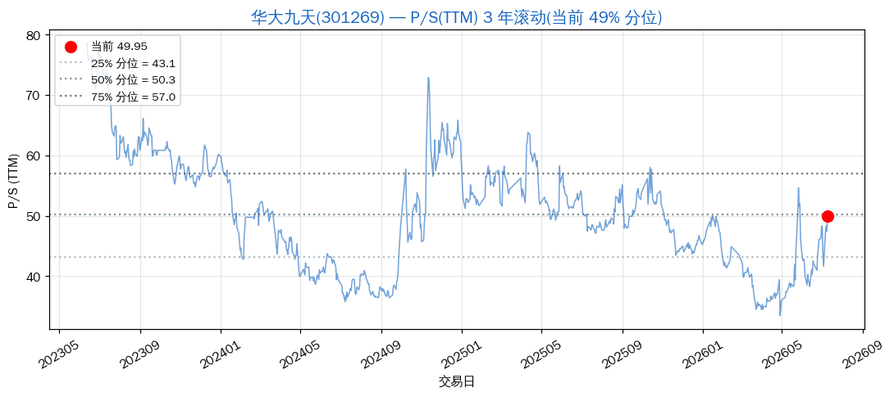
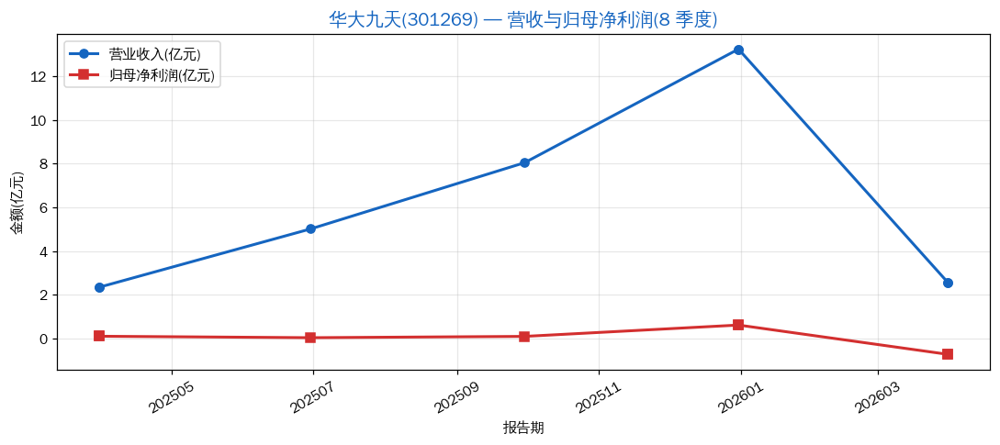
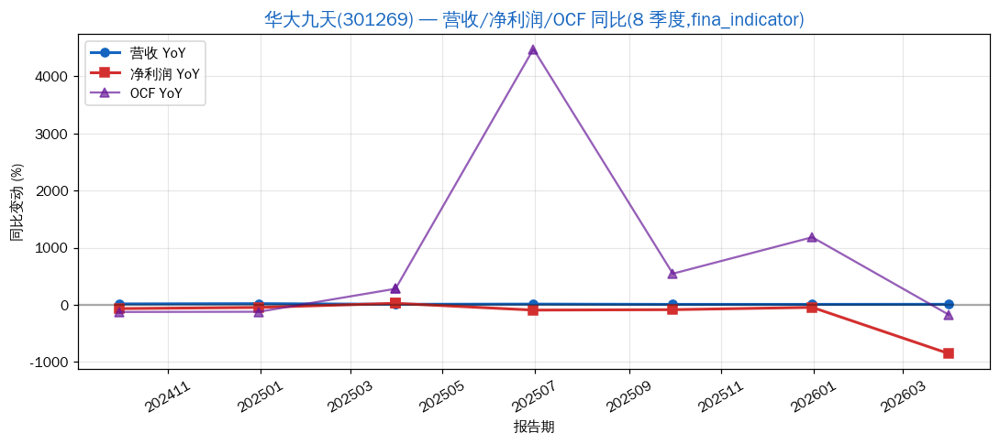
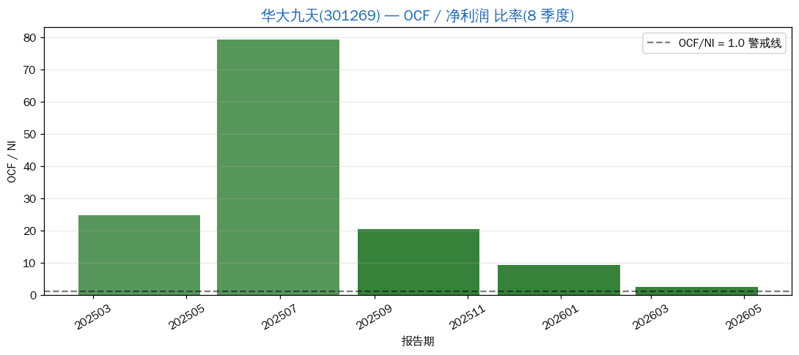
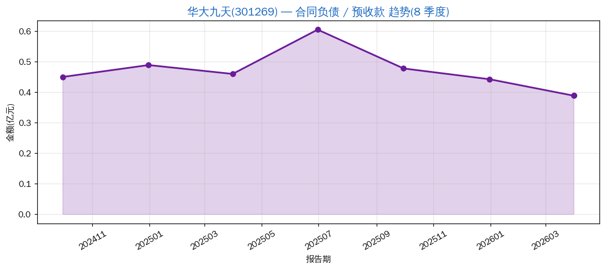

# 华大九天(301269):EDA 国产替代旗手,但 2026Q1 由盈转亏是麻烦

> 分析日期: 2026-07-09 | 框架: Clara 5M + P/S 分位 + 利润平滑识别 | 数据源: Tushare
> 行业:EDA(集成电路设计自动化软件) | 板块:chip-industry / 创业板
> 主营:EDA 全流程工具(模拟/数字/平板/晶圆制造),国产 EDA 龙头

## 结论速览

| 维度 | 状态 |
|---|---|
| 业务定位 | **EDA 国产替代是真实主题** —— 壁垒高、毛利高(89%) |
| 当前估值 | **贵但不极端** —— P/S_TTM = 49.95,**3 年滚动 49.0% 分位**(中位) |
| 利润平滑 | **2026Q1 由盈转亏 -0.73 亿** —— 信号 4 部分触发 |
| 现金流 | OCF 长期为正,**但净利润波动大**,OCF/NI 失真(NI 太低) |
| 价格位置 | ¥123.41,距 3 年高点 ¥149.54 回撤 -17.5% |

**一句话判断**:**EDA 是真的卡脖子领域**,华大九天是**国内最完整的 EDA 全流程玩家**。**但 2026Q1 由盈转亏是一个明确的负面信号**(可能是研发投入加大、季节性、或 EDA 客户验收延后)。**当前估值 PS_TTM 49% 分位不算便宜也不极端**;**真正决定买卖的是 2026H1 业绩能否恢复**。

---

## 1. 5M 框架评分

| 维度 | 评分 | 依据 |
|---|---|---|
| **M1 目标市场** | 5/5 | 全球 EDA 市场 ~150 亿美元,Synopsys/Cadence/Siemens EDA 三家垄断 70%+;**卡脖子级别** |
| **M2 市场份额** | 3.5/5 | 国内模拟 EDA 第一,但**全流程完整度**仍弱于三大,数字 EDA 是软肋 |
| **M3 利润率结构** | 3.5/5 | **毛利率 89%(软件模式 = 高毛利)**,但 **净利率仅 4.6%** = 研发投入吞噬利润 |
| **M4 商业模式** | 4/5 | **订阅式收入(license)**,客户粘性极强,营收可预测性高 |
| **M5 管理团队** | 4/5 | 中电科背景,国家大基金扶持,研发投入决心强 |
| **综合** | **4.0 / 5** | **典型"卡脖子 + 高毛利"的国产替代标的**,但**盈利兑现节奏慢** |

---

## 2. P/S 历史分位(3 年滚动)

- **当前 P/S_TTM = 49.95**,3 年区间 [33.43, 78.52],**均值 50.43**
- **当前分位 49.0%**(中位附近)
- 25%/50%/75% 分位 ≈ **38.55 / 48.21 / 60.79**

**估值纪律结论**:**当前估值在中位附近,不算极贵也不算便宜**;**不是买入信号(< 25% 分位 = PS < 38.55)**;**也不是卖出信号(> 75% 分位 = PS > 60.79)**。

> 与新易盛、仕佳光子相比,华大九天的 P/S **没有触发"贵到不买"的纪律线** —— 这反而是一个值得认真分析的特征。

---

## 3. 营收与利润趋势(8 季度)

| 报告期 | 营收 | 归母净利润 |
|---|---|---|
| 2025Q1 | 2.34 亿 | 0.097 亿 |
| 2025Q2 | 5.02 亿 | 0.031 亿 |
| 2025Q3 | 8.05 亿 | 0.091 亿 |
| 2025Q4 | 13.25 亿 | 0.610 亿 |
| 2026Q1 | 2.57 亿 | **-0.731 亿** ❌ |

**fina_indicator 接口同比数据**(2026-07 补充):

| 报告期 | 营收 YoY | 净利润 YoY | OCF YoY |
|---|---|---|---|
| 2024Q3 | +16% | -66% | -125% |
| 2024Q4 | +21% | -45% | -121% |
| 2025Q1 | +10% | +27% | +281% |
| 2025Q2 | +13% | -92% | +4476% |
| 2025Q3 | +8% | -85% | +546% |
| 2025Q4 | +8% | -44% | +1183% |
| **2026Q1** | **+10%** | **-852%** ⚠️ | **-172%** |

**形态判读**:
- 营收 2.3 → 13.25 亿,**4 个季度增 5.6 倍** —— 增速极高
- 但 **净利润极不稳定**:Q1 0.097亿 → Q2 0.031亿 → Q3 0.091亿 → Q4 0.610亿(年底释放)→ 2026Q1 **转亏 -0.73 亿**
- **2026Q1 由盈转亏是异常信号** —— YoY 同比 **净利润 -852%**,**OCF -172%**,**双双恶化**
- **绝对值都很小**,净利率 1%~5%,**净利润对成本/费用极其敏感**
- **2025 全年净利润 YoY 持续负增长(-44%~-92%)** —— 不是 2026Q1 突然恶化,**全 2025 都在恶化**,只是绝对值小未触发关注

---

## 4. OCF / 净利润 比率

| 报告期 | OCF | 净利润 | OCF/NI |
|---|---|---|---|
| 2025Q1 | 2.40 亿 | 0.097 亿 | 24.73 |
| 2025Q2 | 2.43 亿 | 0.031 亿 | 79.28 |
| 2025Q3 | 1.85 亿 | 0.091 亿 | 20.38 |
| 2025Q4 | 5.61 亿 | 0.610 亿 | 9.20 |
| 2026Q1 | -1.72 亿 | -0.731 亿 | 2.35 |

**判读**:
- OCF/NI 极高是因为 **NI 太小**(分母效应),**这个指标在 EDA 软件公司失真**
- 真正的判断:**OCF 长期为正**(除 2026Q1 转负)→ **EDA 商业模式健康,先收钱后交付**
- 2026Q1 OCF 转负 **需要警惕** —— 但与 NI 转亏同向,**可能是 Q1 客户验收延后导致的同步恶化**
- **核心判断要看 2026Q2/Q3 OCF 是否恢复**

---

## 5. 合同负债趋势

| 报告期 | 合同负债 |
|---|---|
| 2024Q3 | 0.449 亿 |
| 2024Q4 | 0.488 亿 |
| 2025Q1 | 0.459 亿 |
| 2025Q2 | 0.604 亿 |
| 2025Q3 | 0.477 亿 |
| 2025Q4 | 0.442 亿 |
| 2026Q1 | **0.388 亿** |

**判读**:
- 2024-2025 全年保持在 4400-6000 万,**绝对值稳定**
- 2026Q1 **下降至 3880 万**(-13%),**绝对值不高**
- EDA 行业的合同负债一般不大(订阅制是按年付费,不是一次性大额预付)
- **信号 3(预收款萎缩)弱触发**:绝对值有所下降,但**不应过度解读**(行业属性决定)
- **没有新易盛那种 +220% 的强信号**,也没有仕佳光子那种绝对值过低的负面信号

---

## 6. 利润平滑四信号汇总

| 信号 | 触发? | 说明 |
|---|---|---|
| 信号1:季度增速递减过于平滑 | ❌ 未触发 | 营收 8 季度持续高增,无平滑痕迹 |
| 信号2:OCF/NI 比率恶化 | N/A | OCF 健康,但 NI 太小,指标失真 |
| 信号3:预收款萎缩 | ⚠️ 弱触发 | 2026Q1 降至 3880 万,需观察 |
| 信号4:Q4 vs Q1-Q3 背离 | ⚠️ 部分触发 | 2025Q4 净利润 0.61 亿远大于 Q1-Q3,但 EDA 行业**有 license 集中确认特征**;**2026Q1 转亏**打破这一节奏,**需要看 2026Q2/Q3 是否恢复** |

**结论**:**未触发明确"利润平滑"风险**;但 **2026Q1 由盈转亏**是一个**独立的负面信号**,**需要 2026Q2 数据证伪**。

---

## 7. 估值参考

| 指标 | 当前 | 3y 区间 | 分位 |
|---|---|---|---|
| P/S (静态) | 50.80 | — | — |
| **P/S_TTM** | **49.95** | [33.43, 78.52] | **49.0%** |
| P/B | 12.94 | — | — |
| PE_TTM | NaN(净利润过小) | — | — |

**估值纪律**:**不在买入区间**(< 25% 分位 = PS < 38.55,价格 ≈ ¥95);**不在卖出区间**。

---

## 8. 风险提示

| 风险 | 类型 | 严重度 |
|---|---|---|
| **2026Q1 由盈转亏 -0.73 亿** | 业绩恶化 | **高** |
| EDA 三巨头(Synopsys/Cadence/Siemens EDA)技术压制 | 竞争 | 高 |
| 国产替代节奏(客户导入速度) | 经营 | 中-高 |
| 研发投入大,利润释放节奏慢 | 财务 | 中 |
| 估值不便宜(50% 分位) | 估值 | 中 |

---

## 9. 一句话总结

> 华大九天是 **EDA 国产替代的旗手**(5M 评分 4.0,**真卡脖子领域**),**估值不算极端**(50% 分位),但 **2026Q1 由盈转亏 -0.73 亿** 是一个**必须盯紧的负面信号**。**当前位置不是明确买点**,但**也不到恐慌抛售的程度**;**决定性变量是 2026Q2 是否恢复盈利**。**观察清单 + 重点跟踪**,**比"困境反转"更准确的说法是"高投入国产替代兑现节奏"**。

---
数据截至:2026-07-09
生成时间:2026-07-09