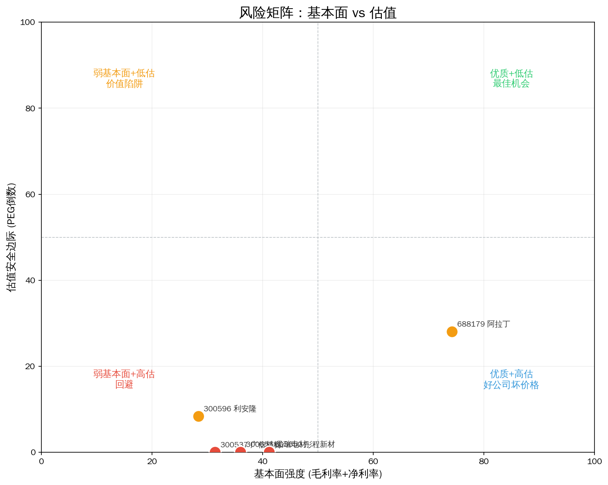
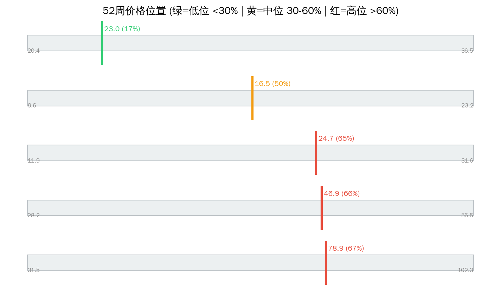

# 光刻胶 Serenity 瓶颈分析报告

> 分析日期: 2026-07-14 | 数据截止: 2026-07-14 收盘 | 方法论: Serenity Choke Point Theory | 数据源: Tushare  
> 评分: 四维加权 + 供应链层级修正（上游产能刚性↑ / 小市值弹性↑）

## 1. 板块周期定位

**产业触发：** 国产替代紧迫+国内晶圆厂导入加速

**图谱描述：** 半导体光刻工艺核心材料

**瓶颈层（图谱）：** Layer 0 — 半导体光刻胶(ArF/KrF)  
**瓶颈理由：** 半导体光刻胶国产化率<5%，验证周期>2年，客户粘性极高

**本次结论：** 图谱标记 **半导体光刻胶(ArF/KrF)** 为瓶颈，但该层 A 股映射标的平均毛利率仅 **27.5%**，垄断利润未兑现 — **名义瓶颈 ≠ 财务瓶颈**。

---

## 2. 供应链结构


```
**Layer 0: 半导体光刻胶(ArF/KrF)  CR3=90%  竞争: near_monopoly  ← 理论瓶颈层**
  ├── 300537 广信材料  PE=349.8  毛利率=33.5%  增速=-7.1%  市值=47.9亿
  ├── 300655 晶瑞电材  PE=124.3  毛利率=24.9%  增速=12.2%  市值=185.7亿
  ├── 603650 彤程新材  PE=86.4  毛利率=24.2%  增速=4.8%  市值=486.0亿

Layer 1: 光刻胶树脂/光酸  CR3=95%  竞争: near_monopoly
  ├── 688179 阿拉丁  PE=87.5  毛利率=64.0%  增速=30.4%  市值=89.3亿
  ├── 300596 利安隆  PE=21.7  毛利率=22.3%  增速=5.9%  市值=107.6亿

```

---

## 3. 瓶颈标的排序


| 排名 | 代码 | 名称 | 综合分 | 必要性 | 垄断性 | 产能刚性 | 市值弹性 | PEG | 市值(亿) | 判断 |
|------|------|------|--------|--------|--------|---------|---------|-----|---------|------|
| 1 | 688179 | 阿拉丁 | 4.8 | 5 | 5.0 | 5.0 | 4.0 | 2.88 | 89.3 | likely_genuine |
| 2 | 300596 | 利安隆 | 2.5 | 1 | 2.0 | 5.0 | 2.5 | 3.67 | 107.6 | unlikely |
| 3 | 300537 | 广信材料 | 2.5 | 1.0 | 3.0 | 2.0 | 5.0 | N/A | 47.9 | unlikely |
| 4 | 300655 | 晶瑞电材 | 2.1 | 2.5 | 1.5 | 2.0 | 2.5 | 10.21 | 185.7 | unlikely |
| 5 | 603650 | 彤程新材 | 1.5 | 1 | 1.5 | 2.0 | 1.5 | 17.81 | 486.0 | unlikely |

**已过滤：**

| 代码 | 名称 | 原因 |
|------|------|------|
| — | — | 无 |

---

## 4. 核心发现


### 名义瓶颈 vs 财务现实

图谱标记 **半导体光刻胶(ArF/KrF)** 为瓶颈，但该层 A 股映射标的平均毛利率仅 **27.5%**，垄断利润未兑现 — **名义瓶颈 ≠ 财务瓶颈**。

### Top 财务快照

| 名称 | 毛利率 | 净利率 | 营收增速 | ROE | PE | PEG | 52周位置 |
|------|--------|--------|---------|-----|----|-----|---------|
| 阿拉丁 | 64.0% | 19.4% | 30.4% | 10.0% | 87.5 | 2.88 | 64.7% |
| 利安隆 | 22.3% | 7.9% | 5.9% | 10.7% | 21.7 | 3.67 | 66.0% |
| 广信材料 | 33.5% | 2.8% | -7.1% | 1.7% | 349.8 | N/A | 16.6% |
| 晶瑞电材 | 24.9% | 12.2% | 12.2% | 5.8% | 124.3 | 10.21 | 50.4% |
| 彤程新材 | 24.2% | 16.8% | 4.8% | 14.9% | 86.4 | 17.81 | 66.9% |

### 角色映射（非投资建议）

- **综合分最高**: 阿拉丁（688179）— 综合分 4.8
- **紫苏叶候选**: 阿拉丁（688179）— 市值 89.3亿 / 分 4.8
- **赔率优先**: 阿拉丁（688179）— PEG=2.88
- **位置观察**: 广信材料（300537）— 52周位置 16.6%
- **谨慎/回避倾向**: 晶瑞电材（300655）— PEG=10.21 / 分 2.1

**Serenity 四条件提醒：** 物理必需 × 寡头垄断 × 产能刚性 × 小市值弹性，缺一不可。综合分高但市值过大 → 降为景气龙头而非紫苏叶；综合分中等但 PEG 极低 → 可作赔率仓，不作纯瓶颈仓。

---

## 5. 估值与风险






| 标的 | 收盘 | 52周高 | 距高点 | 位置% | 信号 |
|------|------|--------|--------|-------|------|
| 彤程新材 | 78.89 | 102.28 | -22.9% | 66.9% | 🟡 |
| 利安隆 | 46.86 | 56.48 | -17.0% | 66.0% | 🟡 |
| 阿拉丁 | 24.67 | 31.63 | -22.0% | 64.7% | 🟡 |
| 晶瑞电材 | 16.48 | 23.22 | -29.0% | 50.4% | 🟡 |
| 广信材料 | 23.03 | 36.45 | -36.8% | 16.6% | 🟢 |

---

## 6. 信号对照表

| 做多信号 ✅ | 做空信号 ❌ |
|------------|------------|
| ✅ 产业触发: 国产替代紧迫+国内晶圆厂导入加速 | ❌ 晶瑞电材 PEG=10.21 — 估值脆弱 |
| ✅ 图谱瓶颈: 半导体光刻胶国产化率<5%，验证周期>2年，客户粘性极高 | ❌ 晶瑞电材 低毛利(24.9%)配高PE(124) — 概念溢价嫌疑 |
| ✅ 阿拉丁 毛利率 64.0% — 具备壁垒特征 | ❌ 彤程新材 PEG=17.81 — 估值脆弱 |
| ✅ 阿拉丁 市值 89亿 + 综合分 4.8 — 紫苏叶候选 | — |

**综合判断：** 做多(4)略强于做空(3)，宜精选个股、控制仓位。

---

## 7. 风险提示

- ⚠️ **技术/路线风险：** 替代技术或工艺切换可能旁路当前瓶颈层（需跟踪产业验证进度）。
- ⚠️ **估值风险：** 高 PEG / 高 52 周位置标的对增速放缓极度敏感，易戴维斯双杀。
- ⚠️ **政策风险：** 国产替代、出口管制、环保配额等政策双向影响供给与需求。
- ⚠️ **流动性风险：** 小市值标的（<100 亿）日内波动可达 ±20%，极端日流动性枯竭。
- ⚠️ **图谱滞后风险：** 供应链 CR3/竞争格局数据可能滞后，新进入者扩产需用公告交叉验证。
- ⚠️ **映射错位风险：** 海外垄断环节在 A 股可能无纯标的（业务混杂），财务无法体现瓶颈溢价。
- ⚠️ **持仓纪律：** 单票建议不超过总仓位 15%；景气龙头与紫苏叶分逻辑管理。

---

Data as of: 2026-07-14  
Generated: 2026-07-14

---
⚠️ 本报告基于 Tushare 公开财务数据、预构建供应链图谱及 LLM 推理生成，**不构成投资建议**。供应链与技术路线信息需独立验证。投资有风险，入市需谨慎。
🤖 Generated with [Claude Code](https://claude.com/claude-code)
