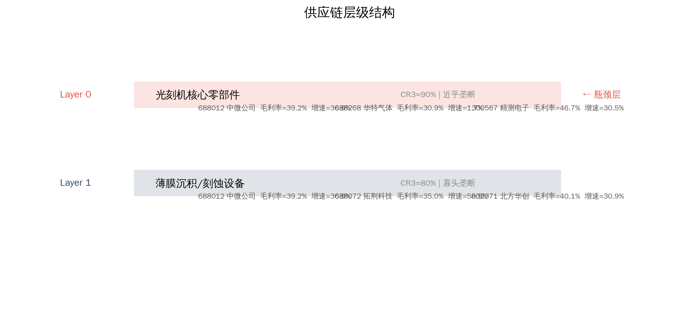
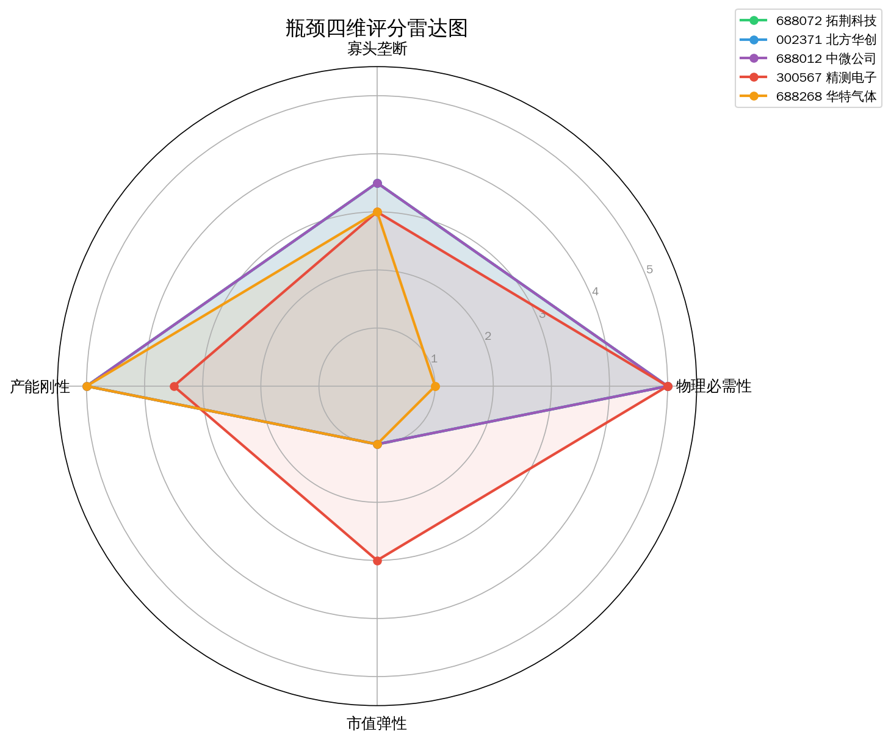
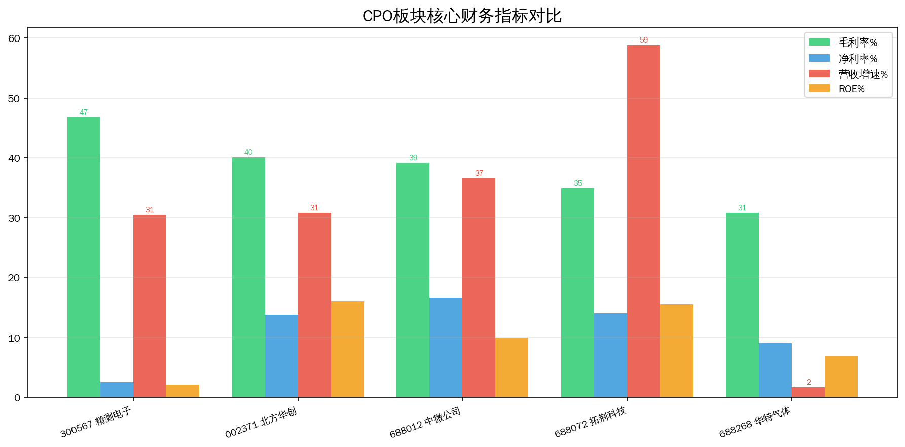
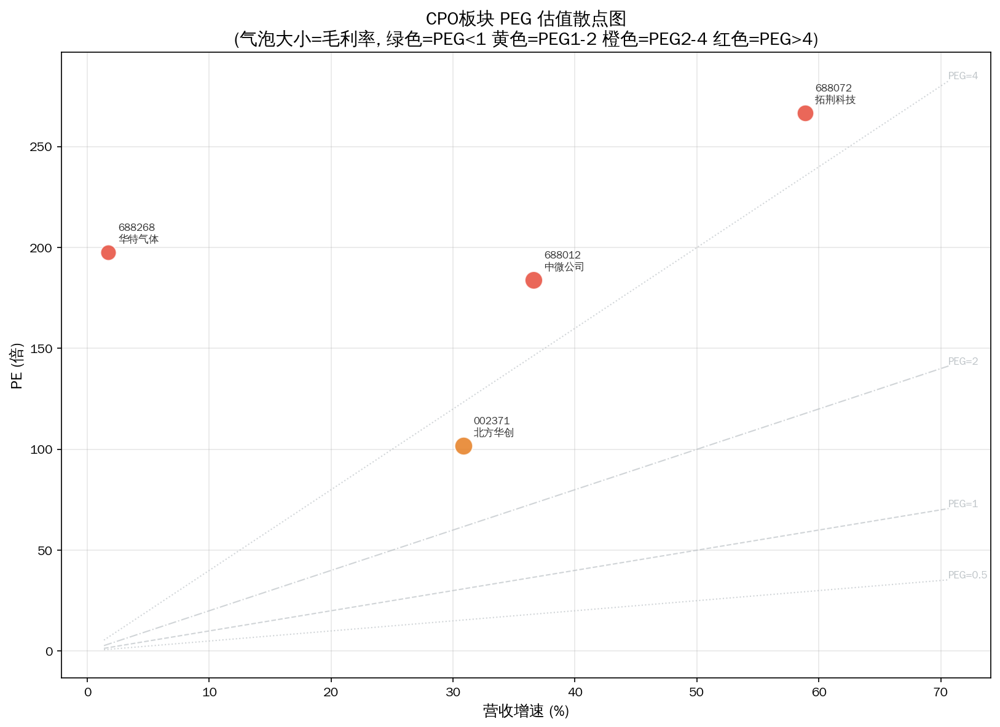
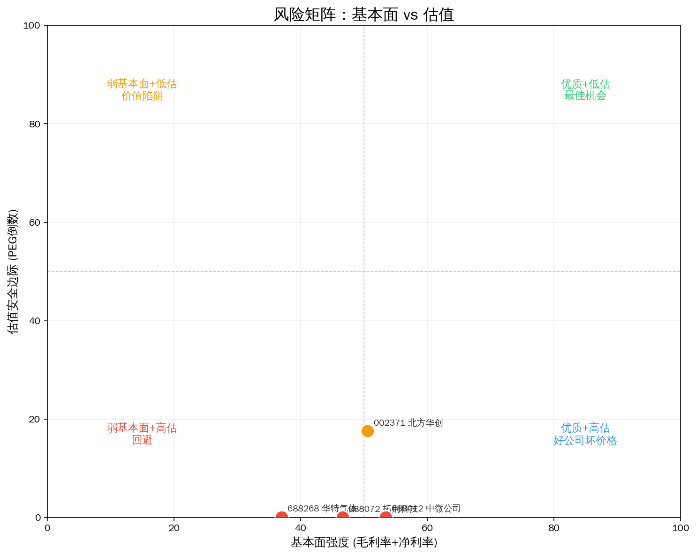
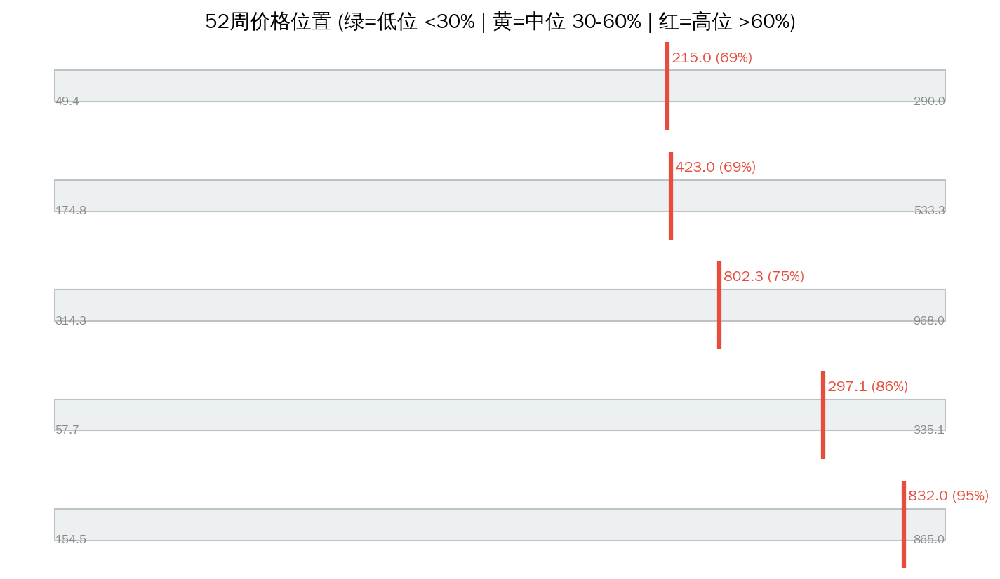

# 半导体设备 Serenity 瓶颈分析（Phase-2 防伪重跑）

> 分析日期: 2026-07-14 | 方法论: Serenity Phase-2 | 引擎: screen_bottleneck methodology_version=phase2-2026-07-14  
> 数据源: Tushare | 图谱: supply_chain v0.2.0 | 注解: company_annotations 全覆盖

## 1. 板块周期定位

**产业触发：** 中美科技脱钩+国内晶圆厂扩产潮

**图谱描述：** 芯片制造前端设备，国产替代核心赛道

**瓶颈层：** Layer 0 — 光刻机核心零部件  
**瓶颈理由：** 光刻机完全依赖进口，核心零部件国产化率极低

**Phase-2 结论：** 瓶颈层「光刻机核心零部件」过线标的 2 只，平均毛利率 38.8%。 财务尚能支撑部分壁垒叙事。

**综合判断：** Phase-2 分轨：leaf=0 leader=4 beta=1 watch=0 过滤=0。紫苏叶轨道为空；龙头轨道看 拓荆科技。

---

## 2. 供应链结构（含主业）



```
**Layer 0: 光刻机核心零部件  CR3=90%  竞争: near_monopoly  ← 理论瓶颈层**
  ├── 688012 中微公司  track=large_cap_leader  match=core  分=3.9  PE=183.8591  毛利=39.1654  增速=36.62
  │     主业: 刻蚀及MOCVD等半导体设备
  ├── 688268 华特气体  track=large_cap_leader  match=adjacent  分=2.6  PE=197.5323  毛利=30.873  增速=1.7
  │     主业: 特种气体
  ├── 300567 精测电子  track=cycle_beta  match=adjacent  分=3.7  PE=None  毛利=46.7304  增速=30.51
  │     主业: 半导体/显示检测设备

Layer 1: 薄膜沉积/刻蚀设备  CR3=80%  竞争: oligopoly
  ├── 688012 中微公司  track=large_cap_leader  match=core  分=3.9  PE=183.8591  毛利=39.1654  增速=36.62
  │     主业: 刻蚀及MOCVD等半导体设备
  ├── 688072 拓荆科技  track=large_cap_leader  match=core  分=3.9  PE=266.6224  毛利=34.9523  增速=58.87
  │     主业: 薄膜沉积等设备
  ├── 002371 北方华创  track=large_cap_leader  match=core  分=3.9  PE=101.7438  毛利=40.1037  增速=30.85
  │     主业: 半导体工艺设备平台

```

---

## 3. 分轨排序（禁止 leaf 与 leader 混读）



| 排名 | 代码 | 名称 | 综合分 | 轨道 | 匹配 | N/M/R/E | PEG | 市值(亿) | 判断 |
|------|------|------|--------|------|------|---------|-----|---------|------|
| 1 | 688072 | 拓荆科技 | 3.9 | large_cap_leader | core | 5.0/3.5/5.0/1.0 | 4.53 | 2470.8 | potential |
| 2 | 002371 | 北方华创 | 3.9 | large_cap_leader | core | 5.0/3.5/5.0/1.0 | 3.30 | 5618.3 | potential |
| 3 | 688012 | 中微公司 | 3.9 | large_cap_leader | core | 5.0/3.5/5.0/1.0 | 5.02 | 3882.1 | potential |
| 4 | 300567 | 精测电子 | 3.7 | cycle_beta | adjacent | 5.0/3.0/3.5/3.0 | N/A | N/A | potential |
| 5 | 688268 | 华特气体 | 2.6 | large_cap_leader | adjacent | 1.0/3.0/5.0/1.0 | 116.20 | 267.4 | unlikely |

### 3.1 紫苏叶轨道 serenity_leaf

- **本板块本轨为空**

### 3.2 大市值龙头 large_cap_leader

- 拓荆科技（688072）分=3.9 市值=2470.8亿
- 北方华创（002371）分=3.9 市值=5618.3亿
- 中微公司（688012）分=3.9 市值=3882.1亿
- 华特气体（688268）分=2.6 市值=267.4亿

### 3.3 景气相邻 cycle_beta / 观察 watchlist

- beta: 精测电子
- watch: 无

### 3.4 已过滤

| 代码 | 名称 | 匹配 | 原因 |
|------|------|------|------|
| — | — | — | 无 |

### 3.5 已否决（mismatch）

| 代码 | 名称 | 主业 | 状态 |
|------|------|------|------|
| — | 无 mismatch 过滤 | — | — |

---

## 4. 核心发现与主业校验



### 强制主业披露（Top 标的）

- **拓荆科技（688072）**  
  **主业：** 薄膜沉积等设备 ｜ **匹配：** core ｜ **轨道：** large_cap_leader  
  定价权=has ｜ 客户验证=True ｜ kill: 估值与位置过高
- **北方华创（002371）**  
  **主业：** 半导体工艺设备平台 ｜ **匹配：** core ｜ **轨道：** large_cap_leader  
  定价权=has ｜ 客户验证=True ｜ kill: 资本开支周期
- **中微公司（688012）**  
  **主业：** 刻蚀及MOCVD等半导体设备 ｜ **匹配：** core ｜ **轨道：** large_cap_leader  
  定价权=has ｜ 客户验证=True ｜ kill: 订单下滑;估值
- **精测电子（300567）**  
  **主业：** 半导体/显示检测设备 ｜ **匹配：** adjacent ｜ **轨道：** cycle_beta  
  定价权=weak ｜ 客户验证=True ｜ kill: 主业结构变化
- **华特气体（688268）**  
  **主业：** 特种气体 ｜ **匹配：** adjacent ｜ **轨道：** large_cap_leader  
  定价权=weak ｜ 客户验证=True ｜ kill: 增速失速

### 名义瓶颈 vs 财务

瓶颈层「光刻机核心零部件」过线标的 2 只，平均毛利率 38.8%。 财务尚能支撑部分壁垒叙事。

### 角色（非投资建议）

- **紫苏叶：** 无（本板块无 serenity_leaf）
- **龙头 β：** 拓荆科技 — 薄膜沉积等设备
- **赔率：** 北方华创 PEG=3.3

---

## 5. 估值与风险







| 名称 | 收盘 | 位置% | PEG | PE | 毛利% | 增速% |
|------|------|-------|-----|-----|-------|-------|
| 拓荆科技 | 850.01 | 88.0 | 4.53 | 266.6 | 35.0 | 58.9 |
| 北方华创 | 774.20 | 70.4 | 3.30 | 101.7 | 40.1 | 30.9 |
| 中微公司 | 405.30 | 64.3 | 5.02 | 183.9 | 39.2 | 36.6 |
| 精测电子 | 297.10 | 86.3 | N/A | N/A | 46.7 | 30.5 |
| 华特气体 | 209.40 | 66.5 | 116.20 | 197.5 | 30.9 | 1.7 |

---

## 6. 信号对照

| 做多结构 | 做空/回避 |
|---------|----------|
| ✅ 触发：中美科技脱钩+国内晶圆厂扩产潮 | ❌ mismatch 已否决见上表 |
| ✅ 过线 5 只带主业披露 | ❌ 无定价权/弱映射标的勿当紫苏叶 |
| ✅ leaf 轨道 0 只 | ❌ 大市值 leader 不作弹性仓 |

**综合判断：** Phase-2 分轨：leaf=0 leader=4 beta=1 watch=0 过滤=0。紫苏叶轨道为空；龙头轨道看 拓荆科技。

---

## 7. 风险提示

- ⚠️ Phase-2 仍依赖注解质量；`adjacent` 不等于已验证瓶颈收入占比
- ⚠️ 结构垄断无定价权标的禁止按 likely_genuine 买入叙事
- ⚠️ 大市值龙头轨道波动与指数相关，非小盘弹性
- ⚠️ 图谱可能滞后，扩产与客户认证需公告交叉验证
- ⚠️ 本报告不构成投资建议，单票仓位建议 ≤15%

---
Data as of: 2026-07-14  
Generated: 2026-07-14  
methodology_version: phase2-2026-07-14

---
⚠️ 本报告基于 Tushare 公开数据、供应链图谱与主业注解，经 Phase-2 防伪引擎过滤后由 LLM 整理，**不构成投资建议**。
🤖 Generated with [Claude Code](https://claude.com/claude-code)
