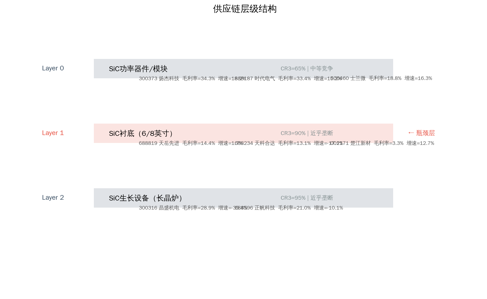
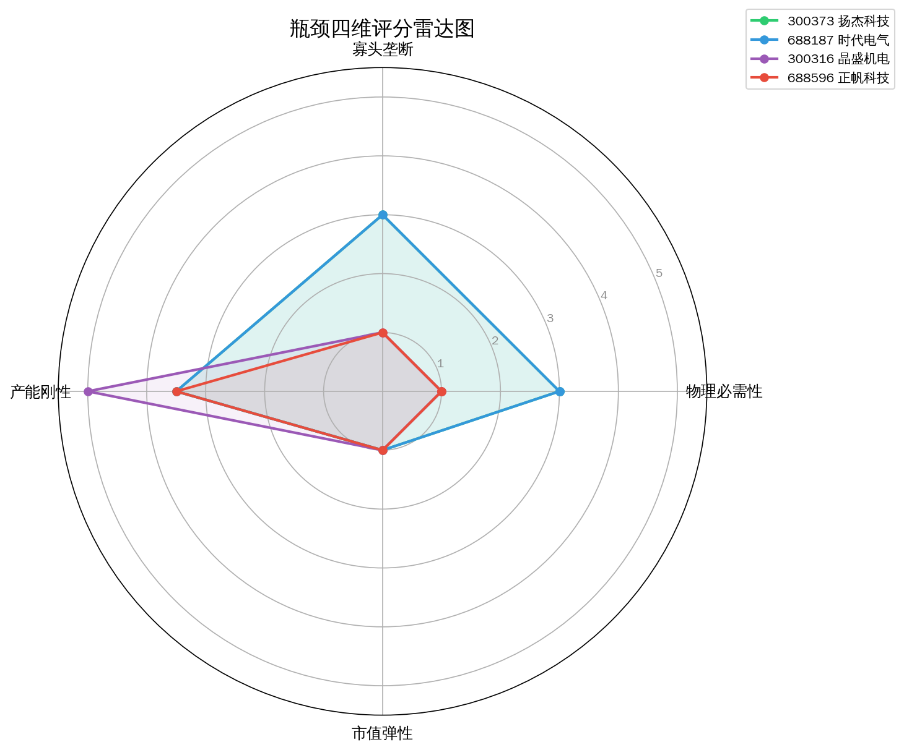
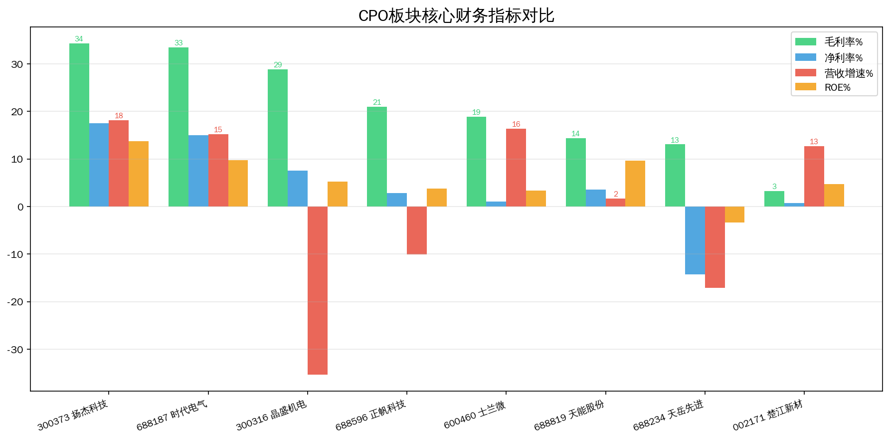
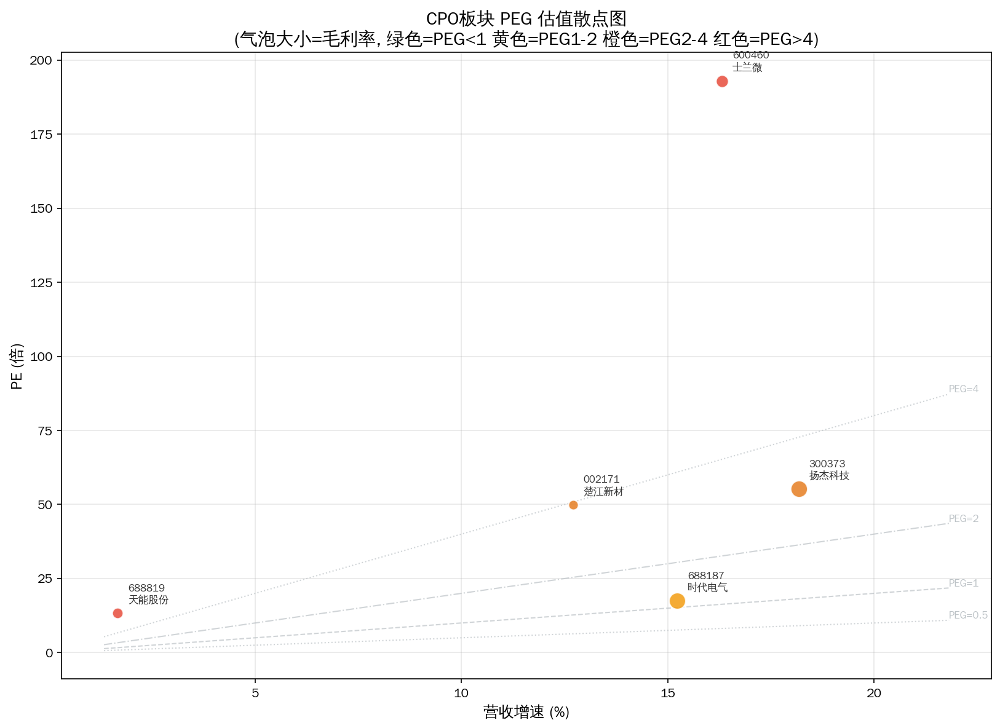

# 碳化硅SiC Serenity 瓶颈分析报告

> 分析日期: 2026-07-09 | 方法论: Serenity Choke Point Theory | 数据源: Tushare

## 1. 板块周期定位

第三代半导体衬底材料，新能源车电驱和充电桩功率器件核心材料。

**驱动因素**: 800V高压平台渗透率快速提升，SiC器件需求爆发

## 2. 供应链结构

**Layer 0: SiC功率器件/模块**  CR3=65%  moderate
  - 300373 扬杰科技  PE=55.2766  毛利率=34.2728%  增速=18.18%
  - 688187 时代电气  PE=17.4922  毛利率=33.432%  增速=15.23%
  - 600460 士兰微  PE=192.9409  毛利率=18.8337%  增速=16.32%

**Layer 1: SiC衬底（6/8英寸）**  CR3=90%  near_monopoly ← **瓶颈层**
  - 688819 天岳先进  PE=13.3281  毛利率=14.3546%  增速=1.67%
  - 688234 天科合达  PE=?  毛利率=13.0541%  增速=-17.15%
  - 002171 楚江新材  PE=49.8062  毛利率=3.253%  增速=12.7%

**Layer 2: SiC生长设备（长晶炉）**  CR3=95%  near_monopoly
  - 300316 晶盛机电  PE=69.8627  毛利率=28.8803%  增速=-35.38%
  - 688596 正帆科技  PE=163.315  毛利率=20.9936%  增速=-10.11%

## 3. 瓶颈评分

**⚠️ 全部标的未通过量化筛选。** 这不一定意味着没有瓶颈——更可能说明瓶颈尚未在财务层面兑现（这正是 Serenity 方法寻找的"研究差"机会）。

**已过滤标的:**

- 002171 楚江新材: 毛利率<20%，议价能力弱，商品化业务
- 300316 晶盛机电: 市值>100亿，弹性有限
- 300373 扬杰科技: 市值>100亿，弹性有限
- 600460 士兰微: 毛利率<20%，议价能力弱，商品化业务
- 688187 时代电气: 市值>100亿，弹性有限
- 688234 天岳先进: 毛利率<20%，议价能力弱，商品化业务
- 688596 正帆科技: 市值>100亿，弹性有限
- 688819 天能股份: 毛利率<20%，议价能力弱，商品化业务

## 4. 瓶颈分析

**理论瓶颈层**: Layer 1 — 8英寸SiC衬底良率<50%，全球仅4家量产，车规认证周期>12个月，衬底缺口持续至2028年

瓶颈层标的被过滤: 3 只 — 当前财务数据未体现垄断定价权

## 5. 财务对比

## 6. 风险提示

- ⚠️ **技术路线风险**: 碳化硅SiC涉及多条技术路线并行，路线收敛方向决定瓶颈归属
- ⚠️ **产能兑现风险**: 扩产计划可能因设备交付、良率爬坡延迟
- ⚠️ **政策风险**: 产业补贴退坡或技术管制升级可能影响供需格局
- ⚠️ **流动性风险**: 部分标的市值偏小，日内波动可能超10%
- ⚠️ **信息验证风险**: 供应链产能数据需通过公司公告和行业调研独立验证

---
数据截至: 2026-07-08 | 生成时间: 2026-07-09
⚠️ 本报告不构成投资建议。