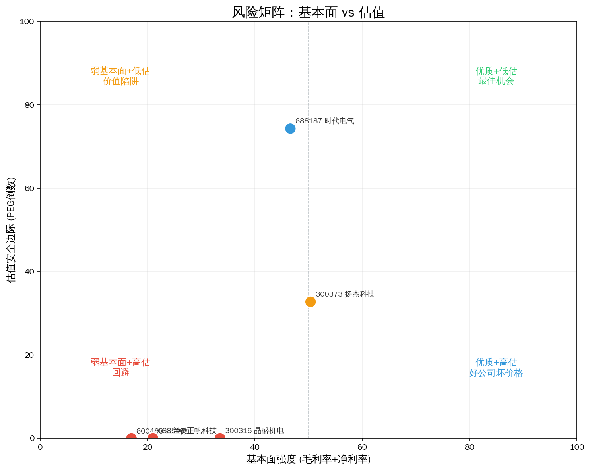
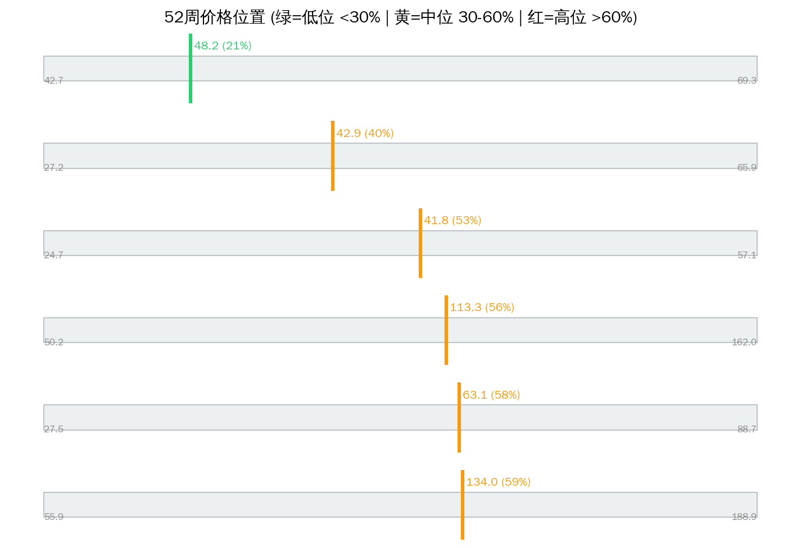

# 碳化硅SiC Serenity 瓶颈分析（Phase-2 防伪重跑）

> 分析日期: 2026-07-14 | 方法论: Serenity Phase-2 | 引擎: screen_bottleneck methodology_version=phase2-2026-07-14  
> 数据源: Tushare | 图谱: supply_chain v0.2.0 | 注解: company_annotations 全覆盖

## 1. 板块周期定位

**产业触发：** 800V高压平台渗透率快速提升，SiC器件需求爆发

**图谱描述：** 第三代半导体衬底材料，新能源车电驱和充电桩功率器件核心材料

**瓶颈层：** Layer 1 — SiC衬底（6/8英寸）  
**瓶颈理由：** 8英寸SiC衬底良率<50%，全球仅4家量产，车规认证周期>12个月，衬底缺口持续至2028年

**Phase-2 结论：** 瓶颈层「SiC衬底（6/8英寸）」无过线标的（全过滤或弱映射）— **A股可投资咽喉空窗。**

**综合判断：** Phase-2 分轨：leaf=0 leader=4 beta=0 watch=0 过滤=2。紫苏叶轨道为空；龙头轨道看 扬杰科技。

---

## 2. 供应链结构（含主业）


```
Layer 0: SiC功率器件/模块  CR3=65%  竞争: moderate
  ├── 300373 扬杰科技  track=large_cap_leader  match=adjacent  分=2.8  PE=48.9132  毛利=34.2728  增速=18.18
  │     主业: 功率半导体器件
  ├── 688187 时代电气  track=large_cap_leader  match=adjacent  分=2.8  PE=15.6506  毛利=33.432  增速=15.23
  │     主业: 轨交+功率半导体
  ├── 600460 士兰微  ❌ 毛利率<20%，议价能力弱，商品化业务
  │     主业: 集成电路与功率器件

**Layer 1: SiC衬底（6/8英寸）  CR3=90%  竞争: near_monopoly  ← 理论瓶颈层**
  ├── 688234 天岳先进  ❌ 毛利率<20%，议价能力弱，商品化业务
  │     主业: 导电型碳化硅衬底

Layer 2: SiC生长设备（长晶炉）  CR3=95%  竞争: near_monopoly
  ├── 300316 晶盛机电  track=large_cap_leader  match=adjacent  分=2.0  PE=63.4537  毛利=28.8803  增速=-35.38
  │     主业: 晶体生长设备（硅/SiC）
  ├── 688596 正帆科技  track=large_cap_leader  match=adjacent  分=1.6  PE=136.2109  毛利=20.9936  增速=-10.11
  │     主业: 高纯工艺介质供应系统

```

---

## 3. 分轨排序（禁止 leaf 与 leader 混读）


| 排名 | 代码 | 名称 | 综合分 | 轨道 | 匹配 | N/M/R/E | PEG | 市值(亿) | 判断 |
|------|------|------|--------|------|------|---------|-----|---------|------|
| 1 | 300373 | 扬杰科技 | 2.8 | large_cap_leader | adjacent | 3.0/3.0/3.5/1.0 | 2.69 | 615.6 | unlikely |
| 2 | 688187 | 时代电气 | 2.8 | large_cap_leader | adjacent | 3.0/3.0/3.5/1.0 | 1.03 | 641.1 | unlikely |
| 3 | 300316 | 晶盛机电 | 2.0 | large_cap_leader | adjacent | 1.0/1.0/5.0/1.0 | N/A | 561.4 | unlikely |
| 4 | 688596 | 正帆科技 | 1.6 | large_cap_leader | adjacent | 1.0/1.0/3.5/1.0 | N/A | 185.7 | unlikely |

### 3.1 紫苏叶轨道 serenity_leaf

- **本板块本轨为空**

### 3.2 大市值龙头 large_cap_leader

- 扬杰科技（300373）分=2.8 市值=615.6亿
- 时代电气（688187）分=2.8 市值=641.1亿
- 晶盛机电（300316）分=2.0 市值=561.4亿
- 正帆科技（688596）分=1.6 市值=185.7亿

### 3.3 景气相邻 cycle_beta / 观察 watchlist

- beta: 无
- watch: 无

### 3.4 已过滤

| 代码 | 名称 | 匹配 | 原因 |
|------|------|------|------|
| 600460 | 士兰微 | adjacent | 毛利率<20%，议价能力弱，商品化业务 |
| 688234 | 天岳先进 | core | 毛利率<20%，议价能力弱，商品化业务 |

### 3.5 已否决（mismatch）

| 代码 | 名称 | 主业 | 状态 |
|------|------|------|------|
| — | 无 mismatch 过滤 | — | — |

---

## 4. 核心发现与主业校验


### 强制主业披露（Top 标的）

- **扬杰科技（300373）**  
  **主业：** 功率半导体器件 ｜ **匹配：** adjacent ｜ **轨道：** large_cap_leader  
  定价权=weak ｜ 客户验证=True ｜ kill: 竞争
- **时代电气（688187）**  
  **主业：** 轨交+功率半导体 ｜ **匹配：** adjacent ｜ **轨道：** large_cap_leader  
  定价权=weak ｜ 客户验证=True ｜ kill: 轨交波动
- **晶盛机电（300316）**  
  **主业：** 晶体生长设备（硅/SiC） ｜ **匹配：** adjacent ｜ **轨道：** large_cap_leader  
  定价权=weak ｜ 客户验证=True ｜ kill: 光伏设备拖累
- **正帆科技（688596）**  
  **主业：** 高纯工艺介质供应系统 ｜ **匹配：** adjacent ｜ **轨道：** large_cap_leader  
  定价权=weak ｜ 客户验证=True ｜ kill: 收入下滑

### 名义瓶颈 vs 财务

瓶颈层「SiC衬底（6/8英寸）」无过线标的（全过滤或弱映射）— **A股可投资咽喉空窗。**

### 角色（非投资建议）

- **紫苏叶：** 无（本板块无 serenity_leaf）
- **龙头 β：** 扬杰科技 — 功率半导体器件
- **赔率：** 时代电气 PEG=1.03

---

## 5. 估值与风险






| 名称 | 收盘 | 位置% | PEG | PE | 毛利% | 增速% |
|------|------|-------|-----|-----|-------|-------|
| 扬杰科技 | 113.30 | 56.4 | 2.69 | 48.9 | 34.3 | 18.2 |
| 时代电气 | 48.18 | 20.5 | 1.03 | 15.7 | 33.4 | 15.2 |
| 晶盛机电 | 42.87 | 40.5 | N/A | 63.5 | 28.9 | -35.4 |
| 正帆科技 | 63.12 | 58.2 | N/A | 136.2 | 21.0 | -10.1 |

---

## 6. 信号对照

| 做多结构 | 做空/回避 |
|---------|----------|
| ✅ 触发：800V高压平台渗透率快速提升，SiC器件需求爆发 | ❌ mismatch 已否决见上表 |
| ✅ 过线 4 只带主业披露 | ❌ 无定价权/弱映射标的勿当紫苏叶 |
| ✅ leaf 轨道 0 只 | ❌ 大市值 leader 不作弹性仓 |

**综合判断：** Phase-2 分轨：leaf=0 leader=4 beta=0 watch=0 过滤=2。紫苏叶轨道为空；龙头轨道看 扬杰科技。

---

## 7. 风险提示

- ⚠️ Phase-2 仍依赖注解质量；`adjacent` 不等于已验证瓶颈收入占比
- ⚠️ 结构垄断无定价权标的禁止按 likely_genuine 买入叙事
- ⚠️ 大市值龙头轨道波动与指数相关，非小盘弹性
- ⚠️ 图谱可能滞后，扩产与客户认证需公告交叉验证
- ⚠️ 本报告不构成投资建议，单票仓位建议 ≤15%

---
Data as of: 2026-07-14  
Generated: 2026-07-14  
methodology_version: phase2-2026-07-14

---
⚠️ 本报告基于 Tushare 公开数据、供应链图谱与主业注解，经 Phase-2 防伪引擎过滤后由 LLM 整理，**不构成投资建议**。
🤖 Generated with [Claude Code](https://claude.com/claude-code)
