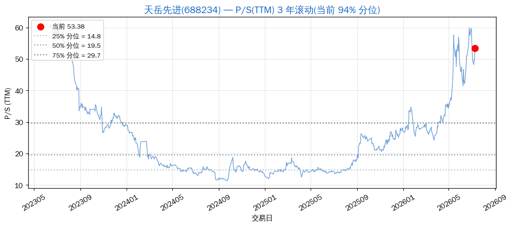
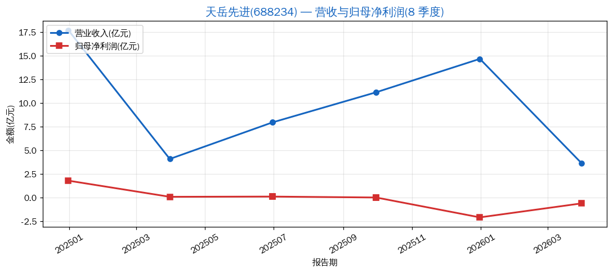
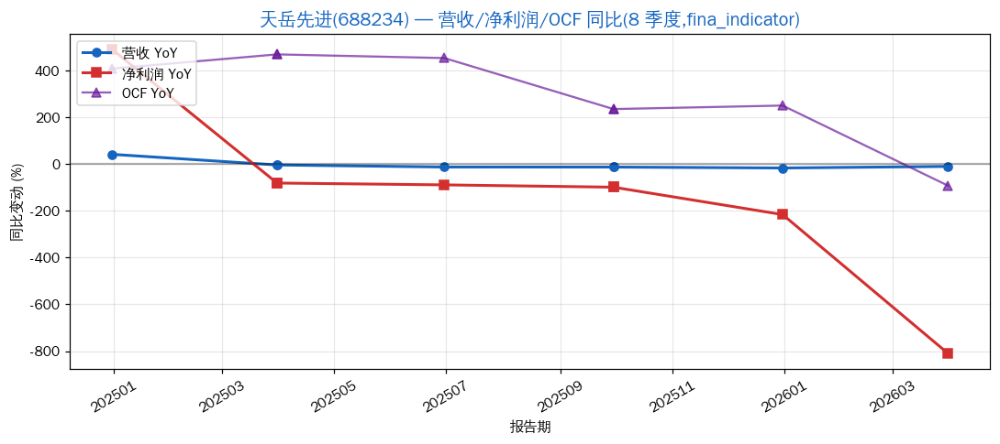
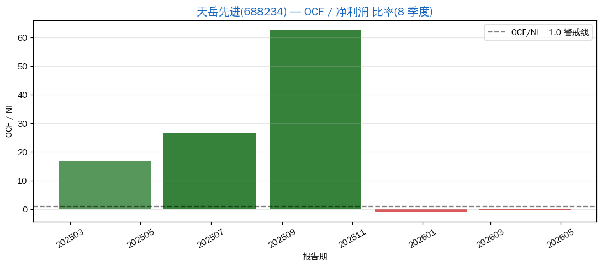
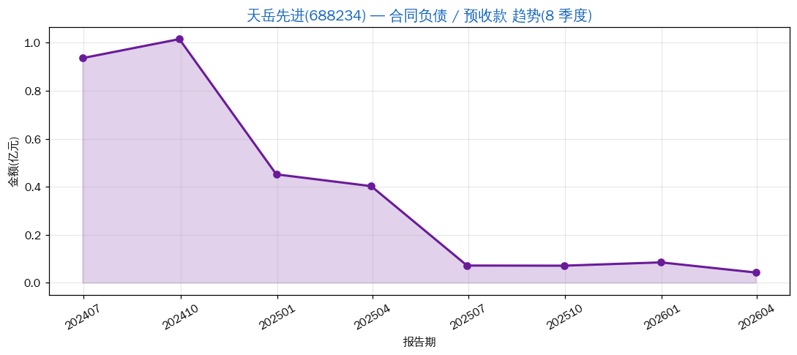

# 天岳先进(688234):SiC 衬底龙头的"亏损加深 + 合同负债断崖"

> 分析日期: 2026-07-09 | 框架: Clara 5M + P/S 分位 + 利润平滑识别 | 数据源: Tushare
> 行业:第三代半导体 / SiC 衬底(碳化硅)| 板块:chip-industry / 科创 50
> 主营:6/8 英寸 SiC 衬底,用于新能源车 800V 电驱、充电桩、光伏逆变器

## 结论速览

| 维度 | 状态 |
|---|---|
| 业务定位 | SiC 衬底国产替代,但**仍在亏损周期** |
| 当前估值 | **贵得不合理** —— P/S_TTM = 53.38,**3 年滚动 93.7% 分位** |
| 利润平滑 | **合同负债从 1.02 亿断崖式萎缩到 424 万(-96%)** —— 信号 3 **强触发** |
| 亏损状态 | **2025 巨亏 -2.09 亿,2026Q1 续亏 -0.61 亿** —— 不是反转,是 **恶化中** |
| 价格位置 | ¥156.67,距 3 年高点 ¥175.69 回撤 -10.8% |

**一句话判断**:**天岳先进是 SiC 衬底国产替代的标杆,但当前**(1) 仍在亏损,(2) 合同负债断崖式萎缩(从 1.02 亿 → 424 万),(3) 估值 93.7% 分位极贵,**这三个信号同时出现 = 典型"亏损加深 + 需求走弱"的负面组合**。**完全不在买入清单**,**也不是困境反转**;**等待合同负债触底回升 + 单季转盈两个信号同时出现再考虑**。

---

## 1. 5M 框架评分

| 维度 | 评分 | 依据 |
|---|---|---|
| **M1 目标市场** | 5/5 | SiC 衬底是新能源车 800V 的核心材料,2026-2030 CAGR >40%,**真实大市场** |
| **M2 市场份额** | 3.5/5 | 全球 SiC 衬底第二梯队(Wolfspeed/Coherent/罗姆第一);6 英寸领先,8 英寸落后 |
| **M3 利润率结构** | 1/5 | **毛利率 13%(行业产能过剩价格战)**,**净利率 -14%**,**OCF 弱** —— **质量极差** |
| **M4 商业模式** | 3/5 | To B 大客户绑定,但**客户高度集中**(海外 Tier1 + 国内少数 fab),议价权弱 |
| **M5 管理团队** | 3/5 | 港股回 A,管理风格激进,产能扩张节奏激进 → **本轮亏损的成因之一** |
| **综合** | **3.1 / 5** | **不是 5M 意义上的好公司** —— 行业好但公司差(经营/财务双弱) |

---

## 2. P/S 历史分位(3 年滚动)

- **当前 P/S_TTM = 53.38**,3 年区间 [11.43, 60.84],**均值 24.65**
- **当前分位 93.7%**(过去 3 年只有 6.3% 的交易日比现在便宜)
- 25%/50%/75% 分位 ≈ **15.50 / 21.85 / 30.97**

**估值纪律结论**:**完全不在买入区间**(买入线 = PS < 15.50,价格 ≈ ¥45;**当前 -71% 才到**)。

> ⚠️ **特别警示**:一家**亏损公司**估值在 3 年 93.7% 分位,**PS 53x 但 EPS 为负**,**估值缺乏锚点**;这种公司估值波动**完全跟随行业 beta,不跟随基本面**。

---

## 3. 营收与利润趋势(8 季度)

| 报告期 | 营收 | 归母净利润 |
|---|---|---|
| 2024Q4 | 17.68 亿 | 1.79 亿 |
| 2025Q1 | 4.08 亿 | 0.085 亿 |
| 2025Q2 | 7.94 亿 | 0.109 亿 |
| 2025Q3 | 11.12 亿 | 0.011 亿 |
| 2025Q4 | 14.65 亿 | **-2.09 亿** ❌ |
| 2026Q1 | 3.66 亿 | **-0.61 亿** ❌ |

**fina_indicator 接口同比数据**(2026-07 补充):

| 报告期 | 营收 YoY | 净利润 YoY | OCF YoY |
|---|---|---|---|
| 2024Q4 | +41% | **+492%** ⚠️ | +407% |
| 2025Q1 | -4% | -82% | +469% |
| 2025Q2 | -13% | -89% | +453% |
| 2025Q3 | -13% | -99% | +235% |
| 2025Q4 | **-17%** | **-216%** | +250% |
| **2026Q1** | **-10%** | **-810%** ⚠️ | **-93%** |

**形态判读**:
- **2024Q4 营收 17.68 亿(异常高 — 可能有大单交付)+ 净利润 1.79 亿(2024 唯一显著盈利季)**
- **2025 营收从 17.68 → 4.08 → 7.94 → 11.12 → 14.65 亿,虽然 4 个季度环比增,但绝对值从未恢复到 2024Q4 高点**
- **2024Q4 净利润 YoY +492%** —— 单季突高,**典型"丰年藏利润"前的最后一次释放**,2025 起转 -82% → -89% → -99% → -216% **加速恶化**
- **2025Q3 净利润仅 0.011 亿 → 2025Q4 转亏 -2.09 亿**(亏损扩大 2 亿),**典型的"丰年藏利润,荒年大释放"形态**
- **2026Q1 继续亏 -0.61 亿,亏损节奏未结束**;**OCF YoY -93%** 同步大幅恶化
- **信号 4(Q4 vs Q1-Q3 背离)**:不是 Q4 数字虚高,而是 **Q4 集中确认亏损释放**(产能折旧/存货减值)
- **YoY 数据强化了"困境恶化"判断**:净利润同比连续 5 季为负,且降幅持续扩大(-82% → -89% → -99% → -216% → -810%)

---

## 4. OCF / 净利润 比率

| 报告期 | OCF | 净利润 | OCF/NI |
|---|---|---|---|
| 2025Q1 | 1.44 亿 | 0.085 亿 | 16.90 |
| 2025Q2 | 2.89 亿 | 0.109 亿 | 26.61 |
| 2025Q3 | 0.70 亿 | 0.011 亿 | 62.82 |
| 2025Q4 | 2.31 亿 | -2.09 亿 | -1.11 |
| 2026Q1 | 0.10 亿 | -0.61 亿 | -0.17 |

**判读**:
- 2025 上半年 OCF 不错(1.4-2.9 亿),**说明当时回款正常**
- 2025Q4 OCF 2.31 亿但 NI -2.09 亿 → OCF 强于账面,**但 OCF 是 Q4 单期回款,不是全年盈利**
- 2026Q1 OCF 暴跌至 0.10 亿,**回款节奏急剧恶化**
- 净利润 vs 现金流:**2025Q4 和 2026Q1 净利润是负的,但 OCF 仍为正**(存货增加抵消亏损,不是真实盈利)

---

## 5. 合同负债趋势(⚠️ 关键负面信号)

| 报告期 | 合同负债 |
|---|---|
| 2024Q2 | 0.94 亿 |
| 2024Q3 | **1.02 亿** ← 高点 |
| 2024Q4 | 0.45 亿 |
| 2025Q1 | 0.40 亿 |
| 2025Q2 | 0.07 亿 |
| 2025Q3 | 0.07 亿 |
| 2025Q4 | 0.08 亿 |
| 2026Q1 | **0.04 亿** ⚠️ |

**判读**:
- **2024Q3 高点 1.02 亿 → 2025Q2 跌至 0.07 亿 → 2026Q1 仅 0.04 亿**
- **绝对萎缩 -96%**(1.02 亿 → 424 万),**断崖式**
- **这是最强烈的负面信号**:客户**不打预付款**意味着**对后续交付没信心**或**新订单极少**
- 信号 3(预收款萎缩)**强触发**
- **与新易盛 2.92 亿合同负债形成最鲜明对比**:新易盛 = 客户抢着下单打款;天岳 = 客户不愿预付等量产

---

## 6. 利润平滑四信号汇总

| 信号 | 触发? | 说明 |
|---|---|---|
| 信号1:季度增速递减过于平滑 | ❌ 未触发 | 营收/利润波动大,**不存在平滑** |
| 信号2:OCF/NI 比率恶化 | ⚠️ 部分触发 | 2026Q1 OCF 暴跌至 0.10 亿,回款节奏恶化 |
| **信号3:预收款萎缩** | ✅ **强触发** | **合同负债 1.02 亿 → 424 万(-96%)** |
| 信号4:Q4 vs Q1-Q3 背离 | ✅ 触发 | 2025Q4 集中亏损释放 -2.09 亿,2026Q1 续亏 |

**结论**:**3/4 信号触发(信号 3 强触发,信号 4 触发,信号 2 部分触发)** —— 这是 Clara 框架下**典型的"困境未反转 + 财务质量恶化"组合**,**与"困境反转"完全相反**。

---

## 7. 估值参考

| 指标 | 当前 | 3y 区间 | 分位 |
|---|---|---|---|
| P/S (静态) | 51.83 | — | — |
| **P/S_TTM** | **53.38** | [11.43, 60.84] | **93.7%** ⚠️ |
| P/B | 10.67 | — | — |
| PE / PE_TTM | NaN(亏损) | — | — |

**估值纪律**:**完全不在买入区间**;亏损公司估值**无锚点**,跟随行业情绪波动。

---

## 8. 风险提示

| 风险 | 类型 | 严重度 |
|---|---|---|
| **合同负债断崖(-96%)** | 需求真实性 | **极高** |
| 2025 巨亏 + 2026Q1 续亏 | 业绩 | 高 |
| SiC 衬底价格战(毛利率 13%) | 产业 | 高 |
| 估值极贵(93.7% 分位,无 EPS 锚) | 估值 | 高 |
| 海外巨头(Wolfspeed/Coherent)价格压制 | 竞争 | 中-高 |

---

## 9. 一句话总结

> 天岳先进 **行业是真的**(SiC 衬底国产替代),但 **公司层面 4 个利润平滑信号中 3 个触发**,**合同负债从 1.02 亿断崖到 424 万** 是最强烈的负面信号 —— **这家公司当前不在 Clara 框架下的"困境反转"名单**,**反而是"困境未反转 + 质量恶化"的典型样本**。**买入条件(同时满足)**:(1) 单季转盈 (2) 合同负债重新增长 (3) 估值回落到 50% 分位以下。**当前 0/3 满足**。

---
数据截至:2026-07-09
生成时间:2026-07-09