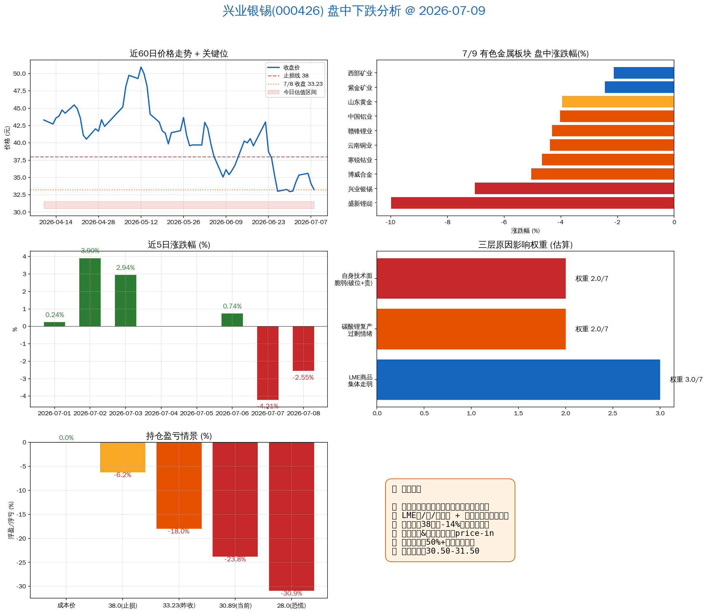

# 兴业银锡(000426) 7/9 盘中下跌原因分析

## 结论

不是兴业银锡个股出问题，是**有色金属板块系统性下跌**。LME 基本金属集体走弱 + 碳酸锂复产情绪传染 → 板块普跌。兴业银锡因自身已破止损位、估值偏贵，跌幅在板块中排第二。

---

## 核心数据

| 指标 | 数值 |
|---|---|
| 7/9 实时价格 (11:23) | **30.89 元 (-7.04%)** |
| 7/8 收盘价 | 33.23 元 |
| 5日累计跌幅 | -11.8% (7/2→7/8) |
| 持仓成本 | 40.52 元 |
| 当前浮亏 | **-23.8%** |
| 止损线 | 38.0 元 (已破 14 日) |
| 7/8 P/S 分位 | 76.7% (偏贵) |
| 7/8 P/B 分位 | 75% (偏贵) |

---

## 三层下跌原因

### 第一层：LME 基本金属集体走弱（最直接导火索）

2026-07-08 夜盘/07-09 凌晨 LME 全面收跌：

- LME 期锡 **-1255 美元 (-2.4%)**，报 52095 美元/吨
- LME 期铜 -200 美元，报 13166 美元/吨
- LME 期锌 -53 美元，报 3519 美元/吨
- 黄金同步走弱：伦敦金 4042 美元/盎司 (-0.52%)

**传导链**：商品价格下跌 → 矿业股盈利预期下调 → A 股有色板块全线走弱。

### 第二层：碳酸锂过剩逻辑压垮整个板块（领跌品种）

关键背景（财联社 7/8 报道）：

- 碳酸锂主力期货从 5 月高点 20 万/吨跌至 16 万/吨以下
- **宁德时代枧下窝锂矿（国内最大单体锂矿之一）6 月底复产**，供给增量预期压顶
- 涨价逻辑证伪，锂矿板块领跌

板块今日跌幅排序（盘中 11:23）：

| 标的 | 涨跌幅 | 板块归属 |
|---|---|---|
| 盛新锂能 | **-9.99%** | 锂矿 |
| **兴业银锡** | **-7.04%** | **银/锡** |
| 博威合金 | -5.05% | 合金 |
| 寒锐钴业 | -4.67% | 钴 |
| 云南铜业 | -4.39% | 铜 |
| 赣锋锂业 | -4.31% | 锂矿 |
| 中国铝业 | -4.03% | 铝 |
| 山东黄金 | -3.96% | 黄金 |
| 紫金矿业 | -2.45% | 黄金/铜 |
| 西部矿业 | -2.13% | 综合有色 |

全板块 10 只标的 9 只下跌，**系统性问题**。

### 第三层：兴业银锡自身技术面极度脆弱（放大跌幅）

| 维度 | 数据 | 信号 |
|---|---|---|
| 7/8 收盘 33.23 | 已在止损线 38 下方 -14% | 早已破位 |
| 7/7 跌幅 -4.21% | 放量加速 | 技术破位确认 |
| P/S 76.7% 历史分位 | 偏贵 | 缺乏估值安全垫 |
| P/B 75% 历史分位 | 偏贵 | — |
| 港交所 H 股上市 | 2026/5 已递交 | 利多已兑现 |
| 银漫二期(2025/1)、布敦银根(2026/3)扩产 | 已公告 | 扩产已 price-in |

**不是被"错杀"的**——前期涨过的扩产逻辑已兑现 + H 股上市已递交 + 估值偏贵 + 早已跌破止损 → 板块下跌时跌得更狠。

---

## 持仓影响

| 场景 | 价格 | 浮亏 (%) | 状态 |
|---|---|---|---|
| 成本价 | 40.52 | 0% | — |
| 止损线 | 38.00 | -6.2% | 已跌破 10 日+ |
| 7/8 收盘 | 33.23 | -18% | 持续扩大 |
| **当前价 (7/9 11:23)** | **30.89** | **-23.8%** | **加速下跌** |
| 极端情景 | 28.00 | -30.9% | 风险情景 |

---

## 参考建议

1. **减仓 50%+**（P0 — 今日即需考虑）
2. 不要等待反弹——商品下跌周期中"等反弹"往往变成"等更深的底"
3. 目标减仓区间：**30.50-31.50**
4. 剩余仓位可等待 LME 锡价企稳信号后再做判断

---

*图注：左上→近60日价格走势及关键位；右上→有色板块对标实时涨跌幅；中左→近5日涨跌幅；中右→三层原因权重；左下→持仓浮亏情景；右下→核心结论卡片。*

---

数据截至：2026-07-09 11:23 CST（盘中实时）
生成时间：2026-07-09 13:59 CST
数据来源：TuShare 实时行情、新浪财经、财联社
