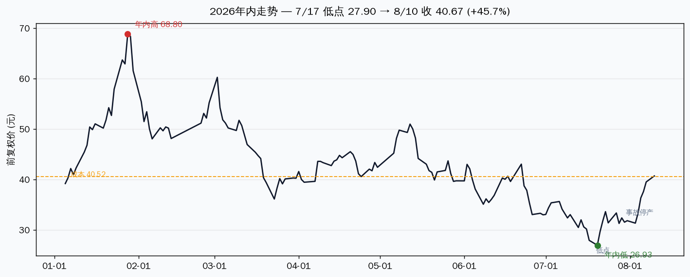
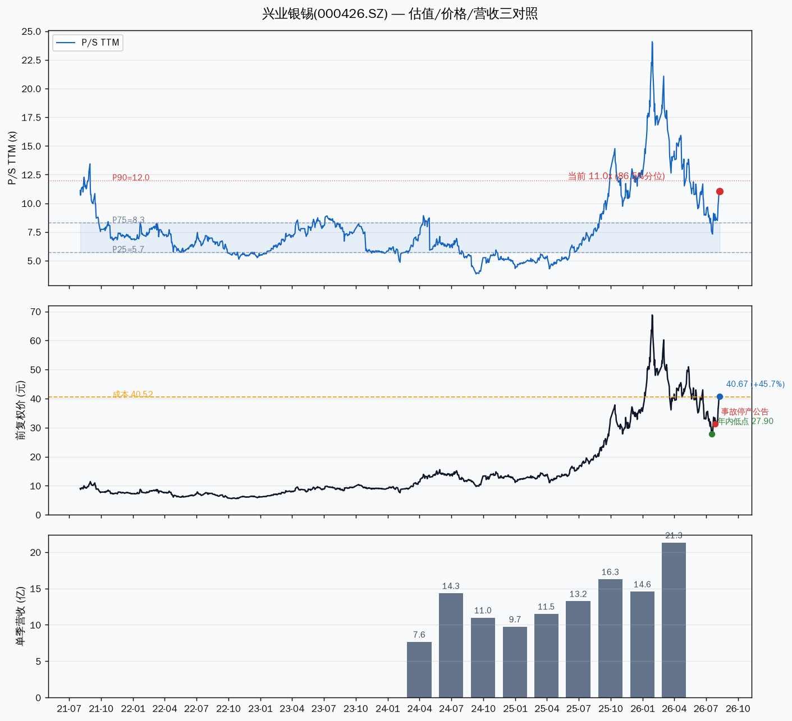
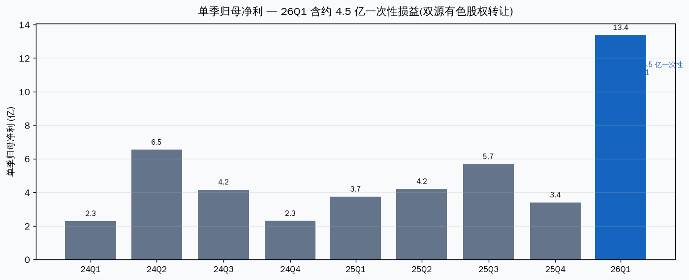

# 兴业银锡(000426.SZ)估值分析 — 该不该减仓

> Data as of: 2026-08-11 09:40 盘中 · 现价 41.13 元(+1.13%) · 昨收 40.67 · 数据源:TuShare / 新浪 / 公司公告

先说结论:**该减,而且是借这波反弹减。** 价格已回到成本线上方(成本 40.52,现价 41.13),P/S TTM 11.05x 站上 5 年 86.5% 分位,而银漫矿业(占净利约 8 成)7/26 事故后采区+选矿全部停产,复产无时间表。这个位置是"商品价高位 + 停产暗雷 + 估值高分位"三重叠加,不是继续加仓的位置。

---

## 一、当前状态

| 指标 | 数值 | 说明 |
|---|---|---|
| 8/11 盘中现价 | **41.13 元 (+1.13%)** | 开 41.67 / 高 41.70 / 低 40.93,成交 7.0 亿 |
| 8/10 收盘 | 40.67 元 (+3.01%) | 近 6 个交易日 +30%(33.28→40.67) |
| 7/17 年内低点 | 27.90 元 | 此后反弹 +45.7% |
| 1/29 年内高点 | 74.80 元(盘中) | 距高点仍 -45% |
| 持仓(历史记录) | 1100 股 / 成本 40.52 | 现价已回到成本上方,浮亏转平 |
| 总市值 | 约 722 亿 | 17.76 亿股 |

## 二、估值三维:分位已到高位区

| 指标 | 当前 | 历史参照 | 位置 |
|---|---|---|---|
| P/S TTM | **11.05x** | 5 年 P25 5.7 / P50 6.9 / P75 8.3 / P90 12.0 | **86.5% 分位,偏高** |
| P/E TTM | 27.07x | 5 年 P25 21.6 / P50 47.4 / P75 68.2 | 30.8% 分位,中性偏低 |
| P/B | **6.67x** | 5 年 P50 2.98 / P75 3.82 / P90 6.73 | **89.7% 分位,接近极值** |
| 2026H1 净利预告 | 21.4~23.7 亿 (+169%~198%) | 2025 全年 17.04 亿 | 高增长已兑现 |

三把尺子口径不同:**P/S 和 P/B 都已经到历史高位**(86.5% / 89.7%),只有 P/E 因为历史上有亏损年、中位数被抬高而显得"不贵"(30.8%)。对周期股,市场情绪尺(P/S)和资产尺(P/B)在高位,说明市场已经把银价高位、业绩爆发都定价进去了。

## 三、季度盈利:爆发是真的,但结构有水分

几个必须拆开看的数字:

- **Q1 单季 13.38 亿含约 4.5 亿非经常性损益**(双源有色股权转让投资收益 3.21 亿 + 所得税抵减 1.33 亿),扣非只有 8.91 亿。
- **Q2 扣非约 9.1 亿**(H1 扣非预告中值 18.05 亿减 Q1 扣非),环比 Q1 基本持平——主业没有恶化,但也没有加速。
- **银漫矿业是命根子**:2025 年贡献净利 13.46 亿,占公司约 79%;2026Q1 净利 4.75 亿,占 45%。
- **但银漫现在全停**:7/26 事故 1 人死亡,7/28 采区停产,7/30 选矿尾矿系统同步停产,7/31 公告确认采矿+选矿均已停产,复产时间无法确定。

## 四、估值为什么走到这里

| 因子 | 类型 | 现状 | 可逆性 |
|---|---|---|---|
| 银价周期:8/10 报 64.87 美元/盎司,月 +12.58%,年 +72% | 周期性 | 向上(站稳 60) | 短期可逆,波动大 |
| 锡价:LME 56,070 美元/吨(8/10),年 +65%;沪锡 426,750 元/吨 | 周期性 | 高位 | 中期可逆 |
| 业绩爆发:H1 预增 169%~198%,扩产故事(银漫 165→297 万吨,2028Q4 试车) | 结构性 | 已兑现 | 长期向上 |
| 安全事故停产:银漫采矿+选矿全停 | 外生性 | **未走出** | 看复产时点 |
| 安全治理:银漫 10 年 4 起致死事故(2019 年 22 死被国务院定性,2025/3 1 死,2026/7 1 死) | 结构性瑕疵 | 未走出 | 难,长期 |
| H 股上市:6/22 申请被港交所发回,7/16 公告可重新申报 | 外生性 | 已消化但待重审 | 看重新申报进度 |

## 五、我的判断

### 短期(1-3 个月):银价说了算,停产是暗雷

近 6 个交易日 +30% 是纯商品行情(银价 8/4 破 60 美元后加速,沪银夜盘带动白银板块共振)。**银价站稳 60 美元,股价还有冲 42-45 的动力;银价回到 57 以下,35 元(8/4 前平台)就撑不住。** 停产的真正影响在 Q3 报表——银漫占净利约 8 成,每停一个月都是实打实的利润缺口。参考 2025 年 3 月同类事故,停产约 1 个月复产(4/16 复产);但 2019 年 22 死事故,停产以年计。本次选矿也停了,如果超过 2 个月,Q3 业绩会明显低于市场当前预期。

### 中期(6-12 个月):估值安全垫已经薄了

这一段的判断最难。两个方向都站得住:银价若维持 60+,扩产 2028 兑现前业绩还能冲,远期 PE 20x 不贵;但 P/S 86.5% 分位 + 停产 + 安全治理劣迹(H 股被发回也说明治理被审视),任何一边证伪都够股价回 30 以下。**周期股的教训是:在商品价格高位给高估值,一旦银价回头,戴维斯双杀的速度比上涨快。**

## 六、该不该减仓 — 参考方案

**前提:以下基于历史持仓记录(1100 股,成本 40.52),若持仓已变动请以实际为准。**

| 方案 | 操作 | 适用条件 | 风险 |
|---|---|---|---|
| **A. 减半锁盈**(推荐) | 卖 500-600 股,留一半 | 默认情形:估值高位 + 停产未定 + 已回本 | 银价继续冲高则少赚一半 |
| B. 全部清仓 | 卖出全部 | 严格纪律派:已回本 + 停产是实打实利空 + 安全治理劣迹 | 错过 Q4 复产 + 银价主升 |
| C. 继续持有 | 不动 | 银价强趋势派:银价 64.87 站稳 60,锡价高位,扩产叙事未完 | Q3 业绩不及预期 + P/S 高位回落,利润回吐 |

**我的倾向是 A(减半),配合硬触发器:**

- **银价跌破 57 美元/盎司** → 剩余仓位减半(反弹逻辑结束)
- **股价跌破 36 元**(8/4 前平台) → 清剩余
- **复产公告**(银漫采区+选矿恢复) → 可重新评估持有
- **Q3 业绩低于预期**(净利环比明显下滑) → 说明停产影响兑现,清仓

## 七、风险(每条带触发条件)

| 风险 | 触发条件 | 影响 |
|---|---|---|
| 银价高位回落 | 跌破 57 美元/盎司 | 戴维斯双杀,回 30 以下 |
| 银漫停产超 2 个月 | 无复产公告持续至 9 月底 | Q3 净利环比大降,估值塌陷 |
| 安全治理叠加 H 股被发回 | 监管处罚 / 重新申报再被拒 | 治理折价,估值中枢下移 |
| 扩产不及预期 | 2028Q4 试车推迟 | 中期叙事证伪 |
| 非经常损益依赖 | Q1 13.38 亿含 4.5 亿一次性 | 扣非口径盈利增速低于账面 |

## 八、观察点

| 日期 | 事件 | 看什么 |
|---|---|---|
| 8 月中下旬 | 2026 半年报正式披露 | Q2 扣非环比是否真的持平;银漫停产对 Q2 的影响是否已在预告覆盖 |
| 9 月初 | 银漫复产进展 | 是否发复产公告;停产满 2 个月的 Q3 影响测算 |
| 每日 | 沪银/伦银价格 | 站稳 60 还是跌破 57 |
| H 股 | 重新申报进度 | 是否更新资料再递表 |

## 九、验证锚点(Verifiable Anchors)

| 类型 | 锚点 | 当前值 |
|---|---|---|
| 价格锚 | 成本线 40.52 / 8/4 平台 36 / 年内低 27.90 | 现价 41.13,已回本 |
| 时间锚 | 7/26 事故 → 7/28 采区停 → 7/30 选矿停 → 7/31 全停确认 | 停产中,无复产时间表 |
| 事件锚 | 银漫 297 万吨扩建开工(7/19)/ H 股重新申报 | 2028Q4 试车 / 待递表 |
| 数据锚 | P/S 86.5% 分位 / P/B 89.7% / Q2 扣非约 9.1 亿 | 估值高位 + 主业环比持平 |

---
Data as of: 2026-08-11
Generated: 2026-08-11
