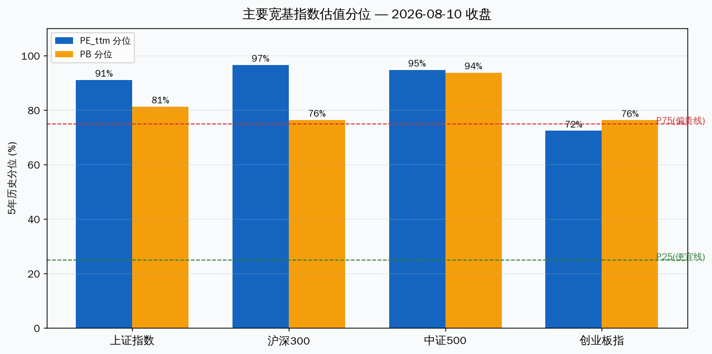
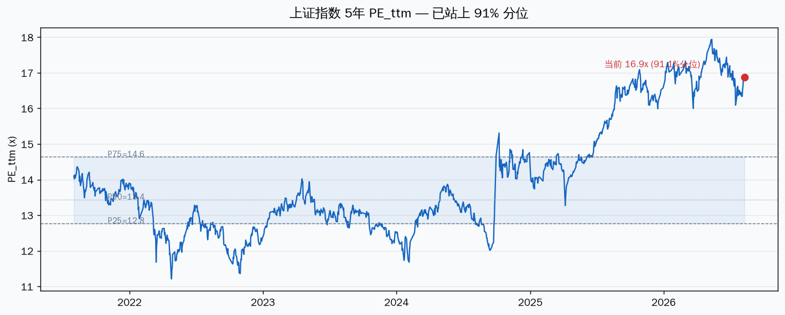
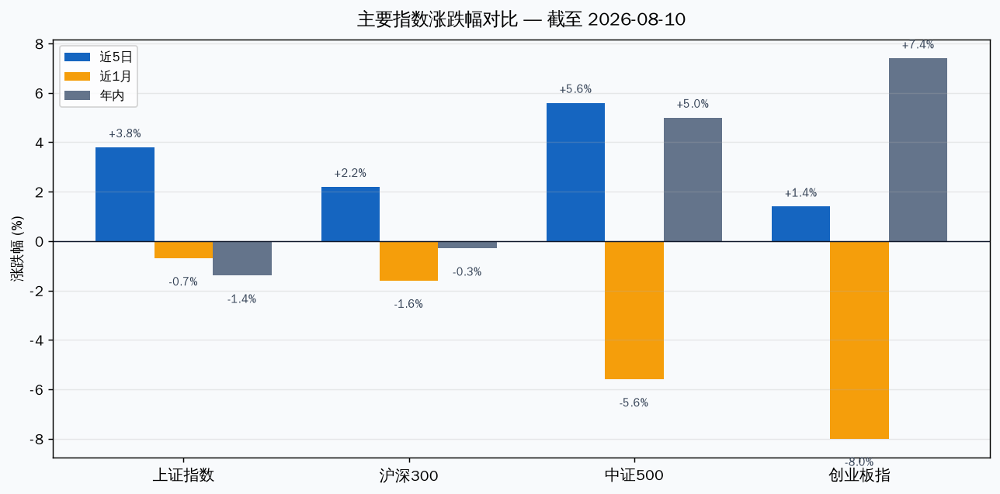

# 大盘估值分析 — 主要宽基指数体检

> 估值 Data as of: 2026-08-10 收盘 · 实时盘面:2026-08-11 10:30 · 数据源:TuShare index_dailybasic / 蛋卷基金 / 新浪

先说结论:**大盘整体不便宜了,但"贵"得分层看。** 上证 PE 16.9x 站上 5 年 91% 分位,沪深300 PE 96.6% 分位、中证500 PE/PB 双 94% 分位——这些是"5 年内最贵的 10%"区间。但创业板指 PE 72% 分位相对温和,且用更长周期(蛋卷口径)看,沪深300 PB 分位只有 57.5%,说明"贵"主要由盈利周期推升的 PE 贡献,资产端(PB)还没到极端泡沫。今天盘面(10:30)上证 -0.82% 高开低走,创业板 +0.34%,正是估值高位后资金风格切换的迹象。

---

## 一、当前盘面(8/11 10:30 盘中)

| 指数 | 现价 | 涨跌幅 | 成交额 |
|---|---|---|---|
| 上证指数 | 3934.09 | **-0.82%** | 10667 亿 |
| 深证成指 | 14259.44 | -0.40% | 12542 亿 |
| 创业板指 | 3549.16 | **+0.34%** | 2771 亿 |
| 沪深300 | 4663.79 | -0.81% | 6454 亿 |
| 中证500 | 7967.54 | -0.79% | 4528 亿 |
| 中证1000 | 7698.05 | -0.46% | 5153 亿 |

今日特征:**权重高开低走、成长逆势红盘**。8/10 沪指五连阳(收 3966.59)后,今天大盘股回吐,资金向创业板切换。两市半天成交约 2.3 万亿,量能仍在高位。

## 二、估值分位:三把尺子口径

| 指数 | PE_ttm | PE 5年分位 | PB | PB 5年分位 | 蛋卷口径(更长周期) |
|---|---|---|---|---|---|
| 上证指数 | 16.88x | **91.1%** | 1.49x | 81.3% | — |
| 沪深300 | 14.53x | **96.6%** | 1.48x | 76.4% | PE 88.8% / PB 57.5% |
| 中证500 | 37.37x | **94.8%** | 2.55x | **93.8%** | PE 88.0% / PB 81.8% |
| 创业板指 | 44.84x | 72.4% | 5.94x | 76.3% | PE 56.4% / PB 70.2% |
| 中证1000 | — | — | — | — | PE 71.1% / PB 51.7% |

关键读数:

- **上证/沪深300 PE 分位 91%/97%**——5 年内最贵区间,主要由盈利上行推升(银行、资源、中字头 2024-2026 涨幅大)。
- **中证500 PE/PB 双高(94.8%/93.8%)**——中小盘里最贵,量价齐升后的典型高位。
- **创业板指 PE 72% 分位**——相对温和,因为 2025 年跌过一轮,估值消化了一部分。
- **蛋卷更长周期口径普遍更低**(如沪深300 PB 57.5%)——放到 10 年尺度看,资产端还没到泡沫顶,只是盈利端(PE)偏高。

## 三、上证指数 5 年 PE band

上证指数 PE_ttm 16.88x,站上 91.1% 分位(2026-08-10)。

## 四、动量和结构

| 指数 | 近5日 | 近1月 | 年内 |
|---|---|---|---|
| 上证指数 | +3.8% | -0.7% | -1.4% |
| 沪深300 | +2.2% | -1.6% | -0.3% |
| 中证500 | +5.6% | -5.6% | +5.0% |
| 创业板指 | +1.4% | -8.0% | +7.4% |

结构特征:**近 5 日普涨(超跌反弹),近 1 月明显分化**。8/4-8/10 的五连阳(中证500 +5.6%、上证 +3.8%)是把 7/24 暴跌(4940 只下跌)后的坑填回来;但近 1 月看,创业板 -8.0%、中证500 -5.6% 仍在低位区,只有权重靠银行/资源把上证托住。年内上证还微跌,创业板 +7.4%。**大盘指数年内涨幅不大,但估值分位高,说明是"盈利涨了、价格没跟"的结构,不是普涨泡沫。**

## 五、估值为什么走到这里(成因拆解)

| 因子 | 类型 | 现状 | 可逆性 |
|---|---|---|---|
| 2024-2026 盈利上行(银行/资源/中字头利润改善) | 结构性 | 已兑现 | 盈利周期高位 |
| 7/24 暴跌后超跌反弹(近5日普涨) | 周期性 | 正在走完 | 短期可逆,量能已现疲态 |
| 中小盘前期跌深(创业板近1月 -8%) | 周期性 | 估值消化中 | 创业板相对便宜 |
| 商品/资源价格高位(银/锡/铜) | 周期性 | 高位 | 若商品回落,权重盈利预期下修 |
| 流动性宽松 + 无风险利率低位 | 外生性 | 支撑估值 | 利率政策变数 |
| H 股/IPO 节奏(兴业银锡被发回等) | 外生性 | 中性 | 短期 |

## 六、我的判断

### 短期(1-3 个月):估值高位 + 反弹尾声,波动加大

五连阳把暴跌坑填完后,今天权重高开低走是获利回吐的典型信号。上证 PE 91% 分位意味着继续上攻需要更强的盈利或流动性催化,而这两者短期都看不到新增量。指数层面:**上证 3900-4000 是估值压力区,突破需要放量站稳;跌破 3850(8/6 平台)则反弹结束。** 创业板相对便宜,是风格切换的受益方,但也不便宜到"便宜"的程度。

### 中期(6-12 个月):盈利周期决定方向,估值只是温度计

最难判断的一段。正面:盈利上行的结构性逻辑(银行/资源/高股息)还没证伪,PB 分位(57-76%)离泡沫顶有距离;反面:PE 分位 90%+ 意味着一旦盈利不及预期,估值收缩和盈利下修会同时发生(戴维斯双杀)。**大盘真正的问题不是"贵",是"贵得不均匀"——权重贵、成长中等,一旦风格切换完成,指数层面反而可能横盘消化。**

## 七、风险(每条带触发条件)

| 风险 | 触发条件 | 影响 |
|---|---|---|
| 权重盈利见顶(银行/资源) | 商品价回落 / 中报权重股净利环比下滑 | PE 分位 91% 回落,上证回 3700-3800 |
| 超跌反弹结束 | 上证跌破 3850 | 短期回吐,波动加大 |
| 流动性收紧 | 利率上行 / 央行表态转向 | 高 PE 中小盘杀估值 |
| 风格切换未完成 | 创业板补跌而非补涨 | 全面回调,泥沙俱下 |

## 八、观察点

| 日期 | 事件 | 看什么 |
|---|---|---|
| 8 月中下旬 | 中报密集披露 | 权重股净利是否匹配当前 PE;资源股(银/锡/铜)Q2 兑现度 |
| 每日 | 两市成交额 | 量能维持 2 万亿以上则反弹延续,萎缩则反弹结束 |
| 每日 | 上证 3850 / 3900 | 跌破 3850 反弹结束;站稳 4000 打开空间 |
| 8 月下旬 | 银漫复产进展(兴业银锡) | 影响资源板块情绪 |

## 九、验证锚点

| 类型 | 锚点 | 当前值 |
|---|---|---|
| 价格锚 | 上证 3850 / 4000 / 创业板 3500 | 上证 3934 / 创业板 3549 |
| 估值锚 | 上证 PE 91% 分位 / 沪深300 97% / 中证500 94% | 全部处于 5 年高位区 |
| 时间锚 | 8 月中下旬中报披露 | 未到 |
| 事件锚 | 权重盈利 / 商品价 / 利率 | 盈利上行中,商品高位,利率低位 |

---
数据说明:指数估值来自 TuShare index_dailybasic(2021-08 至 2026-08-10,1217 个交易日),分位为该序列百分位;蛋卷口径为更长历史(约 10 年)参考。今日盘面为新浪实时(10:30)。本报告为分析参考,不构成交易指令。

Data as of: 2026-08-11
Generated: 2026-08-11
