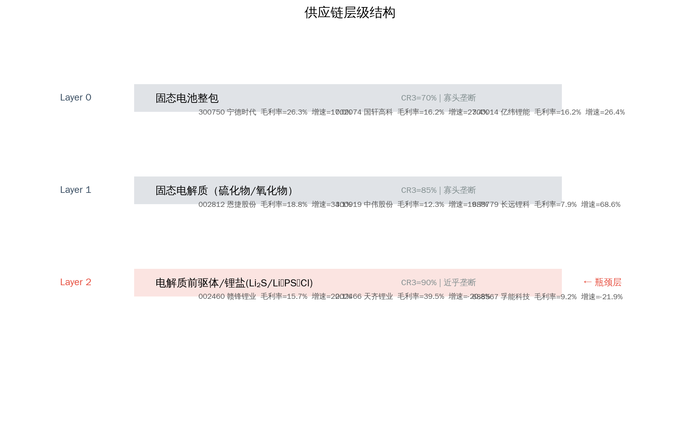
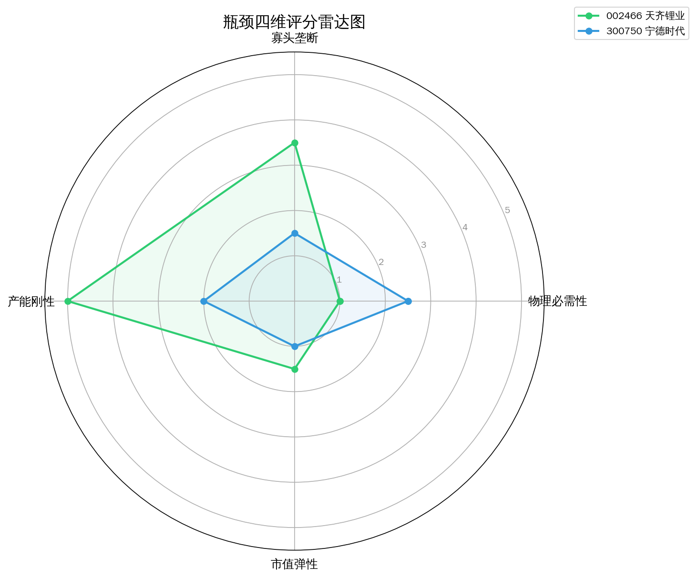
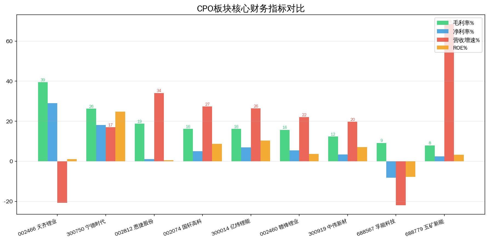
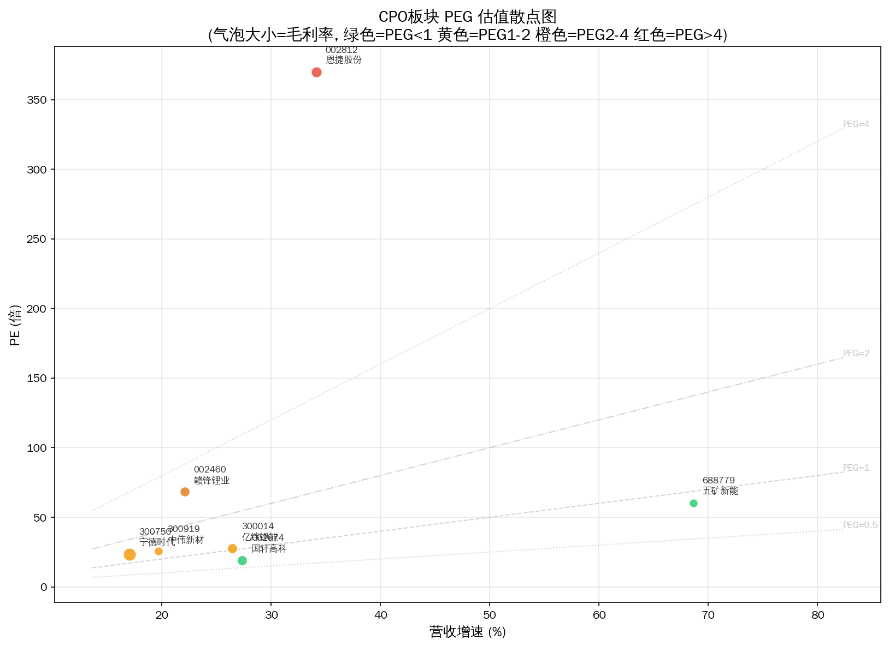
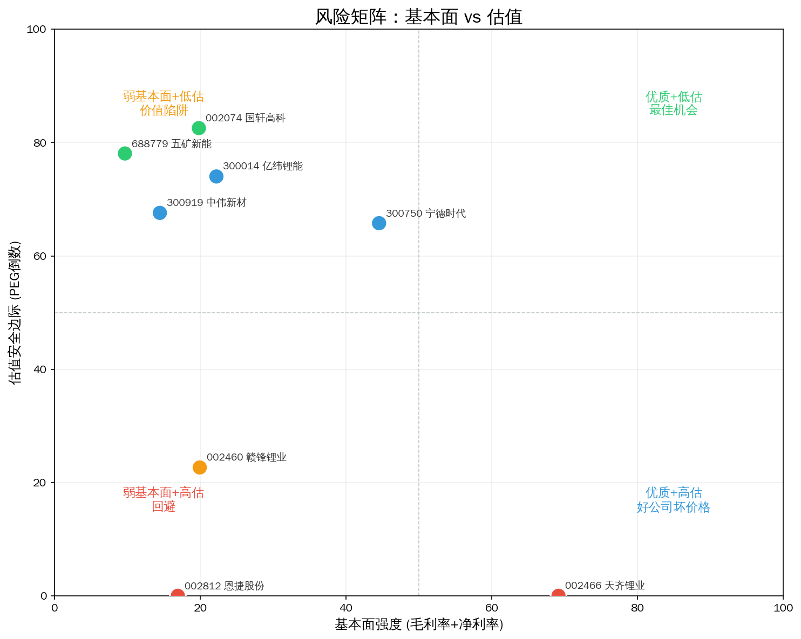
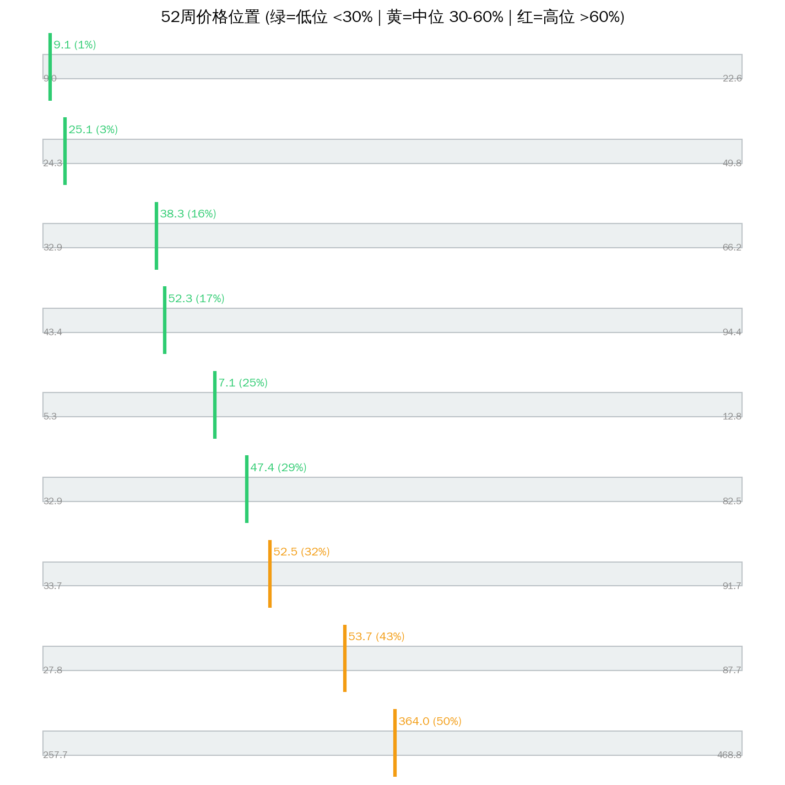

# 固态电池 Serenity 瓶颈分析报告

> 分析日期: 2026-07-14 | 数据截止: 2026-07-14 收盘 | 方法论: Serenity Choke Point Theory | 数据源: Tushare  
> 评分: 四维加权 + 供应链层级修正（上游产能刚性↑ / 小市值弹性↑）

## 1. 板块周期定位

**产业触发：** 2027-2028年量产窗口临近，车企密集发布固态电池车型规划

**图谱描述：** 下一代动力电池核心技术，用固态电解质替代液态电解液，能量密度和安全性的代际提升

**瓶颈层（图谱）：** Layer 2 — 电解质前驱体/锂盐(Li₂S/Li₆PS₅Cl)  
**瓶颈理由：** 硫化锂(Li2S)高纯度量产技术全球仅3家掌握，扩产周期18-24个月，固态电池量产瓶颈在此

**本次结论：** 图谱瓶颈层 **电解质前驱体/锂盐(Li₂S/Li₆PS₅Cl)** 映射标的平均毛利率 **39.5%**，与寡头叙事基本一致。

---

## 2. 供应链结构



```
Layer 0: 固态电池整包  CR3=70%  竞争: oligopoly
  ├── 300750 宁德时代  PE=23.3  毛利率=26.3%  增速=17.0%  市值=16841.5亿
  ├── 002074 国轩高科  ❌ 毛利率16.2% — 商品化/弱定价权
  ├── 300014 亿纬锂能  ❌ 毛利率16.2% — 商品化/弱定价权

Layer 1: 固态电解质（硫化物/氧化物）  CR3=85%  竞争: oligopoly
  ├── 002812 恩捷股份  ❌ 毛利率18.8% — 商品化/弱定价权
  ├── 300919 中伟股份  ❌ 毛利率12.3% — 商品化/弱定价权
  ├── 688779 长远锂科  ❌ 毛利率7.9% — 商品化/弱定价权

**Layer 2: 电解质前驱体/锂盐(Li₂S/Li₆PS₅Cl)  CR3=90%  竞争: near_monopoly  ← 理论瓶颈层**
  ├── 002460 赣锋锂业  ❌ 毛利率15.7% — 商品化/弱定价权
  ├── 002466 天齐锂业  PE=175.3  毛利率=39.5%  增速=-20.8%  市值=811.2亿
  ├── 688567 孚能科技  ❌ 毛利率9.2% — 商品化/弱定价权

```

---

## 3. 瓶颈标的排序



| 排名 | 代码 | 名称 | 综合分 | 必要性 | 垄断性 | 产能刚性 | 市值弹性 | PEG | 市值(亿) | 判断 |
|------|------|------|--------|--------|--------|---------|---------|-----|---------|------|
| 1 | 002466 | 天齐锂业 | 2.8 | 1.0 | 3.5 | 5.0 | 1.5 | N/A | 811.2 | unlikely |
| 2 | 300750 | 宁德时代 | 1.8 | 2.5 | 1.5 | 2.0 | 1.0 | 1.37 | 16841.5 | unlikely |

**已过滤：**

| 代码 | 名称 | 原因 |
|------|------|------|
| 002074 | 国轩高科 | 毛利率16.2% — 商品化/弱定价权 |
| 300014 | 亿纬锂能 | 毛利率16.2% — 商品化/弱定价权 |
| 002812 | 恩捷股份 | 毛利率18.8% — 商品化/弱定价权 |
| 300919 | 中伟新材 | 毛利率12.3% — 商品化/弱定价权 |
| 688779 | 五矿新能 | 毛利率7.9% — 商品化/弱定价权 |
| 002460 | 赣锋锂业 | 毛利率15.7% — 商品化/弱定价权 |
| 688567 | 孚能科技 | 毛利率9.2% — 商品化/弱定价权 |

---

## 4. 核心发现



### 名义瓶颈 vs 财务现实

图谱瓶颈层 **电解质前驱体/锂盐(Li₂S/Li₆PS₅Cl)** 映射标的平均毛利率 **39.5%**，与寡头叙事基本一致。

### Top 财务快照

| 名称 | 毛利率 | 净利率 | 营收增速 | ROE | PE | PEG | 52周位置 |
|------|--------|--------|---------|-----|----|-----|---------|
| 天齐锂业 | 39.5% | 29.0% | -20.8% | 1.1% | 175.3 | N/A | 29.2% |
| 宁德时代 | 26.3% | 18.1% | 17.0% | 24.7% | 23.3 | 1.37 | 50.4% |

### 角色映射（非投资建议）

- **综合分最高**: 天齐锂业（002466）— 综合分 2.8
- **紫苏叶候选**: 暂无合适标的
- **赔率优先**: 暂无合适标的
- **位置观察**: 天齐锂业（002466）— 52周位置 29.2%
- **谨慎/回避倾向**: 宁德时代（300750）— PEG=1.37 / 分 1.8

**Serenity 四条件提醒：** 物理必需 × 寡头垄断 × 产能刚性 × 小市值弹性，缺一不可。综合分高但市值过大 → 降为景气龙头而非紫苏叶；综合分中等但 PEG 极低 → 可作赔率仓，不作纯瓶颈仓。

---

## 5. 估值与风险







| 标的 | 收盘 | 52周高 | 距高点 | 位置% | 信号 |
|------|------|--------|--------|-------|------|
| 宁德时代 | 364.01 | 468.75 | -22.3% | 50.4% | 🟡 |
| 天齐锂业 | 47.35 | 82.49 | -42.6% | 29.2% | 🟢 |

---

## 6. 信号对照表

| 做多信号 ✅ | 做空信号 ❌ |
|------------|------------|
| ✅ 产业触发: 2027-2028年量产窗口临近，车企密集发布固态电池车型规划 | — |
| ✅ 图谱瓶颈: 硫化锂(Li2S)高纯度量产技术全球仅3家掌握，扩产周期18-24个月，固态电池量产瓶颈在此 | — |

**综合判断：** 做多信号偏虚：多数标的因毛利率<20%被过滤，固态量产未到，**整体观望**，宁德作景气锚、锂资源弹性仅主题博弈。

---

## 7. 风险提示

- ⚠️ **技术/路线风险：** 替代技术或工艺切换可能旁路当前瓶颈层（需跟踪产业验证进度）。
- ⚠️ **估值风险：** 高 PEG / 高 52 周位置标的对增速放缓极度敏感，易戴维斯双杀。
- ⚠️ **政策风险：** 国产替代、出口管制、环保配额等政策双向影响供给与需求。
- ⚠️ **流动性风险：** 小市值标的（<100 亿）日内波动可达 ±20%，极端日流动性枯竭。
- ⚠️ **图谱滞后风险：** 供应链 CR3/竞争格局数据可能滞后，新进入者扩产需用公告交叉验证。
- ⚠️ **映射错位风险：** 海外垄断环节在 A 股可能无纯标的（业务混杂），财务无法体现瓶颈溢价。
- ⚠️ **持仓纪律：** 单票建议不超过总仓位 15%；景气龙头与紫苏叶分逻辑管理。

---

Data as of: 2026-07-14  
Generated: 2026-07-14

---
⚠️ 本报告基于 Tushare 公开财务数据、预构建供应链图谱及 LLM 推理生成，**不构成投资建议**。供应链与技术路线信息需独立验证。投资有风险，入市需谨慎。
🤖 Generated with [Claude Code](https://claude.com/claude-code)
