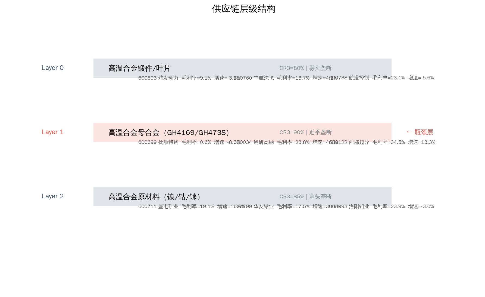
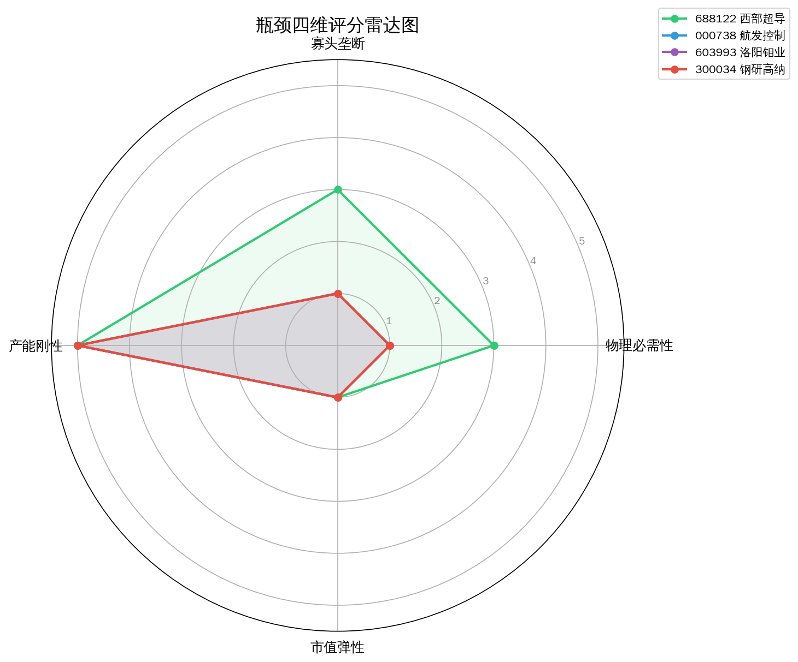
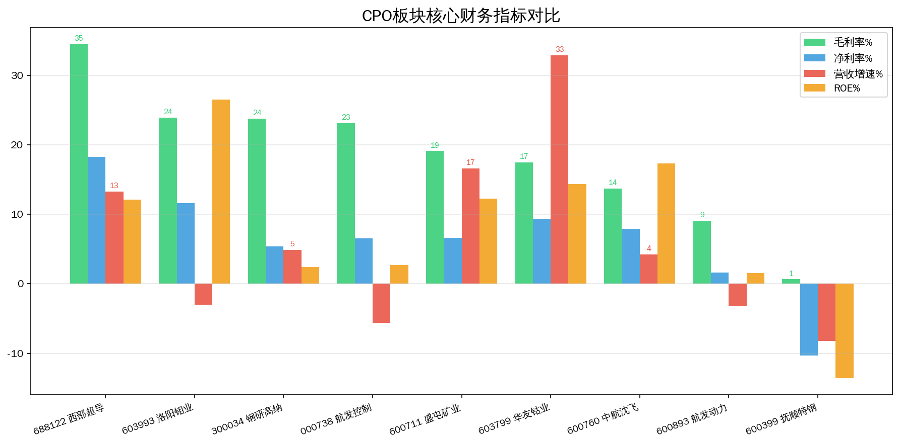
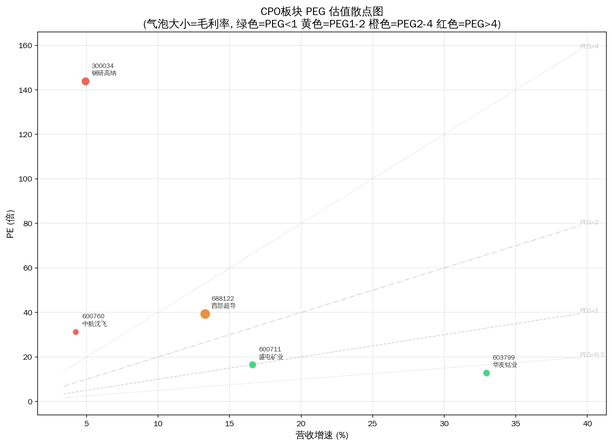
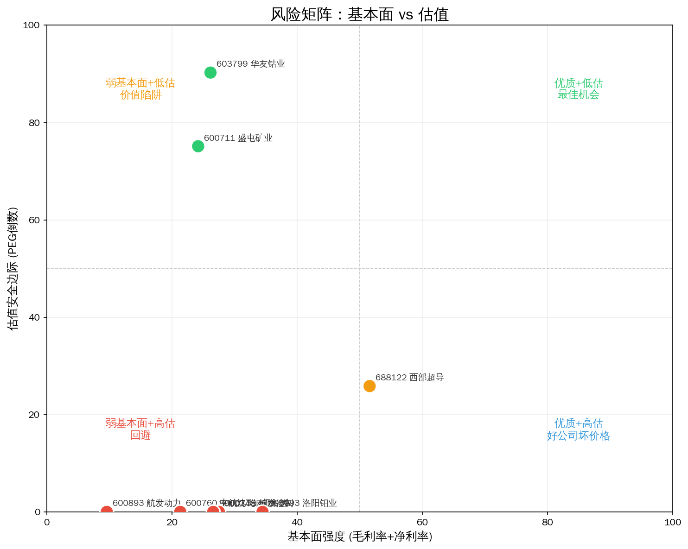
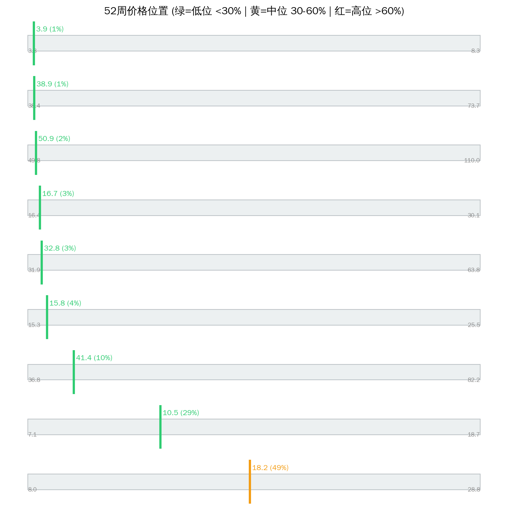

# 军工高温合金 Serenity 瓶颈分析（Phase-2 防伪重跑）

> 分析日期: 2026-07-14 | 方法论: Serenity Phase-2 | 引擎: screen_bottleneck methodology_version=phase2-2026-07-14  
> 数据源: Tushare | 图谱: supply_chain v0.2.0 | 注解: company_annotations 全覆盖

## 1. 板块周期定位

**产业触发：** 军机列装加速+商用航发国产化+燃气轮机需求增长

**图谱描述：** 航空发动机和燃气轮机关键材料，镍基/钴基高温合金在1000°C以上保持强度

**瓶颈层：** Layer 1 — 高温合金母合金（GH4169/GH4738）  
**瓶颈理由：** GH4169等牌号高温合金军品认证>3年，供应商锁定效应极强，全球仅3家稳定供应商

**Phase-2 结论：** 瓶颈层「高温合金母合金（GH4169/GH4738）」过线标的 2 只，平均毛利率 29.1%。 **名义瓶颈与财务定价权仍可能背离。**

**综合判断：** Phase-2 分轨：leaf=0 leader=4 beta=0 watch=0 过滤=5。紫苏叶轨道为空；龙头轨道看 西部超导。

---

## 2. 供应链结构（含主业）



```
Layer 0: 高温合金锻件/叶片  CR3=80%  竞争: oligopoly
  ├── 600893 航发动力  ❌ 毛利率<20%，议价能力弱，商品化业务
  │     主业: 航空发动机总装
  ├── 600760 中航沈飞  ❌ 毛利率<20%，议价能力弱，商品化业务
  │     主业: 歼击机整机制造
  ├── 000738 航发控制  track=large_cap_leader  match=adjacent  分=2.0  PE=65.7938  毛利=23.1291  增速=-5.64
  │     主业: 航发控制系统

**Layer 1: 高温合金母合金（GH4169/GH4738）  CR3=90%  竞争: near_monopoly  ← 理论瓶颈层**
  ├── 600399 抚顺特钢  ❌ 毛利率<20%，议价能力弱，商品化业务
  │     主业: 特殊钢
  ├── 300034 钢研高纳  track=large_cap_leader  match=adjacent  分=2.0  PE=143.8129  毛利=23.7745  增速=4.91
  │     主业: 高温合金制品
  ├── 688122 西部超导  track=large_cap_leader  match=adjacent  分=3.2  PE=39.4162  毛利=34.5075  增速=13.29
  │     主业: 超导+钛合金+高温合金混业

Layer 2: 高温合金原材料（镍/钴/铼）  CR3=85%  竞争: oligopoly
  ├── 600711 盛屯矿业  ❌ 毛利率<20%，议价能力弱，商品化业务
  │     主业: 有色金属矿业贸易
  ├── 603799 华友钴业  ❌ 毛利率<20%，议价能力弱，商品化业务
  │     主业: 钴镍锂电材料
  ├── 603993 洛阳钼业  track=large_cap_leader  match=adjacent  分=2.0  PE=19.1551  毛利=23.9275  增速=-2.98
  │     主业: 铜钴钼等矿业

```

---

## 3. 分轨排序（禁止 leaf 与 leader 混读）



| 排名 | 代码 | 名称 | 综合分 | 轨道 | 匹配 | N/M/R/E | PEG | 市值(亿) | 判断 |
|------|------|------|--------|------|------|---------|-----|---------|------|
| 1 | 688122 | 西部超导 | 3.2 | large_cap_leader | adjacent | 3.0/3.0/5.0/1.0 | 2.97 | 330.8 | potential |
| 2 | 000738 | 航发控制 | 2.0 | large_cap_leader | adjacent | 1.0/1.0/5.0/1.0 | N/A | 220.0 | unlikely |
| 3 | 603993 | 洛阳钼业 | 2.0 | large_cap_leader | adjacent | 1.0/1.0/5.0/1.0 | N/A | 3895.9 | unlikely |
| 4 | 300034 | 钢研高纳 | 2.0 | large_cap_leader | adjacent | 1.0/1.0/5.0/1.0 | 29.29 | 125.8 | unlikely |

### 3.1 紫苏叶轨道 serenity_leaf

- **本板块本轨为空**

### 3.2 大市值龙头 large_cap_leader

- 西部超导（688122）分=3.2 市值=330.8亿
- 航发控制（000738）分=2.0 市值=220.0亿
- 洛阳钼业（603993）分=2.0 市值=3895.9亿
- 钢研高纳（300034）分=2.0 市值=125.8亿

### 3.3 景气相邻 cycle_beta / 观察 watchlist

- beta: 无
- watch: 无

### 3.4 已过滤

| 代码 | 名称 | 匹配 | 原因 |
|------|------|------|------|
| 600760 | 中航沈飞 | adjacent | 毛利率<20%，议价能力弱，商品化业务 |
| 600711 | 盛屯矿业 | adjacent | 毛利率<20%，议价能力弱，商品化业务 |
| 600893 | 航发动力 | adjacent | 毛利率<20%，议价能力弱，商品化业务 |
| 603799 | 华友钴业 | adjacent | 毛利率<20%，议价能力弱，商品化业务 |
| 600399 | 抚顺特钢 | adjacent | 毛利率<20%，议价能力弱，商品化业务 |

### 3.5 已否决（mismatch）

| 代码 | 名称 | 主业 | 状态 |
|------|------|------|------|
| — | 无 mismatch 过滤 | — | — |

---

## 4. 核心发现与主业校验



### 强制主业披露（Top 标的）

- **西部超导（688122）**  
  **主业：** 超导+钛合金+高温合金混业 ｜ **匹配：** adjacent ｜ **轨道：** large_cap_leader  
  定价权=weak ｜ 客户验证=True ｜ kill: 军工下修
- **航发控制（000738）**  
  **主业：** 航发控制系统 ｜ **匹配：** adjacent ｜ **轨道：** large_cap_leader  
  定价权=weak ｜ 客户验证=True ｜ kill: 军工周期
- **洛阳钼业（603993）**  
  **主业：** 铜钴钼等矿业 ｜ **匹配：** adjacent ｜ **轨道：** large_cap_leader  
  定价权=none ｜ 客户验证=True ｜ kill: 大宗价格
- **钢研高纳（300034）**  
  **主业：** 高温合金制品 ｜ **匹配：** adjacent ｜ **轨道：** large_cap_leader  
  定价权=weak ｜ 客户验证=True ｜ kill: 订单

### 名义瓶颈 vs 财务

瓶颈层「高温合金母合金（GH4169/GH4738）」过线标的 2 只，平均毛利率 29.1%。 **名义瓶颈与财务定价权仍可能背离。**

### 角色（非投资建议）

- **紫苏叶：** 无（本板块无 serenity_leaf）
- **龙头 β：** 西部超导 — 超导+钛合金+高温合金混业
- **赔率：** 西部超导 PEG=2.97

---

## 5. 估值与风险







| 名称 | 收盘 | 位置% | PEG | PE | 毛利% | 增速% |
|------|------|-------|-----|-----|-------|-------|
| 西部超导 | 50.92 | 1.8 | 2.97 | 39.4 | 34.5 | 13.3 |
| 航发控制 | 16.73 | 2.6 | N/A | 65.8 | 23.1 | -5.6 |
| 洛阳钼业 | 18.21 | 49.1 | N/A | 19.2 | 23.9 | -3.0 |
| 钢研高纳 | 15.78 | 4.2 | 29.29 | 143.8 | 23.8 | 4.9 |

---

## 6. 信号对照

| 做多结构 | 做空/回避 |
|---------|----------|
| ✅ 触发：军机列装加速+商用航发国产化+燃气轮机需求增长 | ❌ mismatch 已否决见上表 |
| ✅ 过线 4 只带主业披露 | ❌ 无定价权/弱映射标的勿当紫苏叶 |
| ✅ leaf 轨道 0 只 | ❌ 大市值 leader 不作弹性仓 |

**综合判断：** Phase-2 分轨：leaf=0 leader=4 beta=0 watch=0 过滤=5。紫苏叶轨道为空；龙头轨道看 西部超导。

---

## 7. 风险提示

- ⚠️ Phase-2 仍依赖注解质量；`adjacent` 不等于已验证瓶颈收入占比
- ⚠️ 结构垄断无定价权标的禁止按 likely_genuine 买入叙事
- ⚠️ 大市值龙头轨道波动与指数相关，非小盘弹性
- ⚠️ 图谱可能滞后，扩产与客户认证需公告交叉验证
- ⚠️ 本报告不构成投资建议，单票仓位建议 ≤15%

---
Data as of: 2026-07-14  
Generated: 2026-07-14  
methodology_version: phase2-2026-07-14

---
⚠️ 本报告基于 Tushare 公开数据、供应链图谱与主业注解，经 Phase-2 防伪引擎过滤后由 LLM 整理，**不构成投资建议**。
🤖 Generated with [Claude Code](https://claude.com/claude-code)
