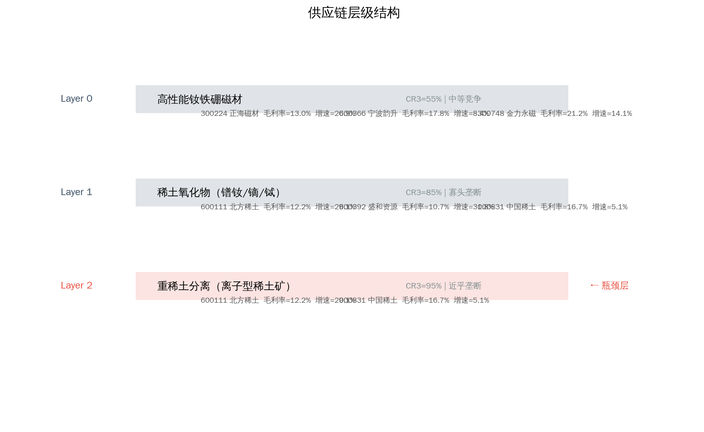
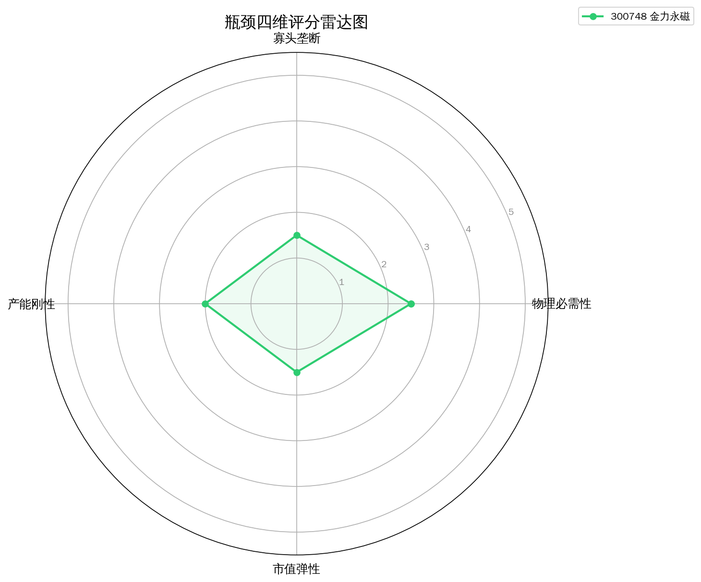
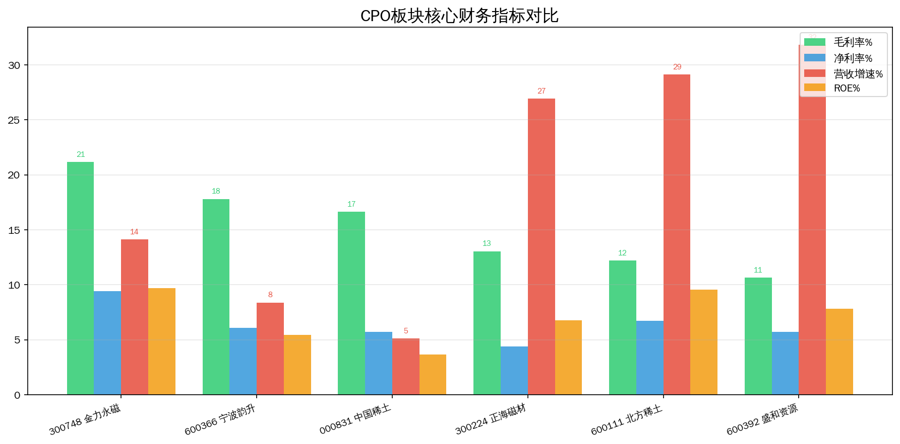
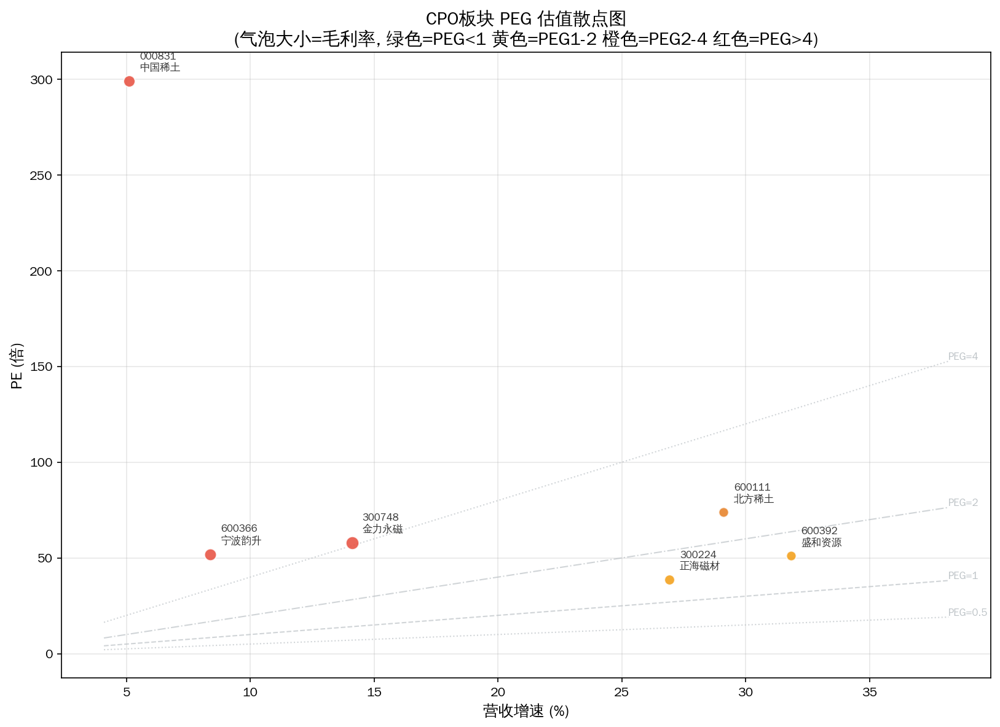

# 稀土永磁 Serenity 瓶颈分析报告

> 分析日期: 2026-07-09 | 方法论: Serenity Choke Point Theory | 数据源: Tushare

## 1. 板块周期定位

钕铁硼永磁材料，新能源车电机和风电直驱发电机核心材料。

**驱动因素**: 新能源车+风电+机器人三驱动叠加，高性能钕铁硼需求持续增长

## 2. 供应链结构

**Layer 0: 高性能钕铁硼磁材**  CR3=55%  moderate
  - 300224 正海磁材  PE=38.8198  毛利率=13.046%  增速=26.93%
  - 600366 宁波韵升  PE=51.825  毛利率=17.8088%  增速=8.39%
  - 300748 金力永磁  PE=57.9006  毛利率=21.1758%  增速=14.11%

**Layer 1: 稀土氧化物（镨钕/镝/铽）**  CR3=85%  oligopoly
  - 600111 北方稀土  PE=73.8984  毛利率=12.2073%  增速=29.11%
  - 600392 盛和资源  PE=51.1215  毛利率=10.6602%  增速=31.83%
  - 000831 中国稀土  PE=299.2241  毛利率=16.6518%  增速=5.11%

**Layer 2: 重稀土分离（离子型稀土矿）**  CR3=95%  near_monopoly ← **瓶颈层**
  - 600111 北方稀土  PE=73.8984  毛利率=12.2073%  增速=29.11%
  - 000831 中国稀土  PE=299.2241  毛利率=16.6518%  增速=5.11%

## 3. 瓶颈评分

**⚠️ 全部标的未通过量化筛选。** 这不一定意味着没有瓶颈——更可能说明瓶颈尚未在财务层面兑现（这正是 Serenity 方法寻找的"研究差"机会）。

**已过滤标的:**

- 000831 中国稀土: 毛利率<20%，议价能力弱，商品化业务
- 300224 正海磁材: 毛利率<20%，议价能力弱，商品化业务
- 300748 金力永磁: 市值>100亿，弹性有限
- 600111 北方稀土: 毛利率<20%，议价能力弱，商品化业务
- 600366 宁波韵升: 毛利率<20%，议价能力弱，商品化业务
- 600392 盛和资源: 毛利率<20%，议价能力弱，商品化业务

## 4. 瓶颈分析

**理论瓶颈层**: Layer 2 — 重稀土（镝/铽）全球供给高度集中于中国，配额制+环保限制扩产，供给刚性极强

瓶颈层标的被过滤: 2 只 — 当前财务数据未体现垄断定价权

## 5. 财务对比

## 6. 风险提示

- ⚠️ **技术路线风险**: 稀土永磁涉及多条技术路线并行，路线收敛方向决定瓶颈归属
- ⚠️ **产能兑现风险**: 扩产计划可能因设备交付、良率爬坡延迟
- ⚠️ **政策风险**: 产业补贴退坡或技术管制升级可能影响供需格局
- ⚠️ **流动性风险**: 部分标的市值偏小，日内波动可能超10%
- ⚠️ **信息验证风险**: 供应链产能数据需通过公司公告和行业调研独立验证

---
数据截至: 2026-07-08 | 生成时间: 2026-07-09
⚠️ 本报告不构成投资建议。