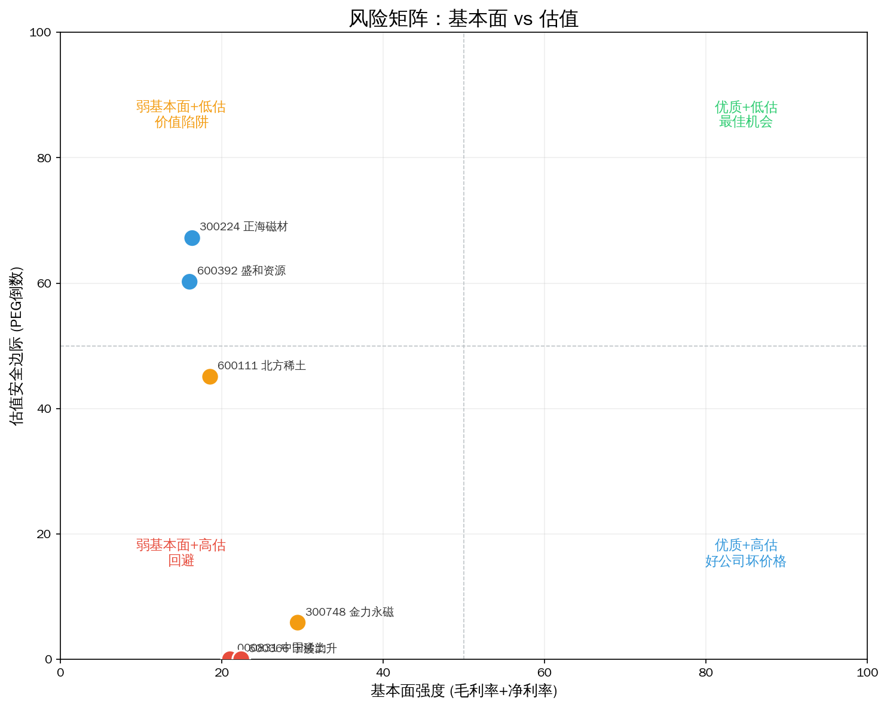
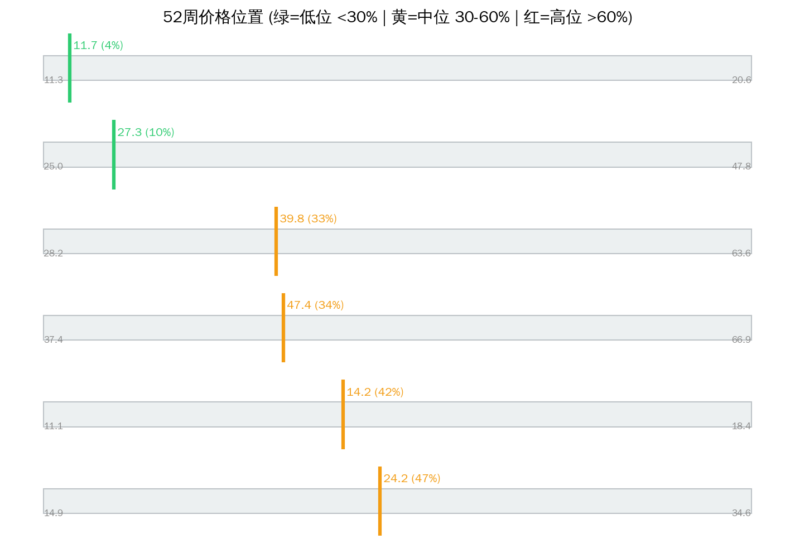

# 稀土永磁 Serenity 瓶颈分析（Phase-2 防伪重跑）

> 分析日期: 2026-07-14 | 方法论: Serenity Phase-2 | 引擎: screen_bottleneck methodology_version=phase2-2026-07-14  
> 数据源: Tushare | 图谱: supply_chain v0.2.0 | 注解: company_annotations 全覆盖

## 1. 板块周期定位

**产业触发：** 新能源车+风电+机器人三驱动叠加，高性能钕铁硼需求持续增长

**图谱描述：** 钕铁硼永磁材料，新能源车电机和风电直驱发电机核心材料

**瓶颈层：** Layer 2 — 重稀土分离（离子型稀土矿）  
**瓶颈理由：** 重稀土（镝/铽）全球供给高度集中于中国，配额制+环保限制扩产，供给刚性极强

**Phase-2 结论：** 瓶颈层「重稀土分离（离子型稀土矿）」无过线标的（全过滤或弱映射）— **A股可投资咽喉空窗。**

**综合判断：** Phase-2 分轨：leaf=0 leader=1 beta=0 watch=0 过滤=5。紫苏叶轨道为空；龙头轨道看 金力永磁。

---

## 2. 供应链结构（含主业）


```
Layer 0: 高性能钕铁硼磁材  CR3=55%  竞争: moderate
  ├── 300224 正海磁材  ❌ 毛利率<20%，议价能力弱，商品化业务
  │     主业: 钕铁硼永磁材料
  ├── 600366 宁波韵升  ❌ 毛利率<20%，议价能力弱，商品化业务
  │     主业: 钕铁硼永磁
  ├── 300748 金力永磁  track=large_cap_leader  match=adjacent  分=2.1  PE=53.1437  毛利=21.1758  增速=14.11
  │     主业: 高性能钕铁硼

Layer 1: 稀土氧化物（镨钕/镝/铽）  CR3=85%  竞争: oligopoly
  ├── 600111 北方稀土  ❌ 毛利率<20%，议价能力弱，商品化业务
  │     主业: 稀土原料及功能材料（配额）
  ├── 600392 盛和资源  ❌ 毛利率<20%，议价能力弱，商品化业务
  │     主业: 稀土冶炼分离与贸易
  ├── 000831 中国稀土  ❌ 毛利率<20%，议价能力弱，商品化业务
  │     主业: 中重稀土等

**Layer 2: 重稀土分离（离子型稀土矿）  CR3=95%  竞争: near_monopoly  ← 理论瓶颈层**
  ├── 600111 北方稀土  ❌ 毛利率<20%，议价能力弱，商品化业务
  │     主业: 稀土原料及功能材料（配额）
  ├── 000831 中国稀土  ❌ 毛利率<20%，议价能力弱，商品化业务
  │     主业: 中重稀土等

```

---

## 3. 分轨排序（禁止 leaf 与 leader 混读）


| 排名 | 代码 | 名称 | 综合分 | 轨道 | 匹配 | N/M/R/E | PEG | 市值(亿) | 判断 |
|------|------|------|--------|------|------|---------|-----|---------|------|
| 1 | 300748 | 金力永磁 | 2.1 | large_cap_leader | adjacent | 2.5/1.0/3.5/1.0 | 3.77 | 375.0 | unlikely |

### 3.1 紫苏叶轨道 serenity_leaf

- **本板块本轨为空**

### 3.2 大市值龙头 large_cap_leader

- 金力永磁（300748）分=2.1 市值=375.0亿

### 3.3 景气相邻 cycle_beta / 观察 watchlist

- beta: 无
- watch: 无

### 3.4 已过滤

| 代码 | 名称 | 匹配 | 原因 |
|------|------|------|------|
| 300224 | 正海磁材 | adjacent | 毛利率<20%，议价能力弱，商品化业务 |
| 000831 | 中国稀土 | core | 毛利率<20%，议价能力弱，商品化业务 |
| 600111 | 北方稀土 | core | 毛利率<20%，议价能力弱，商品化业务 |
| 600392 | 盛和资源 | adjacent | 毛利率<20%，议价能力弱，商品化业务 |
| 600366 | 宁波韵升 | adjacent | 毛利率<20%，议价能力弱，商品化业务 |

### 3.5 已否决（mismatch）

| 代码 | 名称 | 主业 | 状态 |
|------|------|------|------|
| — | 无 mismatch 过滤 | — | — |

---

## 4. 核心发现与主业校验


### 强制主业披露（Top 标的）

- **金力永磁（300748）**  
  **主业：** 高性能钕铁硼 ｜ **匹配：** adjacent ｜ **轨道：** large_cap_leader  
  定价权=weak ｜ 客户验证=True ｜ kill: 客户杀价

### 名义瓶颈 vs 财务

瓶颈层「重稀土分离（离子型稀土矿）」无过线标的（全过滤或弱映射）— **A股可投资咽喉空窗。**

### 角色（非投资建议）

- **紫苏叶：** 无（本板块无 serenity_leaf）
- **龙头 β：** 金力永磁 — 高性能钕铁硼
- **赔率：** 金力永磁 PEG=3.77

---

## 5. 估值与风险






| 名称 | 收盘 | 位置% | PEG | PE | 毛利% | 增速% |
|------|------|-------|-----|-----|-------|-------|
| 金力永磁 | 27.26 | 9.9 | 3.77 | 53.1 | 21.2 | 14.1 |

---

## 6. 信号对照

| 做多结构 | 做空/回避 |
|---------|----------|
| ✅ 触发：新能源车+风电+机器人三驱动叠加，高性能钕铁硼需求持续增长 | ❌ mismatch 已否决见上表 |
| ✅ 过线 1 只带主业披露 | ❌ 无定价权/弱映射标的勿当紫苏叶 |
| ✅ leaf 轨道 0 只 | ❌ 大市值 leader 不作弹性仓 |

**综合判断：** Phase-2 分轨：leaf=0 leader=1 beta=0 watch=0 过滤=5。紫苏叶轨道为空；龙头轨道看 金力永磁。

---

## 7. 风险提示

- ⚠️ Phase-2 仍依赖注解质量；`adjacent` 不等于已验证瓶颈收入占比
- ⚠️ 结构垄断无定价权标的禁止按 likely_genuine 买入叙事
- ⚠️ 大市值龙头轨道波动与指数相关，非小盘弹性
- ⚠️ 图谱可能滞后，扩产与客户认证需公告交叉验证
- ⚠️ 本报告不构成投资建议，单票仓位建议 ≤15%

---
Data as of: 2026-07-14  
Generated: 2026-07-14  
methodology_version: phase2-2026-07-14

---
⚠️ 本报告基于 Tushare 公开数据、供应链图谱与主业注解，经 Phase-2 防伪引擎过滤后由 LLM 整理，**不构成投资建议**。
🤖 Generated with [Claude Code](https://claude.com/claude-code)
