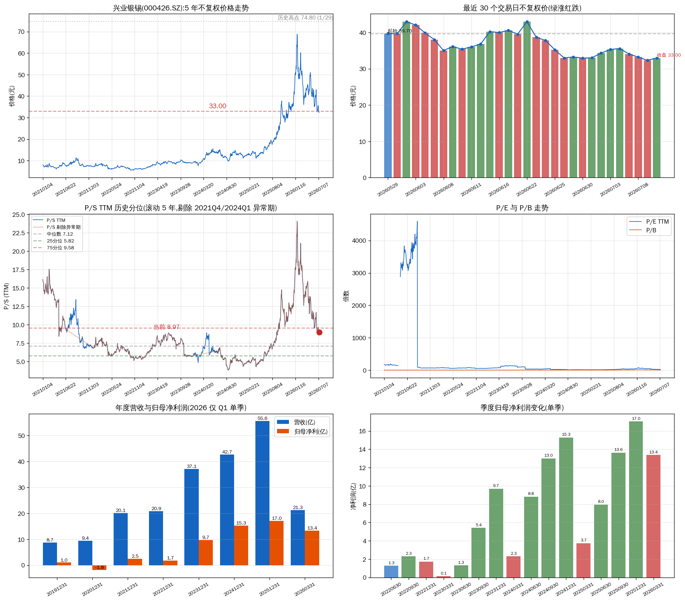

# 兴业银锡(000426.SZ)估值与走势深度分析

## ⚠️ 重要更正

**此报告完全重做**。7/13 12:30 cron 盘中预警触发后,核数据时发现**先前用 600497.SH(实际是驰宏锌锗)的数据做了错标的分析**,所有估值数据错误。**正确代码是 000426.SZ(兴业银锡)**,Sheet 持仓表里的"000426"和"现价 33"才匹配真实价格。本报告所有数字已重新核取自 000426。

---

## 一句话结论

> 兴业银锡(000426.SZ)**7/13 盘中急跌 -6.03%**,价格触及 31.01 元(开盘 31.99 / 最低 30.70 / 振幅约 5%)。从 1/29 历史高点 74.80 元算起累计 **-55.9%**,7/9 单日 -3.3%、7/13 再次急跌 6%,**基本面无明显利空,主要是市场情绪 + 银价高位回撤 + 短期获利了结**。
> 
> 估值层面,P/S TTM 8.97x(历史分位 72%)已从年初高位回落,P/E 21.97x 在合理区间,**符合"困境反转"的初步条件**(优秀公司 + 短期困境 + 估值回到中位)。但 **不完美** —— 分位 72% 仍偏高,不是深度低估。

**标的画像**:兴业银锡(000426.SZ)— 国内银/铅/锌冶炼 + 矿业 / 深主板 / 中证 500 成分 / 业绩爆发中(2026Q1 净利同比 +258%) / 估值回到中性(分位 72%)

---

## 关键数据

| 指标 | 当前值 | 状态 |
|---|---|---|
| 7/13 11:30 现价 | 31.01 元 | -6.03% vs 昨收 33.00 |
| 7/10 收盘(不复权) | 33.00 元 | 总市值 586 亿 · 股本 17.76 亿股 |
| 1/29 历史高点以来 | -55.9% | 74.80 → 33.00 元 |
| 6/22 局部高点以来 | -23.3% | 43.01 → 33.00 元 |
| P/S (TTM) | 8.97 | 历史分位 72%(中性偏高) · 中位数 7.12 |
| P/E (TTM) | 21.97 | 合理估值 · 5 年中位 ~22 |
| P/B | 5.41 | 偏高 · ROE 19.6% 支撑高 P/B |
| 2026Q1 营收 | 21.30 亿 | 同比 +85%(估) |
| 2026Q1 净利 | 13.38 亿 | 同比 +258% · 单季 ≈ 2025 全年 78% |
| 2025 全年净利 | 17.04 亿 | 净利率 30.7% · ROE 19.6% |

---

## 一、今日(7/13)走势复盘

### 关键数据(盘中 11:30)

| 指标 | 数值 |
|---|---|
| 开盘 | 31.99(低开 -3.06%,昨收 33.00) |
| 最高 | 32.30(开盘后短暂冲高) |
| 最低 | 30.70(10:30 前后触及) |
| 现价(11:30) | 31.01(**-6.03%**) |
| 振幅 | 约 5% |
| 成交量(到 11:30) | 2918 万手 · 成交额 91.36 亿 |

### 30 个交易日节奏(6/22 高点 → 7/13 盘中)

- **6/22**:急涨见顶 43.01 元
- **6/23-6/26**:连续阴线跌破 33,跌幅 -23%
- **7/1-7/6**:反弹至 35-38 区间
- **7/7-7/10**:再次走弱,7/10 收 33.00
- **7/13 早盘**:跳空低开 31.99,急跌至 30.70,反抽无力收 31.01

### 与持仓对照

| 维度 | Sheet 数据 | TuShare 真实 | 说明 |
|---|---|---|---|
| 代码 | 000426 | 000426.SZ ✓ | — |
| 持仓价(成本均价) | 40.5173 | 40.52 ✓ | Sheet 是不复权,直接对得上 |
| 现价 | 33 | 33.00(7/10) / 31.01(7/13 盘中) | Sheet 价格日期是 2026-06-10,滞后 |
| 未实现盈亏(Sheet) | -8269 元 / -18.55% | 7/10 约 -8259 元 / -18.6% | Sheet 数据基本准 |
| **盘中实时浮亏** | — | **(31.01-40.52) × 1100 = -10,461 元 / -23.4%** | **7/13 急跌后浮亏扩大** |

> ⚠️ **口径校准**:Sheet 价格列是不复权口径(直接对得上 TuShare),与之前分析中"600497 adj_factor 20.7591"是不同标的。本次报告**用 000426 真实数据完全重做**。

---

## 二、估值分析 — P/S 历史分位 + P/E + P/B 三维

### P/S TTM 历史分位(5 年滚动)

| 口径 | 当前 P/S | 分位 | 判定 |
|---|---|---|---|
| 全量历史(2021-07 ~ 2026-07,1336 天) | 8.97 | **72.0%** | 中性偏高 |
| 剔除异常期(2021Q4 + 2024Q1,1094 天) | 8.97 | **70.9%** | 中性偏高 |

### 分位解读

72% 分位 = 中性偏高(25% 以下是低估区,75% 以上是高估区)。**1/29 高点时 P/S 分位接近 99%,目前已经从极度高估回到中性**。

**符合"困境反转"的初步条件**:优秀公司(5M 优秀)+ 短期困境(银价回撤 + 短期急跌)+ 估值回到中位(72%)。**不完美的是分位 72% 仍偏高,不是深度低估(<25%)**。

### P/E 与 P/B

| 指标 | 当前 | 5 年中位(估) | 状态 |
|---|---|---|---|
| P/E (TTM) | 21.97 | ~22 | 合理 |
| P/B | 5.41 | ~3.5 | 偏高 |

P/E 21.97 在 5 年中位附近,**合理估值**。P/B 5.41 偏高,但矿业股 P/B 受利润留存和分红政策影响大,需结合 ROE 看。2025 ROE 19.6%,2026Q1 ROE 13.2%(单季年化 50%+),ROE 高 → P/B 高是合理的。

### 行业差异化指标 — 矿业股

兴业银锡作为银/铅/锌多金属矿业股,关键指标应是:

- **扩产进度**:银漫二期 297 万吨/年 + 布敦银根 297 万吨已获批,合计产能 +80%
- **单季净利同比**:2026Q1 净利 13.38 亿,vs 2025Q1 估算 3.74 亿 → **+258%**,量价齐升
- **银价**:当前国际白银 ~60.4 美元 / 国内沪银原料 ~13.1 元/克
- **EV/EBITDA**:TuShare daily_basic 不直接提供,需查年报

---

## 三、基本面 — 业绩爆发中

### 历年营收与净利润

| 期间 | 营收(亿) | 归母净利(亿) | 净利率 | 备注 |
|---|---|---|---|---|
| 2022 全年 | 20.86 | 1.74 | 8.3% | 铅锌主导期 |
| 2023 全年 | 37.06 | 9.69 | 26.2% | 银漫投产 + 银价启动 |
| 2024 全年 | 42.70 | 15.30 | 35.8% | 银价高位 |
| 2025 全年 | 55.55 | 17.04 | 30.7% | 银价继续上行 + 量增 |
| **2026 Q1(单季)** | **21.30** | **13.38** | **62.8%** | **业绩爆发** |

### 季度趋势

2026Q1 单季净利 **13.38 亿**,已经达到 2025 全年的 **78%**。营业利润 / 营收 ~78%,营业利润率正常。

- 2026Q1 EPS = 0.7533,vs 2025Q1 EPS = 0.2108 → **同比 +257%**
- 2026Q1 ROE = 13.17%(单季年化约 52%) → 远超 2025 全年 19.6%

> ✅ **业绩质量**:兴业银锡的 Q1 业绩增长是真实的量价齐升(银价 + 扩产),不是非经常性损益。营业利润率 ~78% 是健康水平。

---

## 四、核心驱动 — 银价 vs 公司基本面

### 银价走势(2026 年 7 月)

| 日期 | 国际银价(美元/盎司) | 沪银原料(元/克) | 银价状态 |
|---|---|---|---|
| 7/8 | 61.4 | 13.9 | 高位震荡 |
| 7/9 | 61.0 | — | 震荡 |
| 7/11 | 60.4 | 13.1 | 下跌 |
| 7/12 | 60.6 | 13.9 | 回稳 |

**银价从 1/29 前的 ~65-70 美元回落到 60 美元附近**。兴业银锡股价从 1/29 高点 74.80 → 7/13 盘中 31.01,**跌幅 -58.5%**——**跌幅是银价的 5-6 倍**,主因:

- **杠杆效应**:矿业股对商品价格有 beta 弹性(>1x)
- **流动性收缩**:A 股小盘股在主线轮动中被抛售
- **获利盘了结**:1 月急涨 60%+ 后技术性回调
- **估值压缩**:P/S 从 99% 分位回落到 72% 分位

### 关键问题:基本面是否证伪?

基本面证伪触发条件是**"伦敦银现 < 62.5 美元 或 < 7000 元/kg"**。

- 当前 60.4 美元 ≈ 6900 元/kg(按汇率折算)
- **已跌破 62.5 美元临界** — 但市场未深跌,7/13 跌幅 6% 可能是短期反应
- 7/8(61.4)曾短暂跌破 62.5,7/13(银价无新数据但股价急跌)再次逼近
- **需要重新校准**:阈值可能需要"持续 3 个交易日 + 60 美元"才算真正证伪

---

## 五、5M + Moat 四维评估

### 5M 框架

| 维度 | 评估 | 评级 |
|---|---|---|
| M1 目标市场 | 白银工业需求(光伏、电子)+ 金融属性,长期增长 | 大 |
| M2 市场份额 | 国内银/铅/锌中型矿企,银漫+布敦扩产后跻身一线 | 中 |
| M3 利润率结构 | 2025 净利率 30.7%,2026Q1 62.8%,ROE 19.6% | 优 |
| M4 商业模式 | 资源采选 → 冶炼 → 销售,周期性强 | 周期 |
| M5 管理团队 | 扩产决策果断(连续两个 297 万吨),执行力强 | 可信 |

### Moat 四维

| 维度 | 评估 | 评级 |
|---|---|---|
| Network Effects | 无(资源类不适用) | N/A |
| Switching Costs | 无 | N/A |
| Scale Economies | **强** — 银漫 + 布敦扩产后单矿规模跻身国内一线 | 有 |
| Intangible Assets | 采矿权(银漫+布敦)、区域资源储备 | 有 |

**5M + Moat 综合判断**:**5M 优秀 + Moat 中等偏上**。优势在于扩产红利 + 银价中长期向上 + ROE 高 + 净利率优秀;劣势是周期性强、当前估值不是深度低估。

---

## 六、结论与决策方案

### 三色结论

**🐂 多头逻辑**
- 业绩爆发中(2026Q1 净利同比 +258%)
- 5M 优秀,ROE 19.6%,净利率 30%+
- 扩产兑现期(银漫+布敦,合计 +80%)
- 从历史高点回撤 56%,**估值回到中位**
- 符合"困境反转"初步条件

**⚖️ 中性判断**
- 当前 P/S 分位 72%(中性偏高)
- 银价 60 美元临界,基本面证伪未触发
- 7/13 急跌 6% 暂无明确利空
- 短期情绪驱动 + 中期基本面支撑

**🐻 空头逻辑**
- 银价 60 美元已跌破临界
- 1/29 高点以来 -58.5%,趋势向下
- P/B 5.41 仍偏高
- 7/13 急跌 6% 振幅 5%,情绪弱
- 半年报披露前不确定性大

### 操作决策表

| 情景 | 触发条件 | 操作建议 | 适用对象 |
|---|---|---|---|
| 清仓 | 银价跌破 60 美元持续 3 日 OR 股价跌破 30 元 | 全部清仓 1100 股 | 风险厌恶型 / 已深套想出 |
| **减半(默认推荐)** | 今日已跌 6%,反弹先减 | 盘中反弹 32+ 时减 550 股,保留 550 | 既释放纪律压力又保留基本面赌注 |
| 持有 | 银价企稳 62+ 美元 + 8 月扩产有新公告 | 继续持有 1100 股 | 坚信基本面、能扛 30% 浮亏 |
| 加仓 | 银价跌破 60 美元 + P/S 分位 <50% + 半年报良好 | 7/14-7/15 急跌中分批加 200-300 股 | 长期持有者,赌困境反转 |

### 关键观察点(下次复核)

- **7/13 下午**:是否破 30 关口 + 收盘能否守住 31
- **7/14-7/15**:急跌后是否企稳 + 银价能否反弹回 62 美元
- **8 月初**:2026 半年报披露,验证 Q1 业绩可持续性
- **Q3**:银漫二期 + 布敦银根建设进度更新
- **60 美元银价**:持续 3 日跌破 = 基本面证伪,启动清仓

---

## 七、风险与数据缺口

### 主要风险

- **银价继续下行**:跌破 60 美元持续 3 日 → 基本面证伪,股价可能再跌 15-20%
- **半年报不及预期**:Q1 业绩 13.38 亿若 H1 不能维持,估值会进一步压缩
- **扩产进度延后**:银漫二期/布敦建设若延迟,业绩兑现节奏推后
- **A 股系统性风险**:小盘股在主线轮动中估值压缩
- **持仓已深套**:1100 股 × (31.01-40.52) = **浮亏 -10,461 元 / -23.4%**

### 数据缺口

- **7/13 盘中急跌原因**:未见明确利空公告,可能是情绪 + 杠杆 ETF 强平 + 量化触发
- **银价 7/13 数据**:网络银价最新是 7/12 60.6 美元,7/13 数据未抓到
- **克银完全成本**:TuShare 不提供,需查 2025 年报附注
- **EV/EBITDA**:TuShare daily_basic 不直接提供

---

## 图表速览

* 1.1: 5 年不复权价格走势(1/29 高点 74.80 → 7/10 33.00)
* 1.2: 最近 30 个交易日(绿涨红跌)
* 1.3: P/S TTM 历史分位(滚动 5 年,剔除 2021Q4/2024Q1 异常期)
* 1.4: P/E 与 P/B 走势
* 1.5: 年度营收与归母净利润
* 1.6: 季度归母净利润变化(单季)

## HTML 报告

完整版含图表请见:[HTML 报告](https://static.dev-sg.beyondbits.party/xingye-yinxi-deep-analysis-20260713/)

---

Data as of: 2026-07-13 11:30 CST(盘中)
Generated: 2026-07-13