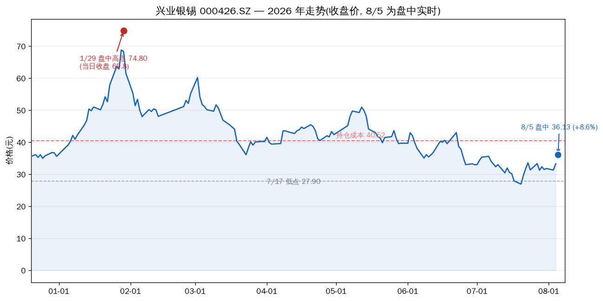
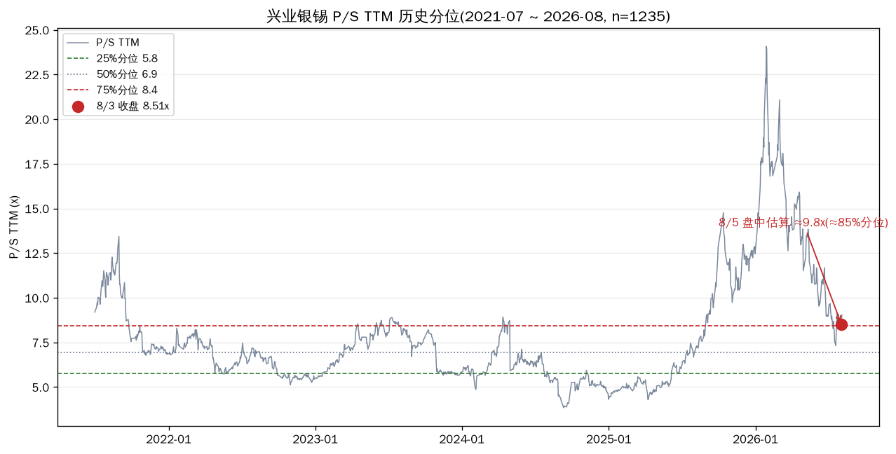
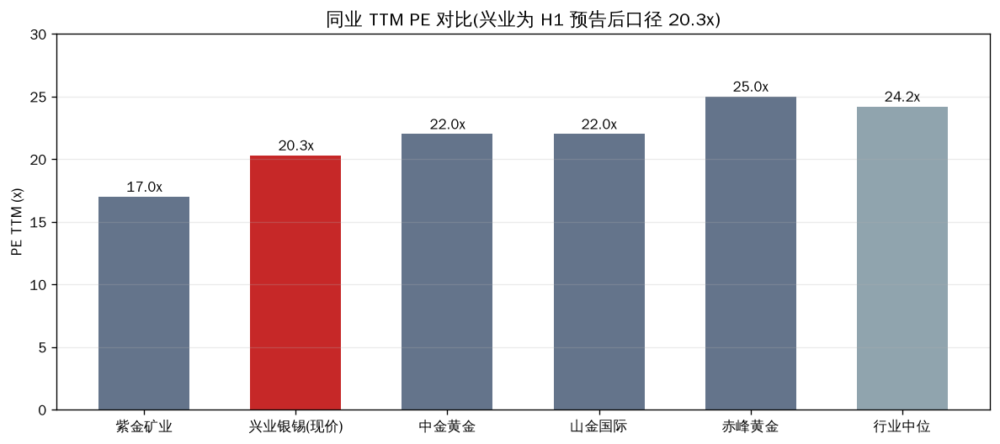
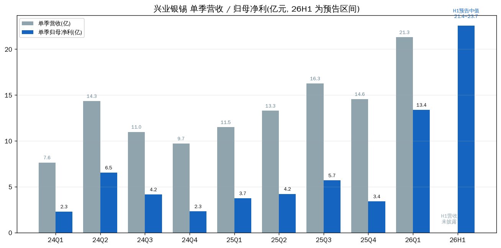

# 兴业银锡(000426.SZ)估值体检

> 2026-08-05 盘中 14:30 · 现价 36.13 元(+8.6%) · 数据源:TuShare / 新浪 / 公司公告

先说结论:估值已经不便宜了。今天盘中 36.13 元,较 7/17 低点 27.90 已反弹 +29%,P/S TTM 约 9.8x 处于近 5 年 85% 分位(75% 分位 8.4x 之上),7 月中旬那种"板块最低 PE、P/S 中位"的便宜状态已经结束。今天的上涨是银价突破 60 美元带动的白银板块共振(板块 +6%,盛达资源涨停),不是兴业独立逻辑。持仓(1100 股,成本 40.52)浮亏已从 7/17 的 -31% 收窄到 -10.8%——这是利用反弹修复仓位的位置,不是加仓的位置。

---

## 当前状态

| 指标 | 数值 | 说明 |
|---|---|---|
| 8/5 盘中现价 | **36.13 元 (+8.6%)** | 开 33.70 / 高 36.45 / 低 33.04,白银板块 +6% 共振 |
| 8/4 收盘 | 33.28 元 (+6.29%) | 沪银夜盘 +3.45% 催化 |
| 7/17 低点 | 27.90 元 | 年内新低,此后反弹 +29.5% |
| 1/29 高点 | 74.80 元(盘中) | 累计仍 -51.7% |
| 持仓 | 1100 股 / 成本 40.52 | 浮亏约 -4,830 元(-10.8%),已实现盈亏 +5,018 元 |
| 总市值 | 约 641.6 亿 | 17.76 亿股 |

---

## 估值三维:分位已经到高位区

| 指标 | 当前 | 历史参照 | 位置 |
|---|---|---|---|
| P/S TTM | **≈9.8x(盘中估算)** | 5 年中位 6.9x / 25%分位 5.8x / 75%分位 8.4x | **≈85% 分位,偏高** |
| P/E TTM | ≈24x(旧口径) / ≈20x(中报后) | 板块中位 24.2x | 中性,仍低于板块中位 |
| P/B | ≈5.9x | 5 年中位约 3.5x | 偏高 |
| 2026H1 净利预告 | 21.4~23.7 亿(+169%~198%) | 2025 全年 17.04 亿 | 高增长已兑现 |

7 月 23 日的体检里,兴业银锡 TTM PE 17.2x 还是板块最低之一(紫金 ~17x,中金黄金 ~22x,赤峰黄金 ~25x,行业中位 24.2x)。两周多时间,价格从 29.62 涨到 36.13(+22%),用中报后口径算 PE 约 20x——便宜的缺口补了大半,P/S 更是直接站上 75% 分位。对周期股而言,P/S 分位在 80%+ 意味着市场已经把银价高位、业绩爆发都定价进去了。

---

## 季度盈利:爆发是真的,但结构有水分

几个必须拆开看的数字:

- **Q1 单季 13.38 亿含约 4.5 亿非经常性损益**(双源有色股权转让投资收益 3.21 亿 + 所得税抵减 1.33 亿),扣非只有 8.91 亿。
- **Q2 扣非约 9.1 亿**(H1 扣非预告中值 18.05 亿减 Q1 扣非),环比 Q1 基本持平——主业没有恶化,但也没有加速。
- **银漫矿业是命根子**:2025 年贡献净利 13.46 亿,占公司约 79%;2026Q1 净利 4.75 亿,占 45%。
- **但银漫现在停产中**——7/26 事故 1 人死亡,7/28 采区停产,7/30 选矿尾矿系统也停产,复产时间未定。这是当前最大的未定价变量。

---

## 估值为什么走到这里

| 因子 | 类型 | 现状 | 可逆性 |
|---|---|---|---|
| 银价周期:从高点 89 美元回撤 -36% 后反弹,8/5 破 60 美元;沪银夜盘 +3.45% | 周期性 | 向上 | 短期可逆,波动大 |
| 锡价:LME 55,268 美元/吨,同比 +65%,高位 | 周期性 | 高位稳定 | 中期可逆 |
| 业绩爆发:H1 预增 169%~198%,扩产故事(银漫 165→297 万吨,2028Q4 试车;Atlas Tin 全资) | 结构性 | 已兑现 | 长期向上 |
| 安全事故停产:银漫采矿+选矿全停 | 外生性 | **未走出** | 看复产时点 |
| 安全治理:十年 4 起致死事故(2019 年 22 死被国务院定性) | 结构性瑕疵 | 未走出 | 难,长期 |

---

## 我的判断

### 短期(1-3 个月):银价说了算,停产是暗雷

今天 +8.6% 是纯商品行情。银价站稳 60 美元,股价还有冲 38-40 的动力(成本区 40.52 是第一个解套位);银价回到 57 以下,33 元(8/4 收盘)就撑不住。停产的真正影响在 Q3 报表——银漫占净利约 8 成,每停一个月都是实打实的利润缺口。参考 2025 年 3 月同类事故,停产约 1 个月复产;但 2019 年 22 死事故,停产以年计。本次已全停(选矿也停了),如果超过 2 个月,Q3 业绩会明显低于市场当前预期。

### 中期(6-12 个月):估值安全垫已经薄了

这一段的判断最难。两个方向都站得住:银价若维持 60+,扩产 2028 兑现前业绩还能冲,PE 20x 不贵;但 P/S 85% 分位 + 停产 + 安全治理劣迹(H 股上市申请 7/17 被港交所发回,也说明治理被审视),任何一边证伪都够股价回 30 以下。周期股的教训是:在商品价格高位给高估值,一旦银价回头,戴维斯双杀的速度比上涨快。

---

## 风险(每条带触发条件)

| 风险 | 触发条件 | 影响 |
|---|---|---|
| 银漫停产延长 | 停产超 2 个月,或复产公告迟迟不出 | Q3 净利缺口按 4.75 亿/季(26Q1 口径)计 |
| 银价高位回落 | 跌破 57 美元(8/5 前平台),或沪银跌破 13,500 元/千克 | 反弹逻辑结束,33 元支撑失守看 30 |
| 估值均值回归 | P/S 维持 80%+ 分位而业绩环比走平 | 周期股高位估值收缩,参考 6/22-7/17 的 -35% |
| H 股发行摊薄 | 重新递交获批 | 股本摊薄,短期股价承压 |

---

## 观察点

| 时点 | 事件 | 看什么 |
|---|---|---|
| 8 月底 | 2026 中报正式披露(2025 中报为 8/26) | 扣非口径验证:Q2 扣非是否 ≥9 亿;银漫停产对报表的影响是否体现 |
| 随时 | 银漫复产公告 | 复产时间:≤1 个月正常,≥2 个月利空坐实 |
| 每日 | 银价 / 沪银 | 60 美元站稳 vs 回落 57 |
| 待定 | H 股重新递交 | 发行规模与定价 |

---

## 验证锚点

**价格锚:** 成本 40.52 / 8/5 盘中 36.13 / 8/4 收盘 33.28 / 7/17 低点 27.90 / 1/29 高点 74.80
**时间锚:** 7/26 事故 → 7/28 采区停 → 7/30 选矿停 → 8/5 银价破 60 → 8 月底中报
**事件锚:** 银漫 297 万吨扩建(2028Q4 试车)/ Atlas Tin 全资 / H 股发回重交
**数据锚:** 26Q1 扣非 8.91 亿 / H1 预告 21.4~23.7 亿(含非经常 4.54 亿) / 银漫 2025 净利 13.46 亿

---

Data as of: 2026-08-05
Generated: 2026-08-05
