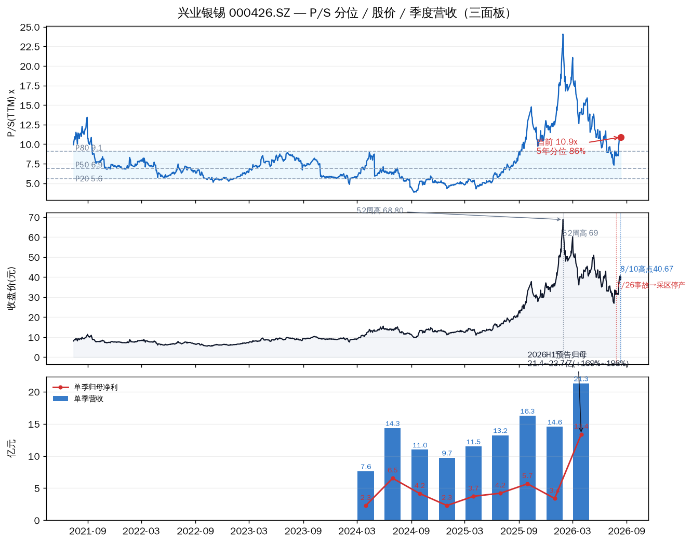
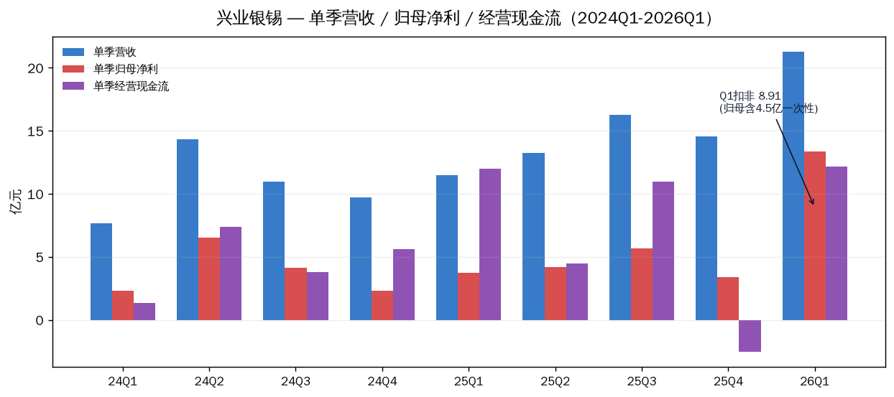

# 兴业银锡(000426.SZ)估值分析

2026-08-13 盘中 13:10 · 估值口径 8/12 收盘 · 深主板 / 有色金属·贵金属采选

先说结论。现价 38.66 元(今日 -3.6%),三把尺子里两把已经贵了:P/S TTM 10.9x 处于近 5 年 **85.8% 分位**,P/B 6.6x 处于 **89.7% 分位**;只有 P/E 26.7x 看着中性,但那是盈利峰值把分母撑大的结果。商品价很强(银 65.85 美元、锡 42.8 万元/吨),业绩也在兑现(H1 预告 +169%~198%),但核心资产银漫矿业还在停产、复产无时间表——这一块没有定价。对你 1300 股 @ 33.47 的持仓:浮盈约 +15.5%,正好在"回本锁盈"位置,Sheet 里的 38.7 触发位今天正在被测试(8/12 收 40.11 上方,今天盘中回落至下方)。

## 一、三把尺子:贵与不贵同时成立

| 尺子 | 当前 | 5年中位 | 5年分位 | 读数 |
|---|---|---|---|---|
| P/S TTM | **10.9x** | 6.9x | **85.8%** | 贵(超 P80 9.1x) |
| P/E TTM | 26.7x | 48.5x(失真) | 30.5% | 中性偏便宜 |
| P/B | **6.6x** | 3.0x | **89.7%** | 贵 |

周期股估值先声明用哪把尺子:P/S、P/B 反映"市场为这轮盈利周期付了多少",现在都在高位;P/E 在盈利峰值期天然显低,而且历史上有亏损年把中位推到 48.5x,分位失真,不适合当绝对定价尺。三把尺子放一起,结论是**偏贵**。

上:P/S(TTM)与 P20/P50/P80 分位带(当前 10.9x,85.8% 分位)· 中:收盘价(52周高 68.80、7/26 事故停产、8/10 高点)· 下:单季营收柱+归母净利线(2024Q1-2026Q1)

## 二、价格位置:15 个交易日 +51% 后的回落

- 52 周区间 19.81–68.80 元,近 6 个月 26.93–60.22 元。现价 38.66:52 周约 38% 位置,6 个月约 35% 位置。
- 7/20 低点 26.93 → 8/10 高点 40.67,15 个交易日 **+51%**,然后 8/11 -4.8%、8/12 +3.6%、今天 -3.6%。单日 ±5-9% 是常态,波动极大。
- 今天的下跌是板块性的:湖南白银 -5.6%、山东黄金 -3.5%、白银有色 -3.3%、锡业股份 -2.0%,贵金属+有色集体回调,不是个股利空。

## 三、商品价:双驱动都在高位,银离 2 月高点还差 24%

| 品种 | 现价(8/12) | 年内路径 | 状态 |
|---|---|---|---|
| 白银(国际) | **65.85 美元/盎司** | 2月高点约87 → 7月底 55-57 → 现 65.85 | 反弹中,站稳 60 |
| 白银(国内1#) | 15,951 元/千克 | — | 同步 |
| 锡(长江现货) | **42.86 万元/吨** | 7月突破 40万,历史高位区 | 高位强 |
| LME 伦锡 | 约 5.5 万美元/吨 | — | 高位 |

锡的逻辑比银更硬:AI 服务器焊料需求 + 缅甸/刚果金/印尼供给扰动 + 国内社会库存处于 2020 年以来约 32% 分位(低位)。银的逻辑一半避险一半光伏银浆,弹性大但波动大。触发阈值:银站稳 60 美元 = 反弹逻辑在;**跌破 57 = 反弹结束**。

## 四、业绩:爆发是真的,但没有加速

- H1 预告归母 21.4–23.7 亿,同比 **+169%~198%**。但含 4.54 亿非经常损益(股权转让投资收益 3.21 亿 + 所得税抵减 1.33 亿)。
- 拆扣非:Q1 归母 13.38 亿里,扣非只有 8.91 亿;Q2 扣非估算 8.0–10.3 亿,与 Q1 基本持平 → **爆发没加速**。
- 利润质量没问题:FY2025 OCF/NI 1.46,Q1'26 按扣非算 1.37,现金是真的(仅 Q4'25 单季 OCF -2.5 亿,像年末集中付款)。
- 半年报预计 8 月下旬披露(去年 8/26),届时验证 Q2 扣非口径和停产影响。

单季营收 / 归母净利 / 经营现金流(2024Q1-2026Q1);2026Q1 归母含 4.5 亿一次性,扣非 8.91 亿

## 五、停产:核心资产,占净利 79%

- 银漫矿业 2025 年净利 13.46 亿,占公司约 **79%**;2026Q1 单季 4.75 亿。
- 7/26 事故 1 死 → 7/28 井下采区停 → 7/30 选矿尾矿系统停 → 7/31 公告采矿+选矿全停,**复产无时间表**。
- 每停一个月,约 1.6 亿净利缺口;行业周报按 1-2 个月短停估算,影响锡产量约 1000 吨。
- 参照历史:2025/3 同类事故停约 1 个月;2019 年 22 死事故停以年计。10 年 4 起致死事故,安全治理是长期结构性减分项。

## 六、成长逻辑的隐忧(7/28 投资者互动)

市场已经在问两个问题,公司都没给明确时间表:银漫二期 297 万吨/年扩建,7/14 拿到建设用地批复,但开工无时间表;H 股招股书产量指引远低于预期,成长逻辑被质疑。H 股 7/16 被港交所发回(合格人士报告有效日期及预计招股书刊发日期需更新),公司拟本季度重新递交。

同时资本开支很大:西藏阳光金矿(已完成工商变更)、Atlas Tin SAS 25%、FEG 场外要约、TAT(8/11 公告终止第二批认购,第一批 9.99% 已完成)。公司回应"统筹管控资本开支节奏,优先保障重点项目",但短期现金流承压是事实。

## 七、我的判断

| 因子 | 类型 | 当前状态 | 判断 |
|---|---|---|---|
| 银价 | 周期性 | 65.85 美元,站稳 60 上方 | 已走出 |
| 锡价 | 周期性/结构性 | 42.8 万元/吨,历史高位+低库存 | 已走出 |
| 业绩 | 结构性 | H1 预告兑现,Q2 扣非环比持平 | 已兑现未加速 |
| 停产 | 外生性 | 采矿+选矿全停,复产无时间表 | 未走出 |
| 扩产/并购 | 结构性 | 推进中,银漫二期未开工 | 不确定 |
| H股 | 外生性 | 被发回,拟三季度重递 | 待重审 |
| 安全治理 | 结构性 | 10 年 4 起致死事故 | 长期瑕疵 |

估值偏贵 + 一块未定价的坑(停产),没有安全边际。商品价强不等于股价该在这个估值站住——P/S 85.8% 分位意味着市场已经把银锡价格的乐观预期买在前面。8/5 的判断("P/S 已贵、P/E 不贵")到今天没有变化,停产这个变量也没有变化。

持仓角度(1300 股 @ 33.47,浮盈 +15.5%):在回本锁盈区间。Sheet 里记的 38.7 触发位,8/12 收盘已站上(40.11),今天盘中又回落到下方——这就是"要不要兑现"的决策点。硬触发器:

- **银价跌破 57 美元** → 反弹逻辑结束,减半
- **股价跌破 36 元**(8/4 前平台)→ 清仓
- **复产公告** → 重新评估持有
- **半年报 Q2 扣非环比明显下滑** → 停产影响兑现,清仓

## 八、风险

| 风险 | 触发条件 |
|---|---|
| 停产延长 | 复产公告缺席;8 月底半年报量化停产影响 |
| 银价回落 | 跌破 57 美元/盎司;避险情绪消退 |
| 锡价回调 | LME 库存回升、缅甸复产超预期、印尼出口恢复 |
| 成长逻辑证伪 | 银漫二期持续无开工时间表;H 股招股书指引继续偏低 |
| 高波动 | 单日 ±5-9% 常态化,纪律失效风险 |

> 持仓数据说明:以上持仓口径来自 Google Sheet hold-status(价格日期 2026-08-06,成本 33.47,1300 股)。8/7 之后若有卖出/加仓,请告知,数字需相应调整。

## 九、验证锚点

| 类型 | 锚点 |
|---|---|
| 价格锚 | 股价 36 / 38.7 / 40.67;银价 57 / 60 美元;锡价 40 万元/吨 |
| 时间锚 | 半年报(8 月下旬,去年 8/26);H 股重新递表(三季度);TAT 临时股东会 8/17 |
| 事件锚 | 银漫复产公告、银漫二期开工、H 股递表进展 |
| 数据锚 | 半年报 Q2 扣非、SMM 锡库存、银漫月度产量 |

---
Data as of: 2026-08-13 盘中(现价 38.66,估值口径 8/12 收盘 40.11)
Generated: 2026-08-13
