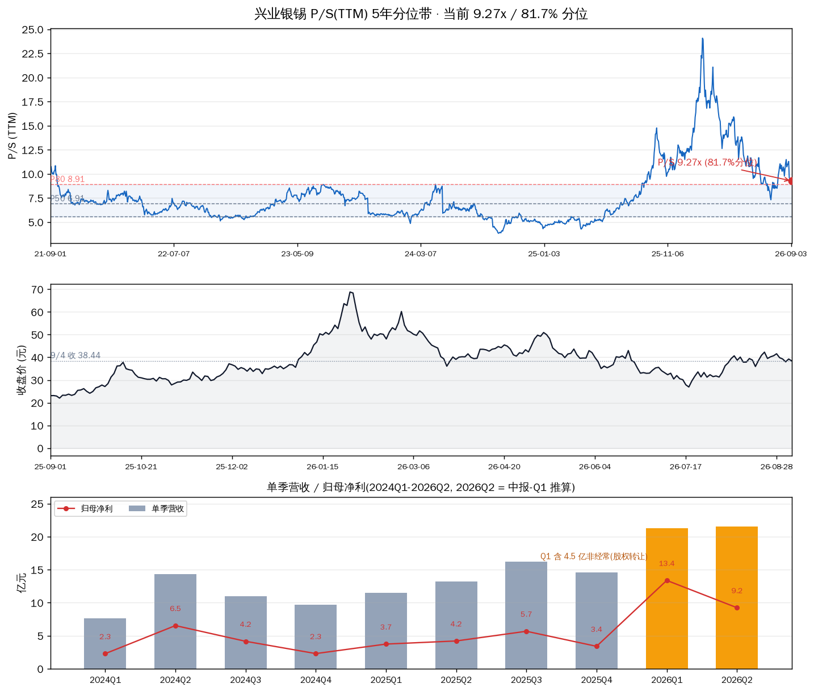
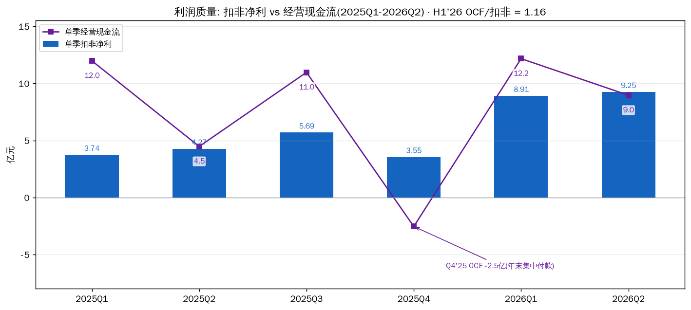

# 兴业银锡(000426.SZ)估值 · 商业模式 · 现状 · 前景

2026-09-07 盘中 09:56 · 估值口径 9/4 收盘 38.44 · 深主板 / 有色金属·贵金属采选

先说结论。三把尺子和 8 月比没有质变:P/S TTM 9.27x(近 5 年 **81.7% 分位**)、P/B 5.92x(**85.1% 分位**)仍贵,P/E 21.5x(24.9% 分位)是盈利峰值把分母撑大的结果——"贵与不贵同时成立",周期股老结构。变的是基本面:中报落地(Q2 扣非 9.25 亿,环比 +3.8%,没加速但也没掉),停产从"全停"推进到"选厂 9/3 复产、采区整改中"(部分走出,下一个催化是采区复产公告);压制项也在加码:美联储 9/16 加息概率已到 ~60%,大股东 100% 质押,机构 Q2 减持超 10 家。商业模式是"优质资源 + 治理瑕疵"的组合,值得持有底仓跟踪,但当前估值没有安全边际,你的 500 股 @30.3173 浮盈约 +25%,处于"纪律持有"状态,不是加仓位置。

## 一、商业模式:它怎么赚钱

多金属采选集团:在产 8 家矿(银漫、宇邦、乾金达、融冠、锡林、荣邦、锐能、博盛),海外 Achmmach 锡矿(Atlas Tin SAS)建设期,另有停建/勘探资产。产品银、锡为主,铅锌铜锑金协同。

盈利公式很简单:净利 ≈ Σ(金属产量 × 价格 − 现金成本) − 费用。所以拆它只有三件事:量、价、成本。

| 维度 | 事实 | 含义 |
|---|---|---|
| 量的结构 | 2025 银漫单矿营收 30.62 亿(占 55%)、净利 13.46 亿(占 **79%**) | 单点依赖,这是它最大的脆弱点 |
| 结构改善 | 2026Q1 银漫净利 4.75 亿,占比降到 ~45% | 宇邦并表放量后,依赖在缓解 |
| 资源禀赋 | 宇邦并表后白银储量约 2.45 万吨 = 国内 34.6%,亚洲第一梯队;双尖子山 6/11 储量备案 Ag 2.16 万吨、品位 73.3 g/t | 资源是真的,不是讲故事 |
| 成本与质量 | H1 毛利率 68.75%,ROE 21.32%,OCF 21.13 亿 = 扣非的 1.16 倍 | 富矿+规模,现金流扎实 |
| 治理瑕疵 | 10 年 4 起致死事故(2019 年 22 死停 17 个月是前科);大股东 100% 质押(占总股本 20.46%);10 派 1 元 | 安全与治理是长期折价项 |

商业模式定性:**资源 A-,治理 C+**。好资产、差纪律——2019 年的教训说明"一只票拿住不动"对这种公司是危险的,必须事件驱动。

## 二、现状:价格、中报、停产、筹码

### 价格与估值快照

| 指标 | 数值 | 5 年分位 | 读数 |
|---|---|---|---|
| 现价(9/7 盘中) | 37.82(-1.6%) | — | 52 周收盘区间 23.24–68.80 的 33% 位置 |
| 收盘(9/4) | 38.44 | — | 8/24 高点 42.29 回落 -9.1% |
| P/S TTM | 9.27x | 81.7%(P20 5.58 / P50 6.91 / P80 8.93) | 贵 |
| P/B | 5.92x | 85.1% | 贵 |
| P/E TTM | 21.5x | 24.9%(中位 43.9x 因历史亏损年失真) | 中性偏便宜,但不可当绝对尺 |
| 总市值 | 682.6 亿 | — | — |

上:P/S(TTM)5 年分位带(当前 9.27x,81.7%)· 中:收盘价与关键事件(1/29 高点 68.8、7/20 低点 26.93、7/28 采区停、8/24 42.29、9/2 选厂复产公告)· 下:单季营收柱+归母净利线(2026Q2 由中报减 Q1 推算)

### 中报(8/28 披露):兑现,没有加速

H1:营收 42.82 亿(+73.1%)、归母 22.63 亿(+184.4%)、扣非 18.16 亿(+126.6%)、OCF 21.13 亿(+28.4%)。单季拆开:

| 单季 | 归母(亿) | 扣非(亿) | OCF(亿) | 说明 |
|---|---|---|---|---|
| 2026Q1 | 13.38 | 8.91 | 12.17 | 归母含 4.47 亿非经常(双源有色股权转让 3.21 + 所得税抵减 1.33) |
| 2026Q2 | 9.25 | 9.25 | 8.96 | 无非经常;环比 +3.8%,同比 +119.7% |

Q2 扣非环比只增 3.8%,延续 8/13 的判断"爆发没加速";但停产(7/31 起)影响还没进 Q2,真正的考验是 Q3。利润质量没问题:H1 OCF/扣非 1.16,现金是真的。

单季扣非净利 vs 经营现金流(2025Q1-2026Q2);Q4'25 OCF 为负是年末集中付款

### 停产时间线(8/13 后的进展)

7/26 事故(1 死)→ 7/28 采区停 → 7/30 选矿尾矿系统停 → **9/2 公告收到西乌旗应急局通知,同意选尾系统复产 → 9/3 选厂复产**;采区整改中,无时间表,已停约 40 天。参照 2025/3 同类事故:采区停 38 天(3/9-4/16)复产——采区复产若按同节奏,应在 9 月内;但 2019 年 22 死停 17 个月的前科让"无时间表"始终悬着。选厂复产的意义:至少现金流端恢复;采区不复,选厂只能吃存量,产量恢复要等采区。

### H 股与筹码

H 股 5/25 递表、7 月被发回(合格人士报告有效期+招股书日期需更新),中报确认:**完成 6/30 基准日文件更新后,本季度(Q3)内重新递交**——9 月底前是观察窗口。另外三个信号:大股东兴业集团 3.63 亿股质押 = 其持股的 100%(占总股本 20.46%);中报显示 Q2 披露持股机构减少超 10 家;10 派 1 元的分红预案对应股息率约 0.5%,聊胜于无。筹码面在 42 元一线有兑现压力,与股价 8/24 见 42.29 后回落相互印证。

## 三、估值:三把尺子 + 价格锚

周期股估值先声明用哪把尺:P/S、P/B 反映"市场为这轮盈利周期付了多少",现在都在 80%+ 分位——贵;P/E 在盈利峰值期天然显低,历史中位又因亏损年失真,只当辅助。8/5、8/13 的判断今天仍然成立:**没有安全边际,估值已把"银锡价格高位延续"买在前面**。

价格锚(把分位换算成股价,供回调时对照):

| 参照 | P/S 对应 | 对应股价 |
|---|---|---|
| P80 = 8.93x(贵贱分界) | 市值 ~658 亿 | ~37.0 元 |
| P50 = 6.91x(历史中枢) | 市值 ~509 亿 | ~28.7 元 |
| 6-7 月平台 | — | 30-33 元 |

## 四、前景:量、价、情景

**量**:近端看采区复产(9 月?),远端看宇邦产能继续释放(已兑现一半)和银漫二期 297 万吨改扩建(建设用地 7/14 已批,开工无时间表;达产后银漫银锡产量翻倍,属远期期权)。海外 Achmmach 锡矿在建设期,全球锡新矿产能 2028 年前释放有限(SMM),锡的紧平衡有持续性。

**价**:银 9/4 收 65.99 美元(+6.4% 月),但 1 月历史高点 121.6 之后是 -46% 的大回撤,当前只是反弹中段;美国 8 月非农超强,9/16 美联储加息概率 ~60%,美元走强是白银短期最直接的压制,黄金 4,432 美元的高位是贵金属情绪底。锡:沪锡 41.6 万、长江现货 41.3 万(9/1-9/3),较 8 月高点 ~43 万回落 3-4%,仍历史高位;印尼 1-8 月交易所交易量同比 -18.2%,AI 焊料需求 + 供给扰动的基本面没变。

| 情景 | 假设 | 2026 全年归母 | 2027 归母 | 现价对应 PE |
|---|---|---|---|---|
| 中性 | 银 60-66、锡 40-42 万;采区 Q3 内复 | ~40-43 亿(含 Q1 非经常 4.5 亿) | 35-42 亿 | 2026E ~16x / 2027E ~17-19x |
| 乐观 | 银站稳 70 + 锡 43 万 + 二期提前 | ~45 亿+ | 45 亿+ | ~15x |
| 悲观 | 银回 55、锡回 35-38 万、复产拖到 Q4 | ~35 亿 | 25-30 亿 | 2027E 23-27x,就不便宜了 |

中间这段最难判断:Q3 报表(10 月底)会同时装进"停产损失"和"银价上涨对冲",单看数字会误读;真正要盯的是采区复产时点和银价在 9/16 FOMC 后的方向。

## 五、我的判断

| 因子 | 类型 | 当前状态 | 判断 |
|---|---|---|---|
| 银价 | 周期性 | 65.99 美元,站稳 60;9 月加息概率 60% 是逆风 | ⚠️ 已走出但遇压制 |
| 锡价 | 周期性/结构性 | 41.6 万,高位小幅回落;紧平衡 | ✅ 高位维持 |
| 业绩 | 结构性 | 中报兑现,Q2 扣非环比 +3.8% | ✅ 兑现未加速 |
| 停产 | 外生性 | 选厂 9/3 复,采区整改中(约 40 天) | ⚠️ 部分走出 |
| H 股 | 外生性 | Q3 内重递 | ⏳ 待观察 |
| 扩产/并购 | 结构性 | 宇邦释放中,银漫二期开工未定 | ✅ 部分兑现 |
| 安全治理+质押 | 结构性 | 10 年 4 起致死;大股东 100% 质押 | 🔴 长期瑕疵 |

综合:好资产在好价格周期里,但市场已经知道——P/S 81.7% 分位说明乐观预期付在前面。8/13"估值偏贵 + 停产未定价"的结论更新为"**估值仍贵,停产已部分定价,定价缺口收窄**"。采区复产公告若落地,是"利好兑现"而不是"追进去的理由"。

## 六、持仓决策(500 股 @30.3173)

Sheet 现读持仓:500 股,成本 30.3173,价格日期 2026-08-13(8/13 后若有交易请告知)。按 9/7 盘中 37.82:浮盈 +3,752(+24.8%);按 9/4 收 38.44:+4,061(+26.8%)。市值约 1.9 万,占组合约 7.7%(sheet 口径),未超 8% 红线;与紫金合计有色链暴露 ~10%。

**不是加仓位置(估值贵、Q3 有坑、9/16 有事件)。持有 + 触发器:**

| 触发器 | 条件 | 动作 |
|---|---|---|
| T1 | 采区复产公告落地 | 若跳空高开 ≥40 元 → 减半(利好兑现) |
| T2 | 反弹到 41.5-42.3(8/24-8/28 前高区) | 减半锁盈(前高 + 机构减持兑现区) |
| T3 | 跌破 36 元(8/4 平台,沿用 8/13 纪律) | 清仓,不解释 |
| T4 | 银价跌破 57 美元 | 减半(反弹逻辑结束) |
| T5 | Q3 扣非环比下滑 >20%(10 月底) | 清仓(停产影响兑现确认) |
| T6 | H 股重递成功/发行定价 | 重估摊薄影响,减持预案 |

这套触发器沿用 8/5-8/13 的口径,跨报告一致本身就是纪律:38.7 触发位 8/24 已被突破过(42.29),当时没执行的部分不要回头追,锚已上移到 41.5-42.3。

## 七、风险

| 风险 | 触发条件 |
|---|---|
| 停产延长 | 采区复产公告缺席到 10 月;Q3 报量化停产损失 |
| 银价回落 | 9/16 美联储加息落地;跌破 57 美元 |
| 锡价回调 | LME 库存回升、缅甸/印尼供给恢复超预期 |
| 治理事件 | 大股东质押爆仓风险(100% 质押);再次安全事故(历史上每次事故 = 以月计的停产) |
| 成长证伪 | 银漫二期持续无开工时间表;H 股招股书指引偏低 |
| 高波动 | 单日 ±5% 常态;9/16 FOMC 前后波动放大 |

## 八、验证锚点

| 类型 | 锚点 |
|---|---|
| 价格锚 | 股价 36 / 38.7 / 41.5-42.3;银价 57 / 60 / 66 / 70 美元;锡 38 万 / 41.6 万 |
| 时间锚 | 9/16 FOMC;9 月底前 H 股重递;10 月底 Q3 报 |
| 事件锚 | 采区复产公告、银漫二期开工、H 股递表、大股东质押变动 |
| 数据锚 | Q3 扣非(停产影响量化)、SMM 锡库存、银漫月度产量、宇邦季度净利 |

## 口径说明

- 持仓:Google Sheet hold-status(价格日期 2026-08-13):500 股 @30.3173;8/13 后若有卖出/加仓请告知,数字需调整
- 行情:TuShare 9/4 收盘;新浪 9/7 盘中 09:56 37.82(-1.6%)
- 财务:H1 为 8/28 中报披露口径;Q2 单季 = H1 − Q1 推算;TuShare income 尚未入库 2026-06-30(延迟)
- 商品价:银 9/4、锡 9/1-9/3(SMM/长江/tradingeconomics)
- 事件:9/2 选厂复产公告、8/28-29 中报、界面 9/2 机构减持报道

---
Data as of: 2026-09-07 盘中(现价 37.82;估值口径 9/4 收盘 38.44)
Generated: 2026-09-07
